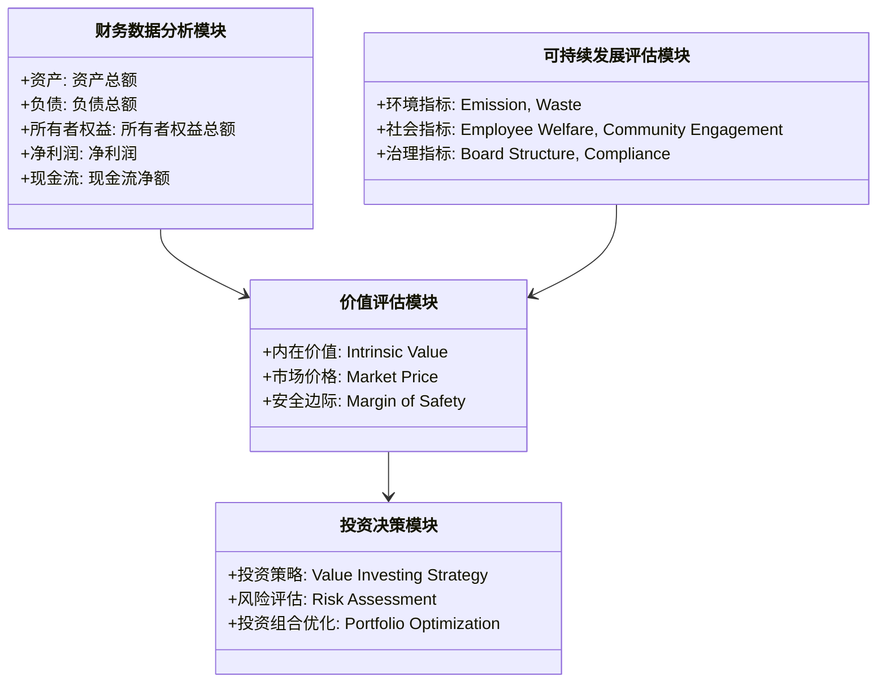
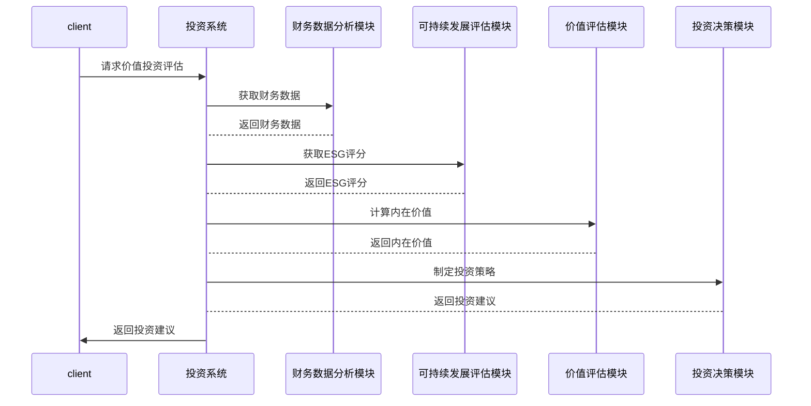

                 


```markdown
# 价值投资与可持续发展

> 关键词：价值投资、可持续发展、投资策略、ESG评分、长期回报、风险管理

> 摘要：价值投资是一种注重长期回报的投资策略，而可持续发展强调企业在环境保护、社会责任和公司治理方面的表现。本文将分析价值投资与可持续发展的结合，探讨如何通过价值投资实现可持续发展目标，为企业和社会创造长期价值。文章从价值投资的背景、核心概念、算法实现、系统架构、项目实战、最佳实践等多个方面进行详细阐述，帮助读者理解如何在投资中融入可持续发展理念。

---

## 第1章: 价值投资的背景与发展

### 1.1 价值投资的核心理念

#### 1.1.1 价值投资的定义
价值投资是一种以低于内在价值的价格买入优质资产的投资策略，强调长期持有，注重企业的基本面分析。其核心在于寻找市场低估的企业，通过安全边际实现长期稳定的回报。

#### 1.1.2 价值投资的基本原则
- **安全边际**：买入价格低于内在价值，确保投资的安全性。
- **长期视角**：关注企业的长期盈利能力，而非短期市场波动。
- **基本面分析**：通过财务报表分析企业的盈利能力、成长性和财务健康状况。

#### 1.1.3 价值投资与投机的区别
- 投资：基于基本面分析，追求长期稳定回报。
- 投机：基于市场波动，追求短期收益，风险较高。

### 1.2 可持续发展的概念与内涵

#### 1.2.1 可持续发展的定义
可持续发展是指在满足当前需求的同时，不损害后代满足其需求的能力。它强调经济、社会和环境的协调发展。

#### 1.2.2 可持续发展的三个核心维度
- **环境（Environmental）**：减少资源消耗和环境污染。
- **社会（Social）**：关注员工权益、社会责任和社区发展。
- **治理（Governance）**：强调公司治理结构和透明度。

#### 1.2.3 可持续发展与企业社会责任的关系
企业社会责任（CSR）是可持续发展的重要组成部分，强调企业在追求利润的同时，应承担对员工、社区和环境的责任。

### 1.3 价值投资与可持续发展的结合

#### 1.3.1 价值投资中的可持续发展视角
- 在选择投资标的时，不仅要考虑财务指标，还要评估企业的可持续发展能力。
- 优先选择在环境、社会和治理方面表现优异的企业。

#### 1.3.2 可持续发展对投资决策的影响
- 企业良好的ESG评分（环境、社会和治理评分）可能带来更低的经营风险和更高的长期回报。
- 社会责任表现优异的企业在市场波动中更具稳定性。

#### 1.3.3 价值投资与可持续发展的未来趋势
随着环保意识的增强和监管政策的趋严，可持续发展将成为投资决策的重要因素。投资者越来越关注企业的长期价值，而不仅仅是短期收益。

---

## 第2章: 价值投资的核心概念与分析框架

### 2.1 财务分析的核心指标

#### 2.1.1 资产负债表分析
- 资产：企业的资源，包括流动资产和非流动资产。
- 负债：企业的债务，包括流动负债和非流动负债。
- 所有者权益：资产减去负债，反映企业的净资产价值。

#### 2.1.2 利润表分析
- 收入：企业在一定时期内通过销售产品或服务获得的总收入。
- 成本：生产产品或服务所需的直接成本。
- 净利润：收入减去成本和费用后的利润。

#### 2.1.3 现金流量表分析
- 经营活动现金流：企业日常经营活动中产生的现金流。
- 投资活动现金流：企业投资于长期资产或处置长期资产产生的现金流。
- 筹资活动现金流：企业通过融资活动（如借款或发行股票）获得或支付的现金流。

### 2.2 价值评估的数学模型

#### 2.2.1 股票内在价值的计算公式
股票的内在价值可以通过多种模型计算，其中最常用的是折现现金流模型（DCF）。公式如下：
$$
\text{内在价值} = \sum_{t=1}^{n} \frac{\text{现金流}_t}{(1 + r)^t} + \frac{\text{残值}}{(1 + r)^n}
$$
其中，$r$ 是折现率，$n$ 是投资期限，$\text{现金流}_t$ 是第 $t$ 年的现金流。

#### 2.2.2 折现现金流模型（DCF）
DCF模型通过将未来现金流折现到现值来计算资产的内在价值。以下是DCF模型的步骤：
1. 预测未来现金流。
2. 确定合适的折现率。
3. 将未来现金流折现到现值。
4. 将现值加总，得到内在价值。

#### 2.2.3 市盈率与市净率的比较
- 市盈率（P/E）：股价除以每股收益。
$$
\text{市盈率} = \frac{\text{股价}}{\text{每股收益}}
$$
- 市净率（P/B）：股价除以每股净资产。
$$
\text{市净率} = \frac{\text{股价}}{\text{每股净资产}}
$$

### 2.3 可持续发展指标的评估方法

#### 2.3.1 ESG评分体系
ESG评分是衡量企业环境、社会和治理表现的重要指标。以下是ESG评分的计算步骤：
1. 收集企业在环境、社会和治理方面的数据。
2. 根据评分标准对每个维度进行评分。
3. 综合三个维度的评分，得到企业的ESG综合评分。

#### 2.3.2 环境影响评估模型
环境影响评估模型用于量化企业在环境保护方面的表现，可以通过以下步骤进行：
1. 确定企业的主要环境影响因素。
2. 量化每个因素的影响程度。
3. 综合所有因素，得到企业的环境影响评分。

#### 2.3.3 社会责任指标的量化
社会责任指标可以通过以下步骤进行量化：
1. 确定企业在社会责任方面的具体表现，如员工福利、社区参与等。
2. 根据评分标准对每个指标进行评分。
3. 综合所有指标，得到企业的社会责任综合评分。

### 2.4 核心概念对比分析表

| 核心概念 | 价值投资 | 可持续发展 |
|----------|-----------|------------|
| 定义     | 长期持有优质资产，注重内在价值 | 经济、社会和环境的协调发展 |
| 关注点   | 财务表现、安全边际 | ESG评分、社会责任 |
| 目标     | 实现长期稳定的回报 | 创造社会价值，实现可持续发展 |

### 2.5 本章小结
本章详细介绍了价值投资的核心概念和分析框架，包括财务分析的核心指标、价值评估的数学模型以及可持续发展指标的评估方法。通过对比分析，揭示了价值投资与可持续发展的结合点。

---

## 第3章: 价值投资与可持续发展的系统架构

### 3.1 投资系统的需求分析

#### 3.1.1 问题场景描述
投资者需要在考虑企业财务表现的同时，评估其在环境、社会和治理方面的表现，以实现长期稳定的回报。

#### 3.1.2 项目目标与范围
开发一个结合价值投资与可持续发展理念的投资系统，帮助投资者做出科学的投资决策。

#### 3.1.3 系统功能需求
- 财务数据分析模块
- 可持续发展评估模块
- 价值评估模块
- 投资决策模块

### 3.2 系统架构设计

#### 3.2.1 领域模型（Mermaid类图）


#### 3.2.2 系统架构图
```mermaid
client --> HTTP 请求 --> 投资系统
投资系统 --> 财务数据分析模块
投资系统 --> 可持续发展评估模块
投资系统 --> 价值评估模块
投资系统 --> 投资决策模块
```

#### 3.2.3 系统接口与交互设计

##### 3.2.3.1 系统接口设计
- 财务数据分析接口
- 可持续发展评估接口
- 价值评估接口
- 投资决策接口

##### 3.2.3.2 系统交互设计（Mermaid序列图）


### 3.3 本章小结
本章通过系统架构设计，展示了如何将价值投资与可持续发展理念结合起来，构建一个科学的投资系统，帮助投资者做出基于长期价值和可持续发展的决策。

---

## 第4章: 价值投资与可持续发展的项目实战

### 4.1 环境配置与安装

#### 4.1.1 安装Python与相关库
- Python 3.8及以上版本
- 安装Pandas、NumPy、Matplotlib等数据处理库
- 安装用于ESG评分的第三方库（如PyESG）

#### 4.1.2 数据获取
- 获取企业的财务数据（如收入、利润、现金流等）
- 获取企业的ESG评分数据

### 4.2 核心代码实现

#### 4.2.1 价值投资的算法实现

##### 4.2.1.1 DCF模型的代码实现
```python
import pandas as pd
import numpy as np

def calculate_intrinsic_value(cash_flows, discount_rate, residual_value):
    """
    计算内在价值的DCF模型
    """
    n = len(cash_flows)
    intrinsic_value = 0
    for t in range(n):
        cash_flow = cash_flows[t]
        intrinsic_value += cash_flow / (1 + discount_rate) ** t
    intrinsic_value += residual_value / (1 + discount_rate) ** n
    return intrinsic_value

# 示例数据
cash_flows = [100, 150, 200, 250]
discount_rate = 0.1
residual_value = 300

intrinsic_value = calculate_intrinsic_value(cash_flows, discount_rate, residual_value)
print(f"内在价值: {intrinsic_value}")
```

##### 4.2.1.2 ESG评分的代码实现
```python
import pandas as pd
import numpy as np

def calculate_esg_score(environment_score, social_score, governance_score):
    """
    计算ESG综合评分
    """
    weights = {'环境': 0.4, '社会': 0.3, '治理': 0.3}
    esg_score = environment_score * weights['环境'] + social_score * weights['社会'] + governance_score * weights['治理']
    return esg_score

# 示例数据
environment_score = 85
social_score = 90
governance_score = 80

esg_score = calculate_esg_score(environment_score, social_score, governance_score)
print(f"ESG综合评分: {esg_score}")
```

#### 4.2.2 可持续发展评估的算法实现

##### 4.2.2.1 环境影响评估模型的代码实现
```python
def calculate_environment_impact(emission, waste):
    """
    计算环境影响评分
    """
    impact = emission * 0.6 + waste * 0.4
    return impact

# 示例数据
emission = 100
waste = 50

environment_impact = calculate_environment_impact(emission, waste)
print(f"环境影响评分: {environment_impact}")
```

##### 4.2.2.2 社会责任指标的代码实现
```python
def calculate_social Responsibility(employee_welfare, community_engagement):
    """
    计算社会责任评分
    """
    responsibility = employee_welfare * 0.5 + community_engagement * 0.5
    return responsibility

# 示例数据
employee_welfare = 90
community_engagement = 85

social Responsibility = calculate_social Responsibility(employee_welfare, community_engagement)
print(f"社会责任评分: {social Responsibility}")
```

### 4.3 案例分析与结果解读

#### 4.3.1 某公司的案例分析
以某公司为例，分析其财务数据和ESG评分，计算其内在价值和环境影响评分。

#### 4.3.2 结果解读
- 内在价值高于市场价格，说明该股票具有投资价值。
- ESG评分较高，说明该企业在可持续发展方面表现优异。

### 4.4 本章小结
本章通过实际案例分析，展示了如何将价值投资与可持续发展理念结合起来，实现科学的投资决策。

---

## 第5章: 最佳实践与注意事项

### 5.1 关键点总结

#### 5.1.1 价值投资的长期视角
投资时应关注企业的长期价值，而非短期市场波动。

#### 5.1.2 ESG评分的重要性
企业在环境、社会和治理方面的表现对长期投资回报有重要影响。

#### 5.1.3 风险管理的重要性
投资时应充分考虑市场风险、流动性风险和企业特有风险。

### 5.2 小结与建议

#### 5.2.1 如何结合价值投资与可持续发展
- 在选择投资标的时，综合考虑企业的财务表现和可持续发展能力。
- 优先选择在环境、社会和治理方面表现优异的企业。

#### 5.2.2 对未来研究的建议
- 进一步研究价值投资与可持续发展的结合对投资回报的具体影响。
- 探索更多可持续发展指标对投资决策的量化影响。

### 5.3 风险管理与注意事项

#### 5.3.1 风险管理的重要性
- 投资时应充分分散投资组合，降低风险。
- 定期审视投资组合，调整投资策略。

#### 5.3.2 投资中的注意事项
- 避免过度依赖单一指标，综合考虑多维度因素。
- 关注政策变化对企业可持续发展的影响。

---

## 第6章: 总结

### 6.1 文章总结
本文详细探讨了价值投资与可持续发展的结合，分析了其对投资决策的积极影响。通过系统架构设计和项目实战，展示了如何在实际投资中融入可持续发展理念。

### 6.2 对未来研究的展望
未来研究可以进一步探索价值投资与可持续发展的结合对投资回报的具体影响，以及如何通过技术创新提升可持续发展评估的准确性。

---

## 作者信息

作者：AI天才研究院/AI Genius Institute & 禅与计算机程序设计艺术 /Zen And The Art of Computer Programming
```

