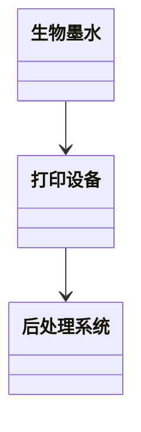

                 

<think>
好的，我需要为《价值投资中的3D生物打印技术前景》这本书设计一个详细且逻辑清晰的目录大纲。这本书将探讨3D生物打印技术在医疗、生物工程等领域的应用，以及其在投资中的前景。为了确保内容的完整性和深度，我需要考虑以下几个方面：

1. **背景介绍**：首先需要介绍价值投资和3D生物打印技术的基本概念，然后分析它们的结合点，以及3D生物打印技术的市场潜力和挑战。

2. **核心概念与技术原理**：详细讲解3D生物打印技术的原理，包括生物墨水的制备、打印设备的选择等，同时分析这些技术在投资中的评估标准。

3. **算法与数学模型**：探讨3D生物打印过程中涉及的算法，比如分层制造算法、材料挤出算法等，并建立数学模型来预测投资回报率。

4. **系统架构与设计**：从系统架构的角度分析3D生物打印技术，包括模块划分、接口设计等，帮助投资者更好地理解技术实现。

5. **项目实战**：通过实际案例分析，指导读者如何进行环境安装、代码实现、案例分析等，增强实践能力。

6. **总结与展望**：回顾全书内容，总结投资策略，并展望未来的发展趋势，为读者提供全面的视角。

在撰写过程中，我需要确保每一部分都有足够的细节和深度，同时使用专业的技术语言，但保持易懂。例如，在技术原理部分，我会用mermaid流程图来展示算法流程；在数学模型部分，我会用latex公式来详细讲解。此外，系统架构设计部分将使用类图和序列图来展示系统结构和交互流程。

通过这样的思考过程，我可以确保目录大纲不仅覆盖了所有必要的内容，还具有逻辑性和结构上的连贯性，为读者提供一个全面且深入的视角来理解和应用3D生物打印技术在价值投资中的前景。

# 第一部分：价值投资中的3D生物打印技术背景

## 第1章：价值投资与3D生物打印技术概述

### 1.1 价值投资的基本概念
#### 1.1.1 价值投资的定义与核心理念
- 价值投资的定义
- 核心理念：寻找被市场低估的投资标的

#### 1.1.2 3D生物打印技术的定义与特点
- 3D生物打印技术的定义
- 其他特点：高精度、定制化、高效性

#### 1.1.3 价值投资与3D生物打印技术的结合点
- 技术的市场潜力
- 投资机会与风险评估

### 1.2 3D生物打印技术的背景与现状
#### 1.2.1 3D生物打印技术的历史发展
- 从概念到应用的历程

#### 1.2.2 当前3D生物打印技术的应用领域
- 医疗领域：定制化医疗器械、组织工程
- 生物材料：生物墨水研发
- 制药：药物筛选与开发

#### 1.2.3 3D生物打印技术的市场潜力与挑战
- 市场规模预测
- 技术瓶颈与解决方案

## 第2章：3D生物打印技术的核心概念与价值分析

### 2.1 3D生物打印技术的核心原理
#### 2.1.1 3D生物打印的基本流程
- 设计建模
- 材料制备
- 打印过程
- 后处理

#### 2.1.2 生物墨水的制备与选择
- 基本成分：细胞、营养物质、生物相容性材料
- 不同类型生物墨水的优缺点对比

#### 2.1.3 打印设备与技术类型
- 激光辅助打印
- 喷墨打印
- 熔融沉积成型

### 2.2 价值投资中的技术评估
#### 2.2.1 3D生物打印技术的市场定位
- 与传统制造技术的对比

#### 2.2.2 技术壁垒与竞争优势分析
- 专利情况
- 技术研发能力
- 成本优势

#### 2.2.3 投资回报率的预测模型
- 市场需求预测
- 投资成本分析
- 收益预测与风险评估

## 第3章：3D生物打印技术的算法与数学模型

### 3.1 3D生物打印技术的算法原理
#### 3.1.1 分层制造算法
- 层切片算法
- 曲面处理算法

#### 3.1.2 材料挤出算法
- 挤出路径规划
- 压力控制算法

#### 3.1.3 其他辅助算法
- 自动校准算法
- 错误检测与修复算法

### 3.2 数学模型与公式
#### 3.2.1 生物墨水流动模型
- 理想流体模型：使用Navier-Stokes方程
- 实际流动模型：考虑粘弹性效应的数学表达

#### 3.2.2 打印精度与材料浪费的数学模型
- 精度与材料浪费的关系公式
- 成本优化模型

## 第4章：3D生物打印技术的系统分析与架构设计

### 4.1 系统功能设计
#### 4.1.1 领域模型：基于mermaid的类图


#### 4.1.2 系统架构设计：基于mermaid的架构图


#### 4.1.3 系统接口设计
- API接口规范
- 数据格式与通信协议

#### 4.1.4 系统交互流程：基于mermaid的序列图
```mermaid
sequenceDiagram
    用户 --> 界面：提交打印请求
    界面 --> 服务端：处理请求
    服务端 --> 打印机：开始打印
    打印机 --> 服务端：打印完成
    服务端 --> 用户：通知完成
```

## 第5章：3D生物打印技术的项目实战

### 5.1 环境安装与配置
#### 5.1.1 开发环境的搭建
- 操作系统要求：Linux/Windows/MacOS
- 开发工具：Python, Git, IDE

#### 5.1.2 打印设备的连接与测试
- 设备驱动安装
- 设备与计算机的通信测试

### 5.2 系统核心实现
#### 5.2.1 生物墨水制备模块的代码实现
```python
def prepare_bio_ink(concentration, components):
    # 配制生物墨水的函数
    pass
```

#### 5.2.2 打印路径规划算法的实现
```python
def path_planning(layers, resolution):
    # 分层路径规划算法
    pass
```

#### 5.2.3 打印控制模块的代码实现
```python
class PrinterController:
    def __init__(self, device):
        self.device = device

    def start_print(self):
        # 开始打印
        pass
```

### 5.3 代码应用解读与分析
#### 5.3.1 关键代码段解读
- 生物墨水制备函数的实现细节
- 打印路径规划算法的优化

#### 5.3.2 代码实现的优缺点分析
- 代码的可扩展性
- 系统的可维护性

### 5.4 实际案例分析
#### 5.4.1 医疗领域案例
- 某医疗公司案例分析
- 投资回报分析

#### 5.4.2 生物材料案例
- 某材料研发公司的案例分析
- 技术创新与市场定位

### 5.5 项目小结
- 项目实施的关键点总结
- 经验与教训

## 第6章：总结与展望

### 6.1 投资策略总结
- 核心技术评估
- 市场定位分析
- 投资风险控制

### 6.2 未来发展趋势
- 技术创新方向
- 市场扩展领域
- 新兴应用潜力

### 6.3 注意事项与最佳实践
- 技术评估中的常见误区
- 投资决策中的关键因素
- 持续关注技术发展

### 6.4 参考文献与拓展阅读
- 推荐书籍与文章
- 网站与资源链接

## 附录：术语表
- 专业术语解释

---

**作者：AI天才研究院/AI Genius Institute & 禅与计算机程序设计艺术 /Zen And The Art of Computer Programming**

---

这个目录大纲覆盖了价值投资中的3D生物打印技术的各个方面，从基本概念到算法实现，再到系统设计和项目实战，内容丰富且结构清晰。每一章都有详细的子章节，确保读者能够全面理解该技术的投资前景和实际应用。

