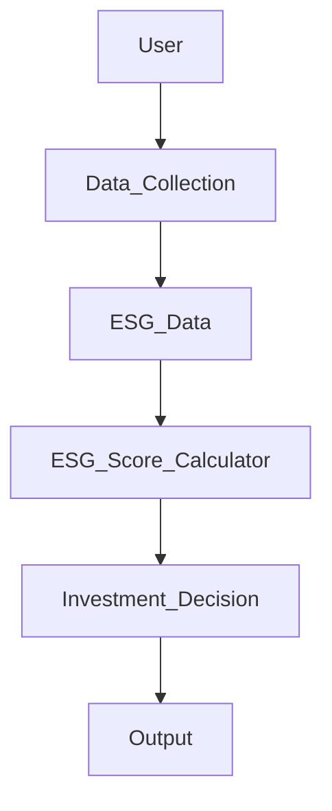

                 

<think>
好，我现在需要分析用户的需求，然后逐步构建一个符合要求的《价值投资中的ESG因素分析》的文章大纲。首先，用户希望我以技术专家的身份，撰写一篇结构清晰、内容详实的技术博客，重点分析ESG因素在价值投资中的应用。我需要确保文章符合逻辑，每个章节都有足够的细节，并且使用专业的技术语言。

首先，我要理解什么是ESG。ESG分别代表环境、社会和治理，这三者都是影响企业长期价值的重要因素。在价值投资中，传统上更关注财务指标，但现在越来越多的投资者开始重视ESG因素，因为它们能够揭示企业的潜在风险和长期发展潜力。

接下来，我需要考虑文章的整体结构。用户已经提供了一个大纲，我需要按照这个大纲来详细展开每个部分。第一部分是背景介绍，包括ESG的基本概念和其在价值投资中的重要性。第二部分是核心概念，分别详细讲解环境、社会和治理三个因素。第三部分是分析方法，介绍如何将ESG因素整合到投资分析中。第四部分是系统架构，设计一个ESG评估系统。第五部分是项目实战，通过案例分析展示如何应用ESG因素进行投资决策。最后是总结与展望。

在开始写作之前，我需要确保每个章节都有足够的细节和深度。例如，在环境因素中，我需要讨论气候变化、碳排放和可再生能源对企业的影响。在社会因素中，要涵盖劳工权益、社会不平等等问题。治理因素则需要分析公司治理结构、透明度和股权激励等。

接下来，我要考虑如何将ESG因素与价值投资结合起来。这可能涉及到构建ESG评分系统，分析ESG指标与企业财务表现的关系，以及使用数学模型来量化ESG对投资决策的影响。

在系统架构部分，我需要设计一个模块化的ESG评估系统，包括数据收集、指标计算、风险评估和投资建议等功能。同时，我需要使用Mermaid图来展示系统的结构和各模块之间的关系。

项目实战部分，我需要选择一个具体的行业或公司，分析其ESG表现，并展示如何利用这些信息进行投资决策。这可能涉及到收集公开数据，应用ESG评分模型，评估潜在风险，并给出投资建议。

最后，我需要总结ESG投资的关键点，给出实际操作中的注意事项，并展望未来的发展趋势。这可能包括ESG评分标准的统一、技术的进步如何提高评估的准确性，以及ESG投资在全球范围内的发展趋势。

在整个写作过程中，我需要确保语言简洁明了，逻辑清晰，同时使用专业术语来展示深度。每个部分的小结有助于读者回顾和巩固所学内容。此外，我还需要注意文章的结构，确保每个章节之间有良好的过渡，使整篇文章连贯流畅。

总之，我需要按照用户提供的大纲，逐步展开每个部分，确保内容详实、逻辑清晰，并且符合技术博客的写作要求。通过这种方式，我可以为读者提供一篇有价值的、关于价值投资中的ESG因素分析的专业文章。
</think>

# 价值投资中的ESG因素分析

## 关键词：价值投资，ESG，环境，社会，治理，投资决策，企业价值

## 摘要：  
本文深入探讨了价值投资中ESG（环境、社会、治理）因素的重要性及其对企业价值的影响。通过分析ESG的三个核心维度，结合实际案例，揭示了如何将ESG因素整合到投资决策中，以实现长期价值最大化。文章还详细介绍了ESG分析的方法、系统架构及实战应用，为投资者提供了实用的指导和参考。

---

# 第一部分: 价值投资中的ESG因素分析基础

## 第1章: 价值投资与ESG概述

### 1.1 价值投资的核心理念  
- **1.1.1 价值投资的定义与历史发展**  
  价值投资是一种以基本面分析为基础的投资策略，强调购买被市场低估的优质企业股票，长期持有以获取超额收益。其核心理念是寻找具有持续竞争优势和良好治理结构的企业。  

- **1.1.2 价值投资与ESG的结合**  
  传统价值投资主要关注企业的财务指标，如市盈率、市净率等。然而，随着环境问题、社会责任和公司治理问题的重要性日益凸显，ESG因素逐渐成为价值投资的重要补充，帮助企业识别潜在风险和长期价值。  

- **1.1.3 ESG投资的兴起与发展趋势**  
  ESG投资的兴起源于全球气候变化、社会不平等和公司治理问题的加剧。越来越多的投资者意识到，企业若在ESG方面表现不佳，可能面临声誉损失、法律风险和财务损失，进而影响其长期价值。  

---

### 1.2 ESG的定义与内涵  
- **1.2.1 ESG的定义**  
  ESG是环境（Environment）、社会（Social）和治理（Governance）的缩写，代表企业在经营过程中对环境、社会和治理三方面的表现。  

- **1.2.2 ESG的三个维度：环境、社会、治理**  
  - **环境（E）**：关注企业的碳排放、资源消耗、环保合规性等。  
  - **社会（S）**：关注企业的社会责任、劳工权益、社区关系等。  
  - **治理（G）**：关注企业的公司治理结构、透明度、管理层激励机制等。  

- **1.2.3 ESG与企业价值的关系**  
  ESG表现优异的企业通常具有更强的抗风险能力和可持续发展潜力，这使得它们在长期投资中更有可能创造超额收益。  

---

### 1.3 价值投资中的ESG分析意义  
- **1.3.1 ESG因素对投资决策的影响**  
  ESG分析可以帮助投资者识别那些在环境保护、社会责任和公司治理方面表现不佳的企业，从而避免潜在风险。  

- **1.3.2 ESG与企业长期价值的关系**  
  企业若在ESG方面表现优异，通常能够吸引更多的优质人才、增强客户信任、降低融资成本，从而提升其市场竞争力和长期价值。  

- **1.3.3 全球ESG投资的发展现状**  
  近年来，全球ESG投资规模迅速增长，越来越多的机构投资者将ESG因素纳入投资决策体系，成为价值投资的重要组成部分。  

---

## 第2章: ESG因素的背景与重要性  

### 2.1 环境因素（E）  
- **2.1.1 气候变化与企业风险**  
  气候变化可能导致企业面临政策风险、运营风险和声誉风险。例如，高碳排放企业可能因碳排放政策的收紧而面临更高的合规成本。  

- **2.1.2 碳排放与企业责任**  
  企业应采取措施减少碳排放，如采用可再生能源、优化生产流程等，以履行其环境责任。  

- **2.1.3 可再生能源与企业转型**  
  随着可再生能源技术的不断进步，企业通过投资可再生能源项目可以降低对化石能源的依赖，从而减少环境风险。  

---

### 2.2 社会因素（S）  
- **2.2.1 劳工权益与企业社会责任**  
  企业应保障员工的合法权益，包括公平的薪酬、安全的工作环境和合理的劳动时间。  

- **2.2.2 社会不平等问题**  
  企业应关注社会不平等问题，通过公益捐赠、社区投资等方式，积极履行社会责任。  

- **2.2.3 企业与社区的关系**  
  企业应与社区建立良好的互动关系，通过支持社区发展、解决社会问题等方式，增强企业的社会形象和声誉。  

---

### 2.3 治理因素（G）  
- **2.3.1 公司治理结构**  
  良好的公司治理结构能够确保企业决策的透明性和高效性，降低代理成本和道德风险。  

- **2.3.2 企业透明度与信息披露**  
  企业应定期披露ESG相关信息，增强投资者对其治理结构和实践的信任。  

- **2.3.3 股权激励与管理层责任**  
  通过股权激励机制，可以将管理层的利益与企业长期价值绑定，激励管理层积极履行其职责。  

---

## 第3章: ESG分析的核心概念与联系  

### 3.1 ESG核心概念的原理  
- **3.1.1 ESG指标的分类与特征**  
  ESG指标可以分为定量指标和定性指标。定量指标如碳排放强度、员工流失率等，定性指标如公司治理结构、社会责任报告等。  

- **3.1.2 ESG评分方法的对比分析**  
  常见的ESG评分方法包括行业基准法、绝对评分法和相对评分法。每种方法都有其优缺点，投资者应根据自身需求选择合适的评分方法。  

- **3.1.3 ESG数据的来源与可靠性**  
  ESG数据主要来源于企业公开披露的信息、第三方评级机构的数据以及行业报告等。投资者应选择可靠的数据源，以确保ESG分析的准确性。  

---

### 3.2 ESG核心概念的属性特征对比  
- **3.2.1 E、S、G三者的属性对比**  
  | 因素 | 环境（E） | 社会（S） | 治理（G） |  
  |------|------------|------------|------------|  
  | 属性 | 硬性指标，如碳排放 | 软性指标，如员工满意度 | 硬性与软性结合，如董事会结构 |  

- **3.2.2 ESG指标与财务指标的关联性**  
  ESG指标与财务指标之间存在一定的相关性。例如，优秀的环境表现可能降低企业的合规成本，从而提升其净利润率。  

- **3.2.3 ESG维度的权重分配**  
  不同行业和不同投资者对ESG维度的权重分配可能不同。例如，对于能源企业，环境因素的权重可能更高；而对于金融企业，治理因素的权重可能更高。  

---

### 3.3 ESG实体关系的ER图与流程图  
- **3.3.1 ESG实体关系的ER图**  
  ```mermaid
  graph TD
      ESG(Entity) --> E(Environment)
      ESG --> S(Social)
      ESG --> G(Governance)
      E --> Climate_Change
      S --> Labor_Practices
      G --> Board_Structure
  ```

---

## 第4章: ESG分析的数学模型与算法  

### 4.1 ESG评分模型的构建  
- **4.1.1 模型输入：企业ESG数据**  
  输入包括企业的环境数据（如碳排放）、社会数据（如员工满意度）和治理数据（如董事会结构）。  

- **4.1.2 模型输出：企业ESG评分**  
  通过加权计算得出企业的综合ESG评分，评分范围为0到100分。  

- **4.1.3 权重分配：E、S、G的权重**  
  根据行业特点和投资策略，确定E、S、G三个维度的权重。例如，对于科技企业，权重分配可能为E:40%，S:30%，G:30%。  

---

### 4.2 ESG评分模型的数学公式  
$$ ESG\_Score = E\_Score \times w_E + S\_Score \times w_S + G\_Score \times w_G $$  
其中，$w_E$、$w_S$、$w_G$分别为环境、社会、治理的权重，$E\_Score$、$S\_Score$、$G\_Score$分别为对应的评分。  

---

### 4.3 基于ESG的股票筛选算法  
- **4.3.1 算法步骤**  
  1. 收集目标行业企业的ESG数据。  
  2. 计算每家企业的ESG综合评分。  
  3. 根据评分筛选出表现优异的企业。  

- **4.3.2 算法实现**  
  ```python
  def calculate_esg_score(e_score, s_score, g_score, w_e, w_s, w_g):
      return e_score * w_e + s_score * w_s + g_score * w_g

  # 示例：筛选高ESG表现的股票
  stocks = [
      {'name': '公司A', 'e': 80, 's': 70, 'g': 60},
      {'name': '公司B', 'e': 75, 's': 85, 'g': 65},
      {'name': '公司C', 'e': 90, 's': 75, 'g': 55}
  ]

  # 权重分配
  w_e = 0.4
  w_s = 0.3
  w_g = 0.3

  # 计算ESG评分并筛选
  for stock in stocks:
      score = calculate_esg_score(stock['e'], stock['s'], stock['g'], w_e, w_s, w_g)
      if score > 70:
          print(f"{stock['name']}的ESG评分为：{score}")
  ```

---

## 第5章: ESG分析的系统架构设计  

### 5.1 系统功能设计  
- **5.1.1 数据收集模块**  
  从企业财报、社会责任报告和第三方评级机构获取ESG数据。  

- **5.1.2 指标计算模块**  
  根据权重分配计算企业的综合ESG评分。  

- **5.1.3 投资决策模块**  
  根据ESG评分和财务指标，生成投资建议。  

---

### 5.2 系统架构设计  


---

## 第6章: 项目实战：基于ESG的股票筛选  

### 6.1 环境数据的收集与分析  
- 收集企业的碳排放数据，分析其环保合规性。  

### 6.2 社会风险评估  
- 评估企业的员工满意度、社会公益支出等社会因素。  

### 6.3 治理结构优化  
- 分析企业的董事会结构、管理层激励机制，提出优化建议。  

---

## 第7章: 总结与展望  

### 7.1 本章总结  
- 本文详细分析了ESG因素在价值投资中的重要性，探讨了ESG分析的核心概念、数学模型和系统架构。  

### 7.2 未来展望  
- 随着技术的进步和ESG数据的完善，未来可以开发更智能化的ESG评分系统，帮助投资者更好地识别和管理风险。  

---

## 作者：AI天才研究院/AI Genius Institute & 禅与计算机程序设计艺术/Zen And The Art of Computer Programming

