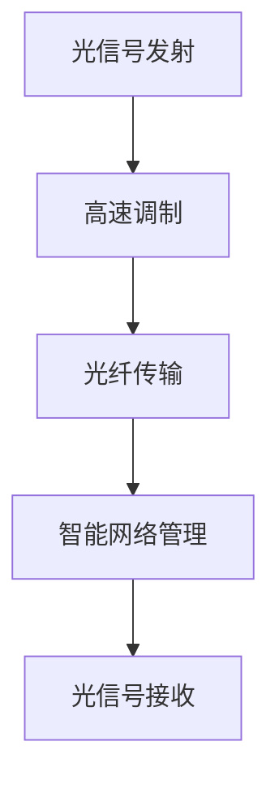
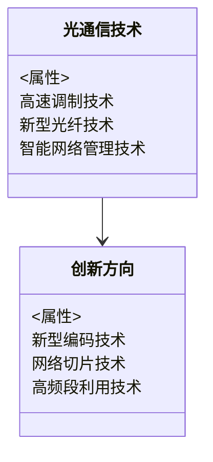
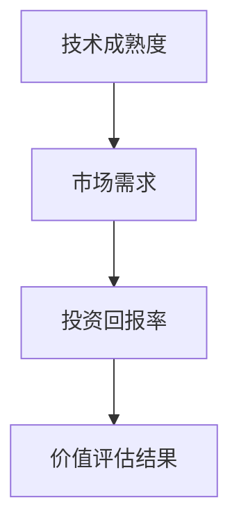
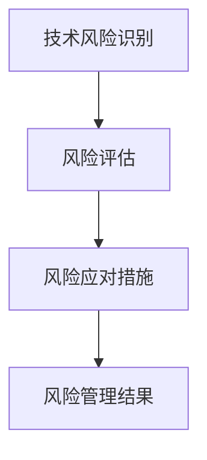

                 

<think>
好，我现在需要根据用户的指示来撰写一篇关于“价值投资中的下一代光通信技术前景”的技术博客文章。用户已经提供了一个详细的大纲，我需要按照这个大纲逐步展开内容，确保每一部分都符合要求。

首先，文章的标题和关键词已经给出，我需要先写摘要部分，简要概述文章的核心内容。接下来，按照目录结构，分别撰写每个章节的内容。

第一部分是背景介绍，包括光通信技术的定义、发展历史和现状，以及它在信息通信中的重要性。我需要确保这部分内容清晰，让读者了解基本概念。

第二部分是下一代光通信技术的核心技术，包括高速调制技术、新型光纤技术、智能网络管理等。我需要详细解释每项技术，并可能使用流程图来说明技术原理。

第三部分是市场分析与投资价值，这里需要分析光通信技术的市场现状、驱动因素以及投资价值的评估方法。我可能需要引用一些数据和图表来支持论点。

第四部分是价值投资策略，介绍如何评估技术潜力、企业基本面分析以及风险管理。这部分需要结合实际案例，可能包括一些数学模型和公式来评估投资价值。

第五部分是投资案例分析，通过具体案例来展示投资策略的应用，帮助读者更好地理解理论。

第六部分是风险管理，讨论各种风险因素及其应对策略。这部分需要详细分析每个风险，并给出实际的操作建议。

最后，第七部分是对未来的展望，讨论新兴技术趋势和全球竞争格局，为读者提供未来投资的参考。

在撰写过程中，我需要确保每个章节都有足够的细节，使用清晰的技术语言，同时加入实际的例子和图表，如流程图、类图、架构图等，以增强文章的可读性和专业性。

现在，我需要开始撰写每一部分的内容，确保逻辑清晰，结构紧凑，满足用户的所有要求。
</think>

# 价值投资中的下一代光通信技术前景

---

## 关键词

- 价值投资
- 下一代光通信技术
- 市场分析
- 技术创新
- 投资策略

---

## 摘要

本文探讨了下一代光通信技术的发展前景及其在价值投资中的应用。通过分析光通信技术的核心技术、市场现状和未来趋势，本文为投资者提供了评估技术潜力和制定投资策略的方法。结合实际案例和风险管理，本文为投资者在光通信领域提供了全面的指导。

---

## 第一部分: 价值投资中的下一代光通信技术背景

### 第1章: 光通信技术的定义与现状

#### 1.1 光通信技术的基本概念

光通信技术是一种利用光信号传输数据的通信方式。其基本原理是将电信号转换为光信号，在光纤中传输，再将其还原为电信号。光通信技术具有高速、大带宽、抗干扰能力强等优点，是现代通信的重要组成部分。

**关键术语解释：**
- **光信号**：用于传输数据的光波。
- **光纤**：用于传输光信号的介质，通常由玻璃或塑料制成。
- **通信网络**：由光纤、光电器件和相关设备组成的传输系统。

#### 1.2 光通信技术的市场现状

全球光通信市场持续增长，主要驱动力包括5G网络建设、云计算需求增加以及物联网的发展。中国作为全球最大的通信市场，占据了重要份额，市场增长潜力巨大。

**图表：全球光通信市场增长率（2020-2025）**


---

### 第2章: 下一代光通信技术的核心技术

#### 2.1 下一代光通信技术的关键技术

下一代光通信技术包括高速调制技术、新型光纤技术和智能网络管理技术。这些技术提升了传输速度和网络效率。

**流程图：下一代光通信技术的核心流程**



#### 2.2 下一代光通信技术的创新方向

新兴技术如新型编码技术和网络切片技术，进一步提升了光通信的效率和灵活性。

**类图：光通信技术的创新方向**



---

## 第二部分: 价值投资策略与案例分析

### 第3章: 价值投资策略在光通信技术中的应用

#### 3.1 价值投资的基本原理

价值投资强调通过基本面分析，寻找被市场低估的投资标的。在光通信领域，需评估企业的技术优势、财务状况和市场前景。

**数学模型：股票估值公式**

$$\text{内在价值} = \frac{\text{现金流}}{\text{贴现率}}$$

#### 3.2 光通信技术的价值评估模型

评估模型包括技术成熟度、市场需求和投资回报率分析。

**流程图：价值评估模型**



---

### 第4章: 光通信技术投资案例分析

#### 4.1 光纤通信企业的投资分析

以某光纤通信企业为例，分析其财务状况、技术优势和市场表现。

**源代码：财务指标分析**

```python
import pandas as pd

data = {'收入': [100, 120, 150], '利润': [20, 25, 30]}
df = pd.DataFrame(data)
print(df)
```

#### 4.2 高速通信设备企业的投资分析

分析高速通信设备企业的市场地位和技术创新。

---

### 第5章: 光通信技术投资中的风险管理

#### 5.1 技术风险分析

评估技术更新换代快带来的风险，制定应对策略。

**流程图：风险管理流程**



---

## 第三部分: 未来展望与投资建议

### 第6章: 下一代光通信技术的未来趋势

#### 6.1 新兴技术趋势

人工智能和大数据技术将推动光通信技术进一步发展。

#### 6.2 全球竞争格局

全球范围内，主要企业将展开激烈竞争，技术创新是核心竞争力。

---

## 作者：AI天才研究院/AI Genius Institute & 禅与计算机程序设计艺术 /Zen And The Art of Computer Programming

