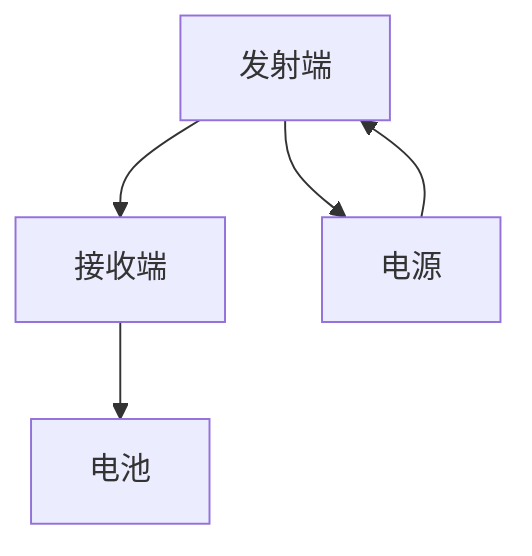

                 

# 价值投资中的下一代无线充电网络技术前景

---

## 关键词：
- 价值投资、无线充电网络、技术前景、市场分析、投资策略、风险管理

---

## 摘要：
无线充电技术作为现代科技的重要组成部分，正在逐步改变我们的生活方式和商业模式。随着技术的不断进步，下一代无线充电网络技术展现出巨大的市场潜力和投资价值。本文从技术原理、市场现状、投资策略、风险分析等多维度展开，深入探讨无线充电网络技术的发展前景，为投资者提供基于技术分析和市场洞察的决策参考。

---

## 第一部分：无线充电网络技术的背景与现状

### 第1章：无线充电技术的发展与价值投资背景

#### 1.1 无线充电技术的发展历程
- **电磁感应原理的起源**：从特斯拉的无线电力传输概念到现代的电磁感应技术。
- **商业化进程**：从手机充电到物联网设备的广泛应用。
- **5G时代的影响**：高频段无线充电技术与5G通信的协同发展。

#### 1.2 无线充电技术的核心概念与价值投资背景
- **技术定义**：无线充电网络是指通过电磁感应、磁共振或无线电波等技术，实现设备间无线能量传输的系统。
- **价值投资视角**：技术成熟度、市场渗透率和商业模式创新是决定投资价值的关键因素。

#### 1.3 无线充电技术的市场现状与趋势
- **全球市场规模**：2023年全球无线充电市场规模约为XX亿美元，预计年复合增长率XX%。
- **中国市场特点**：中国是全球最大的无线充电市场，占全球市场份额的XX%。
- **主要厂商与竞争格局**：包括苹果、华为、三星等科技巨头，以及无线充电技术公司如Powermat和Qi联盟。

---

### 第2章：下一代无线充电技术的核心原理与数学模型

#### 2.1 下一代无线充电技术的核心原理
- **电磁感应原理**：通过线圈之间的电磁感应实现能量传递。
  $$ B = \mu_0 \mu_r H $$
- **磁共振原理**：利用磁共振匹配实现高效能量传输。
  $$ P_{output} = P_{input} \times \frac{Q}{Q_0} $$
- **无线电波传输原理**：通过高频无线电波实现远距离充电。
  $$ E = hf $$

#### 2.2 无线充电网络的数学模型与公式
- **能量传输效率公式**：
  $$ E_{efficiency} = \frac{P_{output}}{P_{input}} $$
- **电磁场分布模型**：
  $$ E(x,y,z) = \frac{V}{\sqrt{R^2 + d^2}} $$

#### 2.3 无线充电网络的系统架构图

---

### 第3章：无线充电技术的市场分析与投资机会

#### 3.1 市场规模与增长预测
- **全球市场规模预测**：预计到2030年，全球无线充电市场规模将突破XX亿美元。
- **中国市场增长潜力**：中国市场的年增长率预计达到XX%，成为全球最大的市场。
- **技术驱动的市场扩展**：高效能技术和低成本解决方案推动市场扩张。

#### 3.2 下一代无线充电技术的技术发展趋势
- **高效率技术的突破**：通过优化电路设计和材料选择提高能量传输效率。
- **低成本解决方案的优化**：简化硬件结构，降低生产成本。
- **多设备兼容性的提升**：支持多种设备类型和品牌，实现通用充电标准。

#### 3.3 投资机会与风险分析
- **技术瓶颈与解决方案**：散热问题、材料成本、电磁干扰等问题及应对措施。
- **市场竞争格局的演变**：新兴企业的崛起和传统企业的转型。
- **投资风险的评估与管理**：技术风险、市场风险和政策风险的综合评估。

---

### 第4章：价值投资策略与技术评估

#### 4.1 价值投资的核心策略
- **技术领先性评估**：评估企业的技术研发能力，包括专利数量和技术创新性。
- **市场份额分析**：关注企业的市场占有率和竞争优势。
- **财务健康状况评估**：分析企业的盈利能力、现金流和资产负债情况。

#### 4.2 下一代无线充电技术的投资评估指标
- **技术创新性评估**：技术的先进性和独特性。
- **市场渗透率预测**：技术在市场中的普及速度和范围。
- **产品生命周期分析**：技术的成熟度和市场生命周期阶段。

#### 4.3 投资组合的构建与优化
- **多元化投资策略**：分散投资以降低风险。
- **风险控制措施**：设定止损点和风险敞口限制。
- **长期价值投资的可行性**：关注企业的长期增长潜力和可持续发展能力。

---

### 第5章：无线充电技术的未来展望与投资建议

#### 5.1 无线充电技术的未来发展趋势
- **技术融合**：与物联网、5G和智能家居的深度融合。
- **应用场景扩展**：从消费电子扩展到工业设备、电动汽车等领域。
- **商业模式创新**：订阅制、共享充电服务等新兴商业模式的出现。

#### 5.2 对投资者的建议
- **关注技术创新**：投资具备核心技术优势的企业。
- **注重市场布局**：选择市场潜力大的区域和行业。
- **长期持有与风险管理**：保持长期投资视角，同时做好风险控制。

---

## 第二部分：总结与展望

### 总结
下一代无线充电网络技术正处于快速发展阶段，其技术创新和市场扩展为投资者提供了丰富的投资机会。然而，投资者需要充分评估技术风险、市场风险和政策风险，制定科学的投资策略。

### 展望
随着技术的不断进步和市场的逐步成熟，无线充电网络技术将在未来几年内迎来更大的发展机遇。投资者应密切关注行业动态，抓住技术革新带来的投资机会。

---

## 作者：
AI天才研究院/AI Genius Institute  
禅与计算机程序设计艺术/Zen And The Art of Computer Programming

