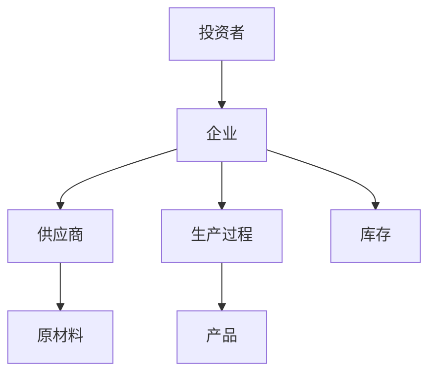
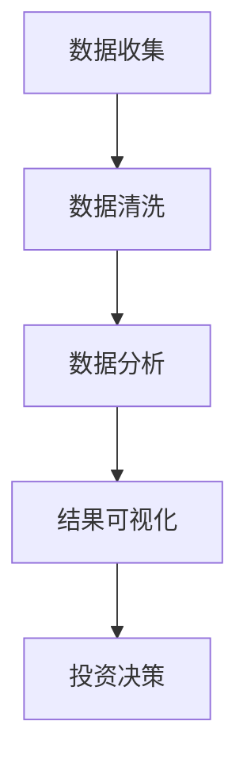
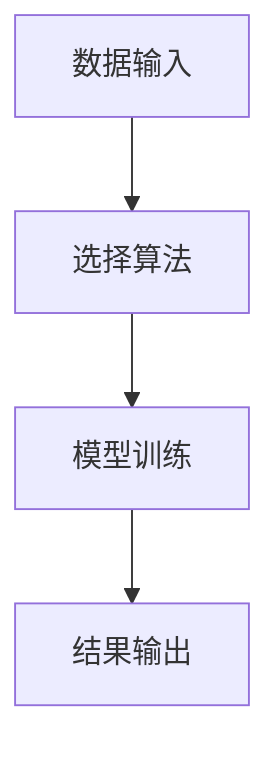
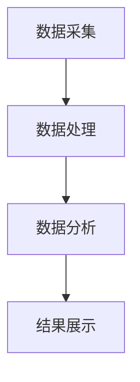
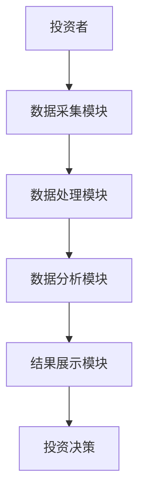

                 


```markdown
# 价值投资中的供应链分析

> 关键词：供应链分析，价值投资，供应链管理，企业运营，投资决策

> 摘要：供应链分析在价值投资中扮演着关键角色，通过深入分析企业的供应链结构、效率和稳定性，投资者可以更准确地评估企业的竞争力和潜在风险。本文系统地介绍了供应链分析的核心概念、算法原理、系统架构，并通过实际案例展示了如何将供应链分析应用于投资决策中。

---

## 第一部分: 供应链分析的背景与重要性

## 第1章: 供应链分析的背景与重要性

### 1.1 供应链的基本概念
#### 1.1.1 供应链的定义与组成
供应链是指从原材料采购到产品交付给最终客户的整个过程中的所有环节和参与者。它包括供应商、制造商、分销商、零售商以及客户等多个环节。

#### 1.1.2 供应链在企业运营中的作用
供应链直接关系到企业的生产效率、成本控制和产品交付能力。高效的供应链能够降低库存成本，提高生产效率，从而增强企业的竞争力。

#### 1.1.3 供应链分析在价值投资中的意义
供应链分析帮助投资者评估企业的运营效率、成本控制能力和风险暴露程度。通过分析供应链的稳定性和效率，投资者可以识别企业的竞争优势和潜在风险。

### 1.2 供应链分析的必要性
#### 1.2.1 供应链对企业竞争力的影响
供应链的效率直接影响企业的生产成本和交付能力。高效的供应链能够更快地响应市场需求，提高企业的市场竞争力。

#### 1.2.2 供应链稳定性与企业风险控制
供应链的稳定性决定了企业能否在面对原材料短缺或物流中断时保持正常运营。稳定的供应链有助于降低企业的经营风险。

#### 1.2.3 供应链效率与企业成本优化
通过优化供应链流程，企业可以降低库存成本、运输成本和生产成本，从而提高利润率和投资回报率。

### 1.3 供应链分析的方法与工具
#### 1.3.1 供应链分析的基本方法
常用的方法包括数据收集、数据分析、模型构建和结果可视化。数据收集包括原材料成本、生产周期、库存水平等关键指标。

#### 1.3.2 数据分析工具在供应链分析中的应用
常用工具包括Excel、Python（Pandas、NumPy）、R等。这些工具可以帮助投资者进行数据清洗、建模和可视化。

#### 1.3.3 供应链分析的行业案例
以制造业为例，分析其供应商选择、生产流程优化和库存管理的具体实践。

### 1.4 本章小结
本章介绍了供应链的基本概念、其在企业运营中的作用以及在价值投资中的意义。供应链分析是投资者评估企业竞争力和风险的重要工具。

---

## 第二部分: 供应链分析的核心概念与联系

## 第2章: 供应链分析的核心概念

### 2.1 供应链的关键要素
#### 2.1.1 供应商的选择与评估
供应商的可靠性和成本直接影响企业的供应链效率。投资者需要评估供应商的交货周期、质量稳定性以及议价能力。

#### 2.1.2 生产过程的优化
生产过程的优化包括流程再造、技术升级和自动化应用。高效的生产过程能够降低生产成本，提高产品交付能力。

#### 2.1.3 库存管理与成本控制
库存管理的目标是在满足需求的前提下，最小化库存成本。投资者需要关注企业的库存周转率和库存持有成本。

### 2.2 供应链的实体关系图


### 2.3 供应链分析的流程图


### 2.4 本章小结
本章详细分析了供应链的关键要素，包括供应商、生产过程和库存管理，并通过图表展示了供应链的结构和分析流程。

---

## 第三部分: 供应链分析的算法与数学模型

## 第3章: 供应链分析的算法原理

### 3.1 常用算法介绍
#### 3.1.1 线性回归分析
线性回归用于分析变量之间的线性关系，例如生产成本与产量的关系。

#### 3.1.2 聚类分析
聚类分析用于将供应商或客户分成不同的群体，识别潜在的合作机会或风险。

#### 3.1.3 时间序列分析
时间序列分析用于预测供应链的未来表现，例如库存需求预测。

### 3.2 算法流程图


### 3.3 数学模型与公式
#### 3.3.1 线性回归模型
$$ y = \beta_0 + \beta_1x + \epsilon $$

#### 3.3.2 聚类分析的距离公式
$$ d(x_i, x_j) = \sqrt{(x_i - x_j)^2 + (y_i - y_j)^2} $$

#### 3.3.3 时间序列模型
$$ ARIMA(p, d, q) $$

### 3.4 本章小结
本章介绍了供应链分析中常用的算法及其数学模型，包括线性回归、聚类分析和时间序列分析。

---

## 第四部分: 供应链分析的系统架构与设计

## 第4章: 供应链分析的系统架构

### 4.1 系统功能设计
#### 4.1.1 数据采集模块
负责收集供应链各个环节的数据，包括供应商信息、生产数据和库存数据。

#### 4.1.2 数据处理模块
对收集到的数据进行清洗和转换，确保数据的准确性和一致性。

#### 4.1.3 数据分析模块
应用算法对数据进行分析，生成分析结果。

#### 4.1.4 结果展示模块
以可视化的方式展示分析结果，帮助投资者做出决策。

### 4.2 系统架构图


### 4.3 系统接口设计
系统需要与企业的ERP系统、供应商管理系统等接口对接，确保数据的实时性和准确性。

### 4.4 系统交互流程图


### 4.5 本章小结
本章详细描述了供应链分析系统的架构设计，包括功能模块、接口设计和交互流程。

---

## 第五部分: 供应链分析的项目实战

## 第5章: 供应链分析的项目实战

### 5.1 项目背景
以一家制造企业为例，分析其供应链的效率和稳定性。

### 5.2 环境安装
安装必要的工具和库，例如Python、Pandas、NumPy等。

### 5.3 核心代码实现
#### 5.3.1 数据采集
```python
import pandas as pd
data = pd.read_csv('supply_chain.csv')
```

#### 5.3.2 数据清洗
```python
data.dropna(inplace=True)
data['date'] = pd.to_datetime(data['date'])
```

#### 5.3.3 数据分析
```python
from sklearn.linear_model import LinearRegression
model = LinearRegression()
model.fit(X, y)
```

#### 5.3.4 结果可视化
```python
import matplotlib.pyplot as plt
plt.scatter(X, y)
plt.plot(X, model.predict(X), color='red')
plt.show()
```

### 5.4 实际案例分析
通过分析某企业的供应链数据，识别其供应链中的瓶颈和优化机会。

### 5.5 本章小结
本章通过实际案例展示了供应链分析的具体实施过程，包括数据采集、清洗、分析和可视化。

---

## 第六部分: 最佳实践与小结

## 第6章: 最佳实践与小结

### 6.1 投资策略与注意事项
投资者在进行供应链分析时，应关注供应商的稳定性、生产过程的效率和库存管理的优化。

### 6.2 项目小结
通过供应链分析，投资者可以更全面地评估企业的运营能力和风险，从而做出更明智的投资决策。

### 6.3 未来研究方向
未来的研究可以进一步探索人工智能和大数据在供应链分析中的应用，提升分析的准确性和效率。

### 6.4 本章小结
本章总结了供应链分析在投资中的应用，并提出了未来的研究方向。

---

## 作者

作者：AI天才研究院/AI Genius Institute & 禅与计算机程序设计艺术 /Zen And The Art of Computer Programming

---

感谢您的阅读！希望本文能够帮助您更好地理解供应链分析在价值投资中的重要性，并为您的投资决策提供有价值的参考。
```

