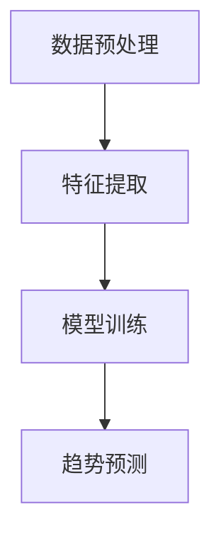
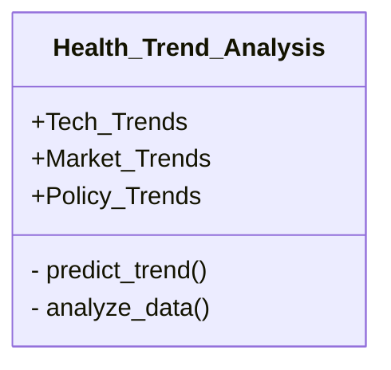
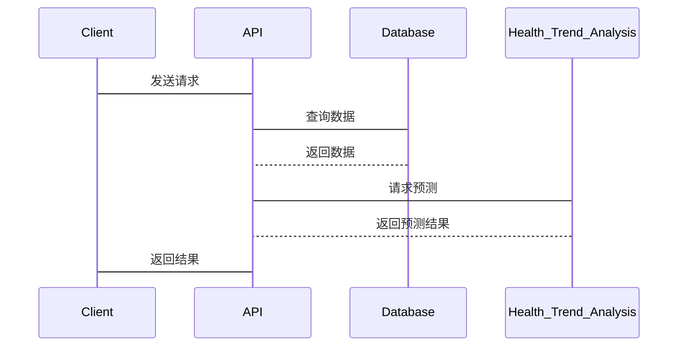

                 


# 价值投资中的健康科技趋势分析

> 关键词：健康科技，价值投资，趋势分析，机器学习，系统架构

> 摘要：本文深入探讨了健康科技领域中的价值投资趋势分析，通过数据驱动的方法，结合机器学习算法和系统架构设计，分析健康科技行业的技术、市场和政策趋势，为投资者提供科学的投资决策依据。

---

## 第1章 健康科技的发展现状与价值投资概述

### 1.1 健康科技的定义与发展

#### 1.1.1 健康科技的核心概念
健康科技是指利用信息技术和生物技术改善医疗健康服务的新兴领域，涵盖智能医疗设备、基因编辑、远程医疗、健康大数据分析等多个方面。健康科技的目标是提高医疗服务的效率和质量，降低医疗成本。

#### 1.1.2 健康科技的演进历程
健康科技的发展经历了以下几个阶段：
1. **传统医疗阶段**：以医院和医生为核心，依赖人工记录和处理医疗数据。
2. **信息技术阶段**：引入电子健康记录（EHR）和医疗信息管理系统（HIS），实现了医疗数据的数字化。
3. **生物技术阶段**：基因测序、精准医疗等技术的应用，推动了个性化医疗的发展。
4. **智能化阶段**：人工智能（AI）和大数据技术的融合，使得健康科技进入智能化时代。

#### 1.1.3 当前健康科技的主要应用领域
- **智能医疗设备**：如智能血压计、可穿戴设备等。
- **远程医疗**：通过互联网实现远程诊断和治疗。
- **健康大数据分析**：利用大数据技术分析医疗数据，辅助诊断和治疗决策。

### 1.2 价值投资的基本原理

#### 1.2.1 价值投资的定义与特点
价值投资是一种长期投资策略，强调以低于内在价值的价格购买优质资产。其核心理念是寻找被市场低估的企业，长期持有，等待其价值回归。

#### 1.2.2 价值投资的核心理念与方法
- **基本面分析**：通过分析企业的财务状况、行业地位、竞争优势等，评估其内在价值。
- **长期视角**：关注企业的长期增长潜力，而非短期市场波动。
- **安全边际**：买入价格低于内在价值，以降低投资风险。

#### 1.2.3 价值投资在健康科技领域的应用
健康科技行业的高成长性和技术创新性使其成为价值投资的理想领域。投资者需要关注企业的技术创新能力、市场前景和财务健康状况。

### 1.3 健康科技与价值投资的结合

#### 1.3.1 健康科技行业的投资价值分析
健康科技行业的投资价值主要体现在以下几个方面：
1. **技术壁垒**：技术创新能力强的公司具有竞争优势。
2. **市场空间**：随着人口老龄化和医疗需求的增加，健康科技市场空间广阔。
3. **政策支持**：政府对健康科技的政策支持力度大，推动行业发展。

#### 1.3.2 价值投资在健康科技领域的优势
- **长期增长潜力**：健康科技行业的技术创新和市场规模增长为长期投资者提供了丰厚的回报。
- **抗周期性**：健康科技行业的需求相对稳定，受经济周期影响较小。

#### 1.3.3 健康科技趋势分析的必要性
通过趋势分析，投资者可以更好地把握行业发展方向，发现具有投资价值的企业。

## 第2章 健康科技趋势分析的核心概念与联系

### 2.1 健康科技趋势分析的原理

#### 2.1.1 数据驱动的健康科技趋势分析
通过收集和分析大量数据，识别行业发展趋势和潜在机会。

#### 2.1.2 假设驱动的健康科技趋势分析
基于行业经验和专家意见，提出趋势假设，并通过数据验证。

#### 2.1.3 综合驱动的健康科技趋势分析
结合数据驱动和假设驱动的方法，进行全面趋势分析。

### 2.2 健康科技趋势分析的核心要素

#### 2.2.1 技术要素
- **人工智能（AI）**：应用于医疗影像识别、疾病预测等领域。
- **大数据分析**：用于医疗数据的挖掘和分析。
- **区块链技术**：用于医疗数据的安全共享和管理。

#### 2.2.2 市场要素
- **市场规模**：健康科技市场的增长潜力。
- **竞争格局**：行业内主要竞争者的市场份额和竞争优势。

#### 2.2.3 政策要素
- **政策支持**：政府对健康科技行业的政策支持力度。
- **法律法规**：与健康科技相关的法律法规对行业的影响。

### 2.3 健康科技趋势分析的ER实体关系图

```mermaid
er
    Health_Trend_Analysis
    Tech_Trends
    Market_Trends
    Policy_Trends
    Health_Trend_Analysis --> Tech_Trends
    Health_Trend_Analysis --> Market_Trends
    Health_Trend_Analysis --> Policy_Trends
```

## 第3章 健康科技趋势预测的算法原理

### 3.1 时间序列分析模型

#### 3.1.1 ARIMA模型
ARIMA（自回归积分滑动平均模型）是一种常用的时间序列预测模型，适用于具有趋势和周期性的数据。

$$ ARIMA(p, d, q) $$

- **p**：自回归阶数。
- **d**：差分阶数。
- **q**：滑动平均阶数。

#### 3.1.2 LSTM模型
长短期记忆网络（LSTM）是一种基于深度学习的时间序列预测模型，能够捕捉长期依赖关系。

### 3.2 基于机器学习的趋势预测

#### 3.2.1 数据预处理与特征提取
- **数据清洗**：处理缺失值、异常值。
- **特征提取**：从原始数据中提取有用的特征。

#### 3.2.2 算法实现


#### 3.2.3 Python代码示例
```python
import numpy as np
from sklearn.metrics import mean_squared_error

# 示例数据
data = np.random.rand(100, 1)

# 划分训练集和测试集
train_data = data[:70]
test_data = data[70:]

# ARIMA模型训练
from statsmodels.tsa.arima.model import ARIMA
model = ARIMA(train_data, order=(1, 1, 1))
model_fit = model.fit()

# 预测
forecast = model_fit.forecast(steps=len(test_data))[0]

# 计算均方根误差
rmse = mean_squared_error(test_data, forecast)
print("均方根误差:", rmse)
```

### 3.3 数学模型与公式

#### 3.3.1 ARIMA模型公式
$$ \phi(\theta)X_t = \theta(B)Z_t $$

- **$\phi(\theta)$**：自回归多项式。
- **$\theta(B)$**：滑动平均多项式。
- **$X_t$**：观测值序列。
- **$Z_t$**：白噪声序列。

## 第4章 健康科技趋势分析的系统架构设计

### 4.1 问题场景介绍
健康科技趋势分析系统旨在通过数据驱动的方法，预测健康科技行业的技术、市场和政策趋势，为投资者提供科学的决策支持。

### 4.2 系统功能设计

#### 4.2.1 领域模型


#### 4.2.2 系统架构设计


#### 4.2.3 系统接口设计
- **API接口**：提供健康科技趋势数据的查询和预测接口。
- **数据库接口**：存储健康科技相关的数据，如技术趋势、市场趋势和政策趋势。

#### 4.2.4 系统交互设计


## 第5章 项目实战

### 5.1 环境安装
- **Python**：安装Python 3.x
- **依赖库**：安装numpy、pandas、statsmodels、scikit-learn等库。

### 5.2 核心实现代码

#### 5.2.1 数据预处理
```python
import pandas as pd
import numpy as np

# 读取数据
data = pd.read_csv('health_trend_data.csv')

# 处理缺失值
data = data.dropna()

# 标准化数据
from sklearn.preprocessing import StandardScaler
scaler = StandardScaler()
data_scaled = scaler.fit_transform(data)
```

#### 5.2.2 模型训练与预测
```python
from statsmodels.tsa.arima.model import ARIMA
import warnings

# 训练ARIMA模型
data_train = data_scaled[:70]
data_test = data_scaled[70:]

model = ARIMA(data_train, order=(1, 1, 1))
model_fit = model.fit()

# 预测
forecast, stderr, conf_int = model_fit.forecast(steps=len(data_test), alpha=0.05)
```

### 5.3 案例分析

#### 5.3.1 案例背景
假设我们有一家健康科技公司，专注于智能医疗设备的研发和生产。

#### 5.3.2 数据分析与预测
通过ARIMA模型预测公司的未来销售额和利润增长率。

#### 5.3.3 投资建议
基于模型预测结果，给出投资建议，如买入价格、持有时间等。

### 5.4 项目小结
通过本项目，我们展示了如何利用ARIMA模型进行健康科技趋势分析，并为投资者提供了科学的投资决策依据。

## 第6章 总结与展望

### 6.1 总结
本文通过分析健康科技行业的技术、市场和政策趋势，结合价值投资的基本原理，提出了健康科技趋势分析的方法和系统架构设计。通过实际案例展示了如何利用机器学习算法进行趋势预测，并为投资者提供了投资建议。

### 6.2 投资策略
- **长期投资**：关注具有长期增长潜力的健康科技企业。
- **风险管理**：通过分散投资和严格的风险控制，降低投资风险。

### 6.3 未来展望
随着人工智能和大数据技术的进一步发展，健康科技行业的趋势分析将更加精准和智能化。投资者需要持续关注行业动态，抓住投资机会。

---

# 作者：AI天才研究院/AI Genius Institute & 禅与计算机程序设计艺术 /Zen And The Art of Computer Programming

