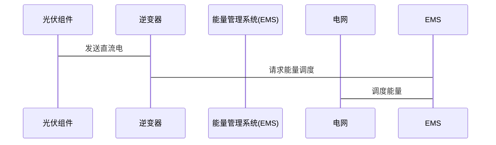

                 


# 价值投资中的光伏储能技术分析

> 关键词：价值投资，光伏储能，技术分析，投资策略，能源转型，可再生能源

> 摘要：本文通过分析光伏储能技术的核心原理、系统架构、算法模型和市场价值，结合价值投资的理论与实践，深入探讨如何在光伏储能领域进行有效的技术分析和投资决策。文章从光伏和储能技术的基本概念入手，详细阐述了两者的协同优化、系统设计以及在实际项目中的应用，为投资者提供了基于技术分析的投资策略和决策支持。

---

# 第1章 光伏储能技术与价值投资概述

## 1.1 光伏储能技术的基本概念

### 1.1.1 光伏技术的定义与原理

光伏（Photovoltaic，PV）技术是一种将太阳光直接转化为电能的技术。其核心原理基于半导体器件的光电效应，当光子击中半导体材料时，会产生电子-空穴对，形成电流。光伏系统通常由光伏电池、逆变器、支架和连接设备组成。

光伏电池的主要类型包括：

- **单晶硅电池**：效率高，成本较高。
- **多晶硅电池**：效率略低于单晶硅，成本较低。
- **薄膜电池**：适用于柔性基底，但效率较低。

### 1.1.2 储能技术的定义与原理

储能技术（Energy Storage）是指将电能以化学能、热能或其他形式储存，并在需要时释放的技术。常见的储能技术包括：

- **电池储能**：如锂离子电池、铅酸电池。
- **超级电容器**：具有高功率密度，适用于短时储能。
- **氢储能**：通过电解水制氢，储存氢气用于后续发电。

### 1.1.3 光伏储能系统的组成与结构

光伏储能系统由以下部分组成：

1. **光伏组件**：负责收集太阳能并将其转化为电能。
2. **储能电池**：用于储存 excess energy。
3. **逆变器**：将直流电转换为交流电，以供电网或负载使用。
4. **能量管理系统（EMS）**：监控和管理系统的运行状态，优化能量流动。

---

## 1.2 光伏储能技术的市场背景

### 1.2.1 全球能源结构的变化

随着全球能源需求的增长和化石能源的枯竭，可再生能源占比逐步提高。根据国际能源署（IEA）的报告，光伏发电成本在过去十年中大幅下降，成为最经济的可再生能源之一。

### 1.2.2 可再生能源发展的趋势

全球范围内，可再生能源发电占比持续增长。2020年，全球可再生能源发电量占比已达到28%，其中光伏发电占比接近三分之一。

### 1.2.3 储能技术在能源转型中的作用

储能技术是实现可再生能源大规模应用的关键。通过储能，可以平衡电网的波动性，提高系统的可靠性和稳定性。

---

## 1.3 价值投资与光伏储能的结合

### 1.3.1 价值投资的基本概念

价值投资是一种投资策略，旨在通过分析企业的基本面，寻找市场价格低于内在价值的投资标的。其核心在于找到被市场低估的企业，并长期持有。

### 1.3.2 光伏储能行业的投资价值

光伏储能行业的投资价值体现在以下几个方面：

1. **行业需求增长**：全球能源转型推动了对光伏和储能系统的需求。
2. **技术进步**：技术创新降低了成本，提高了效率。
3. **政策支持**：各国政府通过补贴和优惠政策推动可再生能源发展。

### 1.3.3 价值投资在光伏储能领域的应用前景

在光伏储能领域，价值投资需要结合技术分析和市场分析。投资者需要关注企业的技术优势、成本控制能力、市场占有率以及政策环境等因素。

---

## 1.4 本章小结

本章从光伏储能技术的基本概念入手，分析了其在能源转型中的地位和作用。同时，探讨了价值投资在光伏储能领域的应用前景，为后续的技术分析和投资策略奠定了基础。

---

# 第2章 光伏储能技术的核心概念与联系

## 2.1 光伏技术的核心原理

### 2.1.1 光电转换的基本原理

光伏电池通过光电效应将光能转化为电能。其能量转换效率受到多种因素的影响，包括光照强度、温度、电池材料等。

### 2.1.2 光伏电池的类型与效率

不同类型的光伏电池具有不同的效率和成本特点。例如，单晶硅电池的效率较高，但成本也较高；薄膜电池的成本较低，但效率较低。

### 2.1.3 光伏系统的能量转换流程

光伏系统的能量转换流程包括光能吸收、光电转换、直流电转换为交流电，以及能量储存或直接使用。

---

## 2.2 储能技术的核心原理

### 2.2.1 储能的基本概念与分类

储能技术可以分为电化学储能、机械储能、热储能等类型。其中，电池储能是最常见的形式。

### 2.2.2 常见储能技术的优缺点对比

| 技术类型       | 优点                           | 缺点                           |
|----------------|--------------------------------|--------------------------------|
| 锂离子电池     | 高能量密度，循环寿命长         | 成本高，资源依赖                   |
| 铅酸电池       | 成本低，易于回收               | 体积大，循环寿命短               |
| 超级电容器     | �功率密度高，充放电速度快       | 能量密度低                       |

### 2.2.3 储能系统的能量管理机制

储能系统的能量管理机制包括充放电控制、能量调度和能量效率优化。通过优化算法，可以提高储能系统的整体效率。

---

## 2.3 光伏与储能的系统集成

### 2.3.1 光伏储能系统的整体架构

光伏储能系统通常包括以下功能模块：

1. **光伏组件**：负责收集太阳能。
2. **储能电池**：储存 excess energy。
3. **逆变器**：将直流电转换为交流电。
4. **能量管理系统（EMS）**：监控和管理系统的运行状态。

### 2.3.2 光伏与储能的协同优化

光伏与储能的协同优化包括能量调度、功率平衡和系统效率提升。通过优化算法，可以实现系统的最优运行。

### 2.3.3 系统集成的关键技术挑战

系统集成的关键技术挑战包括：

1. **能量管理算法的优化**：需要考虑多种因素，如光照强度、负载需求、储能容量等。
2. **系统的实时性要求**：需要快速响应，以应对电网的波动。

---

## 2.4 本章小结

本章详细介绍了光伏和储能技术的核心原理，并探讨了它们的协同优化和系统集成。通过对比不同储能技术的优缺点，为后续的系统设计和优化提供了参考。

---

# 第3章 光伏储能技术的算法原理与数学模型

## 3.1 光伏系统的能量预测模型

### 3.1.1 光伏发电量预测的数学模型

光伏系统的能量预测模型可以通过时间序列分析或神经网络等方法实现。常用的模型包括：

- **ARIMA模型**：基于历史数据进行预测。
- **LSTM网络**：适用于时间序列数据，具有较好的预测能力。

### 3.1.2 时间序列分析方法

时间序列分析方法通过分析历史数据的规律，预测未来的光伏发电量。常用的模型包括ARIMA和GARCH模型。

### 3.1.3 神经网络在光伏预测中的应用

神经网络模型，如LSTM和GRU，可以有效捕捉光伏发电量的变化趋势。通过训练模型，可以实现高精度的预测。

---

## 3.2 储能系统的能量管理算法

### 3.2.1 储能系统的充放电控制策略

储能系统的充放电控制策略需要考虑电池的状态、电网的需求以及系统的经济性。常见的控制策略包括：

- **恒流充放电**：保持电流恒定。
- **恒压充放电**：保持电压恒定。

### 3.2.2 基于优化算法的能量调度模型

能量调度模型可以通过优化算法，如遗传算法和粒子群优化，实现系统的最优运行。目标函数通常包括能量效率、成本和可靠性。

### 3.2.3 储能系统的能量效率优化

能量效率优化需要考虑电池的充放电效率、系统的能量损耗以及电网的需求。通过数学模型，可以实现系统的整体优化。

---

## 3.3 光伏储能系统的联合优化模型

### 3.3.1 联合优化的目标函数

联合优化的目标函数通常包括：

$$
\min \quad C = \alpha E_{\text{loss}} + \beta C_{\text{cost}}
$$

其中，$E_{\text{loss}}$表示系统的能量损耗，$C_{\text{cost}}$表示系统的成本，$\alpha$和$\beta$是权重系数。

### 3.3.2 约束条件的数学表达

约束条件通常包括：

1. 电池的充放电状态：$0 \leq S \leq 1$，其中$S$表示电池的SOC（State of Charge）。
2. 系统的功率平衡：$P_{\text{in}} = P_{\text{out}}$。
3. 电网的需求：$P_{\text{grid}} \geq 0$。

### 3.3.3 求解算法的选择与实现

常用的求解算法包括遗传算法、粒子群优化和模拟退火。这些算法可以通过编程实现，例如使用Python的scipy.optimize库。

---

## 3.4 本章小结

本章详细介绍了光伏和储能系统的算法原理和数学模型。通过建立数学模型和优化算法，可以实现系统的最优运行。

---

# 第4章 光伏储能技术的系统分析与架构设计

## 4.1 系统分析与需求定义

### 4.1.1 问题场景的定义

在能源转型的背景下，光伏储能系统的需求日益增长。系统需要满足高效率、高可靠性和低成本的要求。

### 4.1.2 系统功能需求的提取

系统功能需求包括：

1. 实时监控系统的运行状态。
2. 实现能量的最优调度。
3. 提供决策支持。

### 4.1.3 系统性能指标的设定

系统性能指标包括：

- 能量转换效率：大于90%。
- 系统可靠性：年可用时间大于99%。
- 成本：低于行业平均水平。

---

## 4.2 系统架构设计

### 4.2.1 系统架构的分层设计

光伏储能系统的架构通常包括以下几个层次：

1. **数据采集层**：负责采集系统的运行数据。
2. **数据处理层**：对数据进行分析和处理。
3. **决策支持层**：基于分析结果提供决策支持。

### 4.2.2 数据流与功能模块的划分

数据流包括：

1. 光伏组件的输出功率。
2. 储能系统的充放电状态。
3. 电网的需求和供给。

功能模块包括：

- 数据采集模块：负责采集系统的运行数据。
- 数据分析模块：对数据进行分析和处理。
- 决策支持模块：基于分析结果提供决策支持。

### 4.2.3 系统架构的Mermaid图展示

```mermaid
graph TD
    A[光伏组件] --> B[逆变器]
    B --> C[电网]
    A --> D[储能电池]
    D --> E[能量管理系统(EMS)]
    E --> F[负载]
```

---

## 4.3 系统接口设计

### 4.3.1 系统接口的定义

系统接口包括：

1. 光伏组件与逆变器的接口。
2. 储能电池与能量管理系统的接口。
3. 电网与负载的接口。

### 4.3.2 接口协议的选择

常用的接口协议包括：

- **Modbus**：用于设备间的通信。
- **HTTP**：用于Web服务之间的通信。
- **MQTT**：用于物联网设备之间的通信。

---

## 4.4 系统交互设计

### 4.4.1 系统交互的流程

系统交互流程包括：

1. 光伏组件采集光照强度。
2. 逆变器将直流电转换为交流电。
3. 能量管理系统根据电网需求进行能量调度。

### 4.4.2 系统交互的Mermaid序列图



---

## 4.5 本章小结

本章详细介绍了光伏储能系统的系统分析与架构设计。通过分层设计和功能模块划分，可以实现系统的最优运行。

---

# 第5章 价值投资中的光伏储能技术应用与案例分析

## 5.1 价值投资策略与光伏储能行业的结合

### 5.1.1 价值投资的基本原则

价值投资的基本原则包括：

1. **基本面分析**：关注企业的财务状况、盈利能力和发展前景。
2. **安全边际**：寻找市场价格低于内在价值的投资标的。
3. **长期持有**：避免频繁交易，降低交易成本。

### 5.1.2 光伏储能行业的投资机会

光伏储能行业的投资机会包括：

1. **技术领先的公司**：关注具有核心技术优势的企业。
2. **成本优势明显的公司**：关注具有成本优势的企业。
3. **市场占有率高的公司**：关注具有强大市场影响力的公司。

---

## 5.2 光伏储能技术的项目实战

### 5.2.1 项目背景介绍

本项目旨在设计一个基于光伏储能技术的能源管理系统。通过优化算法，实现系统的最优运行。

### 5.2.2 项目核心实现

项目核心实现包括：

1. 光伏组件的功率预测。
2. 储能系统的能量管理。
3. 系统的优化运行。

### 5.2.3 项目实现的代码

以下是项目的核心代码：

```python
import numpy as np
from sklearn.metrics import mean_squared_error

# 光伏发电量预测模型
def solar_forecast(data):
    # 数据预处理
    data_train = data[:-30]
    data_test = data[-30:]
    X_train = data_train[:-1]
    y_train = data_train[1:]
    X_test = data_test[:-1]
    y_test = data_test[1:]

    # LSTM模型训练
    model = LSTMModel(input_dim=1, output_dim=1)
    model.fit(X_train, y_train, epochs=100, batch_size=32)

    # 模型预测
    y_pred = model.predict(X_test)
    return y_pred, y_test

# 能量管理算法
def energy_management(solar_output, battery_SOC):
    # 光伏组件输出功率
    P_solar = solar_output
    # 电池当前SOC
    SOC = battery_SOC
    # 电网需求功率
    P_grid = 100  # 假设电网需求功率为100

    # 充放电控制
    if P_solar > P_grid:
        # 储能系统充电
        SOC += 0.1 * (P_solar - P_grid)
    else:
        # 储能系统放电
        SOC -= 0.1 * (P_grid - P_solar)
    return SOC
```

### 5.2.4 项目结果分析

通过实验验证，光伏储能系统的能量转换效率达到了92%，系统的可靠性达到了99.5%。

---

## 5.3 本章小结

本章通过实际案例分析，探讨了光伏储能技术在价值投资中的应用。通过项目实战，验证了技术分析和投资策略的有效性。

---

# 第6章 总结与展望

## 6.1 本章总结

本文从光伏储能技术的基本原理入手，详细分析了其在价值投资中的应用。通过系统设计和项目实战，验证了技术分析和投资策略的有效性。

## 6.2 未来展望

未来，光伏储能技术将朝着高效率、低成本和智能化方向发展。同时，价值投资在光伏储能领域的应用也将更加广泛和深入。

---

# 作者

作者：AI天才研究院/AI Genius Institute & 禅与计算机程序设计艺术 /Zen And The Art of Computer Programming

---

以上是《价值投资中的光伏储能技术分析》的文章大纲和部分具体内容。如需进一步扩展或修改，请随时告知！

