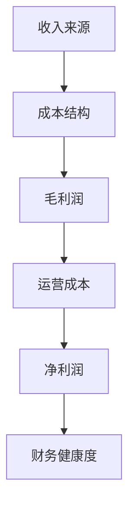

                 

# 价值投资中的共享经济机会

> **关键词**：价值投资、共享经济、投资机会、商业模式、财务分析、投资策略

> **摘要**：  
> 本文深入探讨了共享经济与价值投资的结合，分析了共享经济的商业模式、价值评估方法以及在价值投资中的应用策略。通过结合实际案例和系统架构设计，本文为投资者提供了在共享经济领域寻找投资机会的详细指南，包括投资策略、风险管理、系统架构和项目实战等内容。

---

## 第一部分：共享经济与价值投资的背景与基础

### 第1章：共享经济的定义与核心概念

#### 1.1 共享经济的定义与背景

共享经济是一种基于数字化平台的经济模式，通过闲置资源的共享实现资源利用效率的最大化。其核心在于通过技术手段降低交易成本，创造新的价值。以下是共享经济的关键特征：

- **去中心化**：通过平台连接供需双方，减少中间环节。
- **按需分配**：资源按需调配，提高利用率。
- **透明化**：通过平台实现供需信息的透明匹配。

**共享经济与传统经济的对比**：

| 特性        | 共享经济                  | 传统经济                  |
|-------------|---------------------------|---------------------------|
| 资源利用     | 高效共享                 | 低效集中                 |
| 交易成本     | 低                       | 高                       |
| 信任机制     | 平台背书                  | 非正式关系               |

---

#### 1.2 价值投资的基本原理

价值投资是一种长期投资策略，强调以低于内在价值的价格买入优质资产。其核心理念包括：

- **安全边际**：买入价格低于内在价值，确保投资的安全性。
- **长期视角**：关注企业的长期盈利能力，而非短期波动。
- **基本面分析**：通过对企业财务状况、行业地位和管理团队的分析，评估其内在价值。

**价值投资与共享经济的结合点**：

- 共享经济企业的商业模式具有高成长性和创新性，适合价值投资。
- 共享经济的平台经济模式具有网络效应，能够快速扩大市场规模。

---

#### 1.3 共享经济中的价值投资机会

共享经济领域的投资热点主要集中在出行、住宿、办公空间等领域。以下是一些典型的投资案例：

- **出行领域**：如滴滴出行、Uber，通过共享闲置车辆资源，降低出行成本。
- **住宿领域**：如Airbnb，通过共享闲置房源，提供灵活的住宿解决方案。
- **办公空间领域**：如WeWork，通过共享办公空间，降低企业的固定成本。

---

### 第2章：共享经济的商业模式与价值评估

#### 2.1 共享经济的主要商业模式

共享经济的商业模式主要分为C2C、B2C和B2B三种类型：

- **C2C模式**：个人对个人的共享，如闲置物品交易平台。
- **B2C模式**：企业对个人的共享，如共享办公空间。
- **B2B模式**：企业对企业间的共享，如共享物流资源。

**共享经济的商业模式对比**：

| 模式   | 特点                  | 适用场景               |
|--------|-----------------------|------------------------|
| C2C    | 去中心化、低门槛      | 闲置资源交易           |
| B2C    | 中心化、标准化        | 消费者需求匹配         |
| B2B    | 高效、大规模          | 企业间资源共享         |

---

#### 2.2 价值投资中的关键指标

在价值投资中，关键指标包括市盈率（P/E）、市净率（P/B）和净资产收益率（ROE）。以下是这些指标的数学公式：

- **市盈率（P/E）**：  
  $$ P/E = \frac{\text{股价}}{\text{每股收益}} $$

- **市净率（P/B）**：  
  $$ P/B = \frac{\text{股价}}{\text{每股净资产}} $$

- **净资产收益率（ROE）**：  
  $$ ROE = \frac{\text{净利润}}{\text{净资产}} $$

---

#### 2.3 共享经济企业的财务分析

共享经济企业的财务分析需要重点关注收入来源、成本结构和盈利能力。以下是典型的财务分析流程图：

---

## 第二部分：价值投资的核心理念与策略

### 第3章：价值投资的核心理念与策略

#### 3.1 价值投资的基本原则

价值投资的核心原则包括：

- **长期投资**：关注企业的长期价值，而非短期波动。
- **安全边际**：买入价格低于内在价值。
- **基本面分析**：通过对企业财务状况、行业地位和管理团队的分析，评估其内在价值。

**价值投资与共享经济的结合**：

- 共享经济企业的商业模式具有高成长性和创新性，适合价值投资。
- 共享经济的平台经济模式具有网络效应，能够快速扩大市场规模。

---

#### 3.2 共享经济中的投资策略

在共享经济领域，价值投资的策略包括：

- **行业选择**：选择具有高成长性和创新性的行业，如出行、住宿、办公空间等领域。
- **企业基本面分析**：分析企业的财务状况、行业地位和管理团队。
- **投资组合的构建与优化**：通过分散投资降低风险，同时集中投资优质企业。

---

### 第4章：共享经济中的价值投资策略

#### 4.1 共享经济领域的投资机会

共享经济领域的投资机会主要集中在出行、住宿、办公空间等领域。以下是这些领域的典型投资案例：

- **出行领域**：如滴滴出行、Uber，通过共享闲置车辆资源，降低出行成本。
- **住宿领域**：如Airbnb，通过共享闲置房源，提供灵活的住宿解决方案。
- **办公空间领域**：如WeWork，通过共享办公空间，降低企业的固定成本。

---

#### 4.2 价值投资中的风险管理

在共享经济领域，风险管理是价值投资的重要组成部分。以下是风险管理的关键点：

- **市场风险**：关注行业政策变化和市场竞争格局。
- **财务风险**：分析企业的财务状况，确保企业的财务健康。
- **运营风险**：关注企业的运营效率和管理团队的稳定性。

---

## 第三部分：系统分析与架构设计

### 第5章：系统分析与架构设计

#### 5.1 共享经济平台的系统架构

共享经济平台的系统架构包括以下几个部分：

- **用户端**：包括用户注册、登录、信息发布、订单管理等功能。
- **平台端**：包括资源匹配、交易撮合、支付结算等功能。
- **管理端**：包括用户管理、资源管理、数据分析等功能。

以下是共享经济平台的系统架构图：

---

#### 5.2 共享经济平台的系统实现

共享经济平台的系统实现需要重点关注以下几个方面：

- **资源匹配算法**：通过算法实现供需双方的精准匹配。
- **支付结算系统**：确保交易的安全性和高效性。
- **数据分析系统**：通过数据分析优化平台的运营策略。

---

### 第6章：项目实战与最佳实践

#### 6.1 项目实战

以下是共享经济平台的项目实战步骤：

1. **环境安装**：安装必要的开发工具和依赖库。
2. **系统核心实现**：实现资源匹配算法、支付结算系统和数据分析系统。
3. **代码实现**：编写共享经济平台的核心代码。
4. **案例分析**：分析实际案例，总结经验教训。

---

#### 6.2 最佳实践

在共享经济领域的价值投资中，最佳实践包括：

- **长期投资**：关注企业的长期价值，而非短期波动。
- **安全边际**：买入价格低于内在价值。
- **基本面分析**：通过对企业财务状况、行业地位和管理团队的分析，评估其内在价值。

---

## 第四部分：总结与展望

### 第7章：总结与展望

#### 7.1 总结

本文深入探讨了共享经济与价值投资的结合，分析了共享经济的商业模式、价值评估方法以及在价值投资中的应用策略。通过结合实际案例和系统架构设计，本文为投资者提供了在共享经济领域寻找投资机会的详细指南。

---

#### 7.2 展望

未来，共享经济与价值投资的结合将更加紧密。随着技术的进步和市场的成熟，共享经济企业将更加注重创新和效率，为投资者提供更多投资机会。

---

## 作者：AI天才研究院/AI Genius Institute & 禅与计算机程序设计艺术 /Zen And The Art of Computer Programming

