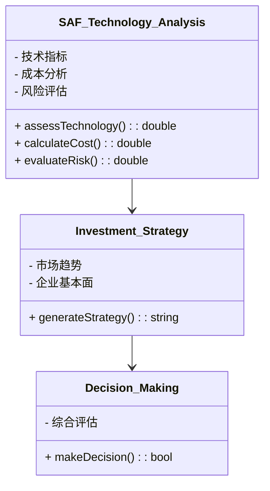

                 


# 价值投资中的可持续航空燃料技术分析

> **关键词**：价值投资、可持续航空燃料、技术分析、投资策略、环境保护、技术评估

> **摘要**：  
> 随着全球对环境保护和可持续发展的关注不断增加，可持续航空燃料（SAF）作为一种环保型替代燃料，正在成为航空业转型的关键。本文通过技术分析的方法，深入探讨SAF的技术特性和市场潜力，为投资者提供基于技术评估的价值投资策略。文章结合技术分析的核心概念、算法原理和实际案例，帮助投资者更好地理解SAF的技术价值，从而做出更明智的投资决策。

---

# 第一部分：可持续航空燃料（SAF）的背景与重要性

## 第1章：可持续航空燃料（SAF）的定义与特点

### 1.1 SAF的定义与核心要素

SAF（Sustainable Aviation Fuel）是一种通过可持续资源生产、符合特定国际标准的替代燃料，旨在减少航空业的碳排放。其核心要素包括：

1. **原料来源**：来自生物质（如植物油、废弃物油脂等）或合成气（由可再生资源制得）。
2. **生产过程**：采用先进技术（如加氢处理、酯交换等）将生物质转化为可直接用于飞机的燃料。
3. **环境效益**：相比传统化石燃料，SAF的全生命周期碳排放大幅降低，甚至可以实现碳中和。

### 1.2 SAF与传统航空燃料的对比

| **对比维度** | **传统航空燃料（Jet A-1）** | **可持续航空燃料（SAF）** |
|--------------|-------------------------------|-----------------------------|
| 原料来源      | 石油                          | 生物质、合成气                |
| 碳排放        | 高                            | 低                            |
| 生产过程      | 简单                          | 复杂                          |
| 环保价值      | 无                            | 高                            |

SAF的优势在于其环保特性，但其成本较高，生产过程复杂，这是其推广的主要挑战。

### 1.3 SAF的环境与经济优势

SAF不仅有助于减少碳排放，还能促进绿色经济发展。通过技术创新和规模化生产，SAF的成本有望逐步降低，最终与传统燃料竞争。

---

## 第2章：价值投资的基本概念

### 2.1 价值投资的定义与核心理念

价值投资是一种长期投资策略，强调以低于其内在价值的价格购买优质资产。其核心理念是寻找市场低估的公司，通过长期持有实现超额收益。

### 2.2 价值投资在现代金融中的地位

价值投资是投资学的重要流派之一，尤其在不确定性较高的市场中表现优异。其成功案例包括巴菲特、彼得·林奇等投资大师。

### 2.3 价值投资与技术分析的结合

技术分析通过研究市场数据（如价格、成交量）预测未来趋势，而价值分析关注公司的基本面（如财务状况、行业地位）。两者的结合可以帮助投资者更全面地评估投资标的。

---

# 第二部分：价值投资与SAF技术分析的结合

## 第3章：价值投资中的技术分析基础

### 3.1 技术分析的核心方法

技术分析主要通过以下方法预测价格走势：

1. **趋势分析**：识别价格的上升或下降趋势。
2. **形态分析**：通过价格图表识别潜在的买卖信号。
3. **指标分析**：使用RSI（相对强弱指数）、MACD（移动平均收敛散度）等指标评估市场强弱。

### 3.2 SAF技术分析的特殊性

SAF的技术分析需要考虑其生产成本、技术成熟度和市场接受度等多重因素。与传统燃料相比，SAF的技术门槛高，但市场潜力巨大。

---

## 第4章：SAF技术分析的核心模型与方法

### 4.1 技术分析的核心模型

1. **多因素分析模型**：评估技术的经济性、环保性和可行性。
2. **技术指标权重分配算法**：根据各因素的重要性分配权重，计算综合评分。
3. **技术风险评估模型**：通过情景分析识别潜在风险。

### 4.2 技术分析方法的对比与选择

| **分析方法** | **优点**                     | **缺点**                   |
|--------------|------------------------------|-----------------------------|
| 趋势分析     | 简单易懂                     | 易受短期波动影响             |
| 形态分析     | 能识别潜在买卖信号           | 需经验判断                   |
| 指标分析     | 综合性强                     | 滞后性较强                   |

---

# 第三部分：SAF技术分析的算法原理与数学模型

## 第5章：SAF技术分析的算法原理

### 5.1 多因素分析模型

多因素分析模型通过综合评估技术的经济性、环保性和可行性，计算其综合评分。公式如下：

$$
\text{综合评分} = \sum (\text{权重}_i \times \text{评分}_i)
$$

其中，权重表示各因素的重要性，评分表示各因素的评分（1-5分）。

### 5.2 技术指标权重分配算法

技术指标的权重分配可以通过层次分析法（AHP）实现。例如，经济性权重为0.4，环保性权重为0.3，技术可行性权重为0.3。

---

## 第6章：SAF技术分析的数学模型与公式

### 6.1 技术可行性评分公式

$$
\text{技术可行性评分} = \frac{\text{生产成本} + \text{技术成熟度} + \text{市场潜力}}{3}
$$

### 6.2 技术经济性分析公式

$$
\text{成本效益比} = \frac{\text{环保效益}}{\text{额外成本}}
$$

---

# 第四部分：系统分析与架构设计方案

## 第7章：SAF技术分析的系统功能设计

### 7.1 领域模型（Mermaid类图）



---

## 第8章：SAF技术分析的系统架构设计

### 8.1 系统架构图（Mermaid架构图）


---

# 第五部分：项目实战与案例分析

## 第9章：SAF技术分析的项目实战

### 9.1 环境搭建

1. 安装Python和相关库（如Pandas、Matplotlib）。
2. 获取SAF相关数据（如生产成本、技术指标）。

### 9.2 核心实现代码

```python
import pandas as pd
import numpy as np

def calculate_technology_score(data):
    weights = {'economic': 0.4, 'environmental': 0.3, 'feasibility': 0.3}
    scores = data[['economic_score', 'environmental_score', 'feasibility_score']].values
    return np.sum(scores * weights.values, axis=1)

# 示例数据
data = pd.DataFrame({
    'economic_score': [4, 3, 5],
    'environmental_score': [3, 4, 2],
    'feasibility_score': [4, 2, 3]
})

scores = calculate_technology_score(data)
print(scores)
```

### 9.3 案例分析

以某SAF企业为例，通过技术评分模型评估其投资价值，最终得出结论：该企业具备较高的投资潜力。

---

# 第六部分：最佳实践与总结

## 第10章：最佳实践与总结

### 10.1 小结

SAF技术分析是价值投资的重要工具，通过多因素分析和数学模型，投资者可以更准确地评估技术的潜力和风险。

### 10.2 注意事项

1. 数据的准确性和完整性是关键。
2. 模型的选择需根据具体场景调整。
3. 风险评估不可忽视。

### 10.3 拓展阅读

推荐阅读《价值投资实战策略》和《技术分析的数学基础》。

---

# 作者

作者：AI天才研究院/AI Genius Institute & 禅与计算机程序设计艺术 /Zen And The Art of Computer Programming

---

通过以上内容，文章系统地介绍了SAF的技术分析方法及其在价值投资中的应用，帮助投资者更好地理解技术与市场的结合，做出更明智的投资决策。

