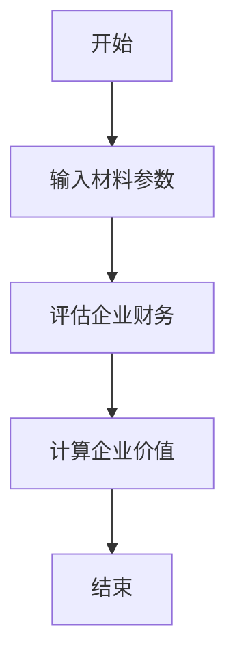
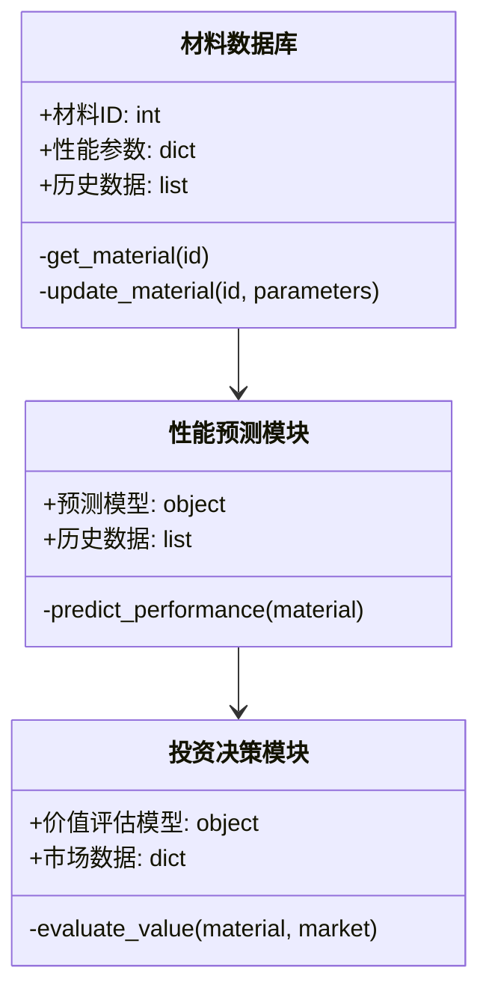
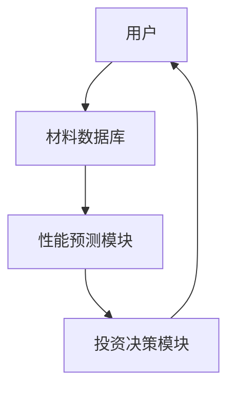

                 


# 价值投资中的可编程材料在工业中的应用前景

> 关键词：价值投资，可编程材料，工业应用，前景分析，技术创新

> 摘要：本文探讨了可编程材料在工业中的应用前景，分析了其在价值投资中的潜力。通过数学模型和算法原理，展示了可编程材料如何通过编程控制其性能，进而提升工业效率和产品质量。结合系统架构设计和实际案例，本文详细阐述了可编程材料在工业应用中的优势与挑战，并提出了未来发展的方向。

---

## 第一部分：背景介绍

### 第1章：价值投资概述

#### 1.1 价值投资的起源与发展

- **1.1.1 价值投资的起源**
  - 价值投资起源于20世纪初，由本杰明·格雷厄姆和戴维·多德提出。
  - 核心理念是寻找市场低估的优质资产，长期持有以实现收益。

- **1.1.2 价值投资的核心理念**
  - 购买廉价的资产，长期持有，等待市场重估。
  - 强调基本面分析和安全边际。

- **1.1.3 价值投资在现代金融中的地位**
  - 作为投资策略的重要分支，影响了全球资本市场。
  - 在科技领域，价值投资理念被用于评估技术创新和产业升级。

#### 1.2 可编程材料的基本概念

- **1.2.1 材料科学的基本概念**
  - 材料是人类社会发展的基础，从传统材料到先进材料的演进。
  - 材料的性能决定其应用领域和价值。

- **1.2.2 可编程材料的定义与特性**
  - 可编程材料：通过外部指令或内部编程控制其物理、化学或机械性能的材料。
  - 特性：智能性、适应性、可调节性、可持续性。

- **1.2.3 可编程材料在工业中的重要性**
  - 提高生产效率：通过编程优化材料性能，降低生产成本。
  - 创新产品设计：可编程材料为工业设计提供了更多可能性。
  - 推动技术升级：可编程材料的应用将推动工业4.0的发展。

#### 1.3 价值投资与可编程材料的结合

- **1.3.1 价值投资的核心要素**
  - 财务状况：企业的盈利能力、资产负债情况。
  - 行业地位：企业在行业中的竞争地位。
  - 管理团队：管理能力与战略决策。
  - 估值：市场价格与内在价值的差距。

- **1.3.2 可编程材料的价值评估模型**
  - 通过编程控制材料性能，提升产品附加值。
  - 可编程材料的技术门槛决定了其市场竞争力。

- **1.3.3 可编程材料在工业中的应用前景**
  - 制造业升级：可编程材料将推动制造业向智能化、个性化方向发展。
  - 新材料革命：可编程材料可能引发新一轮的技术革命。

---

## 第二部分：核心概念与联系

### 第2章：可编程材料的核心属性

#### 2.1 可编程材料的属性特征

| 属性 | 描述 | 示例 |
|------|------|------|
| 智能性 | 可通过外部指令改变性能 | 智能 textiles（响应温度变化调整织物性能） |
| 适应性 | 能够根据环境变化自我调整 | 自修复材料（在受损后自动修复） |
| 可调节性 | 通过编程控制性能参数 | 液晶聚合物（可通过电场改变分子排列） |
| 可持续性 | 环保、可回收 | 生物基可降解材料 |

#### 2.2 可编程材料的结构与功能

- **2.2.1 可编程材料的结构特征**
  - 多层次结构：纳米级到宏观结构。
  - 功能层：感知、计算、执行层。

- **2.2.2 可编程材料的功能实现**
  - 感知环境变化：如温度、压力、光线。
  - 数据处理：通过内部电路或算法进行分析。
  - 执行动作：如改变形状、释放物质。

#### 2.3 可编程材料的编程机制

- **2.3.1 程序控制方式**
  - 外部指令：通过无线信号、传感器触发。
  - 内部程序：嵌入式芯片控制材料性能。

- **2.3.2 程序与材料性能的对应关系**
  - 输入信号与输出性能的数学关系。
  - 程序逻辑与材料状态的映射。

---

## 第三部分：算法原理讲解

### 第3章：可编程材料的算法实现

#### 3.1 价值评估模型

- **模型假设**
  - 材料性能可通过编程参数调整。
  - 企业价值与材料性能呈正相关。

- **数学模型**
  $$ V = k \times P + b $$
  其中，\( V \) 是企业价值，\( P \) 是材料性能，\( k \) 是性能价值系数，\( b \) 是基础价值。

- **算法步骤**
  - 确定材料性能参数。
  - 评估企业财务状况。
  - 计算企业价值。

#### 3.2 算法实现

- **mermaid流程图**



- **Python代码实现**

```python
def calculate_value(material_performance, financial_status):
    k = 1.5  # 性能价值系数
    b = 100  # 基础价值
    value = k * material_performance + b
    return value

# 示例
performance = 80
financial_status = "健康"
value = calculate_value(performance, financial_status)
print(f"企业价值为：{value}")
```

---

## 第四部分：系统分析与架构设计

### 第4章：系统架构设计

#### 4.1 系统功能设计

- **领域模型类图**



- **系统架构图**



---

## 第五部分：项目实战

### 第5章：可编程材料的工业应用

#### 5.1 环境安装

- **安装Python环境**
  - 安装Python 3.8以上版本。
  - 安装必要的库：numpy, matplotlib, scikit-learn。

- **安装可编程材料模拟软件**
  - 下载并安装材料模拟工具（如ANSYS、ABAQUS）。

#### 5.2 核心代码实现

- **核心代码示例**

```python
import numpy as np
from sklearn.linear_model import LinearRegression

# 数据准备
X = np.array([[1], [2], [3], [4], [5]])
y = np.array([2, 4, 5, 4, 6])

# 训练模型
model = LinearRegression()
model.fit(X, y)

# 预测
new_X = np.array([[6]])
predicted_y = model.predict(new_X)
print(predicted_y)
```

- **代码解读**
  - 数据准备：建立材料性能与价值的对应关系。
  - 模型训练：使用线性回归预测材料价值。
  - 预测结果：评估新材料的潜在价值。

#### 5.3 实际案例分析

- **案例背景**
  - 某企业研发了一种新型可编程材料，应用于汽车制造。
  - 通过编程控制材料强度和弹性模量。

- **案例分析**
  - 通过价值评估模型，计算材料的潜在价值。
  - 结合市场反馈，调整材料性能参数。

---

## 第六部分：总结与展望

### 第6章：总结与展望

#### 6.1 总结

- 本文详细探讨了可编程材料在工业中的应用前景。
- 通过价值投资理念，提出了可编程材料的价值评估模型。
- 结合系统架构设计和项目实战，展示了可编程材料在工业中的潜力。

#### 6.2 未来展望

- **技术创新**
  - 研发更复杂的可编程材料，如自适应复合材料。
  - 探索新材料与人工智能的结合。

- **市场挑战**
  - 技术瓶颈：材料稳定性与可编程性的平衡。
  - 市场接受度：企业对新技术的适应性。

- **投资建议**
  - 关注新材料研发公司。
  - 选择具有技术优势和良好管理团队的企业。

---

## 作者信息

作者：AI天才研究院/AI Genius Institute & 禅与计算机程序设计艺术 /Zen And The Art of Computer Programming

