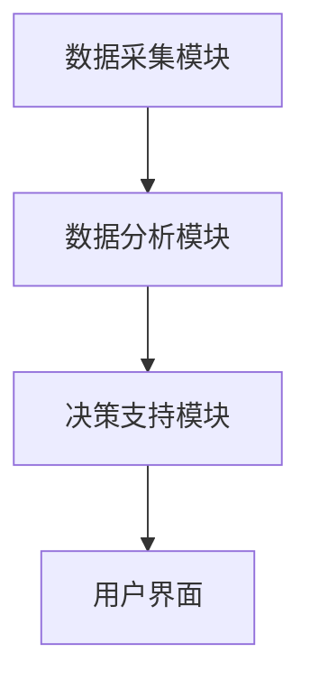

                 


# 价值投资中的地缘政治风险评估

> 关键词：地缘政治风险、价值投资、风险评估、投资策略、风险模型

> 摘要：地缘政治风险是影响价值投资的重要因素。本文系统地探讨了地缘政治风险的分类、评估方法及其对投资决策的影响。通过数学模型和实际案例，本文提出了地缘政治风险的系统分析框架，帮助投资者制定更稳健的投资策略。

---

# 第1章: 地缘政治风险的基本概念

## 1.1 地缘政治风险的定义与特征

### 1.1.1 地缘政治风险的定义

地缘政治风险是指因地理位置、政治格局、国际关系等因素的变化而产生的不确定性，这些不确定性可能对国家、企业或个人的经济活动产生负面影响。例如，贸易摩擦、地区冲突或政策变化都可能引发地缘政治风险。

### 1.1.2 地缘政治风险的核心特征

- **复杂性**：涉及政治、经济、文化等多方面因素。
- **不确定性**：难以准确预测，且影响具有滞后性。
- **区域性**：某些风险可能局限于特定地区，而有些则是全球性的。
- **长期性**：某些地缘政治风险会长期影响经济活动。

### 1.1.3 地缘政治风险与经济活动的关系

地缘政治风险通过影响市场供需、政策环境和投资者信心，进而影响资产价格和投资回报。例如，中美贸易摩擦可能导致相关行业的供应链中断，从而影响企业的盈利能力和股价。

---

## 1.2 价值投资的基本原理

### 1.2.1 价值投资的定义与历史发展

价值投资是一种投资策略，强调以低于内在价值的价格购买优质资产。其核心思想是寻找市场先生的短期情绪波动带来的价格偏差。价值投资的理念起源于本杰明·格雷厄姆和戴维·多德的工作。

### 1.2.2 价值投资的核心理念与方法

- **安全边际**：购买价格低于内在价值，以降低风险。
- **长期视角**：关注企业的基本面，而非短期市场波动。
- **逆向思维**：在市场恐慌时寻找机会，在市场狂热时保持冷静。

### 1.2.3 价值投资与地缘政治风险的关联

地缘政治风险可能影响企业的盈利能力和资产价值，从而影响其内在价值。因此，价值投资者需要将地缘政治风险纳入投资决策中，以避免因忽视这些风险而导致的重大损失。

---

## 1.3 地缘政治风险对价值投资的影响

### 1.3.1 地缘政治风险对资产价格的影响机制

地缘政治事件可能导致市场情绪波动，进而影响资产价格。例如，地缘政治冲突可能导致能源价格波动，从而影响相关企业的盈利能力和股价。

### 1.3.2 地缘政治事件对投资决策的启示

投资者应关注地缘政治风险的潜在影响，尤其是在投资决策中考虑企业的供应链、政策风险和市场环境。例如，在中美贸易摩擦中，投资者应关注关税政策对企业利润的影响。

### 1.3.3 地缘政治风险的长期与短期影响

短期影响可能包括市场情绪波动和资产价格波动，而长期影响可能包括供应链调整、政策变化和企业战略调整。

---

## 1.4 本章小结

本章介绍了地缘政治风险的定义、特征及其对价值投资的影响。地缘政治风险是不可忽视的因素，投资者需要在投资决策中充分考虑这些风险，以制定更稳健的投资策略。

---

# 第2章: 地缘政治风险的分类与评估框架

## 2.1 地缘政治风险的主要分类

### 2.1.1 政治风险

政治风险包括政策变化、政权更迭、政治动荡等。例如，某国政府突然实施限制外资的政策，可能影响外资企业的运营。

### 2.1.2 经济风险

经济风险包括经济衰退、货币贬值、贸易壁垒等。例如，全球经济衰退可能导致企业利润下降，从而影响股价。

### 2.1.3 军事风险

军事风险包括战争、冲突、制裁等。例如，地区冲突可能导致能源价格波动，进而影响相关企业的盈利能力和股价。

### 2.1.4 文化与社会风险

文化与社会风险包括社会动荡、文化冲突等。例如，社会动荡可能导致企业运营中断，从而影响股价。

---

## 2.2 地缘政治风险评估的框架

### 2.2.1 风险识别与量化

风险识别是地缘政治风险评估的第一步，需要识别可能影响投资的地缘政治因素。例如，识别某国政府可能实施的贸易政策变化。

### 2.2.2 风险评估的指标体系

- **概率**：地缘政治事件发生的可能性。
- **影响**：事件对投资的潜在影响程度。
- **时间跨度**：事件的影响是短期还是长期。

### 2.2.3 风险情景分析

情景分析是通过构建不同情景来评估地缘政治风险的影响。例如，构建“中美贸易摩擦升级”和“地缘政治紧张缓解”两种情景。

---

## 2.3 地缘政治风险的动态变化

### 2.3.1 地缘政治风险的周期性

地缘政治风险具有周期性，可能因国际关系的变化而波动。例如，某些地区的地缘政治风险可能在选举年增加。

### 2.3.2 地缘政治风险的触发因素

触发因素包括政治事件、经济变化、社会动荡等。例如，某国领导人的更迭可能触发地缘政治风险。

### 2.3.3 地缘政治风险的全球性与区域性

某些地缘政治风险是全球性的，如全球经济衰退，而有些则是区域性的，如某地区的冲突。

---

## 2.4 本章小结

本章介绍了地缘政治风险的主要分类和评估框架。投资者需要根据不同的分类和情景分析来评估地缘政治风险，并制定相应的投资策略。

---

# 第3章: 地缘政治风险的分析方法

## 3.1 宏观分析方法

### 3.1.1 PEST分析法

PEST分析法从政治（Political）、经济（Economic）、社会（Social）和技术（Technological）四个维度分析地缘政治风险。例如，分析某国的政治稳定性、经济政策、社会动荡和技术发展对投资的影响。

### 3.1.2 SWOT分析法

SWOT分析法用于分析企业的优势（Strengths）、劣势（Weaknesses）、机会（Opportunities）和威胁（Threats）。例如，某企业在某地区的竞争优势可能因地缘政治风险而受到威胁。

### 3.1.3 情景分析法

情景分析法通过构建不同的情景来分析地缘政治风险的影响。例如，分析“贸易摩擦升级”和“贸易摩擦缓和”两种情景对企业的影响。

---

## 3.2 微观分析方法

### 3.2.1 产业链分析

产业链分析用于评估地缘政治风险对产业链的影响。例如，分析某行业供应链的集中度和替代性。

### 3.2.2 竞争分析

竞争分析用于评估地缘政治风险对企业竞争地位的影响。例如，分析某企业在某地区的市场份额可能因地缘政治风险而下降。

### 3.2.3 市场结构分析

市场结构分析用于评估地缘政治风险对市场结构的影响。例如，分析某市场的垄断程度和竞争格局。

---

## 3.3 数学模型与定量分析

### 3.3.1 风险概率矩阵

风险概率矩阵用于量化地缘政治风险的可能性和影响。例如，某地缘政治事件的概率为80%，影响程度为中等，其综合评分为7分（满分10分）。

### 3.3.2 风险影响矩阵

风险影响矩阵用于评估地缘政治风险对投资的影响程度。例如，某风险的影响程度分为高、中、低三个等级。

### 3.3.3 风险评估的数学公式

风险综合评分（RS）= 风险概率（RP）× 风险影响（RI）

例如：
$$
RS = RP \times RI
$$

---

## 3.4 本章小结

本章介绍了地缘政治风险的宏观和微观分析方法，以及数学模型的应用。投资者可以通过这些方法量化地缘政治风险，并制定相应的投资策略。

---

# 第4章: 地缘政治风险的系统分析与架构设计

## 4.1 系统分析方法

### 4.1.1 地缘政治风险的系统构成

地缘政治风险系统由政治、经济、社会和技术四个子系统构成。例如，政治子系统包括政策变化和政权更迭，经济子系统包括经济衰退和货币贬值。

### 4.1.2 系统目标与功能需求

系统目标：评估地缘政治风险对投资的影响。
功能需求：数据采集、风险评估、决策支持。

### 4.1.3 系统边界与外部接口

系统边界：地缘政治风险的内部因素。
外部接口：与市场数据、政策信息等外部数据源的接口。

---

## 4.2 地缘政治风险评估的系统架构

### 4.2.1 数据采集模块

数据采集模块负责收集地缘政治风险相关的数据。例如，收集某国的政治事件、经济指标和社会舆情。

### 4.2.2 数据分析模块

数据分析模块负责对数据进行处理和分析。例如，使用统计分析和机器学习模型评估地缘政治风险。

### 4.2.3 决策支持模块

决策支持模块负责提供投资建议。例如，根据地缘政治风险评估结果，建议投资者调整投资组合。

---

## 4.3 系统架构的Mermaid图



---

## 4.4 数据流与交互过程

### 4.4.1 数据输入与处理

数据输入：市场数据、政策信息等。
数据处理：清洗、转换和存储。

### 4.4.2 数据分析与建模

数据分析：统计分析、机器学习模型。
建模：风险评估模型。

### 4.4.3 结果输出与反馈

结果输出：风险评分、投资建议。
反馈：用户反馈和系统优化。

---

## 4.5 本章小结

本章介绍了地缘政治风险的系统分析方法和架构设计。通过构建系统架构，投资者可以更系统地评估地缘政治风险，并制定相应的投资策略。

---

# 第5章: 地缘政治风险的项目实战

## 5.1 项目背景与目标

### 5.1.1 项目背景

本项目旨在通过实际案例分析地缘政治风险对价值投资的影响。例如，分析中美贸易摩擦对某行业的影响。

### 5.1.2 项目目标

评估地缘政治风险对投资的影响，制定相应的投资策略。

---

## 5.2 系统核心实现源代码

### 5.2.1 风险评估模型

```python
import pandas as pd
import numpy as np

def risk_assessment(risk_factors):
    # 计算风险评分
    risk_score = np.mean(risk_factors)
    return risk_score

# 示例数据
data = {
    '政治风险': [0.8, 0.7, 0.6],
    '经济风险': [0.9, 0.8, 0.7],
    '军事风险': [0.7, 0.6, 0.5],
    '文化风险': [0.6, 0.5, 0.4]
}
df = pd.DataFrame(data)
```

### 5.2.2 投资决策支持系统

```python
import pandas as pd
import numpy as np

def investment_recommendation(portfolio, risk_assessment):
    # 根据风险评估结果调整投资组合
    adjusted_portfolio = {}
    for asset in portfolio:
        adjusted_portfolio[asset] = portfolio[asset] * risk_assessment[asset]
    return adjusted_portfolio

# 示例投资组合
portfolio = {
    '资产A': 100,
    '资产B': 200,
    '资产C': 300
}
```

---

## 5.3 项目实战与分析

### 5.3.1 环境安装

安装所需的Python库，如pandas、numpy等。

### 5.3.2 代码实现与解读

通过代码实现风险评估模型和投资决策支持系统，并解读代码的实现过程。

### 5.3.3 案例分析与小结

通过实际案例分析地缘政治风险对投资的影响，并总结经验教训。

---

## 5.4 本章小结

本章通过实际案例分析了地缘政治风险对价值投资的影响，并展示了如何通过系统方法和数学模型进行风险评估和投资决策。

---

# 第6章: 总结与展望

## 6.1 本章总结

总结全文内容，强调地缘政治风险对价值投资的重要性，以及系统方法和数学模型在风险评估中的作用。

## 6.2 未来展望

展望未来，随着技术的发展，地缘政治风险评估将更加智能化和数据化。例如，人工智能和大数据技术将为风险评估提供更强大的工具和方法。

---

# 作者：AI天才研究院（AI Genius Institute） & 禅与计算机程序设计艺术（Zen And The Art of Computer Programming）

---

版权声明：本文版权归作者所有，转载请注明出处。

