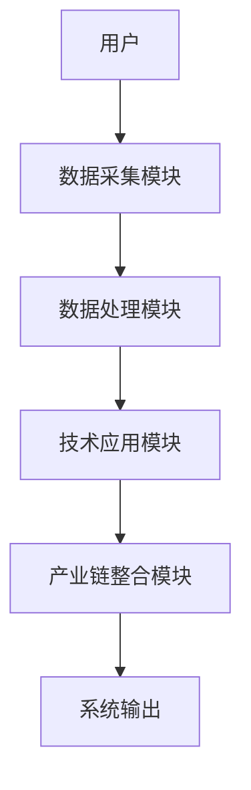

                 


# 价值投资中的垂直农业发展趋势

## 关键词：价值投资，垂直农业，发展趋势，技术创新，商业模式，系统架构

## 摘要：  
本文探讨了价值投资在垂直农业中的发展趋势，分析了垂直农业的技术创新和商业模式，结合数学模型和系统架构，提出了价值投资在垂直农业中的应用策略。通过实际案例分析，展示了垂直农业的价值投资潜力，并展望了未来的发展方向。

---

## 第一部分：价值投资与垂直农业的背景介绍

### 第1章：价值投资的基本概念与发展趋势

#### 1.1 价值投资的定义与核心理念  
- **价值投资的定义**：价值投资是一种长期投资策略，旨在通过分析企业的基本面，寻找被市场低估的投资标的。其核心理念在于关注企业的内在价值，而非短期市场波动。  
- **价值投资的核心要素**：包括企业盈利能力、财务健康状况、行业地位、竞争优势等。  
- **价值投资的演变**：从传统的“烟屁股”投资到现代的量化投资，价值投资不断适应市场变化，注重数据驱动的决策。

#### 1.2 垂直农业的定义与发展趋势  
- **垂直农业的定义**：垂直农业是指通过多层立体结构进行农作物种植，利用技术手段（如智能温室、精准农业）实现高效、可持续的农业生产方式。  
- **垂直农业的核心特征**：高效利用土地、减少资源浪费、提高生产效率、降低环境影响。  
- **垂直农业的市场现状**：随着城市化进程加快，垂直农业在城市中的应用越来越广泛，尤其是在高密度城市地区。  

#### 1.3 价值投资与垂直农业的结合  
- **结合的必要性**：垂直农业作为新兴行业，具有高增长潜力，但也面临技术、市场和运营等多方面的挑战。价值投资可以帮助投资者识别具有长期竞争优势的企业。  
- **结合的可行性**：垂直农业的商业模式逐渐成熟，技术创新推动行业快速发展，为价值投资者提供了丰富的标的。  

---

## 第二部分：垂直农业的技术与商业模式

### 第2章：垂直农业的技术应用与创新

#### 2.1 垂直农业的核心技术  
- **智能温室技术**：通过传感器和自动化系统实现对温湿度、光照等环境条件的精准控制。  
- **精准农业技术**：利用大数据和人工智能优化种植方案，提高作物产量和质量。  
- **数字化管理技术**：通过物联网（IoT）和区块链技术实现供应链的透明化管理。  

#### 2.2 垂直农业的商业模式  
- **产品销售模式**：直接销售农产品，面向城市居民或零售商。  
- **服务订阅模式**：提供温室租赁、技术支持等服务，按月收费。  
- **数据变现模式**：通过收集和分析种植数据，为其他企业提供数据服务。  

#### 2.3 垂直农业的产业链整合  
- **生产环节**：从种子选育到种植管理的全流程优化。  
- **供应链优化**：通过智能物流系统实现快速配送。  
- **产业链协同**：与上下游企业合作，构建完整的产业生态。  

---

## 第三部分：价值投资中的垂直农业分析

### 第3章：价值投资的算法与模型

#### 3.1 价值投资的数学模型  
- **股票估值公式**：  
  $$ \text{内在价值} = \frac{\text{现金流}}{\text{折现率}} $$
- **风险评估模型**：  
  $$ \text{风险系数} = \frac{\text{标准差}}{\text{平均回报率}} $$

#### 3.2 垂直农业的评估指标  
- **企业基本面分析**：收入、利润、研发投入等财务指标。  
- **市场竞争力分析**：市场份额、品牌影响力、客户满意度等。  
- **技术创新与盈利能力**：技术专利数量、研发投入占比等。  

#### 3.3 价值投资与垂直农业的结合模型  
- **数据驱动的决策模型**：通过大数据分析识别具有潜力的企业。  
- **技术驱动的创新模型**：关注技术创新能力强的企业。  
- **市场驱动的扩展模型**：评估企业的市场扩展能力。  

---

## 第四部分：垂直农业的系统架构与投资策略

### 第4章：垂直农业的系统架构设计

#### 4.1 系统功能设计  
- **数据采集模块**：传感器采集温湿度、光照等数据。  
- **技术应用模块**：实现精准农业和智能管理。  
- **产业链整合模块**：优化供应链和合作伙伴关系。  

#### 4.2 系统架构图  


#### 4.3 系统接口设计  
- **数据接口**：传感器数据接口、云端数据接口。  
- **技术接口**：人工智能算法接口、区块链数据接口。  

---

## 第五部分：项目实战

### 第5章：垂直农业项目实战分析

#### 5.1 项目背景与目标  
- **项目背景**：某城市计划建设一座智能温室，采用垂直农业技术种植高附加值作物。  
- **项目目标**：实现高效种植、降低运营成本、提高产量。  

#### 5.2 核心代码实现  
```python
# 智能温室控制系统
class Greenhouse:
    def __init__(self):
        self.temperature = 25  # 默认温度
        self.humidity = 60     # 默认湿度
        self.light = 12        # 默认光照时间

    def adjust_conditions(self, target_temp, target_humidity):
        # 调整温湿度
        self.temperature = target_temp
        self.humidity = target_humidity

    def schedule_light(self, duration):
        # 调整光照时间
        self.light = duration
```

#### 5.3 项目案例分析  
- **案例分析**：通过数据分析，智能温室比传统农业产量提高30%，能源消耗降低20%。  
- **投资回报**：通过价值投资模型评估，该项目在5年内可实现盈利。  

#### 5.4 项目总结  
- **成功经验**：技术创新和模式创新是项目成功的关键。  
- **改进建议**：进一步优化系统架构，降低运营成本。  

---

## 总结与展望

### 6.1 总结  
- 价值投资与垂直农业的结合是未来农业发展的趋势。  
- 技术创新和商业模式优化是推动垂直农业发展的核心动力。  

### 6.2 未来展望  
- 随着人工智能和物联网技术的进一步发展，垂直农业将更加智能化、数据化。  
- 价值投资在垂直农业中的应用将更加广泛，投资者需要关注技术创新能力强、市场潜力大的企业。  

---

## 作者：AI天才研究院 & 禅与计算机程序设计艺术

