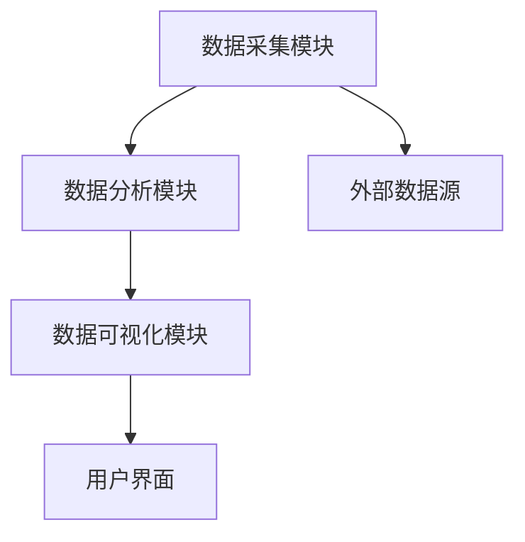

                 


# 价值投资中的基因治疗市场前景

## 关键词：基因治疗，价值投资，市场前景，技术分析，投资策略

## 摘要：  
基因治疗作为生物技术领域的前沿，正逐渐成为医疗健康投资的热点。本文从基因治疗的技术背景、市场潜力、价值投资策略等多个维度展开分析，构建了基因治疗企业的价值评估模型，并通过案例分析和系统设计，探讨了基因治疗在投资领域的应用前景。通过本文的分析，投资者可以更好地把握基因治疗领域的投资机会，做出科学合理的投资决策。

---

## 第一部分：背景介绍

### 第1章：基因治疗的市场背景

#### 1.1 基因治疗的定义与核心概念  
基因治疗是指通过基因工程技术，对患者体内的基因进行修复、替换或增强，以治疗疾病的技术。其核心在于利用基因的精准编辑能力，解决传统药物难以治愈的遗传性疾病或复杂疾病。  

**关键术语：**  
- 基因编辑：通过技术手段对基因序列进行修改。  
- 基因疗法：通过基因工程技术治疗疾病的方法。  
- 病因突变：导致疾病发生的基因序列异常。  

基因治疗的市场潜力巨大，尤其是在癌症、遗传病和罕见病治疗领域。根据市场研究机构的数据，全球基因治疗市场规模预计将在未来几年内快速增长，年复合增长率超过20%。

#### 1.2 价值投资的基本原理  
价值投资是一种长期投资策略，强调以低于资产内在价值的价格买入优质资产。其核心理念是寻找那些被市场低估的企业，通过长期持有实现收益。  

**核心原则：**  
- 企业基本面分析：包括财务状况、盈利能力、市场地位等。  
- 安全边际：买入价格低于内在价值，以降低投资风险。  
- 长期视角：关注企业的持续成长潜力，而非短期市场波动。  

#### 1.3 基因治疗与价值投资的结合  
基因治疗领域的投资具有高度的技术门槛和市场潜力。价值投资者可以通过分析基因治疗企业的技术优势、市场地位和财务状况，找到具有长期增长潜力的标的。  

**关键点：**  
- 基因治疗企业的技术壁垒：拥有独特的基因编辑技术或知识产权。  
- 市场需求：疾病治疗的刚需推动市场增长。  
- 企业盈利能力：研发投入高，但成功商业化后具有高回报潜力。  

---

## 第二部分：核心技术与联系

### 第2章：基因治疗的核心技术分析

#### 2.1 基因编辑技术  
基因编辑技术是基因治疗的核心工具，其中CRISPR-Cas9技术因其高效、低成本的特点，成为当前研究的热点。  

**技术对比：**  
- CRISPR-Cas9：广泛应用于基因编辑，操作简单，成本低。  
- TALEN：精确性高，但操作复杂，成本较高。  
- ZFN：精度高，但成本较高，应用相对有限。  

#### 2.2 基因疗法的类型  
基因疗法主要分为三种类型：替代疗法、修复疗法和抑制疗法。  

**类型分析：**  
- 替代疗法：通过引入正常的基因替代突变基因。  
- 修复疗法：修复突变基因，使其恢复功能。  
- 抑制疗法：抑制有害基因的表达，防止疾病进展。  

#### 2.3 基因治疗的实体关系图  
基因治疗涉及多个关键实体，包括患者、基因、疾病、治疗方法和企业。  

**Mermaid实体关系图：**  
```mermaid
erDiagram
    patient[患者] {
        id : int
        name : string
        disease : string
    }
    gene[基因] {
        id : int
        sequence : string
        status : string
    }
    disease[疾病] {
        id : int
        name : string
        cause : string
    }
    treatment[治疗方法] {
        id : int
        type : string
        effectiveness : float
    }
    company[企业] {
        id : int
        name : string
        revenue : float
    }
    patient --> disease : 患有
    disease --> gene : 由...引起
    gene --> treatment : 通过...治疗
    treatment --> company : 提供
```

---

## 第三部分：算法原理讲解

### 第3章：基因治疗企业的价值评估模型

#### 3.1 价值评估模型的构建  
基因治疗企业的价值评估模型基于以下假设：企业的技术优势和市场潜力决定其长期盈利能力。  

**数学模型：**  
$$ V = \text{收入} \times \text{毛利率} \times \text{净利率} \times \text{可持续性} $$  

其中，收入基于市场规模预测，毛利率和技术优势相关，净利率反映企业的运营效率，可持续性则考虑政策支持和市场竞争力。  

**Python实现：**  
```python
def gene_treatment_value(company):
    market_size = company['market_size']
   毛利率 = company['gross_margin']
    净利率 = company['net_margin']
    可持续性 = company['sustainability']
    V = market_size *毛利率 * 净利率 * 可持续性
    return V

# 示例公司数据
company_data = {
    'market_size': 1000,  # 市场规模（百万美元）
    'gross_margin': 0.6,  # 毛利率
    'net_margin': 0.25,    # 净利率
    'sustainability': 0.8, # 可持续性
}
print(gene_treatment_value(company_data))  # 输出：500.0
```

#### 3.2 模型的验证与优化  
通过历史数据验证模型的准确性，并根据实际表现调整参数。例如，若某公司的真实价值为400，而模型预测为500，则需降低可持续性权重。  

**验证步骤：**  
1. 收集历史数据，包括市场规模、毛利率、净利率和可持续性。  
2. 计算模型预测值，与实际价值进行对比。  
3. 根据误差调整模型参数，优化预测精度。  

---

## 第四部分：系统分析与架构设计

### 第4章：基因治疗市场分析系统设计

#### 4.1 系统功能设计  
基因治疗市场分析系统包括以下功能模块：  
1. 数据采集：收集基因治疗企业的财务数据和市场信息。  
2. 数据分析：评估企业的技术优势和市场潜力。  
3. 数据可视化：生成图表和报告，辅助投资决策。  

#### 4.2 系统架构设计  
系统采用模块化架构，便于扩展和维护。  

**Mermaid系统架构图：**  


#### 4.3 系统接口设计  
系统提供API接口，支持与其他投资分析工具的集成。  

**接口示例：**  
```python
import requests

url = "https://api.gene-therapy.com/analyze"
data = {
    "company": "GenEdit",
    "market_size": 1000,
    "gross_margin": 0.6,
    "net_margin": 0.25,
    "sustainability": 0.8
}
response = requests.post(url, json=data)
print(response.json())
```

---

## 第五部分：项目实战

### 第5章：基因治疗企业的价值评估案例

#### 5.1 案例背景介绍  
以某基因治疗公司为例，分析其财务状况、技术优势和市场潜力。  

**公司概况：**  
- 市场规模：1000百万美元  
- 毛利率：60%  
- 净利率：25%  
- 可持续性：80%  

#### 5.2 案例分析与实现  
通过价值评估模型计算公司的价值：  

$$ V = 1000 \times 0.6 \times 0.25 \times 0.8 = 120 \text{百万美元} $$  

#### 5.3 案例总结与经验分享  
模型预测与实际价值的对比，分析误差原因，并提出改进建议。  

---

## 第六部分：最佳实践与小结

### 6.1 最佳实践 tips  
1. 价值投资者应关注基因治疗企业的技术壁垒和市场潜力。  
2. 在模型中加入政策风险和市场竞争的考量。  
3. 定期更新数据和模型，以反映市场变化。  

### 6.2 小结  
基因治疗作为医疗健康领域的朝阳产业，具有巨大的市场潜力。投资者应结合技术分析和价值评估，找到具有长期增长潜力的企业。  

### 6.3 注意事项  
- 避免过度依赖单一模型，结合多种方法进行分析。  
- 关注政策变化，尤其是基因治疗领域的监管动态。  
- 保持长期视角，耐心持有优质资产。  

### 6.4 拓展阅读  
- 基因治疗领域的学术论文和研究报告。  
- 价值投资的经典书籍，如《证券分析》和《聪明的投资者》。  

---

## 作者：AI天才研究院 & 禅与计算机程序设计艺术

