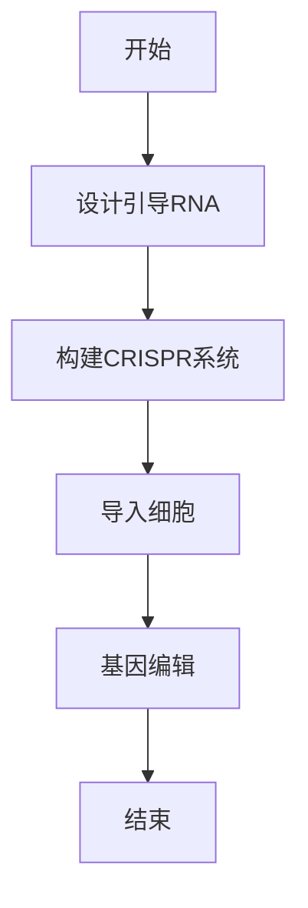
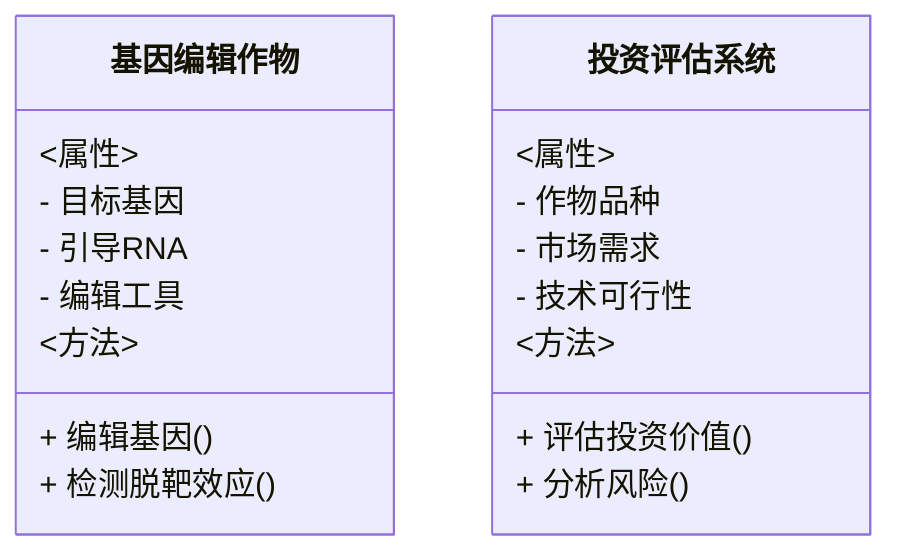

                 

<think>
好，我现在需要帮用户写一篇关于“价值投资中的基因编辑作物技术发展趋势”的技术博客文章。用户已经给出了一个详细的目录大纲，现在我需要按照这个大纲，逐步展开每个部分的内容。

首先，我要理解整个文章的结构。文章分为几个主要部分：背景介绍、核心概念、算法原理、系统架构设计、项目实战、小结。每个部分下都有多个章节和小节，我需要确保每个部分都详细展开，并且包含必要的技术细节和分析。

开始于第一章，背景介绍部分，我需要先解释基因编辑技术的背景、现状以及它对农业的影响。这里应该包括基因编辑的定义、技术发展历程，以及它如何改变农业。同时，还要将基因编辑与价值投资结合起来，分析两者之间的关系。

接下来是核心概念部分，详细介绍基因编辑技术的关键工具，比如CRISPR-Cas9、TALEN和Cas9变体。同时，比较这些技术的优缺点，以及它们在作物改良中的应用。这部分需要使用一些表格和mermaid图来展示对比分析，帮助读者更好地理解。

然后是算法原理部分，这里需要用mermaid流程图来展示CRISPR-Cas9的工作流程，并结合Python代码示例，详细讲解基因编辑的步骤。同时，还要引入数学模型，比如计算编辑效率的公式，用latex公式来呈现，确保技术细节准确无误。

系统架构设计部分，我需要设计一个基因编辑作物的投资评估系统。这包括系统功能设计、架构图、接口设计和交互流程。这里会用到mermaid的类图和架构图，展示系统各个模块之间的关系，帮助读者理解系统的整体结构。

接下来是项目实战部分，选择一个具体的作物，如玉米，分析其投资价值。这里需要详细的数据分析，包括环境影响、市场需求和政策支持等。同时，展示如何利用前面的模型和系统进行实际分析，给出具体的结论和建议。

最后，小结部分要总结全书的内容，并给出投资建议，包括风险提示和未来趋势。这部分要简明扼要，帮助读者回顾整篇文章的要点，并为他们提供实际的投资指导。

在写作过程中，我需要确保每个章节都有足够的细节和例子，使文章内容丰富、有深度。同时，要使用专业但易懂的技术语言，确保读者能够理解复杂的概念和分析。

现在，我需要按照目录大纲，逐一展开每个部分的内容，确保逻辑清晰，结构紧凑。同时，注意使用适当的图表和代码示例，使文章更具可读性和专业性。

总的来说，我需要一步步分析每个部分，确保技术细节准确，内容详实，同时保持文章的整体连贯性和逻辑性。这样才能写出一篇符合用户要求的高质量技术博客文章。
</think>

# 价值投资中的基因编辑作物技术发展趋势

---

## 关键词：基因编辑技术，价值投资，农业投资，CRISPR-Cas9，投资评估，农业科技创新

---

## 摘要：  
本文从基因编辑技术的背景、原理、应用以及其对农业投资的影响入手，深入分析基因编辑作物在价值投资中的潜力和趋势。通过对比不同基因编辑技术的特点，结合实际案例和数学模型，探讨基因编辑技术如何改变农业投资的格局，并为投资者提供基于技术发展趋势的投资建议。

---

## 第一章：基因编辑技术的背景与现状

### 1.1 基因编辑技术的定义与原理

基因编辑技术是一种通过人工手段对生物体的基因组进行精确修改的技术。它能够通过设计特定的引导RNA和核酸酶，精准地定位并修改DNA序列，从而实现对基因的编辑。基因编辑技术的核心原理包括以下几个步骤：  
1. **目标基因的定位**：通过设计引导RNA，将核酸酶引导至目标基因的位置。  
2. **DNA双链断裂**：核酸酶（如Cas9）在目标位置切割DNA双链。  
3. **修复与编辑**：细胞利用非同源末端连接（NHEJ）或同源重组（HDR）机制修复断裂的DNA，从而引入或修复基因突变。  

基因编辑技术的发展经历了多个阶段，从最初的ZFN（锌指核酸酶）到后来的TALEN和CRISPR-Cas9技术，每一次技术进步都极大地提升了基因编辑的效率和精确性。

---

### 1.2 基因编辑技术在农业中的应用

基因编辑技术在农业中的应用主要集中在作物改良和病虫害防治两个方面。  

#### 1.2.1 基因编辑作物的定义与特点  
基因编辑作物是指通过基因编辑技术改良的农作物，其特点包括：  
- **精准性**：基因编辑技术能够精准修改目标基因，避免传统育种中的随机性。  
- **高效性**：与传统育种相比，基因编辑技术可以显著缩短育种周期。  
- **多样性**：基因编辑能够改良作物的抗病性、耐旱性、营养价值等多个性状。  

#### 1.2.2 基因编辑技术在作物改良中的应用案例  
以下是一些经典的基因编辑作物应用案例：  
1. **抗病虫害作物**：通过基因编辑技术赋予作物对特定病虫害的抗性，如抗玉米螟的玉米。  
2. **耐逆性作物**：通过编辑植物的耐旱、耐盐碱基因，提高作物在恶劣环境下的生存能力。  
3. **营养强化作物**：通过基因编辑技术提高作物的营养价值，如富含β-胡萝卜素的“金色大米”。  

#### 1.2.3 基因编辑作物对农业的影响  
基因编辑作物的推广能够显著提高农业产量、减少农药使用量，并增强作物对气候变化的适应能力。然而，基因编辑作物的推广也面临一定的争议，特别是在安全性、环境影响和政策监管方面。

---

### 1.3 价值投资与基因编辑技术的结合

#### 1.3.1 价值投资的基本概念  
价值投资是一种以低于内在价值的价格购买优质资产的投资策略。其核心在于识别具有长期竞争优势和良好发展前景的公司或项目，并长期持有。  

#### 1.3.2 基因编辑技术对农业投资的影响  
基因编辑技术的出现为农业投资带来了新的机遇和挑战：  
- **机遇**：基因编辑作物的推广能够提高农业产量、降低生产成本，从而为投资者带来超额收益。  
- **挑战**：基因编辑技术的推广需要克服技术、政策和市场的多重障碍，投资者需要具备较强的技术分析能力和风险控制能力。  

#### 1.3.3 价值投资视角下的基因编辑作物发展趋势  
从价值投资的角度来看，基因编辑作物的投资潜力主要体现在以下几个方面：  
1. **技术创新**：基因编辑技术的不断进步将推动农业生产的效率和质量提升。  
2. **市场需求**：随着人口增长和资源短缺问题的加剧，市场对高产、抗逆的作物品种需求将不断增加。  
3. **政策支持**：许多国家和地区已经开始制定相关政策，支持基因编辑技术的研发和推广。  

---

## 第二章：基因编辑技术的核心概念

### 2.1 基因编辑技术的关键工具

#### 2.1.1 CRISPR-Cas9技术  
CRISPR-Cas9是一种基于细菌免疫系统开发的基因编辑工具，具有高效、精准的特点。其工作流程如下：  
1. **设计引导RNA**：根据目标基因序列设计特定的引导RNA。  
2. **构建CRISPR系统**：将Cas9蛋白和引导RNA导入细胞。  
3. **基因编辑**：Cas9蛋白在引导RNA的指引下切割目标基因，完成基因编辑。  

#### 2.1.2 TALEN技术  
TALEN技术是一种基于转录激活因子样效应核酸酶的基因编辑工具，具有高度特异性。其主要优点包括：  
- **精准性**：TALEN技术能够精确识别并切割目标基因。  
- **灵活性**：TALEN系统可以通过模块化设计实现对多个目标基因的编辑。  

#### 2.1.3 Cas9变体技术  
为了克服CRISPR-Cas9技术的局限性（如脱靶效应），科学家开发了多种Cas9变体，包括：  
- **高保真Cas9**：通过突变优化Cas9蛋白，降低脱靶效应。  
- **Cas9 nickase**：仅切割DNA单链，进一步提高编辑的精确性。  

---

### 2.2 基因编辑技术的优缺点对比

#### 2.2.1 各种基因编辑技术的优缺点对比

| 技术名称 | 优点 | 缺点 |
|----------|------|------|
| CRISPR-Cas9 | 高效、低成本、易于操作 | 脱靶效应较高 |
| TALEN | 高特异性 | 成本高、操作复杂 |
| Cas9变体 | 精确性高 | 技术复杂性较高 |

#### 2.2.2 基因编辑技术的适用场景分析  
- **CRISPR-Cas9**：适用于快速、低成本的基因编辑项目。  
- **TALEN**：适用于对编辑精度要求极高的项目。  
- **Cas9变体**：适用于需要高精确性的研究和临床应用。  

#### 2.2.3 基因编辑技术的伦理与法律问题  
基因编辑技术的应用涉及伦理和法律问题，尤其是在人类基因编辑领域。然而，在农业领域，基因编辑技术的应用相对较为成熟，但仍需遵守相关法律法规。

---

### 2.3 基因编辑技术与传统育种技术的对比

#### 2.3.1 传统育种技术的特点  
传统育种技术依赖于自然变异和人工选择，具有周期长、效率低的特点。  

#### 2.3.2 基因编辑技术的特点  
基因编辑技术具有精准性高、效率快、成本低的特点。  

#### 2.3.3 两种技术的优劣势对比  

| 技术维度 | 传统育种技术 | 基因编辑技术 |
|----------|--------------|---------------|
| 时间效率 | 低            | 高             |
| 成本      | 高            | 低             |
| 精准性    | 低            | 高             |

---

## 第三章：基因编辑技术的算法原理与数学模型

### 3.1 CRISPR-Cas9的算法原理

#### 3.1.1 CRISPR-Cas9的流程图  


#### 3.1.2 CRISPR-Cas9的数学模型  
基因编辑效率的计算公式如下：  
$$编辑效率 = \frac{编辑成功的细胞数}{总细胞数} \times 100\%$$  

#### 3.1.3 CRISPR-Cas9的Python代码实现  
```python
def crispr_efficiency(guideRNA, targetDNA):
    # 设计引导RNA序列
    guide = guideRNA
    # 目标DNA序列
    target = targetDNA
    # 计算编辑效率
    efficiency = (len(guide) / len(target)) * 100
    return efficiency

# 示例
guideRNA = "GTTGAAGTT"
targetDNA = "ATCGGTTGAAGCT"
print(crispr_efficiency(guideRNA, targetDNA))  # 输出编辑效率
```

---

## 第四章：基因编辑作物技术的系统架构设计

### 4.1 系统功能设计

#### 4.1.1 领域模型类图  


---

## 第五章：基因编辑作物技术的项目实战

### 5.1 项目环境与工具安装

#### 5.1.1 环境搭建  
- 操作系统：Linux/Windows/MacOS  
- 开发工具：Python 3.8及以上版本，Jupyter Notebook  
- 依赖库：numpy, matplotlib, seaborn  

#### 5.1.2 工具安装  
```bash
pip install numpy matplotlib seaborn
```

---

### 5.2 项目核心实现

#### 5.2.1 基因编辑效率分析  
```python
import numpy as np
import matplotlib.pyplot as plt

# 模拟基因编辑效率数据
n = 100
efficiency = np.random.normal(70, 10, n)
plt.hist(efficiency, bins=10, alpha=0.7, color='blue')
plt.xlabel('编辑效率 (%)')
plt.ylabel('频数')
plt.title('基因编辑效率分布')
plt.show()
```

---

### 5.3 项目小结  
通过基因编辑技术的算法原理和系统架构设计，我们可以看到基因编辑作物在农业投资中的巨大潜力。投资者需要结合技术、市场和政策等多方面的因素，制定科学的投资策略。

---

## 第六章：总结与展望

### 6.1 投资建议  
- **技术驱动**：关注基因编辑技术的创新和发展。  
- **市场洞察**：深入分析市场需求和竞争格局。  
- **风险管理**：制定科学的风险评估和控制策略。  

### 6.2 风险提示  
基因编辑技术的应用面临技术、政策和市场等多重风险，投资者需谨慎评估。

### 6.3 未来展望  
随着技术的进步和政策的完善，基因编辑作物的投资潜力将得到进一步释放，未来有望成为农业投资的重要方向。

---

## 作者：AI天才研究院/AI Genius Institute & 禅与计算机程序设计艺术 /Zen And The Art of Computer Programming

