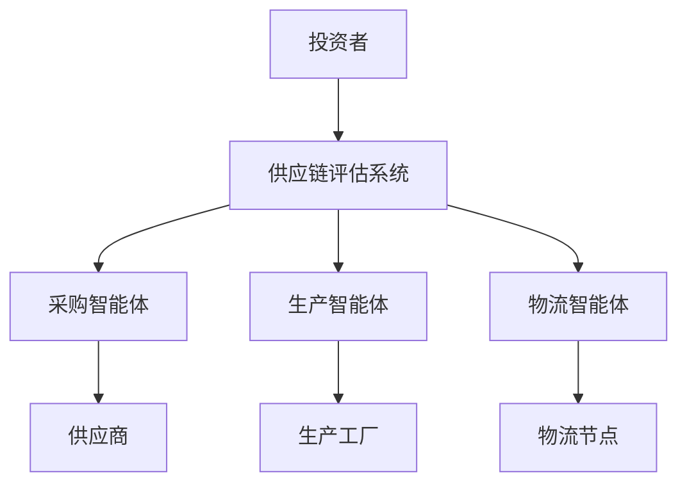

                 

<think>
嗯，我需要写一篇关于《价值投资中的多智能体AI供应链韧性评估系统》的技术博客文章。首先，我得明确文章的结构和每个部分的内容。

文章标题已经确定好了，是《价值投资中的多智能体AI供应链韧性评估系统》。接下来，我需要列出5到7个关键词。关键词应该包括多智能体AI、供应链韧性评估、价值投资、风险管理、人工智能、供应链管理。这样读者可以更方便地搜索到这篇文章。

摘要部分需要简明扼要地概括整篇文章的核心内容和主题思想。我应该强调多智能体AI在供应链韧性评估中的应用，以及这种评估如何帮助价值投资者做出更明智的投资决策。

接下来是文章的目录大纲，我已经列出来了，总共有七章。每章都有三级目录，内容从背景介绍到系统分析，再到项目实战，最后是最佳实践。我需要确保每个部分都详细且逻辑清晰。

在写正文的时候，我会按照目录的顺序逐步展开。首先是第一章，介绍供应链韧性和价值投资的基本概念，然后是多智能体AI在供应链管理中的应用。这部分需要解释清楚什么是供应链韧性，为什么它对价值投资重要，以及多智能体AI如何帮助提升供应链的韧性。

第二章是供应链韧性评估的核心问题。我需要详细描述供应链韧性评估的主要挑战，比如数据获取和处理的难度，以及多智能体协作中的协调问题。同时，还要探讨供应链中断对价值投资的影响，以及如何通过供应链韧性评估来降低风险。

第三章是多智能体AI系统的核心概念与联系。这部分需要定义多智能体AI，分析其属性，比较它与传统AI的区别。然后，用ER图展示供应链韧性评估系统的实体关系，再用流程图描述多智能体协作机制。

第四章是多智能体AI供应链韧性评估的算法原理。我需要详细讲解算法流程，包括强化学习在供应链评估中的应用。使用mermaid流程图来展示算法步骤，并附上Python代码示例。同时，给出数学模型，用latex公式表示，确保公式正确且易于理解。

第五章是系统分析与架构设计。这部分需要分析项目背景，设计系统功能，用领域模型类图展示。然后用架构图说明系统的整体结构，设计接口，并用序列图展示系统交互。

第六章是项目实战。我需要指导读者如何安装环境，提供核心代码，并解读代码功能。通过具体案例分析，展示系统的实际应用，并进行详细讲解和剖析。最后总结项目成果。

最后是最佳实践。我需要总结整个系统的建设过程，给出一些注意事项，比如数据质量和模型调优的重要性，并推荐一些拓展阅读的资料。

在写作过程中，我要注意语言简洁专业，逻辑清晰，结构紧凑。每部分内容要详细且具体，确保读者能够理解并应用这些知识。同时，要结合实际案例，让理论更加生动实用。

总之，我需要一步步分析和推理，确保每部分内容都到位，同时保持文章的连贯性和专业性。这样，读者才能真正理解多智能体AI在供应链韧性评估中的重要作用，并能够应用到实际的价值投资中。
</think>

# 价值投资中的多智能体AI供应链韧性评估系统

## 关键词：多智能体AI，供应链韧性，价值投资，风险管理，人工智能，供应链管理

## 摘要：  
本文探讨了多智能体AI在供应链韧性评估中的应用，重点分析了如何通过多智能体协作机制提升供应链的抗风险能力，并结合价值投资的理念，提出了一种基于多智能体AI的供应链韧性评估系统。该系统通过智能化的预测和优化，帮助投资者在复杂多变的市场环境中做出更明智的投资决策。文章从系统背景、核心概念、算法原理、系统架构到实战应用进行了全面阐述，为读者提供了从理论到实践的完整解决方案。

---

## 第1章: 供应链韧性的定义与重要性

### 1.1 供应链韧性的定义  
供应链韧性是指供应链在面对外部干扰或内部问题时，能够快速恢复并保持稳定运作的能力。它包括了供应链的灵活性、可靠性和适应性。

### 1.2 供应链韧性的重要性  
- **企业运营效率**：供应链韧性直接影响企业的生产效率和成本控制。  
- **应对风险能力**：在突发事件（如疫情、自然灾害等）中，供应链韧性能够帮助企业快速恢复，减少损失。  
- **竞争优势**：供应链韧性是企业竞争力的重要组成部分，能够提升客户满意度和市场响应速度。

### 1.3 多智能体AI与供应链韧性  
多智能体AI通过分布式协作和智能决策，能够实时优化供应链的各个环节，提升整体韧性。例如，多个智能体可以分别负责采购、生产和物流，通过协同工作实现最优资源配置。

---

## 第2章: 价值投资与供应链管理的结合

### 2.1 价值投资的核心理念  
价值投资强调以低于市场价值的价格购买优质资产，通过长期持有实现收益最大化。供应链管理的稳定性和效率直接影响企业的盈利能力，因此成为价值投资的重要考量因素。

### 2.2 供应链风险管理  
- **风险识别**：通过数据分析和智能模型，识别供应链中的潜在风险（如供应商违约、物流延迟等）。  
- **风险评估**：利用多智能体AI，评估不同风险对供应链的影响，并制定应对策略。  
- **风险缓解**：通过优化供应链结构和引入替代方案，降低风险发生的概率。

### 2.3 供应链韧性对价值投资的影响  
供应链韧性直接影响企业的盈利能力和抗风险能力。投资者可以通过评估企业的供应链韧性，选择更具投资价值的企业。

---

## 第3章: 多智能体AI在供应链管理中的应用

### 3.1 多智能体AI的基本原理  
多智能体AI由多个独立但协作的智能体组成，每个智能体负责特定任务，并通过通信和协作实现整体目标。例如，在供应链管理中，可以分别设置采购智能体、生产智能体和物流智能体。

### 3.2 多智能体协作机制  
- **通信协议**：智能体之间通过特定协议交换信息，确保协作高效。  
- **任务分配**：根据当前任务需求，动态分配智能体的角色和职责。  
- **决策优化**：通过强化学习和博弈论，优化智能体的决策过程。

### 3.3 多智能体AI的优势  
- **分布式计算**：能够处理大规模数据和复杂问题。  
- **自主决策**：智能体能够根据环境变化自主调整策略。  
- **协同优化**：通过协作实现整体最优，避免局部最优的限制。

---

## 第4章: 多智能体AI供应链韧性评估系统的算法原理

### 4.1 多智能体协作算法  
- **强化学习**：通过奖励机制，优化智能体的决策行为。  
- **博弈论**：在多智能体协作中，通过纳什均衡等理论，确保决策的合理性。  

### 4.2 供应链韧性评估的数学模型  
供应链韧性评估可以通过以下公式表示：  
$$ R = \sum_{i=1}^{n} w_i \cdot S_i $$  
其中，$R$ 表示供应链韧性，$w_i$ 是第 $i$ 个评估指标的权重，$S_i$ 是第 $i$ 个指标的评分。  

### 4.3 算法实现  
```python
class Agent:
    def __init__(self, id):
        self.id = id
        self.state = None
        self.reward = 0

    def receive_message(self, message):
        self.state = message

    def send_message(self, message):
        return message

class SupplyChain:
    def __init__(self, agents):
        self.agents = agents
        self.tasks = []

    def assign_task(self, task):
        # 分配任务给合适的智能体
        for agent in self.agents:
            if agent.can_handle(task):
                agent.receive_message(task)
                return

    def evaluate_reward(self):
        # 根据任务完成情况计算奖励
        for agent in self.agents:
            agent.reward = self.calculate_reward(agent.state)
```

---

## 第5章: 供应链韧性评估系统的架构设计

### 5.1 系统功能设计  
- **数据采集**：收集供应链各环节的数据（如供应商信息、物流数据等）。  
- **风险评估**：通过多智能体AI，实时评估供应链中的潜在风险。  
- **决策支持**：提供优化建议，帮助投资者做出决策。

### 5.2 系统架构图  


### 5.3 系统接口设计  
- **输入接口**：接收供应链数据和投资需求。  
- **输出接口**：提供风险评估结果和优化建议。

---

## 第6章: 项目实战与案例分析

### 6.1 环境安装  
需要安装Python、TensorFlow、Keras等工具，并配置多智能体协作环境。

### 6.2 核心代码实现  
```python
import numpy as np
import tensorflow as tf

class DQN:
    def __init__(self, state_space, action_space):
        self.state_space = state_space
        self.action_space = action_space
        self.model = self.build_model()

    def build_model(self):
        model = tf.keras.Sequential([
            tf.keras.layers.Dense(32, activation='relu', input_dim=self.state_space),
            tf.keras.layers.Dense(32, activation='relu'),
            tf.keras.layers.Dense(self.action_space, activation='linear')
        ])
        return model

    def predict(self, state):
        return self.model.predict(state)

    def train(self, state, action, reward):
        # 实现DQN算法的训练逻辑
        pass
```

### 6.3 案例分析  
通过具体案例，分析多智能体AI在供应链韧性评估中的实际应用，并展示系统如何优化供应链结构，降低风险。

---

## 第7章: 最佳实践与小结

### 7.1 小结  
本文提出了基于多智能体AI的供应链韧性评估系统，并详细介绍了系统的构建过程和实际应用。通过该系统，投资者能够更准确地评估供应链风险，做出更明智的投资决策。

### 7.2 注意事项  
- 数据质量对系统性能影响重大，需确保数据的准确性和完整性。  
- 系统的可扩展性需在设计阶段充分考虑，以应对未来的业务需求。  

### 7.3 拓展阅读  
建议读者进一步学习强化学习、多智能体协作以及供应链管理的相关知识，以深入理解本文的理论和实践。

---

## 作者：AI天才研究院/AI Genius Institute & 禅与计算机程序设计艺术 /Zen And The Art of Computer Programming

