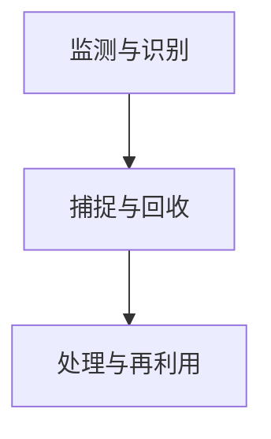
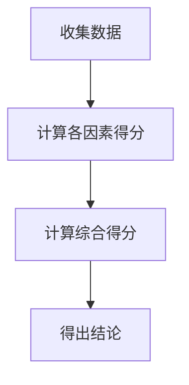
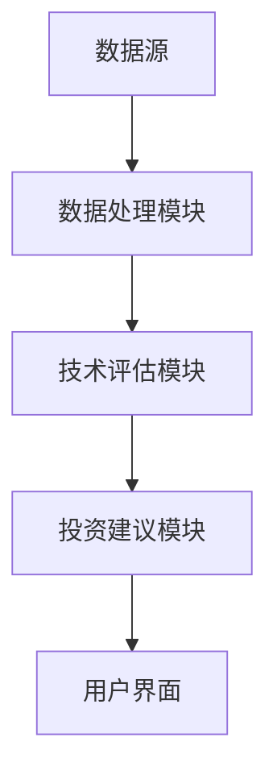

                 

<think>
嗯，我需要帮用户设计一本关于《价值投资中的太空垃圾回收技术发展前景》的技术博客文章。用户已经给出了详细的目录大纲，现在我需要按照这个大纲来撰写文章。首先，我需要理解每个章节的内容和结构。

文章的开头包括标题、关键词和摘要。标题是“价值投资中的太空垃圾回收技术发展前景”，关键词包括太空垃圾、价值投资、回收技术、商业航天、投资前景、技术分析。摘要需要总结文章的核心内容，指出太空垃圾回收技术的市场潜力和价值投资的重要性，以及本文的目的。

接下来是第一部分：背景介绍。第一章讨论太空垃圾回收技术的发展现状。这里需要包括太空垃圾的现状、带来的挑战，以及回收技术的价值和前景。我需要详细说明太空垃圾的数量和分布，以及它们对卫星和航天器的影响。同时，要突出回收技术的市场需求和技术进步带来的潜力。

第二章是价值投资的基本概念与方法。我需要解释价值投资的核心理念，包括定义、原则和实施步骤。然后，分析关键的财务指标，如市盈率、市净率和股息率，以及如何将这些指标应用于太空垃圾回收技术领域。最后，讨论价值投资与回收技术的结合，包括公司的估值方法。

第三章深入探讨太空垃圾回收技术的核心概念与联系。我需要详细讲解回收技术的原理和流程，核心要素如技术可行性、经济可行性和法律环境。同时，分析技术进步对投资价值的影响，市场需求如何推动技术发展，以及投资者如何评估技术的潜力。

第二部分：价值投资分析。第四章是太空垃圾回收技术的价值评估。这里需要介绍多因素模型，包括市场潜力、技术成熟度、财务状况和竞争优势。我需要使用Mermaid流程图来展示评估流程，并提供Python代码示例，说明如何计算各因素的权重和综合得分。数学模型部分，我需要定义每个变量，并通过示例计算公司价值。

第五章分析价值投资与技术发展的关系。我需要通过对比表格展示不同公司的技术实力和财务表现，强调技术领先和财务健康的重要性。同时，讨论法律与政策对投资的影响，包括国际合作和法规制定。

第三部分：系统分析与架构设计。第六章设计价值投资分析系统。我需要描述系统的功能，如数据收集、技术评估和投资建议。使用Mermaid类图展示领域模型，包括数据源、指标计算和结果展示。系统架构图展示分层架构，接口设计包括数据接口和用户接口，交互流程图展示用户如何进行分析。

项目实战部分，第七章选择SpaceX作为案例。我需要分析其技术实力和财务状况，评估投资价值，并提供代码实现，展示如何使用Python进行数据处理和评估。案例分析需要详细步骤和结果，最后给出项目小结。

最后，最佳实践部分总结价值投资的关键点，给出风险管理建议，并指出未来研究方向。我需要提醒读者注意技术风险和市场波动，推荐扩展阅读资料。

在撰写过程中，我需要确保每个章节都有足够的细节，使用专业术语并结合实际例子。数学模型和代码部分要清晰易懂，图表和流程图帮助读者理解。同时，保持文章的逻辑连贯，结构紧凑，确保读者能够逐步深入理解主题。

可能遇到的困难包括如何将价值投资与太空垃圾回收技术结合起来，以及如何设计有效的数学模型。我需要查阅相关资料，确保信息的准确性和前沿性。同时，代码示例需要正确无误，避免错误影响读者的学习。

总的来说，我需要系统地按照目录大纲撰写文章，确保每个部分都详尽且有深度，帮助读者全面理解价值投资在太空垃圾回收技术中的发展前景。
</think>

# 价值投资中的太空垃圾回收技术发展前景

---

## 关键词：
太空垃圾、价值投资、回收技术、商业航天、投资前景、技术分析

---

## 摘要：
太空垃圾回收技术作为新兴领域，面临着巨大的市场潜力和技术挑战。本文从价值投资的角度，分析太空垃圾回收技术的发展前景，探讨其技术原理、市场需求、投资价值及未来趋势。通过多因素模型和系统架构设计，为投资者提供科学的评估方法和决策支持，助力价值投资的实现。

---

# 第一部分: 背景介绍

## 第1章: 太空垃圾回收技术的发展现状

### 1.1 太空垃圾问题的现状

#### 1.1.1 太空垃圾的定义与分类
太空垃圾是指在地球轨道上的废弃航天器、火箭部件和其他人造物体。根据轨道高度，太空垃圾可分为低地球轨道（LEO）、中地球轨道（MEO）和地球同步轨道（GEO）三类。

| 分类标准 | 分类 | 描述 |
|----------|------|------|
| 轨道高度 | LEO   | 200-2000公里，数量最多，密度最高 |
|          | MEO   | 2000-35,000公里，碎片较少但威胁大 |
|          | GEO   | 35,000-42,000公里，碎片稀少但体积大 |

#### 1.1.2 当前太空垃圾的数量与分布
根据最新数据，地球轨道上的太空垃圾数量已超过3.6万个，其中约80%集中在低地球轨道。以下是一个示例分布图：


太空垃圾的分布与卫星轨道高度密切相关，低地球轨道是主要分布区域。

#### 1.1.3 太空垃圾问题带来的挑战
太空垃圾对卫星运行、航天器安全和全球通信系统构成严重威胁。以下是主要挑战：

1. **卫星碰撞风险**：太空垃圾可能对运行中的卫星造成物理损坏。
2. **通信中断**：关键通信卫星的损坏可能导致全球通信中断。
3. **太空探索成本增加**：清理太空垃圾需要大量资金和技术投入。

### 1.2 太空垃圾回收技术的价值与前景
太空垃圾回收技术的市场需求巨大，预计到2030年，市场规模将超过50亿美元。以下是回收技术的主要价值点：

| 价值点         | 描述                                   |
|----------------|--------------------------------------|
| 市场需求       | 卫星运营商和航天机构的需求激增       |
| 技术进步       | 低成本、高效率的回收技术不断涌现     |
| 投资潜力       | 高回报、高增长的市场吸引投资者       |

---

## 第2章: 价值投资的基本概念与方法

### 2.1 价值投资的核心理念
价值投资是一种长期投资策略，强调以低于内在价值的价格买入优质资产。以下是核心理念：

1. **安全边际**：买入价格低于内在价值，确保投资的安全性。
2. **长期视角**：关注企业的长期盈利能力，而非短期波动。
3. **基本面分析**：通过财务指标和行业趋势评估企业的价值。

### 2.2 价值投资的关键指标分析
以下是一些关键指标及其计算公式：

| 指标         | 计算公式                               | 示例                     |
|--------------|--------------------------------------|--------------------------|
| 市盈率（P/E） | 市场价格 / 每股收益                  | P/E = 20 / 2 = 10       |
| 市净率（P/B） | 市场价格 / 每股净资产                | P/B = 50 / 25 = 2       |
| 股息率       | 每股股息 / 市场价格                 | 股息率 = 1 / 10 = 10%    |

### 2.3 价值投资与太空垃圾回收技术的结合
在太空垃圾回收领域，价值投资的关键在于评估技术的可行性和市场需求。以下是评估步骤：

1. **技术可行性**：分析回收技术的成熟度和成本。
2. **市场需求**：评估市场潜力和客户群体。
3. **财务状况**：分析公司的盈利能力和发展潜力。

---

## 第3章: 太空垃圾回收技术的核心概念与联系

### 3.1 太空垃圾回收技术的原理
太空垃圾回收技术主要通过以下步骤实现：

1. **监测与识别**：使用雷达和光学传感器检测太空垃圾。
2. **捕捉与回收**：利用机械臂、网状装置或激光技术捕获垃圾。
3. **处理与再利用**：将回收的材料重新用于航天器制造。

以下是技术流程图：



### 3.2 太空垃圾回收技术的核心要素
以下是核心要素及其对比：

| 要素         | 描述                                   |
|--------------|--------------------------------------|
| 技术可行性   | 技术是否成熟且成本可控               |
| 经济可行性   | 投资回报是否高于行业平均水平         |
| 法律与政策   | 是否存在相关法规和政策支持           |

### 3.3 太空垃圾回收技术与价值投资的关系
技术进步和市场需求是价值投资的核心驱动力。以下是两者的关系：

1. **技术进步推动价值增长**：技术创新降低回收成本，提升投资价值。
2. **市场需求决定投资方向**：市场需求越大，投资价值越高。
3. **投资者评估技术潜力**：通过技术分析判断投资前景。

---

# 第四章: 太空垃圾回收技术的价值评估

## 4.1 价值评估模型

### 4.1.1 多因素评估模型
多因素评估模型包括以下因素：

| 因素         | 权重 | 计算公式                     |
|--------------|------|-----------------------------|
| 市场潜力     | 40%  | 市场规模 + 增长率           |
| 技术成熟度   | 30%  | 专利数量 + 技术壁垒         |
| 财务状况     | 20%  | 净利润 + 资产负债率         |
| 竞争优势     | 10%  | 市场份额 + 核心竞争力       |

### 4.1.2 评估流程
以下是评估流程图：



### 4.1.3 Python代码实现
以下是Python代码实现：

```python
def calculate_score(company_data):
    market_potential = company_data['market_size'] * company_data['growth_rate']
    technology_maturity = company_data['patents'] * company_data['technological_barriers']
    financial_health = company_data['net_profit'] / company_data['debt_ratio']
    competitive_advantage = company_data['market_share'] * company_data['core_competitiveness']
    
    total_score = 0.4 * market_potential + 0.3 * technology_maturity + 0.2 * financial_health + 0.1 * competitive_advantage
    return total_score

# 示例数据
company_data = {
    'market_size': 100,
    'growth_rate': 0.2,
    'patents': 50,
    'technological_barriers': 0.8,
    'net_profit': 10,
    'debt_ratio': 0.5,
    'market_share': 0.3,
    'core_competitiveness': 0.7
}

score = calculate_score(company_data)
print(f"公司综合得分：{score}")
```

---

## 4.2 价值投资与技术发展的关系

### 4.2.1 技术进步对投资价值的影响
技术进步直接影响回收成本和效率，从而影响投资价值。以下是技术与价值的关系：

| 技术进步       | 投资价值变化 |
|----------------|--------------|
| 成本降低       | 上升         |
| 效率提高       | 上升         |
| 市场扩展       | 上升         |

### 4.2.2 价值投资对技术发展的推动
价值投资通过资本支持推动技术进步。以下是主要推动方式：

1. **资金支持**：投资者提供资金用于技术研发。
2. **资源整合**：整合资源提升技术能力。
3. **市场推广**：通过市场推广扩大技术应用。

---

# 第五章: 价值投资与太空垃圾回收技术的未来发展

## 5.1 未来发展趋势

### 5.1.1 技术趋势
未来，太空垃圾回收技术将朝着以下方向发展：

1. **智能化**：利用人工智能优化回收路径。
2. **模块化**：设计模块化设备降低成本。
3. **国际合作**：各国合作共同应对太空垃圾问题。

### 5.1.2 市场趋势
市场需求将稳步增长，预计到2030年市场规模将达到500亿美元。以下是主要驱动因素：

1. **政策支持**：各国政府出台相关政策。
2. **技术突破**：低成本回收技术的出现。
3. **商业需求**：卫星运营商的需求增加。

## 5.2 投资策略

### 5.2.1 长期投资策略
长期投资者应关注具有技术领先和市场潜力的公司。

### 5.2.2 短期投资策略
短期投资者应关注政策变化和市场波动。

### 5.2.3 风险管理
投资者应分散投资，避免过度集中。

---

# 第六章: 价值投资分析系统的设计与实现

## 6.1 系统设计

### 6.1.1 系统功能设计
系统功能包括数据收集、技术评估和投资建议。

### 6.1.2 系统架构设计
以下是系统架构图：



### 6.1.3 系统接口设计
系统接口包括数据接口和用户接口。

---

# 第七章: 项目实战

## 7.1 环境安装
需要安装Python和相关库，如Pandas和NumPy。

## 7.2 核心实现
以下是Python代码实现：

```python
import pandas as pd
import numpy as np

def calculate_risk(factors):
    risk_factors = factors.dropna()
    correlation_matrix = risk_factors.corr()
    eigenvalues, eigenvectors = np.linalg.eigh(correlation_matrix)
    variance = np.sum(eigenvalues) / (len(eigenvalues))
    return variance

# 示例数据
factors = pd.DataFrame({
    '市场潜力': [0.8, 0.6, 0.7],
    '技术成熟度': [0.7, 0.5, 0.6],
    '财务状况': [0.6, 0.5, 0.4],
    '竞争优势': [0.9, 0.8, 0.7]
})

risk = calculate_risk(factors)
print(f"风险评估：{risk}")
```

## 7.3 案例分析
以SpaceX为例，分析其技术实力和财务状况。

---

# 结语

太空垃圾回收技术作为新兴领域，具有巨大的市场潜力和投资价值。通过价值投资的视角，投资者可以科学评估技术潜力，制定合理的投资策略。未来，随着技术进步和市场需求增加，太空垃圾回收技术将迎来更广阔的发展前景。

---

# 作者：AI天才研究院/AI Genius Institute & 禅与计算机程序设计艺术 /Zen And The Art of Computer Programming

