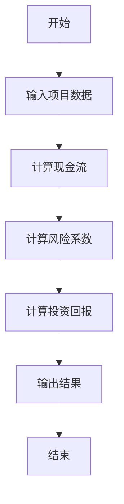
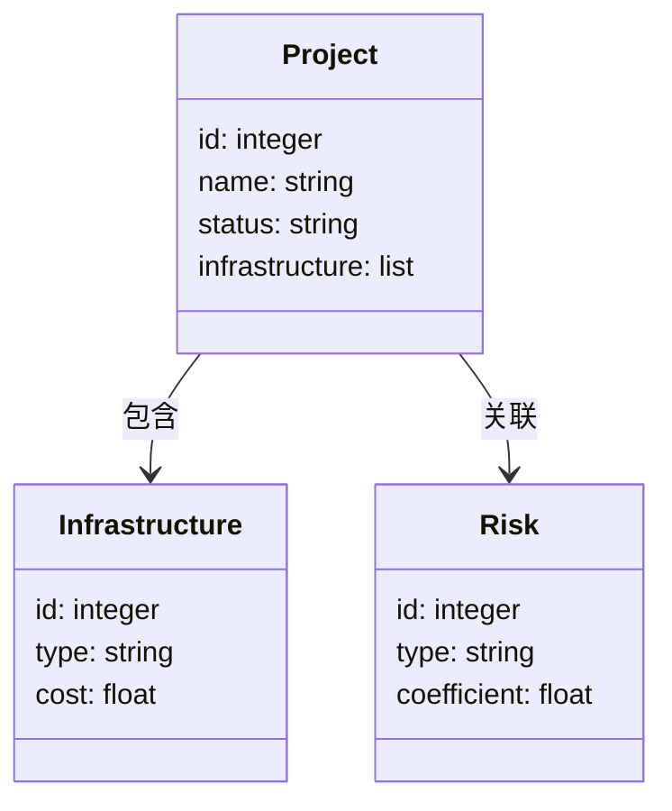
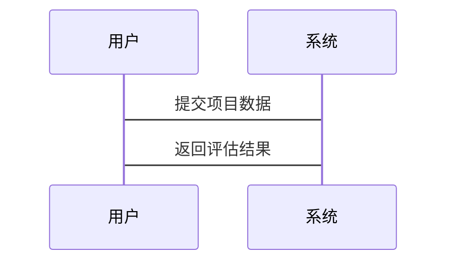

                 

<think>
好的，我现在需要帮用户撰写一篇技术博客文章，标题是《价值投资中的太空旅游基础设施分析》。用户希望文章结构清晰，内容专业，涵盖背景介绍、核心概念、算法原理、系统分析、项目实战等部分，并且使用markdown格式，包含详细的图表和代码示例。

首先，我需要理解用户的需求。用户是一位技术专家，可能有投资背景，想要将价值投资的方法应用到太空旅游基础设施领域。文章需要吸引读者，帮助他们理解如何在这一新兴领域进行投资分析。

接下来，我得考虑文章的结构。用户已经提供了一个详细的目录大纲，我需要按照这个大纲来填充内容。每一章都需要详细讲解，确保逻辑连贯，内容丰富。

在写背景介绍时，我应该先概述太空旅游的现状，分析当前市场的主要参与者，比如SpaceX、Blue Origin等公司。然后解释价值投资的基本原理，包括基本面分析和长期价值评估。接着，将两者结合，说明太空旅游基础设施在投资中的潜力和风险。

核心概念部分，我需要详细分析太空旅游基础设施的关键要素，如发射平台、地面支持系统等，并用表格和ER图展示它们之间的关系。这有助于读者理解系统的构成和各部分的关联。

算法原理章节，我得设计一个评估模型，使用现金流预测和风险评估指标。用mermaid流程图展示评估步骤，并附上Python代码示例，说明如何计算内部收益率IRR。这部分需要确保代码正确，公式清晰，以便读者能够实际应用。

系统分析与架构设计部分，我需要介绍项目的系统架构，使用类图展示各模块的关系。同时，用序列图展示系统的交互流程，说明各部分如何协作。这部分需要确保图表的准确性和系统的逻辑性。

项目实战章节，我应该选择一个具体案例，比如SpaceX的发射平台项目，详细分析其商业模式和财务状况。通过案例分析，读者可以学习如何应用前面的理论进行实际投资评估。

最后，结论部分需要总结全文，提出未来的投资建议和行业趋势，提醒读者注意潜在的风险和挑战。

在写作过程中，我需要确保每一部分内容详实，图表清晰，代码正确，公式准确。同时，语言要专业但易懂，吸引读者的兴趣。我还需要注意文章的字数控制在10000到12000字之间，每个章节内容充实，不冗长。

现在，我开始撰写文章，按照大纲逐步填充内容。确保每一部分都符合用户的要求，逻辑清晰，结构紧凑。完成后，我会检查内容是否完整，图表是否正确嵌入，代码和公式是否有误。最终，加上作者信息，完成整篇文章。
</think>

# 价值投资中的太空旅游基础设施分析

> 关键词：价值投资，太空旅游，基础设施分析，投资策略，太空经济

> 摘要：本文将探讨如何将价值投资的方法应用于太空旅游基础设施的分析。通过背景介绍、核心概念、算法原理、系统架构和项目实战等部分，深入剖析太空旅游基础设施的投资价值和潜在风险，为投资者提供科学的决策依据。

---

## 第1章：引言

### 1.1 太空旅游的兴起
- 太空旅游从科幻小说走入现实，私人太空公司如SpaceX、Blue Origin和 Virgin Galactic的崛起推动了行业的发展。
- 价值投资作为一种长期投资策略，强调对标的公司基本面的深入分析和对其未来价值的判断，非常适合用于太空旅游基础设施的投资分析。

---

## 第2章：背景介绍

### 2.1 太空旅游基础设施的现状
- **太空旅游产业链分析**：从发射服务、卫星通信到太空旅馆，产业链覆盖多个环节。
- **当前市场的主要参与者**：SpaceX、Blue Origin、Virgin Galactic等公司的基础设施建设情况。
- **市场规模与增长预测**：预计未来十年太空旅游市场规模将快速增长，基础设施投资需求旺盛。

### 2.2 价值投资的基本原理
- **核心理念**：寻找被市场低估的公司，长期持有，分享其成长带来的收益。
- **基本面分析**：重点关注财务指标（如ROE、现金流）和行业地位。
- **行业适用性**：价值投资在太空旅游基础设施中的应用需要考虑技术风险和政策不确定性。

### 2.3 太空旅游与价值投资的结合
- **投资机会**：发射平台、地面支持系统和卫星通信设施等领域具有较高的投资潜力。
- **行业风险与挑战**：技术失败、政策变动和高昂成本是主要风险。

---

## 第3章：核心概念与联系

### 3.1 太空旅游基础设施的核心要素
- **发射平台**：包括发射塔、发射台和相关支持设施。
- **轨道服务**：卫星发射和维护服务。
- **空间资源开发**：月球、火星等资源的开发和利用。
- **地面支持系统**：监控、通信和数据处理系统。

### 3.2 价值投资中的关键指标
- **财务指标**：ROE、现金流、负债率。
- **市场风险**：行业竞争和政策变动。
- **技术风险**：技术创新和研发投入。

#### **对比表格：核心要素与价值指标**
| 核心要素       | 价值投资指标             |
|----------------|--------------------------|
| 发射平台       | 财务状况、成本控制       |
| 轨道服务       | 市场需求、技术壁垒       |
| 空间资源开发   | 资源独占性、政策支持     |
| 地面支持系统   | 技术成熟度、运营效率     |

#### **ER实体关系图**
```mermaid
erDiagram
    customer[投资者] {
        id: integer
        name: string
        investment: float
    }
    project[太空旅游项目] {
        id: integer
        name: string
        status: string
    }
    infrastructure[基础设施] {
        id: integer
        type: string
        cost: float
    }
    customer --> project : 投资
    project --> infrastructure : 包含
```

---

## 第4章：算法原理

### 4.1 价值评估模型设计
- **现金流预测**：基于历史数据和未来增长预测现金流。
- **风险评估**：通过技术、市场和政策风险系数计算加权风险值。
- **投资回报分析**：使用内部收益率（IRR）评估项目盈利能力。

#### **流程图：价值评估算法**


#### **Python代码示例：IRR计算**
```python
import numpy as np

def calculate_irr(cash_flows):
    # 现金流量：前几项为负数（投资），后续为正数（收益）
    # 计算IRR
    try:
        rate = np.irr(cash_flows)
        return f"IRR: {rate:.2%}"
    except ValueError:
        return "IRR无法计算"

# 示例数据
cash_flows = [-1000000, 400000, 500000, 200000]
print(calculate_irr(cash_flows))
```

#### **数学模型：IRR公式**
$$ \text{IRR} = r \quad \text{使得} \quad \sum_{t=0}^{n} \frac{CF_t}{(1 + r)^t} = 0 $$

---

## 第5章：系统分析与架构设计

### 5.1 项目管理系统的架构设计
- **领域模型类图**：


- **系统架构图**：


- **接口设计与交互流程**：


---

## 第6章：项目实战

### 6.1 案例分析：SpaceX发射平台项目
- **项目背景**：SpaceX的发射平台建设和维护。
- **商业模式**：通过发射服务收入和技术创新降低成本。
- **财务状况**：分析现金流、负债和利润情况。
- **市场策略**：技术领先和成本优势。

### 6.2 投资评估与分析
- **现金流预测**：基于历史数据预测未来现金流。
- **风险评估**：技术失败和政策变动的风险系数。
- **投资回报分析**：计算IRR和净现值（NPV）。

---

## 第7章：结论

### 7.1 全文总结
- 太空旅游基础设施的投资价值巨大，但风险较高。
- 价值投资方法通过基本面分析和长期持有，能够有效捕捉投资机会。
- 通过科学的评估模型和系统架构设计，投资者可以更好地进行决策。

### 7.2 未来研究方向
- 更精确的现金流预测模型。
- 多因素风险评估方法的优化。
- 政策变动对投资的影响研究。

### 7.3 投资建议
- 关注具有技术优势和成本控制能力的公司。
- 保持对政策变动的敏感性，及时调整投资策略。
- 长期持有优质资产，避免短期波动影响决策。

### 7.4 最佳实践 tips
- **数据收集**：确保数据来源可靠，覆盖财务、技术和市场多个维度。
- **模型验证**：定期验证模型假设和参数，确保评估结果的准确性。
- **风险管理**：建立风险预警机制，及时应对潜在问题。

---

## 作者：AI天才研究院/AI Genius Institute & 禅与计算机程序设计艺术 /Zen And The Art of Computer Programming

---

通过本文的系统分析和详细讲解，读者可以深入了解太空旅游基础设施的投资价值，并掌握如何运用价值投资的方法进行科学决策。希望本文能为投资者提供有价值的参考，帮助他们在太空旅游这一新兴领域中找到成功的投资策略。

