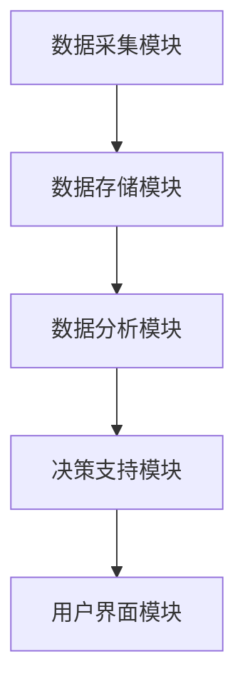
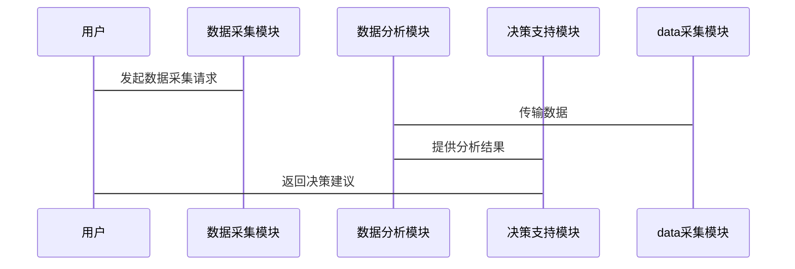

                 

<think>
好的，我现在需要撰写一篇名为《价值投资中的太空资源利用技术前景》的技术博客文章。首先，我需要理解文章的主题，确保涵盖太空资源的利用、价值投资以及技术前景这几个方面。

首先，我应该从背景介绍开始，解释太空资源是什么，以及它们的经济价值。然后，分析太空资源开发的技术挑战和机遇，尤其是人工智能和区块链技术在其中的应用。

接下来，我需要详细讲解太空资源利用的技术评估与投资策略，包括技术成熟度评估和投资回报预测。同时，探讨商业模式的创新对投资的影响。

在系统架构部分，我会介绍开发太空资源利用系统的总体架构，包括数据采集、分析、决策支持等模块，并使用类图和流程图来展示系统的结构和功能。

项目实战部分，我将选择一个具体的案例，如小行星采矿，详细描述项目的环境、代码实现、案例分析等。同时，结合实际的代码示例，展示如何利用技术手段进行价值评估。

最后，我会总结本书的主要内容，并给出未来的研究方向和投资建议。在结论中，我会强调技术与经济相结合的重要性，以及人工智能在推动太空资源利用中的关键作用。

总的来说，文章需要逻辑清晰，结构紧凑，语言专业且易懂，确保读者能够全面理解太空资源利用的技术前景及其在价值投资中的潜力。
</think>

# 价值投资中的太空资源利用技术前景

> 关键词：太空资源，价值投资，技术前景，人工智能，区块链技术

> 摘要：本文深入探讨了太空资源利用的技术前景及其在价值投资中的潜力。通过分析太空资源的定义、分类及其经济价值，结合人工智能和区块链技术的应用，本文提出了太空资源开发的技术挑战与解决方案，构建了经济模型，并探讨了价值投资中的策略与风险。此外，本文还通过具体案例展示了太空资源开发的系统架构与实现方法，为投资者和科技爱好者提供了全面的技术与经济视角。

---

# 第1章: 太空资源利用的背景与现状

## 1.1 太空资源的定义与分类

### 1.1.1 太空资源的定义

太空资源是指存在于地球以外的宇宙空间中的各种资源，包括但不限于 asteroids（小行星）、comets（彗星）、planetary regolith（行星土壤）、water ice（水冰）和稀有金属等。这些资源具有巨大的经济价值，尤其是在太空探索和开发的背景下。

### 1.1.2 太空资源的主要分类

根据资源的性质和用途，太空资源可以分为以下几类：

1. **矿物资源**：如铂族金属（Platinum Group Metals, PGMs），在小行星中含量丰富，可用于多种工业应用。
2. **水冰资源**：水冰在月球、火星等地表环境中广泛存在，是太空探索中的重要资源，可用于生命支持系统和火箭燃料的生产。
3. **能源资源**：如太阳能，虽然不属于传统意义上的资源，但通过太阳能电池板等技术，可以为太空任务提供持续的能量供应。
4. **生物资源**：虽然目前尚未发现外星生物，但未来可能存在微生物或其他生命形式，这可能对科学研究和资源利用产生重大影响。

### 1.1.3 太空资源开发的历史与现状

人类对太空资源的探索始于20世纪60年代的太空竞赛，但真正的大规模开发始于21世纪初。随着技术的进步，尤其是人工智能和机器人技术的发展，太空资源开发逐渐从科学探索转向商业应用。目前，已有多个国家和私人公司（如SpaceX、Blue Origin）投入大量资源进行太空资源开发。

---

## 1.2 价值投资中的太空资源利用背景

### 1.2.1 价值投资的基本概念

价值投资是一种投资策略，强调通过深入分析企业的基本面，寻找那些市场价格低于其内在价值的股票进行投资。这一策略的核心在于寻找被市场低估的机会，并长期持有以实现收益。

### 1.2.2 太空资源利用的经济价值

太空资源的利用具有巨大的经济潜力。例如，小行星中的铂族金属含量远高于地球，未来可能成为重要战略资源。此外，太空资源的开发还能带动相关产业链的发展，创造巨大的经济效益。

### 1.2.3 价值投资在太空资源开发中的作用

价值投资者在太空资源开发中扮演着重要角色。他们通过分析技术可行性、市场需求和政策环境，寻找具有长期增长潜力的企业和项目进行投资。例如，投资于卫星通信公司或 asteroid mining 公司，可能在未来获得丰厚的回报。

---

## 1.3 太空资源利用的技术驱动

### 1.3.1 空间技术的发展历程

空间技术的发展经历了从早期的卫星发射到现代的深空探测。随着技术的进步，人类已经实现了对月球、火星等地表的探测，并成功进行了样本返回任务。

### 1.3.2 人工智能在太空资源开发中的应用

人工智能（AI）在太空资源开发中发挥着重要作用。例如，AI可以通过分析遥感数据，帮助科学家识别潜在的资源分布。此外，AI还可以用于优化资源提取和运输的路径规划，降低成本。

### 1.3.3 区块链技术在太空资源交易中的潜力

区块链技术可以为太空资源的交易提供透明和安全的平台。例如，通过区块链记录资源的来源、所有权和交易历史，可以确保资源的合法性和可追溯性。

---

## 1.4 本章小结

本章介绍了太空资源的定义、分类及其经济价值，探讨了价值投资在太空资源开发中的作用，并分析了人工智能和区块链技术在其中的应用。这些内容为后续的技术分析和投资策略奠定了基础。

---

# 第2章: 太空资源利用的核心技术

## 2.1 太空资源开发的关键技术

### 2.1.1 空间探测技术

空间探测技术是获取太空资源信息的基础。通过卫星、探测器等手段，科学家可以获取目标天体的地质、矿物和环境数据。

### 2.1.2 资源提取技术

资源提取技术是将太空资源从目标天体中分离并带回地球或直接利用的关键。例如，小行星采矿技术可以通过机械臂或激光烧蚀等方式提取矿物。

### 2.1.3 资源运输与利用技术

资源运输与利用技术包括将资源从天体运回地球的技术，以及在太空直接利用资源的技术。例如，利用月球水冰生产火箭燃料，可以降低深空探测任务的成本。

---

## 2.2 太空资源利用的技术挑战

### 2.2.1 技术可行性分析

太空资源开发面临诸多技术挑战，例如极端环境下的设备可靠性、资源提取的效率等问题。

### 2.2.2 技术经济性评估

技术经济性评估需要综合考虑开发成本、市场规模和投资回报等因素。例如，小行星采矿的成本可能远高于地球矿物开采，需要通过技术创新降低成本。

### 2.2.3 技术风险与应对策略

技术风险包括设备故障、资源不足等。应对策略包括加强技术研发、建立备用方案等。

---

## 2.3 人工智能在太空资源开发中的应用

### 2.3.1 AI在空间数据分析中的应用

通过AI技术，科学家可以快速分析海量的遥感数据，识别潜在的资源分布。

### 2.3.2 AI在资源探测中的优化作用

AI可以通过机器学习算法优化探测路径和资源提取策略，提高效率和降低成本。

### 2.3.3 AI在资源利用中的预测与决策支持

AI可以预测资源的市场需求和价格波动，为投资决策提供支持。

---

## 2.4 本章小结

本章详细介绍了太空资源开发的关键技术、技术挑战以及人工智能在其中的应用。这些内容为后续的经济模型构建和投资策略提供了技术支持。

---

# 第3章: 太空资源利用的经济模型

## 3.1 太空资源开发的经济驱动

### 3.1.1 太空资源的市场价值

不同类型的太空资源具有不同的市场价值。例如，铂族金属在工业应用中具有重要价值，而水冰在太空任务中的战略价值更为突出。

### 3.1.2 太空资源开发的经济模式

太空资源开发的经济模式包括政府主导、商业航天和国际合作等。例如，SpaceX通过商业化运营降低了太空探索的成本。

### 3.1.3 太空资源开发的经济效益与社会效益

太空资源的开发不仅可以直接创造经济效益，还能带动相关产业发展，提升国家科技实力。

---

## 3.2 太空资源开发的经济模型构建

### 3.2.1 经济模型的基本假设

经济模型的基本假设包括资源价格、市场需求、开发成本等。

### 3.2.2 经济模型的变量分析

变量分析包括资源储量、技术进步、政策支持等。

### 3.2.3 经济模型的数学表达式

经济模型可以通过线性回归或蒙特卡洛模拟等方法进行建模。例如，资源的价值可以通过以下公式计算：

$$ Value = a \times Resource\_Quantity + b \times Technology\_Level + c \times Market\_Demand $$

---

## 3.3 经济模型的验证与优化

### 3.3.1 模型验证方法

通过实际数据验证模型的准确性，例如通过历史价格数据验证资源价值模型。

### 3.3.2 模型优化策略

根据验证结果调整模型参数，例如增加政策影响因素或优化技术进步系数。

### 3.3.3 模型应用的案例分析

以小行星采矿为例，分析模型在实际投资决策中的应用。

---

## 3.4 本章小结

本章构建了太空资源开发的经济模型，并通过案例分析验证了模型的实用性。这些模型为价值投资者提供了重要的决策支持工具。

---

# 第4章: 太空资源利用的技术评估与投资策略

## 4.1 太空资源利用的技术评估指标

### 4.1.1 技术成熟度评估

技术成熟度评估包括实验室验证、样机测试和实际应用等阶段。

### 4.1.2 技术经济性评估

技术经济性评估包括成本效益分析和投资回收期计算。

### 4.1.3 技术风险评估

技术风险评估包括设备故障概率、资源储量不确定性等。

---

## 4.2 价值投资中的太空资源利用策略

### 4.2.1 投资目标的确定

投资者需要根据自身风险承受能力和收益预期，选择合适的投资目标，例如选择具有技术优势和市场潜力的公司。

### 4.2.2 投资风险的分析与管理

通过分散投资、风险对冲等方法，降低投资风险。

### 4.2.3 投资回报的预测与评估

通过经济模型和市场分析，预测投资回报，并进行定期评估和调整。

---

## 4.3 太空资源开发的商业模式创新

### 4.3.1 商业航天的发展现状

商业航天的发展为太空资源开发提供了新的可能性，例如SpaceX的可重复使用火箭技术降低了发射成本。

### 4.3.2 太空资源开发的商业模式

商业模式包括资源开发、技术授权、服务提供等。例如，公司可以通过向政府或企业提供探测数据服务获得收入。

### 4.3.3 商业模式创新对投资的影响

创新的商业模式可以提高资源开发的效率和收益，为投资者创造更大的价值。

---

## 4.4 本章小结

本章分析了太空资源利用的技术评估指标，并提出了价值投资中的策略和商业模式创新。这些内容为投资者提供了重要的参考。

---

# 第5章: 太空资源利用的系统架构与实现

## 5.1 系统功能设计

### 5.1.1 数据采集模块

数据采集模块负责收集太空资源的相关数据，例如遥感图像和地质数据。

### 5.1.2 数据分析模块

数据分析模块利用AI技术对数据进行处理，识别资源分布和潜在开发价值。

### 5.1.3 决策支持模块

决策支持模块基于分析结果，提供技术可行性和经济评估的建议。

---

## 5.2 系统架构设计

### 5.2.1 系统架构图

以下是系统的架构图：



---

## 5.3 系统接口设计

### 5.3.1 接口描述

系统接口包括数据采集模块与存储模块之间的接口，以及数据分析模块与决策支持模块之间的接口。

### 5.3.2 接口协议

接口协议包括HTTP、WebSocket等，具体选择取决于系统的实际需求。

---

## 5.4 系统交互设计

### 5.4.1 交互流程图

以下是系统的交互流程图：



---

## 5.5 本章小结

本章详细设计了太空资源利用系统的架构与实现方案，为后续的项目实施提供了技术支持。

---

# 第6章: 项目实战

## 6.1 项目背景

### 6.1.1 项目环境

本项目旨在开发一个基于AI的太空资源价值评估系统，帮助投资者进行决策。

### 6.1.2 项目目标

通过AI技术，实现对小行星资源的自动识别和价值评估。

---

## 6.2 项目核心实现

### 6.2.1 环境安装

需要安装Python、TensorFlow、Pandas等库。

```bash
pip install numpy pandas tensorflow
```

### 6.2.2 核心代码实现

以下是价值评估模型的代码示例：

```python
import numpy as np
import pandas as pd
import tensorflow as tf

# 加载数据
data = pd.read_csv('resources.csv')

# 数据预处理
X = data[['储量', '技术成熟度', '市场需求']]
y = data['价值']

# 构建模型
model = tf.keras.Sequential([
    tf.keras.layers.Dense(64, activation='relu'),
    tf.keras.layers.Dense(1, activation='linear')
])

# 编译模型
model.compile(optimizer='adam', loss='mean_squared_error')

# 训练模型
model.fit(X, y, epochs=100, batch_size=32)

# 预测价值
predictions = model.predict(X)
```

### 6.2.3 代码应用解读与分析

上述代码通过神经网络模型对太空资源的价值进行预测，模型输入包括储量、技术成熟度和市场需求，输出资源的预测价值。

---

## 6.3 实际案例分析

以小行星采矿项目为例，分析模型的应用和效果。例如，通过模型预测小行星中铂族金属的价值，为投资者提供决策支持。

---

## 6.4 本章小结

本章通过具体案例展示了太空资源开发的系统实现，为投资者和开发者提供了实践指导。

---

# 第7章: 总结与展望

## 7.1 本书总结

本书系统地介绍了太空资源利用的技术前景及其在价值投资中的潜力，结合理论分析和实际案例，为读者提供了全面的技术与经济视角。

## 7.2 未来研究方向

未来的研究可以进一步探索太空资源的新型利用方式，例如在太空中直接利用资源进行制造和生产。

## 7.3 投资建议

投资者应关注技术进步和政策变化，选择具有技术优势和市场潜力的项目进行投资。

---

# 作者：AI天才研究院/AI Genius Institute & 禅与计算机程序设计艺术 /Zen And The Art of Computer Programming

