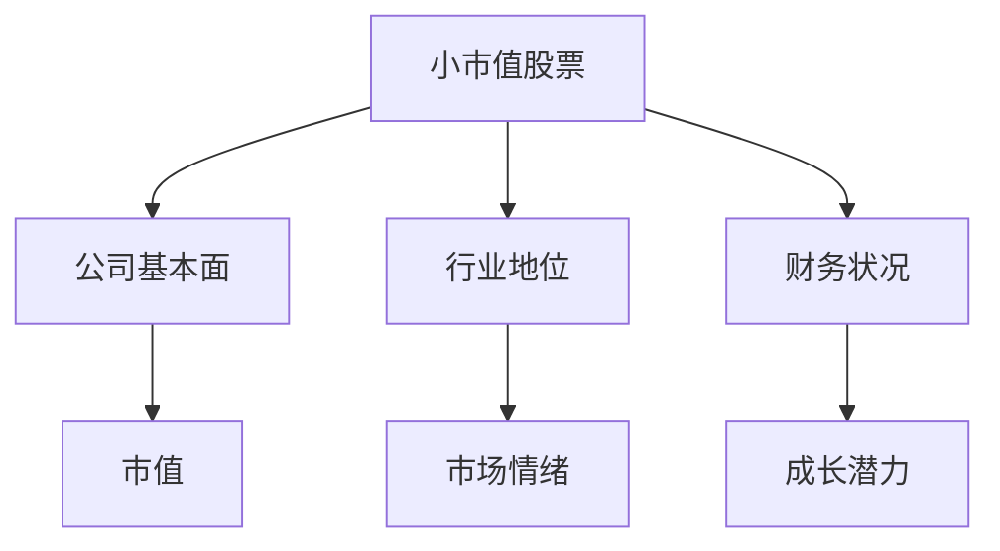
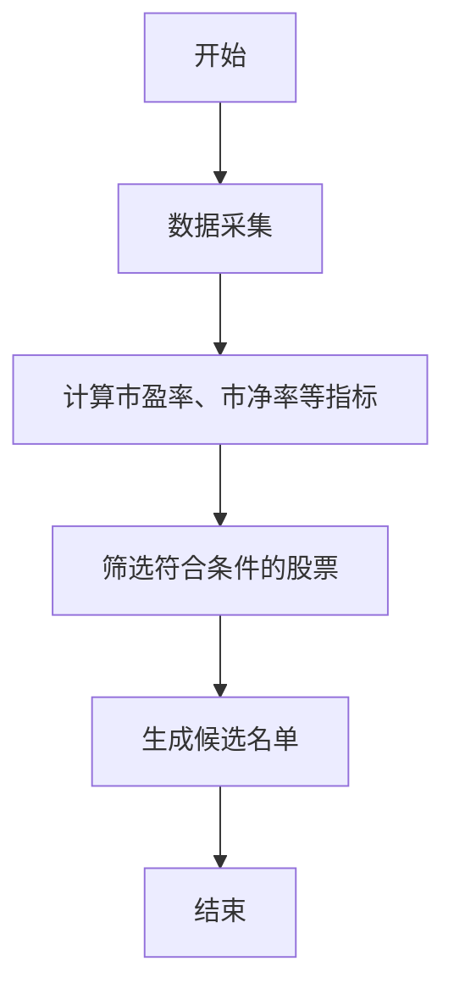
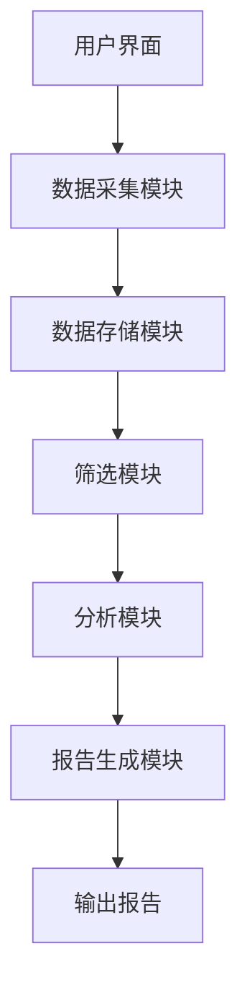
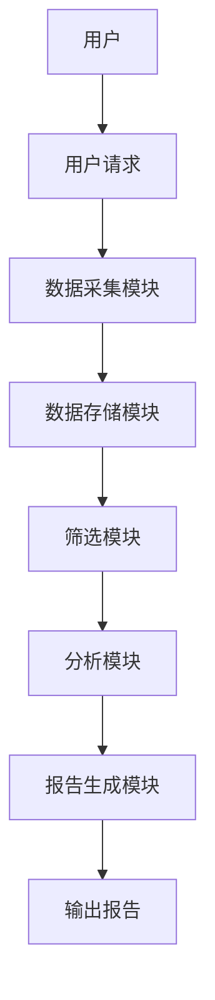

                 


# 价值投资中的小市值股票策略

> 关键词：价值投资，小市值股票，股票策略，投资策略，股票筛选，投资分析

> 摘要：本文详细探讨了价值投资中的小市值股票策略，从背景介绍到核心概念，从算法原理到系统架构设计，再到项目实战，系统地分析了小市值股票策略的各个方面。文章通过丰富的案例和详细的代码实现，帮助读者全面理解小市值股票策略的核心思想和具体操作方法。

---

# 第一部分: 小市值股票策略的背景与核心概念

# 第1章: 小市值股票策略概述

## 1.1 小市值股票的定义与特点

### 1.1.1 小市值股票的定义

小市值股票是指公司市值相对较小的股票。市值是公司股票的数量乘以当前股价。通常，小市值股票的市值在50亿元以下，相对于大盘股，小市值股票的流动性较低，市场关注度较低，但同时也可能具有较高的增长潜力。

### 1.1.2 小市值股票的特点

- **低流动性**：小市值股票的交易量通常较低，市场深度不足，可能导致价格波动较大。
- **高波动性**：由于流动性低，小市值股票的价格容易受到市场情绪和突发事件的影响。
- **高增长潜力**：小市值公司可能具有较高的增长潜力，尤其是在新兴行业或细分市场中。
- **估值较低**：小市值股票的估值通常较低，可能被市场低估，从而为投资者提供投资机会。

### 1.1.3 小市值股票的优势与劣势

- **优势**：
  - 估值较低，可能具有较高的上涨空间。
  - 增长潜力大，尤其在新兴行业或细分市场中。
  - 市场关注度低，可能被忽视，从而出现投资机会。
- **劣势**：
  - 流动性低，可能导致买卖价差较大。
  - 市场波动性高，可能导致股价短期大幅波动。
  - 监管关注度低，可能存在信息不对称风险。

## 1.2 价值投资的基本原理

### 1.2.1 价值投资的定义

价值投资是一种投资策略，强调以低于其内在价值的价格购买优质的股票。价值投资者认为市场的短期波动并不影响公司的长期价值，因此在市场价格低于内在价值时买入股票，并长期持有，等待市场价格回归内在价值。

### 1.2.2 价值投资的核心理念

- **长期投资**：价值投资者倾向于长期持有股票，相信市场会最终反映公司的内在价值。
- **安全边际**：价值投资者注重安全边际，即市场价格与内在价值之间的差距，以降低投资风险。
- **基本面分析**：价值投资者注重对公司基本面的深入分析，包括财务状况、盈利能力、行业地位等。

### 1.2.3 价值投资与小市值股票的结合

小市值股票通常被市场低估，具有较高的安全边际，适合价值投资者。由于小市值股票的流动性低，价格波动大，价值投资者需要更加谨慎地选择标的，并进行深入的基本面分析。

## 1.3 小市值股票策略的背景与现状

### 1.3.1 小市值股票策略的历史发展

小市值股票策略在价值投资中有着悠久的历史。早期的价值投资者如本杰明·格雷厄姆和沃伦·巴菲特都曾成功运用小市值股票策略，通过深入的基本面分析，找到被市场低估的股票进行投资。

### 1.3.2 当前市场环境下的小市值股票策略

在当前市场环境下，小市值股票策略仍然具有其独特的优势。随着市场的发展，新兴行业和细分市场的崛起，小市值公司有机会通过技术创新、市场拓展等方式实现快速增长。

### 1.3.3 小市值股票策略的市场现状与趋势

目前，小市值股票策略在市场中仍然受到一定的关注，尤其是在新兴市场中，小市值股票往往具有较高的增长潜力。然而，随着市场的成熟和信息透明度的提高，小市值股票的估值差异逐渐缩小，投资难度增加。

## 1.4 小市值股票策略的核心要素

### 1.4.1 小市值股票的市值与流动性

小市值股票的市值较低，流动性较差，这可能导致价格波动较大，同时也可能为投资者提供投资机会。

### 1.4.2 小市值股票的市场机会

小市值股票在新兴行业和细分市场中可能具有较高的增长潜力，尤其是在技术进步和消费升级的推动下，小市值公司有机会实现快速增长。

### 1.4.3 小市值股票策略的风险与挑战

小市值股票策略面临较高的市场风险和流动性风险，同时也需要投资者具备较高的分析能力和信息获取能力。

## 1.5 本章小结

本章介绍了小市值股票的定义、特点以及价值投资的基本原理，并分析了小市值股票策略的背景与现状。小市值股票具有较高的增长潜力和安全边际，但也面临较高的风险和挑战。

# 第2章: 小市值股票策略的核心概念与联系

## 2.1 小市值股票策略的核心概念

### 2.1.1 小市值股票的估值方法

小市值股票的估值方法包括市盈率、市净率、现金流折现模型等。其中，市盈率和市净率是常用的估值指标。

- **市盈率（P/E）**：市盈率 = 股价 / 每股净利润。
- **市净率（P/B）**：市净率 = 股价 / 每股净资产。

### 2.1.2 小市值股票的市场情绪

市场情绪是指市场参与者对小市值股票的看法和预期，通常受到市场波动、投资者情绪和突发事件的影响。

### 2.1.3 小市值股票的成长潜力

小市值股票的成长潜力取决于公司的基本面、行业地位和市场前景。成长潜力高的公司通常具有较高的净利润增长率和市场份额扩张能力。

## 2.2 小市值股票策略的关联因素

### 2.2.1 公司基本面分析

公司基本面分析包括财务状况、盈利能力、资产负债情况等。小市值股票的公司通常规模较小，财务状况较为简单，但需要关注其盈利能力和成长潜力。

### 2.2.2 行业地位与竞争环境

小市值股票的行业地位和竞争环境是影响其投资价值的重要因素。在新兴行业或细分市场中，小市值公司可能具有较高的竞争优势。

### 2.2.3 财务状况与盈利能力

小市值股票的财务状况和盈利能力是基本面分析的核心内容。需要关注公司的净利润增长率、毛利率、资产负债率等指标。

## 2.3 小市值股票策略的ER实体关系图

以下是小市值股票策略的ER实体关系图：



## 2.4 本章小结

本章分析了小市值股票策略的核心概念，包括估值方法、市场情绪和成长潜力，并探讨了公司基本面、行业地位和财务状况等因素对小市值股票的影响。

# 第3章: 小市值股票策略的算法原理

## 3.1 小市值股票筛选算法

### 3.1.1 筛选标准的定义

小市值股票筛选算法需要根据预设的筛选标准，从市场中筛选出符合条件的股票。常用的筛选标准包括：

- **市值**：市值在50亿元以下。
- **市盈率**：市盈率小于15。
- **市净率**：市净率小于2。
- **净利润增长率**：净利润同比增长率大于10%。

### 3.1.2 算法流程

小市值股票筛选算法的流程如下：

1. 数据采集：从数据库中获取股票的基本数据，包括市值、市盈率、市净率、净利润增长率等。
2. 筛选标准：根据预设的筛选标准，筛选出符合条件的股票。
3. 生成候选名单：将符合条件的股票生成候选名单。

### 3.1.3 算法优化与改进

为了提高筛选算法的效率和准确性，可以考虑以下优化措施：

- **动态调整筛选标准**：根据市场环境的变化，动态调整筛选标准。
- **结合技术分析**：将技术分析指标融入筛选算法，提高筛选结果的准确性。
- **引入机器学习**：利用机器学习算法，对历史数据进行分析，预测股票的潜在价值。

## 3.2 小市值股票估值模型

### 3.2.1 市盈率与市净率分析

市盈率和市净率是常用的估值指标。市盈率反映了股票的盈利能力，市净率反映了股票的资产价值。

- **市盈率计算公式**：
  $$ P/E = \frac{Price}{Earnings} $$
- **市净率计算公式**：
  $$ P/B = \frac{Price}{Book\ Value} $$

### 3.2.2 现金流折现模型

现金流折现模型（DCF模型）是一种常用的估值方法，通过折现未来现金流的现值来评估股票的内在价值。

- **现金流折现模型公式**：
  $$ V = \sum_{t=1}^{n} \frac{CF_t}{(1 + r)^t} $$

其中，\( V \) 是股票的内在价值，\( CF_t \) 是第 \( t \) 年的现金流，\( r \) 是折现率，\( n \) 是预测的年数。

### 3.2.3 其他估值方法

除了市盈率、市净率和现金流折现模型外，还可以使用股息率、EV/EBITDA等指标进行估值。

## 3.3 小市值股票策略的数学模型

### 3.3.1 市盈率计算公式

$$ P/E = \frac{Price}{Earnings} $$

### 3.3.2 市净率计算公式

$$ P/B = \frac{Price}{Book\ Value} $$

### 3.3.3 现金流折现模型

$$ V = \sum_{t=1}^{n} \frac{CF_t}{(1 + r)^t} $$

## 3.4 算法流程图

以下是小市值股票筛选算法的流程图：



## 3.5 本章小结

本章详细介绍了小市值股票筛选算法的原理和流程，并分析了常用的估值模型，包括市盈率、市净率和现金流折现模型。通过这些模型和算法，可以有效筛选出具有投资价值的小市值股票。

# 第4章: 小市值股票策略的系统分析与架构设计

## 4.1 问题场景介绍

在实际投资过程中，投资者需要一个高效、可靠的系统来辅助进行小市值股票的筛选和分析。该系统需要能够快速获取股票数据，计算各项指标，并根据筛选标准生成候选名单。

## 4.2 系统功能设计

### 4.2.1 数据采集模块

数据采集模块负责从数据库或第三方数据源获取股票的基本数据，包括市值、市盈率、市净率、净利润增长率等。

### 4.2.2 筛选模块

筛选模块根据预设的筛选标准，对股票数据进行筛选，生成候选名单。

### 4.2.3 分析模块

分析模块对候选名单中的股票进行深入分析，包括财务状况、行业地位、市场情绪等。

### 4.2.4 报告生成模块

报告生成模块根据分析结果，生成投资报告，包括筛选结果、分析结论和投资建议。

## 4.3 系统架构设计

### 4.3.1 系统架构图

以下是系统的架构图：



### 4.3.2 数据流图

以下是系统的数据流图：



## 4.4 系统接口设计

### 4.4.1 数据接口

数据接口负责与数据库或第三方数据源进行交互，获取股票数据。

### 4.4.2 用户接口

用户接口负责与用户交互，接收用户的筛选标准和查询请求。

## 4.5 本章小结

本章分析了小市值股票策略的系统架构设计，包括功能模块、系统架构和数据流图。通过系统化的架构设计，可以提高投资分析的效率和准确性。

# 第5章: 小市值股票策略的项目实战

## 5.1 环境安装

### 5.1.1 安装Python

在开始项目之前，需要安装Python编程语言。可以通过官方网站（https://www.python.org/）下载并安装适合的版本。

### 5.1.2 安装第三方库

为了进行数据处理和可视化，需要安装以下第三方库：

- **pandas**：用于数据处理。
- **numpy**：用于数值计算。
- **matplotlib**：用于数据可视化。
- **requests**：用于HTTP请求。

安装命令如下：

```bash
pip install pandas numpy matplotlib requests
```

## 5.2 系统核心实现源代码

### 5.2.1 数据采集代码

以下是一个简单的数据采集代码示例：

```python
import requests
import pandas as pd

# 获取股票数据
url = 'https://api.example.com/stock_data'
response = requests.get(url)
data = response.json()

# 将数据转换为DataFrame
df = pd.DataFrame(data)

# 打印数据
print(df.head())
```

### 5.2.2 筛选代码

以下是一个简单的筛选代码示例：

```python
import pandas as pd

# 假设df是股票数据
df = df[df['市值'] < 500000000]
df = df[df['市盈率'] < 15]
df = df[df['市净率'] < 2]
df = df[df['净利润增长率'] > 10]

# 打印筛选结果
print(df.head())
```

### 5.2.3 可视化代码

以下是一个简单的可视化代码示例：

```python
import matplotlib.pyplot as plt

# 绘制市盈率分布图
df['市盈率'].hist(bins=10)
plt.title('市盈率分布图')
plt.xlabel('市盈率')
plt.ylabel('频数')
plt.show()
```

## 5.3 代码应用解读与分析

### 5.3.1 数据采集模块

数据采集模块通过HTTP请求获取股票数据，并将其转换为DataFrame格式，便于后续处理。

### 5.3.2 筛选模块

筛选模块根据预设的筛选标准，对股票数据进行筛选，生成候选名单。

### 5.3.3 可视化模块

可视化模块通过绘制图表，直观展示数据分布情况，帮助投资者更好地理解和分析数据。

## 5.4 实际案例分析

### 5.4.1 案例背景

假设我们关注的是某新兴行业中的小市值公司，希望通过筛选和分析找到具有投资价值的股票。

### 5.4.2 数据采集与处理

通过数据采集模块获取该行业的股票数据，并进行清洗和处理。

### 5.4.3 筛选与分析

根据预设的筛选标准，筛选出符合条件的股票，并对其进行深入分析，包括财务状况、行业地位和市场情绪等。

### 5.4.4 投资建议

根据分析结果，提出投资建议，包括买入、持有或卖出等。

## 5.5 项目小结

本章通过实际案例展示了小市值股票策略的项目实战，包括环境安装、数据采集、筛选分析和可视化等步骤。通过这些步骤，投资者可以系统地筛选和分析小市值股票，找到具有投资价值的标的。

# 第6章: 小市值股票策略的最佳实践

## 6.1 小结

小市值股票策略是一种有效的投资策略，通过深入的基本面分析和科学的筛选算法，可以找到具有投资价值的股票。

## 6.2 注意事项

- **风险控制**：小市值股票具有较高的市场风险和流动性风险，投资者需要具备较高的风险意识。
- **信息获取**：小市值股票的信息可能较为分散，投资者需要具备较强的信息获取能力。
- **长期投资**：小市值股票策略需要长期投资，耐心等待市场价值的回归。

## 6.3 拓展阅读

- **《证券分析》**：本杰明·格雷厄姆的《证券分析》是价值投资的经典著作，对小市值股票策略有深入的分析。
- **《巴菲特的选股智慧》**：巴菲特的选股智慧为小市值股票策略提供了丰富的实践经验和理论支持。

## 6.4 本章小结

本章总结了小市值股票策略的最佳实践，包括小结、注意事项和拓展阅读等内容，帮助投资者更好地理解和应用小市值股票策略。

---

# 作者：AI天才研究院/AI Genius Institute & 禅与计算机程序设计艺术 /Zen And The Art of Computer Programming

