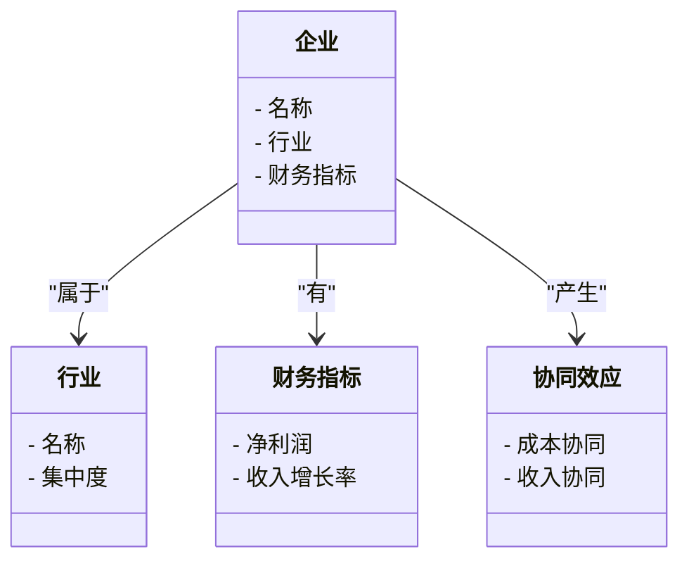
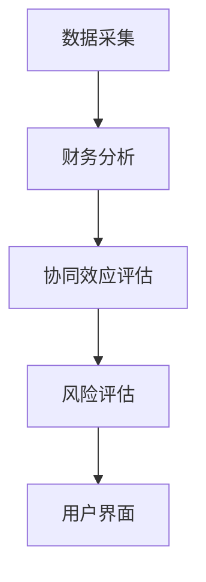

                 


# 价值投资中的并购机会分析

> 关键词：价值投资、并购机会、财务分析、协同效应、投资策略

> 摘要：本文深入探讨了价值投资中的并购机会分析，从并购的基本概念、分析方法、策略选择到系统架构设计和实战案例，全面解析了并购在价值投资中的重要性。文章通过逻辑清晰的结构，结合实际案例和系统设计，为投资者提供了科学的并购机会评估和投资决策支持。

---

## 第一部分: 价值投资与并购的基本概念

### 第1章: 价值投资的起源与发展

#### 1.1 价值投资的定义与核心理念
- **价值投资的起源**：本杰明·格雷厄姆和沃伦·巴菲特共同奠定了价值投资的理论基础。格雷厄姆提出“安全边际”概念，巴菲特进一步完善了投资体系。
- **价值投资的核心理念**：寻找市场定价低于内在价值的企业，长期持有，等待价值回归。
- **并购与价值投资的关系**：并购是企业实现价值增长的重要手段，也是价值投资者关注的重要机会。

#### 1.2 并购的基本概念与类型
- **并购的定义**：企业之间的合并或收购行为，旨在整合资源、扩大规模或增强竞争力。
- **并购的分类**：
  - **横向并购**：同行业竞争企业之间的并购。
  - **纵向并购**：产业链上下游企业之间的并购。
  - **混合并购**：与主业无关的跨行业并购。
- **并购的主要形式**：
  - **股权并购**：收购目标企业的股权。
  - **资产并购**：收购目标企业的特定资产或业务。

#### 1.3 价值投资中的并购机会
- **并购机会的定义**：通过并购实现企业价值增长的机会。
- **并购机会的来源**：
  - 行业整合：市场集中度低，存在整合空间。
  - 估值洼地：目标企业市场定价低于内在价值。
  - 协同效应：并购后产生的成本或收入协同效应。
- **并购与企业价值的关系**：并购通过整合资源、消除冗余、提升效率，实现企业价值的提升。

---

### 第2章: 并购目标企业的评估

#### 2.1 企业基本面分析
- **财务指标分析**：
  - **盈利能力**：净利润率、ROE（净资产收益率）。
  - **成长能力**：收入增长率、净利润增长率。
  - **财务健康性**：资产负债率、流动比率。
- **行业地位分析**：
  - 行业集中度：CR4、CR8。
  - 市场份额：目标企业在行业中的地位。
- **管理团队评估**：
  - 团队稳定性：高管团队是否稳定。
  - 管理能力：是否有优秀的管理能力。

#### 2.2 并购的财务分析与估值
- **财务数据的分析方法**：
  - 资产负债表分析：识别资产质量、负债结构。
  - 利润表分析：评估盈利能力、成本控制能力。
  - 现金流量表分析：评估现金流健康性。
- **并购估值方法**：
  - **市盈率法**：目标企业市盈率低于行业平均水平。
  - **市净率法**：目标企业市净率低于行业平均水平。
  - **股权自由现金流法**：评估企业未来现金流的现值。

#### 2.3 并购风险与机会的平衡
- **并购风险的识别**：
  - 行业风险：目标企业所在行业的周期性。
  - 财务风险：目标企业的财务健康性。
  - 管理风险：目标企业的管理团队稳定性。
- **并购机会的捕捉**：
  - 行业趋势分析：选择处于上升周期的行业。
  - 企业竞争优势分析：目标企业是否具备竞争优势。
  - 并购协同效应的评估：并购后是否能产生协同效应。

---

### 第3章: 价值投资中的并购策略

#### 3.1 并购驱动的长期投资策略
- **长期价值投资的核心要素**：
  - 企业长期价值的评估：目标企业的持续盈利能力。
  - 并购对股东价值的影响：并购是否能为股东创造价值。
- **并购与长期投资的关系**：
  - 并购是实现长期价值增长的重要手段。
  - 长期投资需要关注企业的长期竞争优势。

#### 3.2 并购周期与市场时机选择
- **并购周期的定义与特点**：
  - 并购周期的波动性：并购活动受市场周期影响。
  - 市场时机对并购的影响：市场低迷时，并购机会增加。
- **并购周期与价值投资的关系**：
  - 在并购周期低谷时，寻找估值洼地。
  - 在并购周期高峰时，警惕并购风险。

---

## 第四部分: 系统分析与架构设计

### 第4章: 并购机会分析的系统架构

#### 4.1 问题场景介绍
- **问题背景**：如何系统化地分析并购机会，构建一个高效的分析框架。
- **项目介绍**：构建一个并购机会分析系统，帮助投资者快速评估并购机会。

#### 4.2 系统功能设计
- **领域模型设计**：
  - 实体：企业、行业、财务指标、协同效应。
  - 关系：企业属于行业，行业有财务指标，企业有协同效应。
  - 类图：使用 mermaid 绘制领域模型类图。



#### 4.3 系统架构设计
- **系统架构设计**：
  - 使用分层架构：数据层、业务逻辑层、用户界面层。
  - 模块划分：数据采集、财务分析、协同效应评估、风险评估。



#### 4.4 系统接口设计
- **接口设计**：
  - 数据接口：从数据库中获取企业数据。
  - 分析接口：调用财务分析模块进行估值。
  - 报告接口：生成并购机会报告。

#### 4.5 系统交互设计
- **交互流程**：
  - 用户输入目标企业名称。
  - 系统调用数据采集模块获取企业数据。
  - 财务分析模块进行估值。
  - 协同效应评估模块评估协同效应。
  - 风险评估模块评估并购风险。
  - 生成并购机会报告。

---

## 第五部分: 项目实战

### 第5章: 并购机会分析的实战指导

#### 5.1 环境安装
- **工具安装**：
  - 安装 Python 环境。
  - 安装相关库：pandas、numpy、scipy。

#### 5.2 核心实现
- **财务分析模块**：
  ```python
  import pandas as pd

  def calculate_value(company_data):
      # 计算市盈率
      pe_ratio = company_data['市盈率']
      # 计算市净率
      pb_ratio = company_data['市净率']
      # 计算股息率
      dividend_yield = company_data['股息率']
      return {
          '市盈率': pe_ratio,
          '市净率': pb_ratio,
          '股息率': dividend_yield
      }
  ```

- **协同效应评估模块**：
  ```python
  def calculate_synergy(acquirer, target):
      # 计算成本协同效应
      cost_synergy = acquirer['成本'] + target['成本'] - (acquirer['成本'] * target['成本'] / (acquirer['成本'] + target['成本']))
      # 计算收入协同效应
      revenue_synergy = acquirer['收入'] * target['收入'] / (acquirer['收入'] + target['收入'])
      return {
          '成本协同': cost_synergy,
          '收入协同': revenue_synergy
      }
  ```

#### 5.3 案例分析
- **案例介绍**：某制造企业并购一家软件公司。
- **数据采集**：目标企业财务数据。
- **分析过程**：
  - 计算市盈率、市净率、股息率。
  - 评估成本协同效应和收入协同效应。
  - 综合评估并购风险。

---

## 第六部分: 总结与展望

### 第6章: 并购机会分析的总结与展望

#### 6.1 总结
- **核心内容回顾**：并购是价值投资的重要机会，通过系统化的方法可以有效评估并购机会。
- **关键点总结**：财务分析、协同效应评估、风险控制是并购机会分析的关键。

#### 6.2 展望
- **未来发展趋势**：人工智能和大数据技术将为并购机会分析提供更强大的支持。
- **新技术的应用**：利用AI技术进行自动化分析和预测，并购机会评估将更加精准。

---

## 作者：AI天才研究院/AI Genius Institute & 禅与计算机程序设计艺术/Zen And The Art of Computer Programming

---

**注意事项**：
1. 并购分析需要结合实际情况，避免过于理想化。
2. 注意并购后的整合风险，包括文化冲突、管理问题等。
3. 在实际操作中，建议结合多种分析方法进行综合评估。

**拓展阅读**：
- 《The Intelligent Investor》——本杰明·格雷厄姆
- 《并购的艺术》——沃伦·巴菲特

