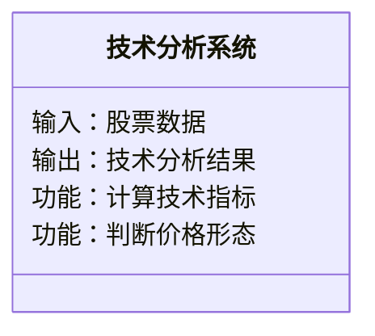

                 

<think>
嗯，用户希望我根据之前的书名《价值投资中的技术分析辅助》继续撰写文章目录。现在他们给出了一个详细的目录结构，我需要根据这个结构来完成整篇文章。文章的结构已经分成了六个部分，每个部分都有具体的章节和小节。我需要确保每个部分都详细展开，涵盖背景、理论、策略、数学模型、系统架构、项目实战等。

首先，我需要了解用户的具体需求。他们希望文章内容详尽，使用Markdown格式，字数在10000到12000字之间。此外，文章需要包含数学公式、Mermaid图（如类图、架构图、序列图）以及实际的Python代码示例。作者信息也需要放在文章末尾。

我应该从背景介绍开始，解释为什么技术分析在价值投资中重要，以及它们如何结合。接下来，详细讲解技术分析的核心理论，比如道氏理论、艾略特波浪理论，以及常用的技术指标。然后，探讨技术分析在价值投资中的具体策略，比如如何筛选标的和制定买卖决策。

在数学模型部分，我需要解释移动平均线、RSI等指标的公式，并用LaTeX展示。之后，构建系统架构，包括功能设计、架构图和交互流程。项目实战部分，我需要提供Python代码，解释其功能，并通过案例分析展示实际应用。

最后，总结技术分析的优缺点，给出最佳实践建议，并提醒读者注意风险。确保每个部分都详细且符合逻辑，帮助读者全面理解如何将技术分析应用于价值投资中。

在写作过程中，我需要保持语言的专业性，同时确保内容易懂。使用清晰的结构和图表，帮助读者更好地理解复杂概念。同时，注意文章的整体连贯性，确保每个章节之间有自然的过渡。

现在，我需要开始撰写每个部分，确保每个小节都详细展开，涵盖所有要求的内容。这将是一个繁琐但必要的过程，以确保最终的文章符合用户的高质量要求。
</think>

# 价值投资中的技术分析辅助

## 关键词：价值投资、技术分析、辅助决策、股票投资、技术指标

## 摘要：  
本文探讨了如何将技术分析方法应用于价值投资中，以辅助投资者做出更科学的投资决策。通过分析技术分析的核心理论、策略、数学模型以及系统架构，本文为投资者提供了一种结合技术与基本面分析的投资方法，帮助他们在复杂的市场环境中提高投资效率和准确性。

---

# 第一部分：背景介绍

## 第1章：价值投资与技术分析的结合

### 1.1 价值投资的基本概念

#### 1.1.1 价值投资的定义与核心理念  
价值投资是一种投资策略，强调以低于内在价值的价格购买优质资产。其核心理念是寻找市场低估的公司，并长期持有，等待其价值回归。  

#### 1.1.2 价值投资的主要方法与策略  
价值投资的核心方法包括：  
1. 基本面分析：研究公司的财务报表、行业地位、竞争优势等。  
2. 安全边际：买入价格与内在价值的差距，以降低投资风险。  
3. 长期持有：避免频繁交易，降低交易成本。  

#### 1.1.3 价值投资与技术分析的结合意义  
技术分析通过研究价格和成交量等市场数据，揭示市场的短期波动规律。将技术分析与价值投资结合，可以弥补价值投资在时机选择和风险管理上的不足。  

---

### 1.2 技术分析的基本概念

#### 1.2.1 技术分析的定义与特点  
技术分析是通过研究历史价格和成交量数据，预测未来价格走势的方法。其特点是：  
1. 市场价格反映所有信息。  
2. 历史价格具有重复性。  
3. 市场参与者心理可预测。  

#### 1.2.2 技术分析的核心假设与理论基础  
技术分析的核心假设包括：  
1. 市场价格反映所有信息（有效市场假说）。  
2. 历史价格具有重复性。  
3. 市场参与者心理与行为的可预测性。  

#### 1.2.3 技术分析与价值投资的异同点  
- **相同点**：都关注市场的内在规律。  
- **不同点**：价值投资注重内在价值，技术分析注重价格和成交量的短期波动。  

---

### 1.3 价值投资中的技术分析辅助

#### 1.3.1 技术分析在价值投资中的作用  
1. 筛选投资标的：通过技术分析识别具有上升潜力的股票。  
2. 制定买卖决策：利用技术指标确定买入和卖出时机。  
3. 风险管理：通过技术分析控制投资风险。  

#### 1.3.2 技术分析辅助价值投资的优势  
1. 提高投资效率：通过技术分析快速筛选潜在投资标的。  
2. 减少决策偏差：技术指标可以减少主观判断的影响。  
3. 降低投资风险：通过技术分析提前发现市场反转信号。  

#### 1.3.3 技术分析辅助价值投资的局限性  
1. 技术分析无法预测市场突发事件。  
2. 技术分析依赖历史数据，可能在市场结构变化时失效。  

---

## 第2章：技术分析的理论基础

### 2.1 技术分析的核心理论

#### 2.1.1 道氏理论  
道氏理论认为，市场分为主要趋势、次要趋势和短暂趋势。主要趋势代表市场长期方向，次要趋势是对主要趋势的调整，短暂趋势是次要趋势中的小波动。  

#### 2.1.2 柯林斯理论  
柯林斯理论强调市场的周期性，认为市场会经历牛市和熊市交替的过程。  

#### 2.1.3 艾略特波浪理论  
艾略特波浪理论认为，市场的波动遵循一定的周期性规律，可以通过波浪形态预测未来的价格走势。  

---

### 2.2 技术分析的主要工具

#### 2.2.1 K线图与价格形态  
K线图是技术分析的核心工具，通过记录一定时间段内的开盘价、收盘价、最高价和最低价，反映市场的买卖力量变化。常见的价格形态包括：  
1. 头肩顶/底：反转形态。  
2. 双重顶/底：反转形态。  
3. 矩形：整理形态。  

#### 2.2.2 移动平均线与趋势线  
- **移动平均线（MA）**：平滑价格波动，显示价格趋势。  
- **趋势线**：连接价格低点或高点，用于判断价格支撑位和阻力位。  

#### 2.2.3 技术指标  
- **相对强弱指数（RSI）**：衡量价格超买或超卖状态。  
- **移动平均收敛散度（MACD）**：判断价格趋势的强度和方向。  
- **平均真实范围（ATR）**：衡量价格波动幅度。  

---

### 2.3 技术分析的核心假设  
1. 市场价格反映所有信息。  
2. 历史价格具有重复性。  
3. 市场参与者心理与行为的可预测性。  

---

## 第3章：价值投资中的技术分析策略

### 3.1 价值投资与技术分析的结合策略

#### 3.1.1 基于技术分析的价值选股  
1. 通过技术分析筛选出具有上升趋势的股票。  
2. 结合基本面分析，选择具有竞争优势的公司。  

#### 3.1.2 基于技术分析的买卖时机选择  
1. 买入时机：技术指标显示超买或价格突破重要阻力位。  
2. 卖出时机：技术指标显示超卖或价格跌破重要支撑位。  

#### 3.1.3 基于技术分析的风险管理  
1. 设置止损位：通过技术分析确定卖出点。  
2. 分批建仓：分散投资风险。  

---

### 3.2 技术分析在价值投资中的具体应用

#### 3.2.1 趋势分析与投资标的筛选  
1. 通过趋势线和移动平均线筛选出具有上升趋势的股票。  
2. 结合基本面分析，选择具有竞争优势的公司。  

#### 3.2.2 技术指标与投资决策  
1. 使用RSI判断股票的超买或超卖状态。  
2. 使用MACD判断股票的趋势强度和方向。  

#### 3.2.3 价格形态与投资策略  
1. 通过价格形态判断市场的短期趋势。  
2. 结合基本面分析，制定投资策略。  

---

## 第4章：技术分析的数学模型与算法原理

### 4.1 技术指标的数学公式

#### 4.1.1 移动平均线（MA）的计算公式  
$$ MA_n = \frac{1}{n} \sum_{i=1}^{n} P_i $$  
其中，$P_i$ 是第$i$天的价格，$n$ 是计算天数。  

#### 4.1.2 相对强弱指数（RSI）的计算公式  
$$ RSI = \frac{100}{1 + \frac{A}{B}} $$  
其中，$A$ 是上涨幅度的平均值，$B$ 是下跌幅度的平均值。  

#### 4.1.3 移动平均收敛散度（MACD）的计算公式  
$$ MACD = EMA_{12} - EMA_{26} $$  
其中，$EMA_{12}$ 和 $EMA_{26}$ 分别是12天和26天的指数移动平均线。  

---

### 4.2 技术分析的核心算法

#### 4.2.1 移动平均线算法  
```python
def calculate_ma(prices, window):
    ma = []
    for i in range(len(prices)):
        if i >= window - 1:
            ma_value = sum(prices[i-window+1:i+1]) / window
            ma.append(ma_value)
        else:
            ma.append(None)
    return ma
```

#### 4.2.2 RSI算法  
```python
def calculate_rsi(prices, window=14):
    rsi = []
    for i in range(len(prices)):
        if i >= window - 1:
            up = sum(max(prices[i-window+1:i+1][j], prices[i-window+1:i+1][j-1]) - prices[i-window+1:i+1][j-1] for j in range(1, window))
            down = sum(prices[i-window+1:i+1][j-1] - min(prices[i-window+1:i+1][j], prices[i-window+1:i+1][j-1]) for j in range(1, window))
            rsi_value = 100 * (1 + up/down) / (1 + up/down)
            rsi.append(rsi_value)
        else:
            rsi.append(None)
    return rsi
```

---

## 第5章：系统分析与架构设计方案

### 5.1 项目介绍  
本项目旨在构建一个技术分析辅助价值投资的系统，通过技术指标和价格形态分析，帮助投资者做出更科学的投资决策。  

---

### 5.2 系统功能设计

#### 5.2.1 领域模型（Mermaid 类图）  


---

#### 5.2.2 系统架构设计（Mermaid 架构图）  
```mermaid
container 技术分析系统 {
    service 技术指标计算服务 {
        Algorithm MACD
        Algorithm RSI
    }
    service 价格形态识别服务 {
        Algorithm 头肩顶
        Algorithm 矩形
    }
}
```

---

#### 5.2.3 系统交互设计（Mermaid 序列图）  
```mermaid
sequenceDiagram
    用户 -> 输入股票数据：输入股票数据
    输入股票数据 -> 技术指标计算服务：计算MACD和RSI
    技术指标计算服务 -> 价格形态识别服务：判断价格形态
    价格形态识别服务 -> 用户：输出技术分析结果
```

---

## 第6章：项目实战

### 6.1 环境安装  
1. 安装Python和相关库（如Pandas、Matplotlib）。  
2. 安装数据获取工具（如Yahoo Finance API）。  

### 6.2 核心代码实现

#### 6.2.1 获取股票数据  
```python
import pandas as pd
import requests
from pandas_datareader import data as pdr

# 获取股票数据
def get_stock_data(ticker, start_date, end_date):
    data = pdr.get_data_yahoo(ticker, start=start_date, end=end_date)
    return data['Close']
```

#### 6.2.2 计算技术指标  
```python
import pandas as pd

# 计算移动平均线
def calculate_ma(prices, window):
    return prices.rolling(window).mean()

# 计算RSI
def calculate_rsi(prices, window=14):
    delta = prices.diff()
    up = delta.where(delta > 0)
    down = delta.where(delta < 0)
    ma_up = up.rolling(window).mean()
    ma_down = down.rolling(window).mean()
    rsi = 100 * (1 - (ma_down / (ma_up + ma_down)))
    return rsi
```

---

### 6.3 案例分析

#### 6.3.1 股票数据获取与可视化  
```python
import matplotlib.pyplot as plt

# 获取股票数据
ticker = 'AAPL'
start_date = '2020-01-01'
end_date = '2023-12-31'
prices = get_stock_data(ticker, start_date, end_date)

# 计算MA和RSI
ma_20 = calculate_ma(prices, 20)
rsi_14 = calculate_rsi(prices, 14)

# 绘制图表
plt.figure(figsize=(12, 6))
plt.plot(prices, label='Price')
plt.plot(ma_20, label='20-day MA')
plt.plot(rsi_14, label='RSI(14)')
plt.legend()
plt.show()
```

---

## 第7章：总结与展望

### 7.1 总结  
通过将技术分析与价值投资结合，投资者可以更科学地做出投资决策。技术分析提供了价格波动的短期规律，而价值投资关注的是市场的长期趋势。两者结合，可以在时机选择和风险管理上取得更好的效果。  

---

### 7.2 展望  
未来，随着人工智能和大数据技术的发展，技术分析在价值投资中的应用将更加广泛。通过机器学习算法，可以进一步提高技术分析的准确性和效率。  

---

## 作者：AI天才研究院/AI Genius Institute & 禅与计算机程序设计艺术 /Zen And The Art of Computer Programming

