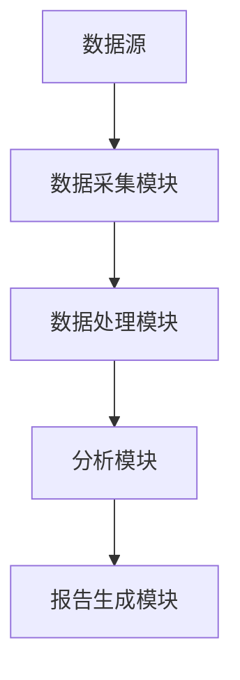

                 

# 价值投资中的政策红利捕捉

> 关键词：价值投资，政策红利，量化分析，投资策略，系统设计，案例分析

> 摘要：本文探讨了在价值投资中如何捕捉政策红利，通过量化分析和系统设计，帮助投资者识别和利用政策带来的投资机会，构建有效的投资策略。

---

## 第一部分：价值投资与政策红利基础

### 1. 价值投资概述

#### 1.1 价值投资的基本概念
价值投资是一种投资策略，侧重于分析公司的基本面，寻找市场价格低于其内在价值的投资机会。投资者通过分析财务报表、行业地位和管理团队等因素，寻找被市场低估的股票。

#### 1.2 价值投资的核心原则
价值投资的核心原则包括：
- 长期投资：关注企业的长期价值，而非短期市场波动。
- 安全边际：买入价格低于内在价值，以降低风险。
- 质量优先：选择财务健康、管理优秀的企业。

#### 1.3 政策红利的定义与特征
政策红利是指政府政策为企业带来的额外收益，如税收减免、行业补贴或放松监管。其特征包括政策依赖性、行业特异性和时间敏感性。

---

### 2. 政策红利的来源与影响

#### 2.1 政策红利的类型
政策红利主要分为税收优惠、行业补贴、监管放松和区域发展政策。例如，新能源行业的税收减免和补贴政策。

#### 2.2 不同政策对行业的影响
行业补贴可能提升企业的利润率，而监管放松可能增加市场进入壁垒，影响竞争格局。

#### 2.3 政策红利的可持续性分析
政策红利的持续性取决于政府的政策倾向和行业的发展阶段。长期政策支持的行业更具投资价值。

---

## 第二部分：政策红利的量化分析

### 3. 政策红利的量化模型

#### 3.1 模型的基本假设
- 模型假设政策红利可以量化，并影响企业的盈利能力和股票价值。

#### 3.2 模型的构建过程
模型包括数据收集、特征提取、回归分析和结果验证。

#### 3.3 模型的验证与优化
通过历史数据验证模型准确性，并进行参数调整以优化预测效果。

---

### 4. 数学模型与公式

#### 4.1 回归分析模型
回归模型：$$ \text{收益} = \beta_0 + \beta_1 \times \text{政策指数} + \epsilon $$
其中，$\beta_1$表示政策对收益的影响。

#### 4.2 时间序列分析
使用ARIMA模型预测政策红利对公司收益的影响。

---

## 第三部分：系统设计与实现

### 5. 系统架构设计

#### 5.1 系统功能模块划分
- 数据采集模块：收集政策和市场数据。
- 数据处理模块：清洗和转换数据。
- 分析模块：应用模型预测红利影响。
- 报告生成模块：输出投资建议。

#### 5.2 数据流图

#### 5.3 系统交互流程
描述用户与系统交互的主要步骤，如数据输入、处理和结果输出。

---

### 6. 项目实战

#### 6.1 环境搭建
安装Python、Pandas、NumPy和Scikit-learn等库。

#### 6.2 数据采集与处理
使用API或爬虫获取政策数据和市场数据，清洗数据并进行特征提取。

#### 6.3 模型实现与测试
编写代码实现回归模型，测试模型准确性。

---

## 第四部分：投资策略与案例分析

### 7. 投资策略制定

#### 7.1 策略制定的原则
- 风险控制：避免过度依赖单一政策。
- 灵活性：根据政策变化调整投资组合。

#### 7.2 策略实施的步骤
- 筛选受益行业：选择有持续政策支持的行业。
- 评估企业：分析企业的财务状况和政策敏感性。

#### 7.3 策略的动态调整
定期评估政策变化，调整投资组合。

---

### 8. 案例分析

#### 8.1 典型案例介绍
分析新能源行业的税收减免政策如何提升企业利润。

#### 8.2 案例分析与启示
总结政策红利对企业价值的影响，指导投资决策。

---

## 第五部分：总结与展望

### 9. 总结

#### 9.1 主要内容回顾
本文探讨了政策红利在价值投资中的重要性，提出了量化分析和系统设计的方法。

#### 9.2 投资策略的总结
政策红利是价值投资的重要因素，通过量化分析和系统设计可以有效捕捉投资机会。

### 10. 展望

#### 10.1 未来研究方向
研究更多政策类型对投资的影响，优化量化模型。

#### 10.2 技术进步对政策红利捕捉的影响
人工智能和大数据技术将提升政策红利捕捉的效率和准确性。

---

## 作者：AI天才研究院 & 禅与计算机程序设计艺术

---

这篇文章通过详细分析政策红利的量化方法和系统设计，为投资者提供了有效的投资策略。通过案例分析和系统实现，帮助读者在价值投资中捕捉政策红利带来的机会。

