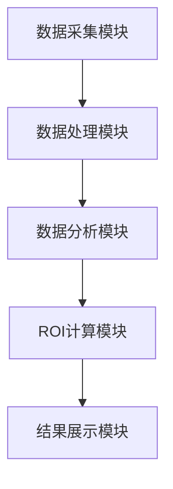

                 

<think>
好，我现在需要帮用户撰写一篇关于《价值投资中的数字化转型ROI分析》的技术博客文章。首先，我得理解用户的需求。用户希望文章结构清晰，内容专业，涵盖从背景到实战的各个方面。同时，文章需要用技术语言，但又要通俗易懂。

首先，我应该从文章的标题和摘要开始。标题已经确定，摘要需要简明扼要地概括文章的核心内容，即如何通过数字化转型和ROI分析来优化价值投资。

接下来，目录大纲已经给出，分为五个部分：背景与概念、核心概念与联系、算法原理、系统分析与架构、项目实战。每个部分都有具体的章节和子章节，确保内容全面。

在第一部分，我需要介绍价值投资和数字化转型的基本概念，以及ROI分析的重要性。这部分需要让读者明白什么是价值投资，什么是数字化转型，以及它们如何结合。

第二部分要深入探讨数字化转型与价值投资的核心概念，解释它们之间的联系，以及ROI分析在其中的作用。这部分可能需要一些对比表格和流程图来帮助理解。

第三部分是算法原理，我需要详细讲解ROI的计算公式，以及如何用Python代码实现这些分析。这部分可能需要使用一些数学公式和代码示例，确保读者能够理解并实际应用。

第四部分涉及系统架构设计，我需要画出模块化的架构图和数据流图，说明系统如何运作。这部分可能需要使用Mermaid图来展示架构和流程。

第五部分是项目实战，我需要提供一个具体的案例，从环境安装到代码实现，再到案例分析，一步步指导读者完成。这部分需要实际操作，确保读者能够跟着步骤进行分析。

最后，我需要总结全文，并给出一些最佳实践的建议，提醒读者在实际操作中需要注意的事项，以及推荐一些拓展阅读资料。

在写作过程中，我要确保每个部分都详细具体，同时语言要专业但易懂。数学公式要用LaTeX表示，代码部分要用Python实现，并附上注释以便读者理解。系统架构图和流程图要用Mermaid绘制，帮助读者直观理解。

总的来说，我需要一步步地分析每个部分，确保内容全面且逻辑清晰，最终写出一篇结构合理、内容丰富的技术博客文章。
</think>

# 价值投资中的数字化转型ROI分析

> **关键词**：价值投资，数字化转型，ROI分析，投资回报，数据分析

> **摘要**：本文探讨了在价值投资中如何通过数字化转型来优化投资回报（ROI）的分析方法。通过结合数字化工具和技术，分析投资项目的经济效益，帮助投资者做出更明智的决策。文章从理论到实践，详细阐述了数字化转型的核心概念、ROI分析的算法原理、系统架构设计以及实际案例分析。

---

## 第一部分：价值投资与数字化转型的背景与概念

### 第1章：价值投资与数字化转型的概述

#### 1.1 价值投资的核心概念
价值投资是一种以基本面分析为基础的投资策略，强调以低于内在价值的价格购买优质资产。其核心在于识别市场中的低估资产，并长期持有，等待其价值回归。

#### 1.2 数字化转型的定义与特征
数字化转型是指利用数字技术（如大数据、人工智能、云计算等）对传统业务进行改造和升级，以提升效率、降低成本、创造新价值。

#### 1.3 ROI分析的基本原理
ROI（Return on Investment，投资回报率）是衡量投资效益的重要指标，公式为：
$$ ROI = \frac{（净收益）}{投资成本} \times 100\% $$

---

## 第二部分：价值投资中的数字化转型核心概念与联系

### 第2章：数字化转型与价值投资的核心概念

#### 2.1 数字化转型的核心要素
- 数据驱动的决策：通过数据分析优化投资决策。
- 技术赋能的业务模式：利用技术提升投资效率。
- 数字化生态系统的构建：打造闭环的投资生态。

#### 2.2 价值投资中的数字化转型特征
- 数据分析在价值投资中的应用：通过大数据挖掘发现低估资产。
- 技术工具对投资决策的影响：量化分析工具辅助决策。
- 数字化转型对投资效率的提升：自动化数据处理与分析。

#### 2.3 ROI分析在数字化转型中的作用
- ROI分析作为数字化转型的评估标准。
- ROI与投资回报的关系：ROI高的项目更值得投资。
- ROI分析在价值投资中的具体应用：通过ROI筛选优质投资项目。

---

## 第三部分：数字化转型中的ROI分析算法原理

### 第3章：ROI分析的算法原理

#### 3.1 ROI分析的数学模型
ROI的计算公式：
$$ ROI = \frac{（净收益）}{投资成本} \times 100\% $$

净收益的计算公式：
$$ 净收益 = 总收益 - 投资成本 $$

#### 3.2 ROI分析的算法流程
1. 数据收集与处理：
   - 收集投资项目的收益和成本数据。
2. 数据分析与建模：
   - 使用统计分析或机器学习模型预测收益。
3. ROI计算与结果解读：
   - 计算ROI值并评估投资的经济效益。

#### 3.3 ROI分析的Python实现
```python
def calculate_roi(net_income, investment_cost):
    return (net_income / investment_cost) * 100

# 示例数据
net_income = 1000000
investment_cost = 800000

roi = calculate_roi(net_income, investment_cost)
print(f"ROI: {roi}%")
```

---

## 第四部分：系统分析与架构设计方案

### 第4章：数字化转型ROI分析的系统架构

#### 4.1 系统功能设计
- 数据采集模块：收集投资项目的收益和成本数据。
- 数据分析模块：对数据进行清洗、建模和预测。
- ROI计算模块：计算ROI值并生成报告。
- 结果展示模块：以可视化形式展示ROI分析结果。

#### 4.2 系统架构设计


#### 4.3 系统接口设计
- 数据接口规范：JSON格式接口。
- API设计与调用：RESTful API实现模块间通信。

---

## 第五部分：项目实战与案例分析

### 第5章：数字化转型ROI分析的项目实战

#### 5.1 环境安装与配置
- Python环境搭建：使用Anaconda或virtualenv。
- 数据分析工具安装：安装Pandas、NumPy、Matplotlib。

#### 5.2 核心代码实现
```python
import pandas as pd
import matplotlib.pyplot as plt

# 数据处理
data = pd.DataFrame({
    '项目': ['项目A', '项目B', '项目C'],
    '净收益': [1000000, 800000, 1200000],
    '投资成本': [800000, 600000, 900000]
})

# ROI计算
data['ROI'] = data.apply(lambda x: (x['净收益'] / x['投资成本']) * 100, axis=1)

# 可视化
plt.figure(figsize=(10, 6))
plt.bar(data['项目'], data['ROI'], label='ROI')
plt.xlabel('项目')
plt.ylabel('ROI (%)')
plt.legend()
plt.show()
```

#### 5.3 案例分析与解读
- 案例背景：某投资公司计划投资三个项目，需通过ROI分析选择最优项目。
- 数据分析：通过Python代码计算三个项目的ROI。
- ROI结果解读：项目C的ROI最高，值得投资。

---

## 总结

本文通过理论与实践相结合的方式，详细探讨了价值投资中的数字化转型ROI分析方法。通过数字化技术的应用，投资者可以更高效地评估投资项目，优化投资决策。未来，随着技术的不断发展，ROI分析在价值投资中的应用将更加广泛和深入。

---

**作者：AI天才研究院/AI Genius Institute & 禅与计算机程序设计艺术 /Zen And The Art of Computer Programming**

