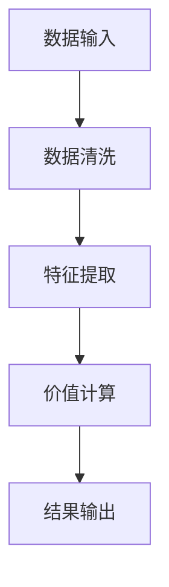

                 

# 价值投资中的数据资产评估

> 关键词：数据资产评估，价值投资，数据价值，数据质量，数据安全

> 摘要：数据资产评估是价值投资中的关键环节，本文从背景、概念、数学模型、系统架构到项目实战，全面解析数据资产评估的全过程，帮助投资者科学评估数据资产的价值。

---

## 第一部分：数据资产评估的背景与重要性

### 第1章：数据资产评估的背景与重要性

#### 1.1 数据资产评估的背景
- 数据作为新时代的重要资产，其价值在价值投资中占据越来越重要的地位。数据资产评估是理解数据资产价值的基础。
- 数据资产评估的定义：通过对数据的完整性、准确性和可用性进行评估，确定其在特定场景下的经济价值。

#### 1.2 数据资产评估的重要性
- 数据资产评估是价值投资中的核心步骤，决定了投资决策的科学性和准确性。
- 数据资产评估的边界与外延：明确数据资产的范围，包括结构化数据和非结构化数据，以及数据的生命周期。

---

## 第二部分：数据资产评估的核心概念

### 第2章：数据资产评估的核心要素

#### 2.1 数据资产评估的核心要素
- 数据的完整性：数据是否覆盖了所有必要信息。
- 数据的准确性：数据是否反映了真实情况。
- 数据的可操作性：数据是否易于处理和分析。
- 数据的可扩展性：数据是否能够支持未来的扩展需求。

#### 2.2 数据资产评估的核心步骤
- 数据的收集与整理：通过数据清洗和预处理，确保数据的干净和一致性。
- 数据的质量评估：通过质量指标（完整性、准确性、一致性）对数据进行评分。
- 数据的价值量化：通过加权平均等方法计算数据的价值。

### 第3章：数据资产评估的数学模型与算法

#### 3.1 数据资产评估的数学模型
- 加权平均模型：
$$ V = \sum_{i=1}^{n} w_i x_i $$
其中，\( V \) 表示数据的价值，\( w_i \) 表示第 \( i \) 个特征的权重，\( x_i \) 表示第 \( i \) 个特征的值。

#### 3.2 数据资产评估的算法实现
- 数据清洗与预处理：使用Python的pandas库进行数据清洗。
- 数据特征提取：使用机器学习算法提取关键特征。
- 数据价值计算：通过模型计算数据的价值评分。

### 第4章：数据资产评估的系统架构设计

#### 4.1 数据资产评估系统概述
- 系统目标：提供数据资产评估的完整解决方案。
- 系统功能模块：数据输入、数据清洗、特征提取、价值计算、结果输出。

#### 4.2 数据资产评估系统的架构图

---

## 第三部分：数据资产评估的项目实战

### 第5章：数据资产评估的项目实战

#### 5.1 项目背景与目标
- 项目背景：某金融公司希望通过数据资产评估来优化其投资策略。
- 项目目标：评估客户数据的价值，为投资决策提供支持。

#### 5.2 项目实施步骤
1. 数据收集：收集客户的基本信息和交易记录。
2. 数据清洗：去除重复和错误数据。
3. 数据特征提取：提取关键特征，如客户活跃度、交易频率等。
4. 数据价值计算：使用加权平均模型计算数据价值。

#### 5.3 项目成果
- 数据价值评分：客户数据价值分为高、中、低三个等级。
- 投资决策优化：基于数据价值评分调整投资策略。

---

## 第四部分：总结与最佳实践

### 第6章：总结与最佳实践

#### 6.1 总结
- 数据资产评估是价值投资中的关键环节。
- 通过科学的方法和工具，可以有效评估数据资产的价值。

#### 6.2 最佳实践
- 数据资产评估需要结合具体业务场景。
- 数据安全和隐私保护是数据资产评估的重要考虑因素。

---

## 作者：AI天才研究院/AI Genius Institute & 禅与计算机程序设计艺术 /Zen And The Art of Computer Programming

