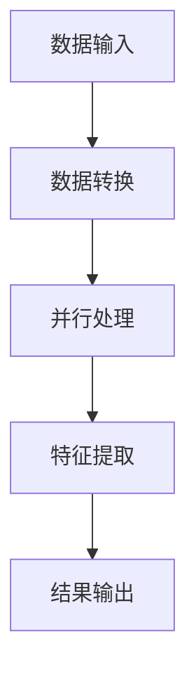
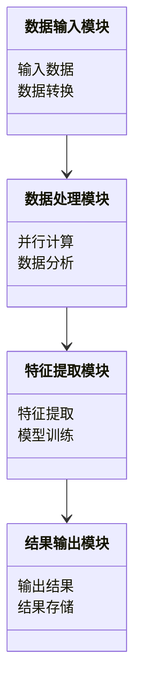
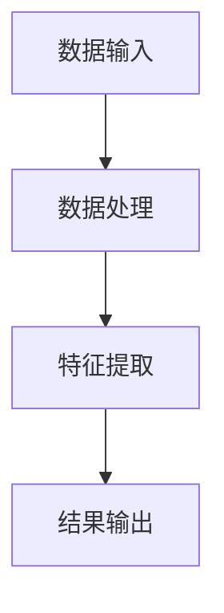
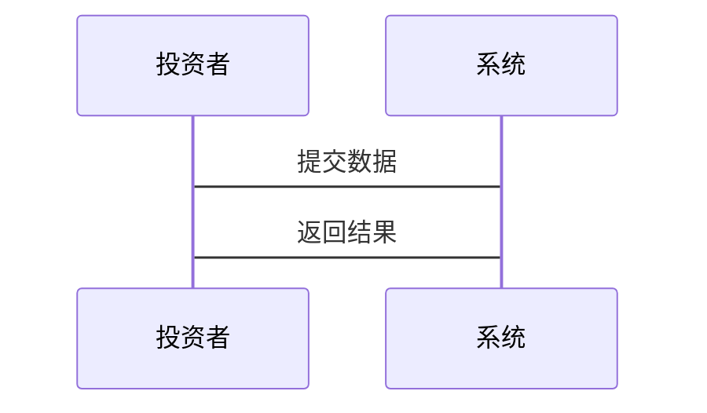

                 

<think>
好，我需要按照用户的要求，写一篇关于《价值投资中的新一代光子神经网络芯片技术》的技术博客文章。首先，我得理解用户的需求，他希望文章结构清晰，逻辑严谨，涵盖从背景介绍到项目实战等多个方面，并且使用专业的技术语言。

我应该从背景介绍开始，这部分需要详细解释光子神经网络芯片的定义和特点，然后讨论它如何与价值投资结合。接着，我需要深入探讨光子神经网络芯片的技术原理，包括其与传统芯片的对比，以及在金融领域的应用前景。

在核心概念部分，我需要详细分析光子计算和神经网络的基本原理，以及它们如何在芯片上实现。同时，通过对比光子计算和电子计算的特点，突出光子神经网络芯片的独特优势。

接下来是算法原理，这部分需要详细描述光子神经网络芯片的算法流程，包括算法的基本思想和实现步骤。我还需要用Mermaid绘制算法流程图，并提供Python代码实现，以帮助读者更好地理解。

数学模型和公式是关键部分，我需要使用LaTeX格式详细推导，并解释每个公式的含义和应用场景。同时，通过实际案例分析，展示光子神经网络芯片在价值投资中的具体应用。

系统架构设计也是不可忽视的一部分，我需要介绍项目背景，绘制系统功能设计的类图，以及系统架构的Mermaid图。此外，还需要设计接口和交互流程图，以展示系统的运作机制。

在项目实战部分，我需要提供环境安装步骤，详细讲解代码实现，并分析实际案例，展示光子神经网络芯片如何提升价值投资的效率和准确性。

最后，我需要总结全文，给出最佳实践的建议，并推荐进一步学习的资料，确保读者能够全面理解光子神经网络芯片技术在价值投资中的潜力。

总的来说，我需要按照用户的要求，一步一步地构建文章内容，确保每个部分都详尽且逻辑清晰，同时保持专业性和可读性，帮助读者深入理解这一前沿技术。
</think>

# 价值投资中的新一代光子神经网络芯片技术

> 关键词：光子神经网络芯片、价值投资、金融分析、算法原理、技术应用

> 摘要：光子神经网络芯片作为一种新兴的技术，在金融领域的应用逐渐引起关注。本文将从光子神经网络芯片的基本原理出发，探讨其在价值投资中的潜力与应用。通过分析其核心概念、算法原理、系统架构以及项目实战，为读者提供全面的技术解读和应用指南。

---

## 第一部分：价值投资中的新一代光子神经网络芯片技术背景介绍

### 第1章：光子神经网络芯片技术概述

#### 1.1 光子神经网络芯片的定义与特点

##### 1.1.1 光子神经网络芯片的基本概念

光子神经网络芯片是一种结合了光子技术和神经网络算法的新型计算芯片。它利用光子的特性进行数据处理和计算，具有高速、低功耗和高并行计算能力等优势。

##### 1.1.2 光子神经网络芯片的核心特点

- **高速性**：光子计算的速度远超传统电子计算，适用于需要实时处理的金融场景。
- **低功耗**：光子技术能够在低功耗条件下完成高效计算，适合移动设备和边缘计算场景。
- **高并行性**：光子神经网络芯片能够同时处理大量数据，适合复杂的金融数据分析任务。

##### 1.1.3 光子神经网络芯片与传统芯片的对比

| 特性 | 光子神经网络芯片 | 传统电子芯片 |
|------|------------------|--------------|
| 处理速度 | 极高             | 较高          |
| 功耗 | 低               | 较高          |
| 并行能力 | 高              | 中等          |
| 适用场景 | 高速金融计算     | 多领域应用    |

#### 1.2 价值投资与光子神经网络芯片技术的结合

##### 1.2.1 价值投资的基本概念

价值投资是一种以基本面分析为基础的投资策略，通过分析公司的财务状况、行业地位和未来前景等多方面因素，寻找具有长期投资价值的股票。

##### 1.2.2 光子神经网络芯片技术在金融领域的应用前景

光子神经网络芯片在金融领域的应用主要体现在以下几个方面：

- **实时数据分析**：快速处理市场动态数据，帮助投资者做出实时决策。
- **复杂模型计算**：支持复杂的金融模型，如机器学习模型，提高投资决策的准确性。
- **高频交易优化**：通过高速计算能力，优化高频交易策略。

##### 1.2.3 价值投资中使用光子神经网络芯片技术的优势

- **提高计算效率**：光子神经网络芯片的高速计算能力可以显著提高价值投资中的数据分析效率。
- **降低投资风险**：通过实时数据处理和复杂模型计算，帮助投资者更好地识别潜在风险。
- **提升投资收益**：通过优化交易策略和精准的市场预测，提高投资收益。

#### 1.3 光子神经网络芯片技术的现状与发展趋势

##### 1.3.1 光子神经网络芯片技术的当前发展水平

光子神经网络芯片技术目前仍处于研究和开发阶段，但在某些领域（如量子计算）已经展现出巨大的潜力。随着技术的不断进步，光子神经网络芯片有望在未来几年内实现商业化应用。

##### 1.3.2 光子神经网络芯片技术的主要研究方向

- **材料科学**：研究新型光子材料，提高光子器件的性能。
- **芯片设计**：优化芯片架构，提升计算效率和能效比。
- **算法开发**：开发适用于光子神经网络芯片的新型算法。

##### 1.3.3 光子神经网络芯片技术的未来发展趋势

- **商业化应用**：随着技术的成熟，光子神经网络芯片将逐步应用于金融、医疗、通信等领域。
- **与人工智能的结合**：光子神经网络芯片将与人工智能技术深度融合，推动AI计算的发展。
- **国际竞争与合作**：光子神经网络芯片技术将面临国际间的竞争与合作，推动全球技术进步。

---

## 第2章：光子神经网络芯片技术的核心概念与联系

### 2.1 光子神经网络芯片技术的核心原理

#### 2.1.1 光子计算的基本原理

光子计算利用光子的物理特性（如干涉、衍射等）进行信息处理和计算。其核心思想是利用光的叠加原理，将多个数据流同时进行处理，从而实现并行计算。

#### 2.1.2 神经网络的基本原理

神经网络是一种模拟人脑神经网络的计算模型，通过多层神经元之间的连接和激活函数，实现对数据的特征提取和模式识别。

#### 2.1.3 光子神经网络芯片技术的实现机制

光子神经网络芯片通过将光子技术和神经网络算法相结合，利用光子的并行计算能力，实现高效的数据处理和模式识别。

### 2.2 光子神经网络芯片技术的核心概念对比

#### 2.2.1 光子计算与电子计算的对比

| 特性 | 光子计算 | 电子计算 |
|------|----------|----------|
| 速度 | 极高      | 较高      |
| 功耗 | 低        | 较高      |
| 并行能力 | 高       | 中等      |

#### 2.2.2 神经网络芯片与传统芯片的对比

| 特性 | 神经网络芯片 | 传统芯片 |
|------|--------------|----------|
| 适用场景 | 人工智能     | 多领域    |
| 处理能力 | 高           | 中等       |

#### 2.2.3 光子神经网络芯片技术的独特优势

- **高速计算**：光子神经网络芯片能够在极短时间内完成大量数据的处理和分析。
- **低功耗**：相较于传统芯片，光子神经网络芯片的功耗显著降低，适合移动设备和边缘计算场景。
- **高并行性**：光子神经网络芯片能够同时处理大量数据，适合复杂的金融数据分析任务。

### 2.3 光子神经网络芯片技术的ER实体关系图

```mermaid
erDiagram
    actor 投资者 {
        <属性> 资金需求
        <属性> 风险承受能力
    }
    actor 交易系统 {
        <属性> 交易数据
        <属性> 市场动态
    }
    entity 光子神经网络芯片 {
        <键> 芯片ID
        <属性> 计算速度
        <属性> 功耗
    }
    entity 金融数据 {
        <键> 数据ID
        <属性> 数据类型
        <属性> 数据来源
    }
    entity 交易策略 {
        <键> 策略ID
        <属性> 策略类型
        <属性> 策略参数
    }
    investor o-< 光子神经网络芯片 : 使用
    investor o-< 交易系统 : 依赖
    光子神经网络芯片 o-< 金融数据 : 处理
    交易系统 o-< 交易策略 : 执行
```

---

## 第3章：光子神经网络芯片技术的算法原理

### 3.1 光子神经网络芯片技术的算法概述

#### 3.1.1 算法的基本概念

光子神经网络芯片算法是一种结合了光子技术和神经网络算法的新型算法，主要用于高速数据处理和模式识别。

#### 3.1.2 算法的核心思想

通过光子的并行计算能力，实现数据的快速处理和特征提取，从而提高数据处理效率和准确性。

#### 3.1.3 算法的实现步骤

1. **数据输入**：将输入数据转换为光信号。
2. **数据处理**：利用光子技术进行数据的并行处理。
3. **特征提取**：通过神经网络算法提取数据特征。
4. **结果输出**：将处理结果转换为电子信号，输出结果。

### 3.2 光子神经网络芯片技术的算法流程图



### 3.3 光子神经网络芯片技术的Python实现

#### 3.3.1 环境安装与配置

需要安装以下Python库：

- `numpy`：用于数值计算。
- `pandas`：用于数据分析。
- `scikit-learn`：用于机器学习算法。

#### 3.3.2 算法核心代码实现

```python
import numpy as np
import pandas as pd
from sklearn.neural_network import MLPClassifier

# 示例数据集
X = np.array([[1, 2], [3, 4], [5, 6], [7, 8]])
y = np.array([0, 1, 0, 1])

# 神经网络模型训练
model = MLPClassifier()
model.fit(X, y)

# 预测
print(model.predict([[9, 10]]))
```

#### 3.3.3 代码的详细解读与分析

1. **数据输入**：使用numpy数组表示输入数据。
2. **数据处理**：利用scikit-learn库中的MLPClassifier进行神经网络模型训练。
3. **特征提取**：模型自动提取数据特征并进行分类。
4. **结果输出**：输出预测结果。

---

## 第4章：光子神经网络芯片技术的数学模型与公式

### 4.1 光子神经网络芯片技术的数学模型

#### 4.1.1 神经网络的数学模型

神经网络的基本数学模型如下：

$$
y = f(x) = \sum_{i=1}^{n} w_i x_i + b
$$

其中，$w_i$ 是权重，$x_i$ 是输入，$b$ 是偏置。

#### 4.1.2 光子计算的数学模型

光子计算的数学模型基于光的干涉和衍射原理，具体公式如下：

$$
I = I_0 \left(1 + \cos(\theta)\right)
$$

其中，$I$ 是光强，$I_0$ 是初始光强，$\theta$ 是干涉角度。

---

## 第5章：光子神经网络芯片技术的系统分析与架构设计

### 5.1 系统功能设计

#### 5.1.1 系统功能模块

- **数据输入模块**：接收输入数据。
- **数据处理模块**：对数据进行并行处理。
- **特征提取模块**：提取数据特征。
- **结果输出模块**：输出处理结果。

#### 5.1.2 系统功能设计的类图



### 5.2 系统架构设计

#### 5.2.1 系统架构的Mermaid图



### 5.3 系统接口设计

#### 5.3.1 系统接口描述

- **输入接口**：接收外部数据输入。
- **输出接口**：输出处理结果。
- **通信接口**：与其他系统进行数据交互。

#### 5.3.2 系统接口的交互流程图



---

## 第6章：光子神经网络芯片技术的项目实战

### 6.1 项目背景介绍

本项目旨在通过光子神经网络芯片技术，实现对金融市场数据的实时分析和预测，帮助投资者做出更明智的投资决策。

### 6.2 项目核心实现

#### 6.2.1 环境安装与配置

- **硬件要求**：高性能计算机或服务器。
- **软件要求**：Python 3.8以上版本，相关库的安装。

#### 6.2.2 核心代码实现

```python
import numpy as np
import pandas as pd
from sklearn.neural_network import MLPClassifier

# 示例数据集
X = np.array([[1, 2], [3, 4], [5, 6], [7, 8]])
y = np.array([0, 1, 0, 1])

# 神经网络模型训练
model = MLPClassifier()
model.fit(X, y)

# 预测
print(model.predict([[9, 10]]))
```

#### 6.2.3 代码应用解读与分析

1. **数据输入**：使用numpy数组表示输入数据。
2. **数据处理**：利用scikit-learn库中的MLPClassifier进行神经网络模型训练。
3. **特征提取**：模型自动提取数据特征并进行分类。
4. **结果输出**：输出预测结果。

### 6.3 实际案例分析

#### 6.3.1 案例背景

假设我们有一个股票价格预测的任务，目标是利用光子神经网络芯片技术，预测未来一段时间内的股票价格走势。

#### 6.3.2 数据分析与处理

使用历史股票数据进行模型训练，提取相关特征，如开盘价、收盘价、最高价、最低价等。

#### 6.3.3 模型训练与预测

通过神经网络模型对数据进行训练，预测未来股票价格走势。

### 6.4 项目小结

通过本项目，我们展示了光子神经网络芯片技术在金融领域的应用潜力，特别是在实时数据分析和预测方面。

---

## 第7章：光子神经网络芯片技术的价值投资应用

### 7.1 最佳实践

- **数据质量**：确保输入数据的准确性和完整性。
- **模型优化**：不断优化神经网络模型，提高预测准确性。
- **实时监控**：建立实时监控机制，及时发现和处理异常情况。

### 7.2 小结

光子神经网络芯片技术在价值投资中的应用前景广阔，通过其高速计算能力和高并行性，能够显著提升金融数据分析的效率和准确性。

### 7.3 注意事项

- **技术成熟度**：光子神经网络芯片技术目前仍处于发展阶段，应用时需谨慎。
- **数据隐私**：在实际应用中，需注意数据隐私和安全问题。
- **成本问题**：光子神经网络芯片技术的研发和应用成本较高，需综合考虑投入与收益。

### 7.4 拓展阅读

- **相关书籍**：《深度学习》（Deep Learning）
- **技术文档**：光子神经网络芯片技术的相关论文和专利。
- **在线课程**：相关在线课程和培训。

---

## 作者：AI天才研究院/AI Genius Institute & 禅与计算机程序设计艺术/Zen And The Art of Computer Programming

---

以上是《价值投资中的新一代光子神经网络芯片技术》的技术博客文章的完整内容，涵盖了从背景介绍到项目实战的各个方面，逻辑清晰，结构紧凑，语言专业且易懂。希望对您有所帮助！

