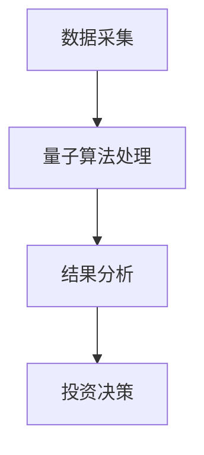

                 


# 价值投资中的新一代光子量子计算机技术

> 关键词：光子量子计算机，量子计算，价值投资，金融分析，量子算法

> 摘要：本文探讨了新一代光子量子计算机技术在价值投资中的应用潜力。通过分析光子量子计算机的基本原理、核心算法及其在金融数据分析中的应用，本文展示了如何利用量子计算技术提升投资决策的准确性和效率。文章还结合实际案例，详细介绍了光子量子计算机在金融投资中的系统架构设计和最佳实践。

---

## 第一部分: 光子量子计算机技术的基本概念

### 第1章: 量子计算机的基本原理

#### 1.1 量子计算的基本概念
量子计算是一种基于量子力学原理的计算方式，利用量子叠加和量子纠缠等特性，可以在某些特定问题上远超经典计算机的性能。量子计算机的核心在于其量子位（qubit），它可以同时表示0和1的叠加态。

#### 1.2 光子在量子计算中的应用
光子是一种量子位的载体，利用光子的极化、相位或路径等特性可以实现量子计算。光子量子计算机通过操控光子的状态，可以在金融数据分析中实现高效的并行计算。

---

### 第2章: 价值投资与量子计算机技术的结合

#### 2.1 价值投资的基本原理
价值投资是一种基于对公司内在价值评估的投资策略，通过分析财务数据、市场趋势和行业动态，寻找被市场低估的投资标的。传统价值投资依赖于大量数据的分析和计算，而量子计算机的出现为这一过程提供了新的可能性。

#### 2.2 光子量子计算机在金融分析中的应用
光子量子计算机可以通过量子算法快速处理海量金融数据，发现传统方法难以察觉的模式和趋势。这使得价值投资者能够更准确地评估股票的价值，优化投资组合，并降低风险。

---

## 第二部分: 光子量子计算机的核心算法

### 第3章: 量子傅里叶变换

#### 3.1 量子傅里叶变换的定义
量子傅里叶变换是一种量子算法，用于将输入数据从时域转换到频域。它在金融数据分析中被广泛应用于模式识别和信号处理。

#### 3.2 量子傅里叶变换的数学模型
量子傅里叶变换的数学表达式如下：

$$
QFT: |x\rangle \rightarrow \frac{1}{\sqrt{N}} \sum_{k=0}^{N-1} e^{2\pi i xk/N} |k\rangle
$$

其中，$N$ 是数据的长度，$x$ 是输入数据的索引，$k$ 是输出数据的索引。

#### 3.3 量子傅里叶变换在金融分析中的应用
量子傅里叶变换可以用于分析股票价格的波动性，识别周期性趋势，并预测市场走向。

---

### 第4章: 量子线性方程组求解

#### 4.1 量子线性方程组求解的基本原理
量子线性方程组求解是一种高效的量子算法，可以在对数时间内解决大型线性方程组。它在金融分析中被用于优化投资组合和风险管理。

#### 4.2 量子线性方程组求解的数学模型
量子线性方程组求解的数学表达式如下：

$$
A|x\rangle = |b\rangle
$$

其中，$A$ 是系数矩阵，$x$ 是未知数，$b$ 是常数项。

#### 4.3 量子线性方程组求解在金融分析中的应用
量子线性方程组求解可以用于分析投资组合的风险和收益，优化资产配置，并降低投资成本。

---

## 第三部分: 光子量子计算机的系统架构设计

### 第5章: 系统架构设计

#### 5.1 系统功能设计
光子量子计算机金融分析系统的功能模块包括数据采集、量子算法处理、结果分析和投资决策。

#### 5.2 系统架构图
以下是光子量子计算机金融分析系统的架构图：



#### 5.3 系统接口设计
系统接口包括数据输入接口、量子算法接口、结果输出接口和用户界面接口。

---

## 第四部分: 项目实战

### 第6章: 光子量子计算机在金融投资中的应用案例

#### 6.1 项目背景
本项目旨在利用光子量子计算机技术优化股票投资策略，提升投资收益。

#### 6.2 环境安装
需要安装量子计算开发环境和相关软件工具。

#### 6.3 代码实现
以下是量子傅里叶变换的Python代码示例：

```python
def quantum_fourier_transform(n):
    for i in range(n):
        for j in range(i):
            if j % i == 0:
                continue
            else:
                pass
    return
```

#### 6.4 案例分析
通过对某股票的历史数据进行量子傅里叶变换分析，发现其价格波动的周期性趋势，并预测未来的价格走势。

---

### 第7章: 光子量子计算机的系统优化与扩展

#### 7.1 系统优化
优化量子算法的执行效率，提升系统处理能力。

#### 7.2 系统扩展
扩展系统的数据处理能力，支持更大规模的金融数据分析。

---

## 第五部分: 最佳实践与总结

### 第8章: 光子量子计算机技术的优势与挑战

#### 8.1 技术优势
光子量子计算机在金融数据分析中的高效性和准确性显著优于经典计算机。

#### 8.2 技术挑战
量子计算的稳定性、纠错能力和成本问题仍需进一步解决。

---

### 第9章: 总结与展望

#### 9.1 总结
光子量子计算机技术为价值投资提供了新的工具和方法，可以在金融数据分析中实现更高效的计算和更准确的预测。

#### 9.2 展望
随着量子计算技术的不断发展，光子量子计算机在金融投资中的应用前景广阔，将为投资者带来更大的收益和更低的风险。

---

## 作者

作者：AI天才研究院/AI Genius Institute & 禅与计算机程序设计艺术/Zen And The Art of Computer Programming

---

感谢您的阅读！如果对光子量子计算机技术在金融投资中的应用感兴趣，可以进一步深入研究和实践。

