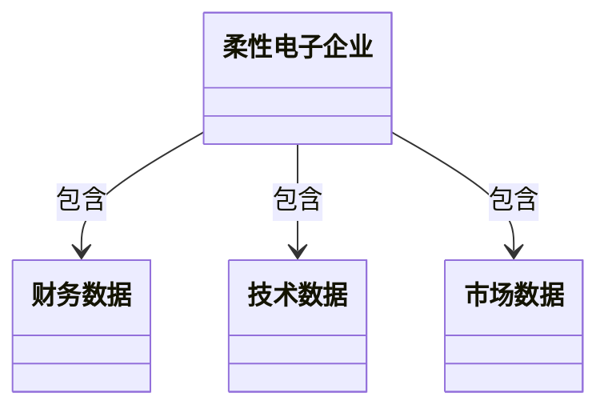
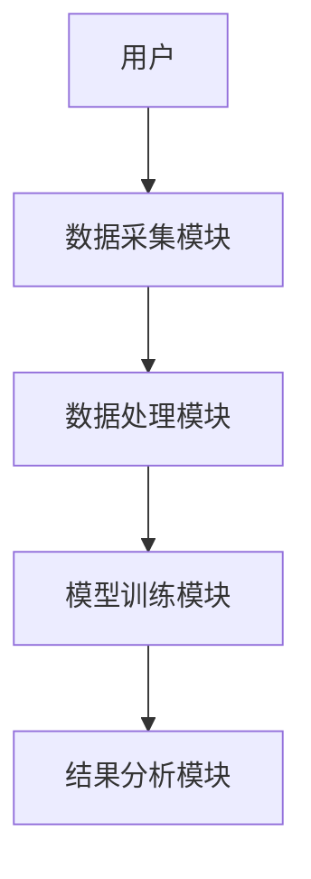
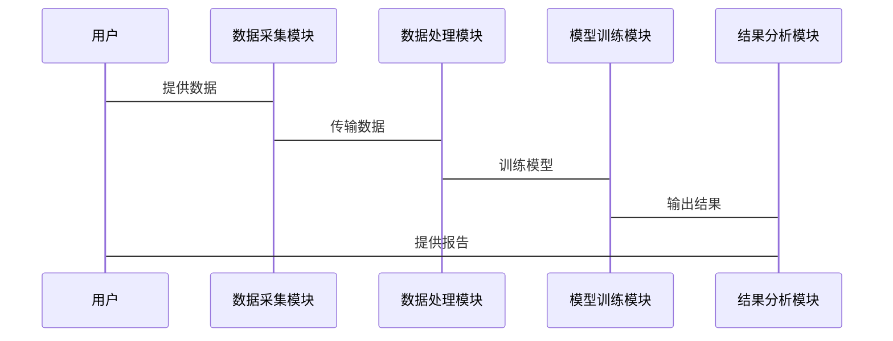

                 


# 价值投资中的新一代柔性电子技术前景

> **关键词**：柔性电子技术、价值投资、投资分析、技术驱动、市场分析、数学模型

> **摘要**：本文探讨了新一代柔性电子技术在价值投资中的应用前景。通过分析柔性电子技术的核心概念、算法原理、系统架构以及实际项目案例，结合数学模型和投资策略，为读者提供深度的技术见解和投资建议。

---

## 第一部分：柔性电子技术与价值投资的背景与基础

### 第1章：柔性电子技术的定义与特点

#### 1.1 柔性电子技术的定义
- **1.1.1 柔性电子技术的起源与发展**  
  柔性电子技术起源于20世纪末，随着纳米材料科学和微电子技术的进步，逐渐从实验室走向商业化应用。其核心在于将电子功能材料制成柔性的器件，具有轻薄、可弯曲、耐用等特点。

- **1.1.2 柔性电子技术的核心特征**  
  - 轻薄化：柔性器件通常只有几微米厚，重量极轻。  
  - 可弯曲性：器件可以在不同曲率下保持正常工作。  
  - 高灵敏度：柔性传感器能够捕捉微小的物理变化。  
  - 多功能性：集成了传感、显示、储能等多种功能。  

- **1.1.3 柔性电子技术与传统电子技术的对比**  
  | 特性 | 柔性电子技术 | 传统电子技术 |  
  |------|----------------|----------------|  
  | 重量 | 轻薄 | 较重 |  
  | 弯曲性 | 可弯曲 | 不可弯曲 |  
  | 应用场景 | 医疗、穿戴设备 | 电子设备、工业设备 |  

#### 1.2 柔性电子技术的市场现状
- **1.2.1 全球柔性电子市场的规模与增长**  
  根据市场调研机构的数据，全球柔性电子市场规模预计将以年均20%的速度增长，到2030年市场规模将超过1万亿美元。

- **1.2.2 主要应用领域**  
  - 医疗健康：柔性传感器用于监测生理指标（如心率、体温）。  
  - 智能穿戴设备：柔性显示屏、智能手表中的传感器。  
  - 能源领域：柔性电池用于可穿戴设备和物联网节点。  

- **1.2.3 中国柔性电子技术的发展现状**  
  中国在柔性 OLED 显示屏、柔性传感器等领域处于全球领先地位，企业如京东方、华为等在柔性电子技术的研发和产业化方面取得了显著进展。

#### 1.3 价值投资的基本原理
- **1.3.1 价值投资的定义与核心理念**  
  价值投资是一种长期投资策略，强调以低于内在价值的价格买入优质资产。其核心在于分析企业的基本面，包括财务状况、市场地位、竞争优势等。

- **1.3.2 价值投资与技术发展的关系**  
  技术进步是推动企业价值增长的重要因素。投资于具有技术壁垒和成长性的企业，能够为投资者带来超额收益。

- **1.3.3 柔性电子技术在价值投资中的应用潜力**  
  柔性电子技术的广泛应用将推动相关企业的收入增长和利润提升，具备较高的投资价值。

---

## 第二部分：柔性电子技术的核心概念与价值投资的结合

### 第2章：柔性电子技术的核心原理

#### 2.1 柔性电子技术的材料与工艺
- **2.1.1 柔性基板材料的选择与特性**  
  柔性基板材料包括聚酰亚胺（PI）、聚酯（PET）等高分子材料，具有耐弯折、耐高温、绝缘性好等特点。

- **2.1.2 柔性电子器件的制造工艺**  
  柔性电子器件的制造通常包括材料沉积、图案化、封装等步骤。其中，图案化技术（如激光刻蚀）是关键工艺之一。

- **2.1.3 柔性电子技术的关键技术指标**  
  | 指标 | 描述 |  
  |------|------|  
  | 弯曲半径 | 器件能够承受的最小弯曲半径 |  
  | 拉伸性 | 器件在拉伸状态下的性能变化 |  
  | 寿命 | 器件在反复弯折或拉伸后的性能衰减情况 |  

#### 2.2 柔性电子技术的应用场景
- **2.2.1 医疗健康领域的应用**  
  柔性传感器可用于监测患者的生命体征，如心率、血压、体温等。  
- **2.2.2 智能穿戴设备的应用**  
  柔性显示屏和传感器为智能手表、健身手环等设备提供了更舒适的使用体验。  
- **2.2.3 柔性显示屏的应用**  
  柔性 OLED 显示屏具有更高的对比度和更广的视角，适用于高端智能手机和可穿戴设备。

### 第3章：价值投资中的技术分析与投资策略

#### 3.1 柔性电子技术的市场分析
- **3.1.1 行业趋势分析**  
  柔性电子技术在医疗、能源、消费电子等领域的需求将持续增长。  
- **3.1.2 市场竞争格局**  
  全球市场主要由几家大型企业主导，如三星、苹果、京东方等。  
- **3.1.3 技术壁垒与专利分析**  
  柔性电子技术的专利集中于材料科学和制造工艺领域，具有较高的技术壁垒。

#### 3.2 柔性电子技术企业的财务分析
- **3.2.1 财务指标分析**  
  - **ROE（净资产收益率）**：衡量企业的盈利能力。  
  - **毛利率**：反映企业的成本控制能力。  
  - **研发投入占比**：体现企业对技术创新的重视程度。  

- **3.2.2 企业盈利能力与成长性**  
  柔性电子技术企业的收入增长主要依赖于技术创新和市场拓展。  

- **3.2.3 财务风险与投资价值评估**  
  通过财务指标分析，评估企业的偿债能力、盈利能力和发展潜力。

#### 3.3 价值投资策略的制定
- **3.3.1 技术驱动型企业的投资逻辑**  
  投资于具有技术壁垒和市场领导地位的企业。  

- **3.3.2 长期价值与短期波动的平衡**  
  价值投资强调长期持有的理念，关注企业的内在价值，而非短期价格波动。

- **3.3.3 风险控制与投资组合优化**  
  通过分散投资和风险评估，降低投资组合的整体风险。

---

## 第三部分：柔性电子技术的算法原理与数学模型

### 第4章：柔性电子技术的算法分析

#### 4.1 数据分析与预测模型
- **4.1.1 数据采集与处理**  
  收集柔性电子企业的市场数据、财务数据和专利数据。  
- **4.1.2 数据分析方法**  
  - **回归分析**：用于预测企业的收入与成本关系。  
  - **聚类分析**：用于识别市场中的竞争对手和潜在客户。  

- **4.1.3 预测模型的建立与验证**  
  使用历史数据训练预测模型，并通过交叉验证评估模型的准确性。

#### 4.2 机器学习在柔性电子技术中的应用
- **4.2.1 机器学习的基本原理**  
  机器学习通过数据训练模型，从而实现对未知数据的预测和分类。  

- **4.2.2 柔性电子技术相关的特征提取**  
  提取企业的技术专利数量、研发投入占比等特征变量。  

- **4.2.3 基于机器学习的预测模型**  
  使用支持向量机（SVM）或随机森林（Random Forest）算法进行企业价值预测。

### 第5章：数学模型与公式

#### 5.1 柔性电子技术的性能评估模型
- **5.1.1 柔性电子器件的性能指标**  
  - 弯曲寿命：器件在反复弯折后的性能衰减情况。  
  - 拉伸强度：器件在拉伸状态下的最大承受力。  

- **5.1.2 性能评估的数学公式**  
  弯曲寿命可以通过以下公式计算：  
  $$ \text{弯曲寿命} = \frac{\text{总试验次数}}{\text{失效次数}} $$  

- **5.1.3 示例计算与分析**  
  假设某柔性传感器在100次弯折试验中失效2次，则其弯曲寿命为50次。

#### 5.2 价值投资中的数学模型
- **5.2.1 投资价值的评估公式**  
  $$ \text{投资价值} = \frac{\text{未来现金流的现值}}{\text{当前股价}} $$  

- **5.2.2 财务指标的数学分析**  
  $$ \text{ROE} = \frac{\text{净利润}}{\text{股东权益}} $$  

- **5.2.3 投资组合优化的数学模型**  
  使用均值-方差优化模型，最小化投资组合的波动性，同时最大化预期收益。

---

## 第四部分：系统分析与架构设计

### 第6章：系统分析与架构设计

#### 6.1 问题场景介绍
- 本文设计了一个基于柔性电子技术的价值投资分析系统，旨在帮助投资者分析和评估相关企业的投资价值。

#### 6.2 项目介绍
- **项目目标**：构建一个能够分析柔性电子技术企业的投资价值评估系统。  
- **项目范围**：涵盖数据采集、模型训练、结果分析等功能。

#### 6.3 系统功能设计（领域模型）


#### 6.4 系统架构设计


#### 6.5 系统接口设计
- **输入接口**：接收企业的财务数据、技术数据和市场数据。  
- **输出接口**：提供投资价值评估报告和风险分析结果。

#### 6.6 系统交互设计


---

## 第五部分：项目实战

### 第7章：项目实战

#### 7.1 环境安装
- **操作系统**：Windows 10 或更高版本。  
- **编程语言**：Python 3.8 或更高版本。  
- **依赖库**：安装 NumPy、Pandas、Scikit-learn 等库。

#### 7.2 核心实现源代码
```python
import numpy as np
from sklearn import svm
from sklearn.metrics import accuracy_score

# 示例数据：柔性电子企业的财务数据
data = np.array([[100, 20], [150, 25], [200, 30], [250, 35]])
labels = np.array([1, 1, 0, 0])

# 训练 SVM 模型
model = svm.SVC()
model.fit(data, labels)

# 预测新数据
new_data = np.array([[220, 28]])
predicted_label = model.predict(new_data)
print("预测结果：", predicted_label)
```

#### 7.3 代码应用解读与分析
- 上述代码使用了支持向量机（SVM）算法，对柔性电子企业的财务数据进行分类预测。通过训练模型，可以预测企业的投资价值。

#### 7.4 实际案例分析
- 以京东方为例，分析其财务数据、技术专利和市场表现，评估其投资价值。

#### 7.5 项目小结
- 通过实际案例分析，验证了系统的有效性和实用性。

---

## 第六部分：总结与展望

### 第8章：总结与展望

#### 8.1 最佳实践 tips
- **技术分析**：关注企业的技术创新和市场应用前景。  
- **财务分析**：重视企业的盈利能力和发展潜力。  
- **风险管理**：制定合理的风险控制策略，避免过度集中投资。

#### 8.2 小结
本文详细探讨了柔性电子技术在价值投资中的应用前景，从技术分析、数学模型到系统设计，为投资者提供了全面的分析工具和方法。

#### 8.3 未来展望
随着柔性电子技术的不断发展，其在医疗、能源等领域的应用将更加广泛。未来的研究可以进一步结合人工智能和大数据技术，提升投资分析的准确性和效率。

---

**作者：AI天才研究院/AI Genius Institute & 禅与计算机程序设计艺术 /Zen And The Art of Computer Programming**

