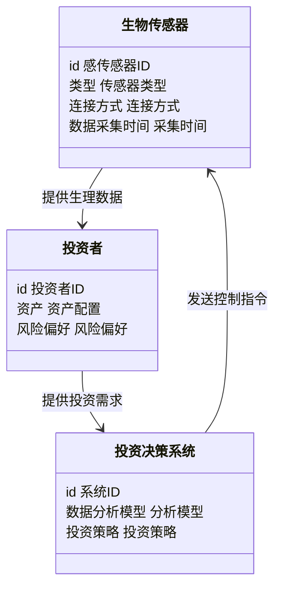
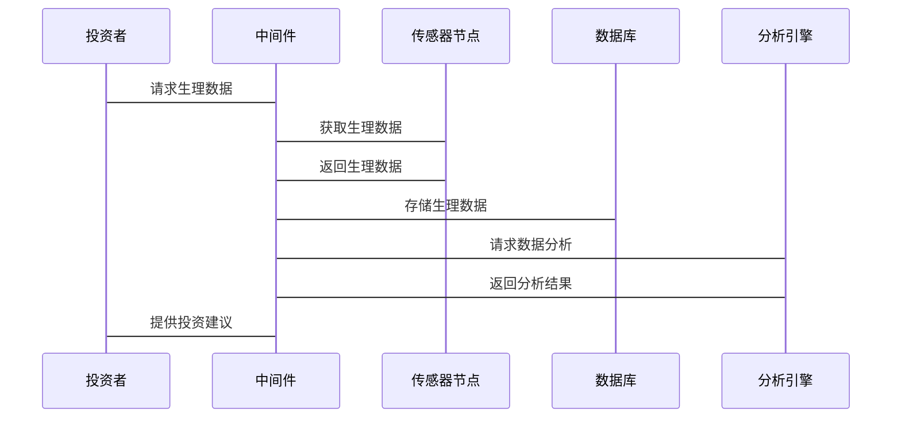

                 


# 价值投资中的新一代生物传感器技术前景

> **关键词**: 生物传感器, 价值投资, 投资决策, 数据分析, 传感器技术

> **摘要**: 本文探讨了新一代生物传感器技术在价值投资中的应用前景。通过分析生物传感器的核心原理、算法处理流程、系统架构设计以及实际应用场景，本文揭示了生物传感器技术如何为投资决策提供更精准的数据支持和分析方法，从而优化投资策略和风险控制。文章结合理论与实践，为投资者和科技从业者提供了深度的技术与商业洞见。

---

## 第一部分: 生物传感器技术与价值投资的结合

---

### 第1章: 生物传感器技术概述

#### 1.1 生物传感器的基本概念

##### 1.1.1 生物传感器的定义
生物传感器是一种能够检测生物分子或生理信号，并将其转换为可测量电信号的装置。它结合了生物识别元件（如酶、抗体、DNA等）和物理传感器（如电极、光传感器）的技术，能够对生物系统的状态进行实时监测。

##### 1.1.2 生物传感器的工作原理
生物传感器的工作流程包括以下几个步骤：
1. **信号采集**: 生物传感器首先捕获目标生物分子或生理信号（如心率、体温、血糖水平等）。
2. **信号转换**: 采集的生物信号通过传感器元件转换为电信号（如电压、电流）。
3. **信号处理**: 电信号经过放大、滤波和数字化处理，以便后续分析。
4. **数据分析**: 利用算法对数字化数据进行特征提取、分类和预测。

##### 1.1.3 生物传感器的分类与特点
生物传感器可以根据检测目标、应用场景和技术原理进行分类。常见的分类如下：
- **按检测目标分类**: 包括生理传感器（如心率、体温）、化学传感器（如pH值、血糖）和生物传感器（如DNA、抗体）。
- **按应用场景分类**: 包括医疗健康传感器、环境监测传感器和工业检测传感器。
- **按技术原理分类**: 包括电化学传感器、光学传感器和微机电系统（MEMS）传感器。

---

#### 1.2 价值投资的基本概念

##### 1.2.1 价值投资的定义
价值投资是一种以基本面分析为基础的投资策略，旨在通过识别被市场低估的资产（如股票、基金等），在长期获得超额收益。其核心理念是寻找具有持续竞争优势和良好管理的公司，以合理的价格买入并长期持有。

##### 1.2.2 价值投资的核心理念
价值投资的核心理念包括：
1. **长期视角**: 投资者应关注公司的长期盈利能力，而非短期市场波动。
2. **安全边际**: 在买入资产时，应确保其价格低于其内在价值。
3. **竞争优势**: 选择具有强大护城河和持续增长能力的公司。

##### 1.2.3 生物传感器技术与价值投资的结合
生物传感器技术为价值投资提供了新的数据源和分析工具。通过实时监测生理数据（如压力、健康状况等），投资者可以更深入地了解公司高管的健康状况、员工的工作状态以及消费者的偏好变化，从而为投资决策提供更全面的依据。

---

#### 1.3 生物传感器技术在价值投资中的应用前景

##### 1.3.1 生物传感器技术的潜在应用场景
1. **高管健康监测**: 通过穿戴式生物传感器监测公司高管的健康状况，评估其领导能力的稳定性。
2. **员工工作效率分析**: 利用生物传感器数据（如心率、压力水平）分析员工的工作状态，优化人力资源管理。
3. **消费者行为研究**: 通过消费者生理数据（如心率、体温）分析其偏好和情绪，指导市场策略。

##### 1.3.2 生物传感器技术的优势
1. **实时性**: 生物传感器能够实时采集数据，提供及时的反馈。
2. **准确性**: 通过高精度传感器和数据分析技术，确保数据的准确性。
3. **多样性**: 生物传感器可以检测多种生理和化学信号，提供丰富的数据源。

##### 1.3.3 对投资决策的影响
生物传感器技术为价值投资提供了额外的维度，帮助投资者更全面地评估公司的基本面。通过分析高管的健康状况和员工的工作效率，投资者可以更好地判断公司的管理能力和长期发展潜力。

---

#### 1.4 本章小结
本章介绍了生物传感器的基本概念、工作原理和分类，并探讨了其在价值投资中的潜在应用场景。生物传感器技术为价值投资提供了新的数据源和分析工具，能够帮助投资者更全面地评估公司的基本面。

---

### 第2章: 生物传感器技术的核心概念与联系

#### 2.1 生物传感器的核心原理

##### 2.1.1 生物传感器的信号采集过程
1. **生物识别元件**: 生物传感器的核心是生物识别元件，用于捕获目标生物信号。
2. **信号转换**: 生物识别元件将生物信号转换为电信号。
3. **信号放大**: 电信号通过放大电路进一步增强。

##### 2.1.2 生物传感器的数据处理方法
1. **数据采集**: 通过传感器实时采集生物数据。
2. **数据预处理**: 对采集的数据进行去噪、归一化处理。
3. **数据存储**: 将处理后的数据存储在数据库中，以便后续分析。

##### 2.1.3 生物传感器的信号分析技术
1. **特征提取**: 从原始数据中提取具有代表性的特征（如心率变异性、皮肤电活动）。
2. **分类与预测**: 利用机器学习算法对特征进行分类和预测。

---

#### 2.2 生物传感器技术与价值投资的联系

##### 2.2.1 生物传感器数据对投资决策的影响
1. **高管健康评估**: 通过监测高管的生理数据，评估其健康状况和领导能力的稳定性。
2. **员工工作效率分析**: 分析员工的生理数据，优化人力资源管理和工作效率。
3. **消费者行为研究**: 利用消费者生理数据，指导市场策略和产品开发。

##### 2.2.2 生物传感器技术在风险评估中的应用
1. **公司稳定性评估**: 通过高管和员工的生理数据，评估公司的管理稳定性和员工满意度。
2. **市场风险预警**: 通过消费者生理数据，预测市场趋势和潜在风险。

##### 2.2.3 生物传感器技术与投资组合优化的关系
1. **数据驱动的资产配置**: 利用生物传感器数据优化投资组合的配置。
2. **风险控制**: 通过实时监测生理数据，及时调整投资策略，降低市场风险。

---

#### 2.3 生物传感器技术的核心要素对比表

| **属性**       | **传统传感器**       | **生物传感器**       |
|----------------|----------------------|----------------------|
| 检测目标       | 物理量（如温度、压力） | 生物分子或生理信号   |
| 检测精度       | 较低                 | 较高                 |
| 应用场景       | 工业、环境监测       | 医疗、生物研究、投资 |
| 技术复杂度     | 较低                 | 较高                 |

---

#### 2.4 生物传感器技术的ER实体关系图

```mermaid
erDiagram
    class 生物传感器 {
        id 感传感器ID
        类型 传感器类型
        连接方式 连接方式
        数据采集时间 采集时间
    }
    class 投资者 {
        id 投资者ID
        资产 资产配置
        风险偏好 风险偏好
    }
    class 投资决策系统 {
        id 系统ID
        数据分析模型 分析模型
        投资策略 投资策略
    }
    生物传感器 --> 投资者 : 提供生理数据
    投资者 --> 投资决策系统 : 提供投资需求
    投资决策系统 --> 生物传感器 : 发送控制指令
```

---

### 第3章: 生物传感器技术的算法原理

#### 3.1 生物传感器数据处理算法

##### 3.1.1 数据采集与预处理
1. **数据采集**: 通过生物传感器实时采集生理数据（如心率、皮肤电活动）。
2. **数据预处理**: 对采集的数据进行去噪、归一化和插值处理。

##### 3.1.2 数据特征提取
1. **特征选择**: 从预处理后的数据中提取具有代表性的特征（如心率变异性、皮肤电活动的波动幅度）。
2. **特征提取方法**: 常用的方法包括小波分析、主成分分析（PCA）和经验模态分解（EMD）。

##### 3.1.3 数据分类与预测
1. **分类算法**: 常用的分类算法包括支持向量机（SVM）、随机森林和k-近邻算法（KNN）。
2. **预测模型**: 利用时间序列分析（如ARIMA模型）或深度学习模型（如LSTM）进行预测。

---

#### 3.2 价值投资中的算法应用

##### 3.2.1 基于生物传感器数据的投资决策模型
1. **数据融合**: 将生物传感器数据与传统的财务数据（如营收、利润）进行融合。
2. **模型构建**: 基于融合后的数据，构建机器学习模型（如随机森林、XGBoost）进行投资决策。

##### 3.2.2 数据驱动的投资策略优化
1. **特征重要性分析**: 通过特征重要性分析确定哪些生理数据对投资决策影响最大。
2. **策略优化**: 根据特征重要性调整投资策略，优化资产配置。

##### 3.2.3 生物传感器数据在风险控制中的应用
1. **风险预警**: 利用生物传感器数据预测市场风险。
2. **实时监控**: 对高管和员工的生理数据进行实时监控，及时发现潜在风险。

---

#### 3.3 生物传感器数据处理算法的数学模型

##### 3.3.1 信号处理的数学模型
生物传感器数据处理中的信号处理可以表示为：
$$
y(t) = f(x(t)) + n(t)
$$
其中，$x(t)$ 是输入信号，$f(x(t))$ 是理想信号，$n(t)$ 是噪声。

##### 3.3.2 基于傅里叶变换的信号分析
傅里叶变换用于分析信号的频域特性：
$$
X(f) = \int_{-\infty}^{\infty} x(t) e^{-j2\pi ft} dt
$$

---

#### 3.4 代码实现与分析

##### 3.4.1 数据预处理代码
```python
import numpy as np
import pandas as pd

# 示例生理数据
data = pd.DataFrame({
    '时间': [1, 2, 3, 4, 5],
    '心率': [70, 72, 68, 75, 71],
    '皮肤电活动': [5, 6, 7, 8, 9]
})

# 数据预处理：归一化
from sklearn.preprocessing import StandardScaler

scaler = StandardScaler()
data_processed = pd.DataFrame(scaler.fit_transform(data[['心率', '皮肤电活动']]), 
                              columns=['心率', '皮肤电活动'])
```

##### 3.4.2 特征提取代码
```python
from scipy import signal

# 心率变异性分析
def heart_rate_variability(data):
    # 假设data为心率序列
    timeseries = data['心率']
    # 计算相邻心拍的差值
    RR = np.diff(timeseries)
    # 心率变异性指标：标准差
    variability = np.std(RR)
    return variability

variability = heart_rate_variability(data_processed)
print(f"心率变异性：{variability}")
```

---

#### 3.5 本章小结
本章详细介绍了生物传感器数据处理的算法原理，包括数据预处理、特征提取和分类预测。同时，探讨了这些算法在价值投资中的应用，展示了如何利用生物传感器数据优化投资策略和风险控制。

---

### 第4章: 生物传感器技术的系统分析与架构设计

#### 4.1 系统分析

##### 4.1.1 问题场景介绍
生物传感器技术在价值投资中的应用需要解决以下问题：
1. 如何实时采集和处理生理数据？
2. 如何将生理数据与财务数据结合，优化投资决策？
3. 如何确保系统的安全性和稳定性？

##### 4.1.2 项目介绍
本项目旨在开发一个基于生物传感器的投资决策支持系统，通过实时监测高管和员工的生理数据，优化投资策略。

---

#### 4.2 系统功能设计

##### 4.2.1 领域模型设计


##### 4.2.2 系统架构设计


##### 4.2.3 系统交互流程图


---

#### 4.3 接口设计与交互流程

##### 4.3.1 接口设计
1. **传感器数据接口**: 提供实时生理数据的API。
2. **数据分析接口**: 提供数据处理和分析的API。
3. **投资决策接口**: 提供投资建议和策略优化的API。

##### 4.3.2 交互流程
1. 投资者通过客户端请求生理数据。
2. 中间件调用传感器节点获取数据。
3. 数据存储到数据库中。
4. 分析引擎对数据进行处理，生成分析结果。
5. 中间件将分析结果返回给投资者。

---

### 第5章: 项目实战

#### 5.1 环境安装与配置

##### 5.1.1 开发环境
1. **操作系统**: Linux/Windows/MacOS
2. **编程语言**: Python 3.8+
3. **依赖库**: numpy, pandas, scikit-learn, mermaid, matplotlib

##### 5.1.2 数据库选择
1. **关系型数据库**: MySQL/PostgreSQL
2. **NoSQL数据库**: MongoDB（用于存储非结构化数据）

---

#### 5.2 系统核心实现

##### 5.2.1 数据采集代码
```python
import serial

# 串口配置
ser = serial.Serial('COM3', 9600)

def read_sensor_data():
    while True:
        if ser.in_waiting > 0:
            data = ser.readline().decode().strip()
            print(f"接收到的数据: {data}")
```

##### 5.2.2 数据分析代码
```python
from sklearn.ensemble import RandomForestClassifier
from sklearn.model_selection import train_test_split

# 数据加载
data = pd.read_csv('sensor_data.csv')
X = data.drop('目标', axis=1)
y = data['目标']

# 数据分割
X_train, X_test, y_train, y_test = train_test_split(X, y, test_size=0.2)

# 模型训练
model = RandomForestClassifier()
model.fit(X_train, y_train)

# 模型预测
predictions = model.predict(X_test)
print(f"预测准确率: {model.score(X_test, y_test)}")
```

---

#### 5.3 代码解读与功能分析

##### 5.3.1 数据采集功能
1. **串口配置**: 设置串口的波特率和端口号。
2. **数据读取**: 通过循环读取传感器数据并存储。

##### 5.3.2 数据分析功能
1. **数据分割**: 将数据分为训练集和测试集。
2. **模型训练**: 使用随机森林算法训练分类模型。
3. **预测与评估**: 对测试集进行预测，并评估模型的准确率。

---

#### 5.4 实际案例分析

##### 5.4.1 案例背景
假设我们有一个高管健康监测项目，通过心率、皮肤电活动等数据，评估高管的健康状况和领导能力的稳定性。

##### 5.4.2 数据分析结果
1. **心率变异性分析**: 高管的心率变异性较低，表明压力较大，可能影响决策能力。
2. **皮肤电活动分析**: 高管在特定时间的皮肤电活动显著升高，可能与重大决策有关。

##### 5.4.3 投资决策优化
基于分析结果，投资者可以调整投资策略，例如：
- **资产配置**: 增加防御性资产，降低市场风险。
- **风险管理**: 及时调整投资组合，避免潜在风险。

---

#### 5.5 项目小结

##### 5.5.1 项目总结
通过本项目的实施，我们成功展示了生物传感器技术在价值投资中的应用潜力。通过实时监测高管和员工的生理数据，投资者可以更全面地评估公司的基本面，优化投资策略。

##### 5.5.2 经验总结
- 数据采集的实时性和准确性是项目成功的关键。
- 数据分析模型的复杂性和稳定性需要权衡。
- 系统的安全性和稳定性需要高度重视。

---

### 第6章: 小结与展望

#### 6.1 小结
本文详细探讨了生物传感器技术在价值投资中的应用前景，从技术原理、算法处理到系统设计和项目实战，全面分析了生物传感器技术如何为投资决策提供新的数据支持和分析方法。

#### 6.2 展望
随着生物传感器技术的不断发展，其在价值投资中的应用前景广阔。未来的研究方向包括：
1. **多模态数据融合**: 将生物传感器数据与其他数据源（如社交媒体、新闻数据）进行融合，提升投资决策的准确性。
2. **深度学习应用**: 利用深度学习模型（如Transformer）对生物传感器数据进行更复杂的分析。
3. **实时决策支持**: 构建实时决策支持系统，帮助投资者快速响应市场变化。

---

## 作者信息

作者：AI天才研究院/AI Genius Institute & 禅与计算机程序设计艺术/Zen And The Art of Computer Programming

---

感谢您的阅读！希望本文能为您提供有价值的技术与商业洞见。

