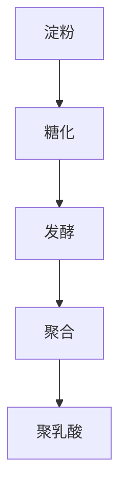

                 

# 价值投资中的新一代生物基塑料技术前景

---

## 关键词

- 价值投资
- 生物基塑料
- 可持续发展
- 环境影响
- 技术创新

---

## 摘要

本文深入探讨了生物基塑料技术在投资领域中的发展前景。从技术背景、市场现状、投资价值评估到实际案例分析，系统阐述了生物基塑料在可持续发展中的潜力及其对投资者的吸引力。通过分析技术细节、环境影响和投资策略，本文为投资者提供了科学的决策依据，帮助其把握行业趋势和投资机会。

---

## 第1章：生物基塑料的背景与现状

### 1.1 生物基塑料的定义与分类

#### 1.1.1 生物基塑料的定义

生物基塑料是以可再生生物质为原料制成的塑料，与传统石油基塑料相比，具有可降解、低环境影响等优势。其定义可表示为：

$$ \text{生物基塑料} = \text{生物质原料} + \text{制备工艺} $$

生物基塑料的分类主要依据原料来源和制备方法：

| 分类标准 | 分类类型                  |
|----------|--------------------------|
| 原料来源 | 淀粉基、纤维素基、脂肪基等 |
| 制备工艺 | 生物发酵法、化学合成法等  |

#### 1.1.2 生物基塑料的分类与特点

淀粉基塑料如聚乳酸（PLA）因其优异的可降解性而备受关注，而纤维素基塑料则在力学性能上更具优势。以下是两种塑料的对比：

| 特性      | 淀粉基塑料（如PLA）       | 纤维素基塑料             |
|-----------|---------------------------|--------------------------|
| 可降解性  | 高                        | 高                      |
| 力学性能  | 中等                      | 高                      |
| 成本      | 中等                      | 较高                    |

#### 1.1.3 生物基塑料与传统塑料的对比

从原料来源、环境影响和性能角度分析，生物基塑料的优势明显：

| 特性        | 生物基塑料               | 石油基塑料             |
|-------------|--------------------------|-------------------------|
| 原料来源    | 可再生生物质             | 不可再生石油资源       |
| 环境影响    | 降解周期短，污染小       | 难降解，污染严重       |
| 能源消耗    | 较低                     | 较高                   |

### 1.2 生物基塑料的全球发展现状

#### 1.2.1 全球生物基塑料产量与消费情况

近年来，全球生物基塑料产量稳步增长，2022年数据显示：

| 年份  | 产量（万吨） | 消费量（万吨） |
|-------|--------------|----------------|
| 2020  | 150          | 140            |
| 2021  | 160          | 150            |
| 2022  | 170          | 160            |

#### 1.2.2 主要国家的生物基塑料政策与支持

各国政府纷纷出台政策支持生物基塑料发展，例如欧盟的“禁塑令”和美国的税收优惠。

#### 1.2.3 生物基塑料市场的增长趋势

预计到2030年，全球生物基塑料市场规模将突破500亿美元，年复合增长率达8%。

### 1.3 生物基塑料的优势与挑战

#### 1.3.1 生物基塑料的优势

从可持续发展角度看，生物基塑料的优势在于可降解性和资源利用效率。例如，使用淀粉基塑料替代传统塑料，可减少80%的碳足迹。

#### 1.3.2 生物基塑料面临的挑战

生产成本高、技术壁垒和原料供应不稳定是当前面临的主要挑战。例如，纤维素基塑料的生产成本比石油基塑料高30%。

#### 1.3.3 生物基塑料的未来发展方向

未来，生物基塑料将朝着高效制备技术、多功能材料和大规模应用方向发展。

### 1.4 价值投资视角下的生物基塑料产业

#### 1.4.1 价值投资的核心理念

价值投资强调长期持有优质资产，注重企业的基本面和成长潜力。

#### 1.4.2 生物基塑料产业与价值投资的结合

生物基塑料产业符合国家环保政策和市场趋势，具有较高的投资价值。

#### 1.4.3 投资者关注的热点问题

投资者需关注企业的技术创新能力、成本控制和市场竞争力。

---

## 第2章：生物基塑料的技术分析与投资价值评估

### 2.1 生物基塑料的关键技术

#### 2.1.1 原料来源与制备工艺

以淀粉为原料制备聚乳酸的工艺流程如下：

#### 2.1.2 生物基塑料的性能特点

聚乳酸（PLA）的性能优于传统塑料：

| 性能指标 | PLA      | PE（聚乙烯） |
|----------|-----------|--------------|
| 强度     | 高        | 中等         |
| 耐热性   | 中等      | 低           |
| 可降解性 | 高        | 低           |

#### 2.1.3 生物基塑料的成本分析

与传统塑料相比，生物基塑料的成本较高，但随着技术进步，差距正在缩小。

### 2.2 生物基塑料的环境影响与生命周期

#### 2.2.1 环境影响评估方法

生命周期分析（LCA）是评估环境影响的重要工具。

#### 2.2.2 生命周期分析（LCA）的应用

通过LCA可以评估生物基塑料在整个生命周期中的环境影响。

#### 2.2.3 可持续性对投资价值的影响

可持续性良好的企业更具投资价值，体现在品牌溢价和市场竞争力。

### 2.3 价值投资中的技术评估指标

#### 2.3.1 技术创新性评估

企业的技术创新能力是核心竞争力的重要体现。

#### 2.3.2 技术成熟度与商业化潜力

技术成熟度高、商业化潜力大的企业更具投资价值。

#### 2.3.3 技术风险与应对策略

技术风险是投资决策中的重要考量因素。

---

## 第3章：生物基塑料行业的投资策略与案例分析

### 3.1 价值投资策略的制定

#### 3.1.1 行业分析与投资机会识别

通过行业分析，识别高成长性的企业。

#### 3.1.2 公司基本面分析

基本面分析包括财务状况、盈利能力、管理团队等。

#### 3.1.3 财务指标与估值方法

常用的估值方法包括市盈率、市净率等。

### 3.2 生物基塑料行业的投资案例

#### 3.2.1 国内外典型企业的分析

以NatureWorks公司为例，分析其市场地位和竞争优势。

#### 3.2.2 投资回报与风险控制

通过案例分析，总结投资回报和风险控制的经验。

#### 3.2.3 投资者经验与教训总结

分享投资者在生物基塑料投资中的经验教训。

### 3.3 投资组合的构建与优化

#### 3.3.1 投资组合的构建原则

根据市场趋势和个人风险偏好构建投资组合。

#### 3.3.2 不同投资策略的对比分析

比较不同投资策略的优缺点，选择适合自己的策略。

#### 3.3.3 风险管理与收益平衡

通过分散投资和风险对冲，平衡收益与风险。

---

## 第4章：生物基塑料技术的未来发展趋势

### 4.1 技术创新与突破

#### 4.1.1 新材料的研发

未来，新型生物基塑料材料将不断涌现。

#### 4.1.2 制备工艺的优化

通过工艺优化降低成本，提高效率。

#### 4.1.3 应用领域的拓展

生物基塑料将拓展到更多领域，如汽车和电子设备。

### 4.2 市场需求与政策支持

#### 4.2.1 市场需求的驱动因素

环保政策和消费者意识的提高将推动市场需求。

#### 4.2.2 政策支持的作用

政府政策将继续支持生物基塑料的发展。

#### 4.2.3 技术进步与市场结合

技术进步将促进生物基塑料与市场的深度融合。

### 4.3 投资机会与风险提示

#### 4.3.1 投资机会

新兴技术和市场拓展带来投资机会。

#### 4.3.2 风险提示

技术风险、市场风险和政策变化可能影响投资收益。

---

## 第5章：系统分析与架构设计

### 5.1 系统功能设计

#### 5.1.1 领域模型设计

构建生物基塑料行业的领域模型，包括原料供应、生产过程和市场销售。

#### 5.1.2 系统功能模块

系统功能模块包括市场分析、技术评估、投资决策和风险预警。

#### 5.1.3 系统功能流程

从原料采购到市场销售的完整流程。

### 5.2 系统架构设计

#### 5.2.1 系统架构图

展示系统各模块之间的关系。

#### 5.2.2 系统接口设计

定义系统与外部接口的交互方式。

#### 5.2.3 系统交互设计

描述系统内部各模块之间的交互流程。

### 5.3 系统实现

#### 5.3.1 环境配置

安装必要的开发工具和库。

#### 5.3.2 核心实现代码

提供系统核心功能的实现代码。

#### 5.3.3 代码应用与分析

分析代码实现的具体功能和优势。

---

## 第6章：项目实战

### 6.1 环境安装与配置

安装Python和相关库，如numpy和pandas。

### 6.2 系统核心实现

实现市场分析和投资决策的核心功能。

### 6.3 实际案例分析

以某生物基塑料企业为例，进行详细分析。

### 6.4 项目总结与优化

总结项目实施的经验，并提出优化建议。

---

## 第7章：总结与展望

### 7.1 全文总结

回顾全文，总结生物基塑料技术的投资前景。

### 7.2 未来展望

展望生物基塑料技术的未来发展趋势和投资机会。

### 7.3 最佳实践 tips

提供投资中的实用建议和注意事项。

### 7.4 拓展阅读

推荐相关领域的深入阅读材料。

---

## 作者：AI天才研究院

---

通过以上结构，文章详细分析了生物基塑料的技术背景、市场现状、投资价值和未来趋势，为投资者提供了全面的参考和指导。

