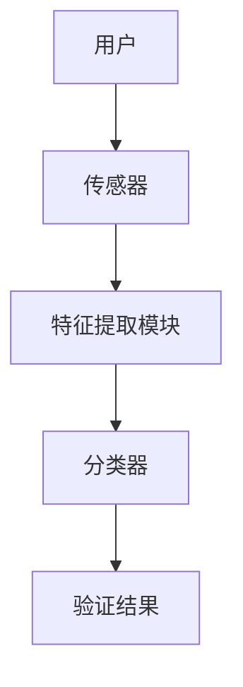

                 


# 价值投资中的新一代生物识别安全技术前景

## 关键词：生物识别技术，安全，价值投资，算法，系统架构，金融安全

## 摘要：生物识别技术在金融领域的应用日益广泛，尤其是在价值投资中，通过高精度的生物识别技术保障投资安全，提升交易效率和用户信任度。本文将详细探讨生物识别技术的核心算法、系统设计及实际应用，分析其在金融安全中的前景和投资价值。

---

# 第一章: 生物识别技术的背景与价值投资中的应用

## 1.1 生物识别技术的基本概念

### 1.1.1 生物识别技术的定义
生物识别技术是通过人的生理特征或行为特征进行身份识别的一种技术，常见的包括指纹识别、面部识别、虹膜识别等。

### 1.1.2 生物识别技术的历史发展
生物识别技术起源于20世纪60年代，随着计算机技术和传感器的发展，逐渐应用于金融、医疗、公共安全等领域。

### 1.1.3 生物识别技术的现状
目前，生物识别技术已广泛应用于移动支付、智能门禁、身份验证等领域，技术精度和安全性不断提升。

## 1.2 生物识别技术在价值投资中的应用

### 1.2.1 金融交易中的身份验证
通过生物识别技术确保投资者身份的真实性，防止账户被盗用或非法交易。

### 1.2.2 投资账户的安全保障
生物识别技术可以替代传统的密码验证，提升账户的安全性，降低密码泄露的风险。

### 1.2.3 提高交易效率
生物识别技术的快速验证能力可以缩短交易时间，提升投资者的交易效率。

## 1.3 生物识别技术对金融安全的影响

### 1.3.1 提升金融系统的安全性
通过高精度的生物识别技术，有效防止金融诈骗和身份盗窃。

### 1.3.2 增强投资者信任
生物识别技术的高可靠性可以增强投资者对金融机构的信任，促进投资行为的活跃。

### 1.3.3 推动金融创新
生物识别技术的应用推动了金融产品和服务的创新，为投资者提供更安全、便捷的服务。

---

# 第二章: 生物识别技术的核心算法与原理

## 2.1 特征提取算法

### 2.1.1 特征提取的定义
特征提取是从生物特征中提取关键特征信息的过程，如指纹的脊线、面部的特征点等。

### 2.1.2 常见的特征提取方法
- 基于模板的特征提取
- 基于深度学习的特征提取

### 2.1.3 数学模型与公式
特征提取过程可以通过线性变换或非线性变换将高维特征映射到低维空间，常用公式如下：

$$ Y = W^T X $$

其中，X是输入特征向量，W是变换矩阵，Y是提取的低维特征。

## 2.2 分类器设计算法

### 2.2.1 分类器的定义
分类器是根据提取的特征对样本进行分类的算法，如支持向量机（SVM）、随机森林等。

### 2.2.2 常见的分类器设计方法
- 线性分类器
- 非线性分类器（如SVM、神经网络）

### 2.2.3 分类器的性能评估
分类器的性能通常通过准确率、召回率、F1值等指标进行评估。

## 2.3 加密算法

### 2.3.1 加密算法的定义
加密算法是对生物特征数据进行加密，防止数据泄露和篡改。

### 2.3.2 常见的加密算法
- 哈希函数（如SHA-256）
- 公钥加密算法（如RSA）

### 2.3.3 加密算法的应用
生物识别系统的特征数据通过加密算法进行加密，确保数据传输和存储的安全性。

---

# 第三章: 生物识别技术的系统架构与设计

## 3.1 系统功能设计

### 3.1.1 用户身份验证
通过生物识别技术对用户进行身份验证，确保用户身份的真实性。

### 3.1.2 特征数据采集
使用传感器采集用户的生物特征数据，如指纹、面部图像等。

### 3.1.3 数据处理与分析
对采集的特征数据进行预处理、特征提取和分类识别，生成验证结果。

## 3.2 系统架构设计

### 3.2.1 系统架构图


### 3.2.2 接口设计
系统需要提供标准接口，方便与其他系统（如银行系统）进行集成。

### 3.2.3 交互流程
用户通过传感器输入生物特征，系统进行特征提取和分类识别，返回验证结果。

---

# 第四章: 生物识别技术在价值投资中的项目实战

## 4.1 项目背景与目标

### 4.1.1 项目背景
某金融机构希望引入生物识别技术，提升投资账户的安全性。

### 4.1.2 项目目标
实现基于面部识别的投资者身份验证系统。

## 4.2 项目实现

### 4.2.1 环境安装
- 安装必要的开发工具和库，如Python、OpenCV等。

### 4.2.2 核心代码实现
```python
import cv2
import numpy as np

def face_recognition(image):
    # 转换为灰度图
    gray = cv2.cvtColor(image, cv2.COLOR_BGR2GRAY)
    # 检测面部特征点
    face_cascade = cv2.CascadeClassifier('haarcascade_frontalface_default.xml')
    faces = face_cascade.detectMultiScale(gray, 1.3, 5)
    return faces
```

### 4.2.3 系统功能展示
通过面部识别技术，投资者只需扫描面部即可完成身份验证，提升交易效率。

## 4.3 实际案例分析

### 4.3.1 案例介绍
某证券公司引入生物识别技术后，交易安全性显著提升，客户满意度提高。

### 4.3.2 技术实现细节
通过深度学习算法优化面部识别模型，提升识别准确率和速度。

## 4.4 项目小结

### 4.4.1 项目成果
成功实现了基于面部识别的投资者身份验证系统，提升了投资安全性和用户体验。

### 4.4.2 经验总结
生物识别技术的应用需要结合具体业务需求，选择合适的算法和设备。

---

# 第五章: 生物识别技术的前景与投资机会

## 5.1 生物识别技术的发展趋势

### 5.1.1 技术创新
深度学习和人工智能技术的应用将进一步提升生物识别技术的精度和安全性。

### 5.1.2 市场扩展
生物识别技术将广泛应用于更多领域，如医疗、教育、公共安全等。

## 5.2 价值投资中的生物识别技术机会

### 5.2.1 金融安全领域的投资机会
生物识别技术在金融安全领域的应用前景广阔，具有较高的投资价值。

### 5.2.2 创新企业与技术服务商的投资机会
支持生物识别技术的创新企业和技术服务商将获得更多的市场机会。

## 5.3 投资者建议

### 5.3.1 关注技术创新
投资者应关注生物识别技术的最新发展，选择具有技术优势的企业进行投资。

### 5.3.2 注重市场应用
投资应考虑生物识别技术的市场应用前景，选择具有实际需求的领域进行布局。

---

# 总结

生物识别技术作为新一代信息技术的重要组成部分，在价值投资中的应用前景广阔。通过技术创新和市场扩展，生物识别技术将为金融安全提供更高效、更安全的解决方案。投资者应密切关注这一领域的技术发展和市场动态，抓住投资机会。

---

# 作者：AI天才研究院/AI Genius Institute & 禅与计算机程序设计艺术 /Zen And The Art of Computer Programming

