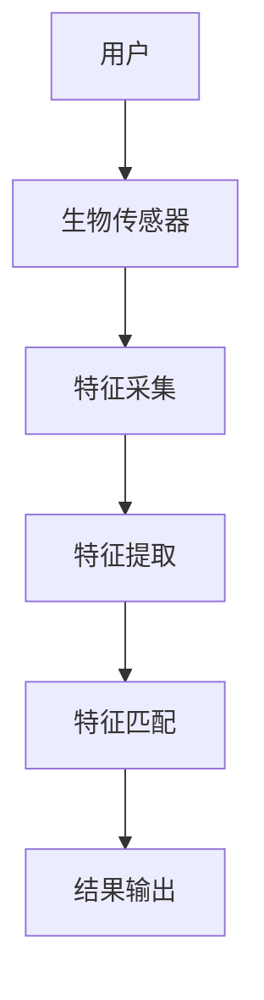

                 

<think>
好，我现在需要帮用户撰写一篇关于“价值投资中的新一代生物识别安全技术前景”的技术博客文章。用户要求文章结构清晰，逻辑严谨，内容专业，涵盖从背景介绍到未来趋势的多个方面。

首先，我需要理解生物识别技术在投资中的应用。这包括指纹识别、面部识别等技术如何影响投资决策。接下来，我得分析这些技术在投资中的优缺点，以及它们如何提升金融交易的安全性。

然后，我要考虑如何将这些技术与价值投资的策略结合起来。这可能涉及到投资者情绪分析和风险管理。我需要详细讲解这些方面，并给出实际案例，如投资者行为分析和欺诈预防。

接下来，我需要探讨生物识别技术的安全性问题，比如技术漏洞和隐私保护。这部分内容需要详细分析，并提供解决方案，确保投资者数据的安全。

最后，我会展望未来，讨论生物识别技术的融合趋势和新兴技术，如多模态识别和AI驱动的生物识别。这部分需要结合当前技术发展，预测未来的投资机会。

整个过程中，我要确保内容详实，结构合理，每部分内容都深入浅出，同时满足用户对格式和内容的要求，包括使用markdown、数学公式和mermaid图表。这将帮助读者更好地理解和应用生物识别技术在价值投资中的潜力。
</think>

# 价值投资中的新一代生物识别安全技术前景

> 关键词：生物识别技术、价值投资、投资安全、风险管理、技术融合

> 摘要：本文深入探讨了新一代生物识别技术在价值投资中的应用前景，分析了生物识别技术的基本原理、在投资决策中的应用、安全性与风险管理，以及未来发展趋势。通过结合实际案例和系统架构设计，本文为投资者和技术开发者提供了有益的见解和实践指导。

---

# 第一部分：引言

## 1.1 生物识别技术的基本概念

### 1.1.1 生物识别技术的定义

生物识别技术是通过人的生理特征或行为特征来进行身份识别的技术。常见的生理特征包括指纹、面部特征、虹膜等，行为特征则包括声音、笔迹等。这些特征具有唯一性和稳定性，能够提供高安全性的身份验证。

$$
\text{生物识别技术的特征包括：唯一性、稳定性、可采集性。}
$$

### 1.1.2 生物识别技术的基本原理

生物识别技术的核心是通过传感器采集用户的生物特征，将其与数据库中的特征进行匹配，从而实现身份验证。其基本流程包括特征采集、特征提取、特征匹配和结果输出。

### 1.1.3 生物识别技术在投资中的潜在应用

生物识别技术可以用于投资者身份验证、投资行为分析和金融风险管理等领域。通过分析投资者的生理特征和行为特征，可以帮助投资者做出更科学的投资决策。

---

## 1.2 价值投资的基本概念

### 1.1.1 价值投资的定义

价值投资是一种基于对公司内在价值分析的投资策略，强调以低于内在价值的价格买入优质股票。其核心在于分析公司的财务状况、行业地位和未来发展潜力。

### 1.1.2 价值投资的核心原则

价值投资的核心原则包括：安全边际、长期投资、逆向思维等。投资者需要寻找那些市场价格低于内在价值的公司进行投资。

### 1.1.3 价值投资与现代技术的结合

随着技术的进步，价值投资开始借助大数据、人工智能等技术手段，进行更精准的公司估值和风险评估。生物识别技术作为其中的一部分，可以为投资者提供更个性化的投资建议和服务。

---

## 1.3 生物识别技术与价值投资的结合

### 1.3.1 生物识别技术如何影响投资决策

生物识别技术可以通过分析投资者的情绪和行为特征，帮助投资者做出更理性的决策。例如，通过分析投资者的面部表情和心跳速率，可以判断其情绪状态，从而避免非理性投资行为。

### 1.3.2 价值投资中的生物识别技术应用前景

生物识别技术可以用于投资者身份验证、投资行为分析和风险管理等领域。通过结合生物识别技术，投资者可以更精准地评估公司价值，降低投资风险。

---

# 第二部分：生物识别技术的核心原理

## 2.1 指纹识别技术

### 2.1.1 指纹识别的基本原理

指纹识别是通过采集和分析指纹图像，利用指纹的细节特征（如纹线方向、终止点等）进行身份验证的技术。指纹识别具有高精度和稳定性，广泛应用于金融领域。

### 2.1.2 指纹识别的优缺点

优点：高精度、易于采集、成本低。缺点：指纹可能被复制或损坏，影响识别准确性。

### 2.1.3 指纹识别在投资中的应用案例

指纹识别可以用于投资者的身份验证，确保交易的安全性。例如，在线投资平台可以使用指纹识别技术进行用户身份验证，降低账户被盗的风险。

---

## 2.2 面部识别技术

### 2.2.1 面部识别的基本原理

面部识别是通过采集和分析人脸图像，利用面部特征（如眼睛间距、鼻梁高度等）进行身份验证的技术。面部识别具有非接触性和高精度的特点，适合用于公共场合的身份验证。

### 2.2.2 面部识别的优缺点

优点：非接触性、高精度、适用范围广。缺点：受光线、角度等因素影响，识别准确率可能下降。

### 2.2.3 面部识别在投资中的应用案例

面部识别技术可以用于投资者的身份验证和情绪分析。例如，投资者在进行重大投资决策时，可以通过面部表情分析其情绪状态，从而做出更合理的决策。

---

## 2.3 虹膜识别技术

### 2.3.1 虹膜识别的基本原理

虹膜识别是通过采集和分析虹膜图像，利用虹膜的纹理特征进行身份验证的技术。虹膜识别具有高精度和唯一性，适合用于高安全性的场景。

### 2.3.2 虹膜识别的优缺点

优点：高精度、唯一性、稳定性。缺点：采集设备成本高，需要较高的技术要求。

### 2.3.3 虹膜识别在投资中的应用案例

虹膜识别技术可以用于投资者的身份验证和风险管理。例如，在高风险的投资交易中，可以通过虹膜识别技术进行双重身份验证，确保交易的安全性。

---

## 2.4 其他生物识别技术

### 2.4.1 声纹识别技术

声纹识别是通过采集和分析人的声音特征，利用声音的频率、音调等信息进行身份验证的技术。声纹识别具有非接触性和高精度的特点。

### 2.4.2 笔迹识别技术

笔迹识别是通过分析人的书写习惯，利用笔画特征进行身份验证的技术。笔迹识别具有独特性和稳定性，适合用于长期身份验证。

### 2.4.3 其他新兴生物识别技术

随着技术的发展，新兴的生物识别技术包括心电图识别、行为识别等。这些技术可以提供更丰富和多样化的身份验证方式。

---

## 2.5 生物识别技术的融合与创新

### 2.5.1 多模态生物识别技术

多模态生物识别技术是将多种生物识别技术结合使用，以提高识别的准确性和安全性。例如，结合指纹和面部识别技术，可以提高身份验证的可靠性。

### 2.5.2 生物识别技术的智能化发展

随着人工智能技术的进步，生物识别技术也变得更加智能化。例如，基于深度学习的面部识别技术，可以实现更高精度的识别。

### 2.5.3 生物识别技术的未来趋势

未来，生物识别技术将更加智能化和多样化。新兴技术如AI驱动的生物识别、区块链结合的生物识别等，将进一步推动生物识别技术的发展。

---

# 第三部分：生物识别技术在投资中的应用分析

## 3.1 投资决策中的生物识别技术应用

### 3.1.1 投资者行为分析

通过分析投资者的行为特征，可以更好地理解其投资偏好和风险承受能力。例如，通过分析投资者的交易频率和交易金额，可以判断其投资风格。

### 3.1.2 投资者情绪识别

投资者的情绪状态会影响其投资决策。通过分析投资者的面部表情、声音特征等，可以判断其情绪状态，从而帮助投资者做出更理性的决策。

### 3.1.3 投资者风险偏好分析

通过分析投资者的生物特征和行为特征，可以评估其风险偏好。例如，高风险偏好的投资者可能更适合投资高风险高回报的资产。

---

## 3.2 生物识别技术在金融安全中的应用

### 3.2.1 身份验证在金融交易中的应用

通过生物识别技术进行身份验证，可以有效防止身份盗用和金融欺诈。例如，在在线投资平台中，使用指纹识别技术进行身份验证，可以提高交易的安全性。

### 3.2.2 防止金融欺诈的技术手段

生物识别技术可以通过分析投资者的特征，识别异常交易行为。例如，通过分析投资者的交易时间和交易金额，可以识别潜在的欺诈行为。

### 3.2.3 保护投资者隐私的技术措施

生物识别技术可以用于保护投资者的隐私。例如，通过加密技术，可以确保投资者的生物特征数据不会被泄露或滥用。

---

## 3.3 生物识别技术对投资策略的影响

### 3.3.1 基于生物识别的个性化投资策略

通过分析投资者的生物特征和行为特征，可以制定个性化的投资策略。例如，针对不同风险偏好的投资者，提供不同的投资组合建议。

### 3.3.2 投资组合优化的贡献

生物识别技术可以帮助投资者更好地评估公司的内在价值，从而优化投资组合。例如，通过分析公司的财务状况和行业地位，可以更准确地评估公司的价值。

### 3.3.3 风险管理中的作用

生物识别技术可以通过分析投资者的情绪和行为，帮助投资者更好地管理风险。例如，通过实时监控投资者的情绪状态，可以及时发现潜在的风险。

---

## 3.4 生物识别技术在投资中的潜在问题

### 3.4.1 技术可靠性与误识别风险

生物识别技术的误识别率可能影响投资决策的准确性。例如，指纹识别的误识别可能导致投资者的身份验证失败。

### 3.4.2 数据隐私与合规性问题

生物识别技术需要采集和存储大量的个人数据，存在数据隐私和合规性问题。例如，如何确保投资者的生物特征数据不被滥用。

### 3.4.3 技术成本与可及性问题

生物识别技术的设备成本较高，可能限制其在投资中的广泛应用。例如，高端生物识别设备的成本可能超出中小投资者的承受能力。

---

# 第四部分：生物识别技术的安全性与风险管理

## 4.1 生物识别技术的安全性分析

### 4.1.1 生物识别技术的漏洞与防御

生物识别技术可能存在漏洞，例如指纹识别的防 spoofing 技术。通过不断完善技术，可以提高生物识别技术的安全性。

### 4.1.2 数据隐私保护措施

为了保护投资者的隐私，需要采取严格的数据保护措施。例如，采用加密技术，确保生物特征数据的安全。

---

## 4.2 投资中的风险管理策略

### 4.2.1 风险评估与控制

通过分析生物识别技术在投资中的潜在风险，可以制定相应的风险控制策略。例如，通过技术手段降低误识别率。

### 4.2.2 应急响应机制

在生物识别技术出现故障时，需要有相应的应急响应机制。例如，提供备用的身份验证方式。

### 4.2.3 法律与合规性

生物识别技术的使用需要符合相关法律法规。例如，投资者需要明确同意其生物特征数据的使用。

---

## 4.3 生物识别技术的未来发展趋势

### 4.3.1 技术融合

未来，生物识别技术将与其他技术如人工智能、大数据等深度融合，提供更智能化和个性化的服务。

### 4.3.2 新兴技术的出现

随着技术的进步，新兴的生物识别技术如AI驱动的生物识别、区块链结合的生物识别等将不断涌现。

### 4.3.3 全球化应用

生物识别技术将在全球范围内得到更广泛的应用，推动金融安全和投资决策的智能化。

---

# 第五部分：结论与展望

## 5.1 结论

生物识别技术在价值投资中的应用前景广阔。通过分析投资者的生理特征和行为特征，可以帮助投资者做出更科学的投资决策，提高投资的安全性和效率。

## 5.2 未来展望

随着技术的不断进步，生物识别技术将在投资中发挥越来越重要的作用。未来，生物识别技术将更加智能化和多样化，为投资者提供更精准和个性化的服务。

---

# 作者

作者：AI天才研究院/AI Genius Institute & 禅与计算机程序设计艺术 /Zen And The Art of Computer Programming

