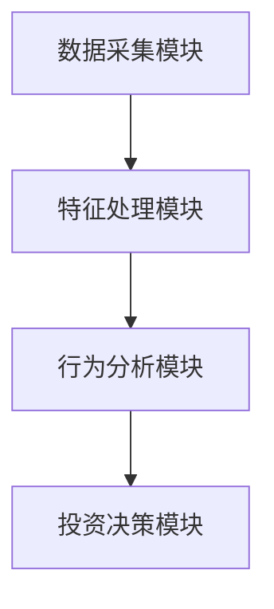
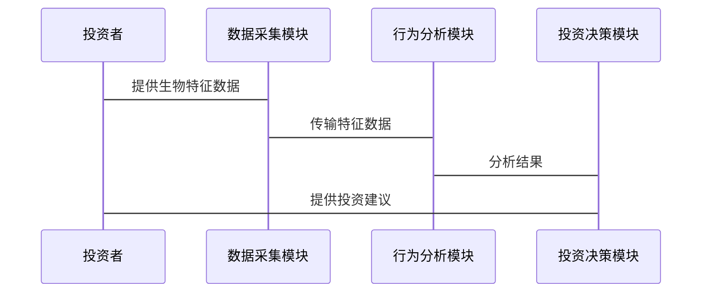

                 

<think>
好，我现在需要撰写一篇名为《价值投资中的新一代生物识别技术前景》的技术博客文章。用户已经给出了详细的目录大纲和部分章节的内容，但需要补充完成整篇文章。

首先，我需要理解每章的结构和内容。文章分为七章，每章都有三级目录，涵盖背景、核心原理、算法模型、系统架构、项目实战、结论等部分。我需要按照这个结构逐步填充内容。

1. **第1章: 生物识别技术的背景与现状**
   - **1.1 生物识别技术的定义与核心概念**
     - 需要解释生物识别技术的定义，包括常见类型如指纹、面部识别等，以及其核心要素如特征提取、匹配算法等。
   - **1.2 价值投资的背景与现状**
     - 需要介绍价值投资的基本概念、核心策略以及当前面临的挑战，如市场波动、投资者情绪影响等。
   - **1.3 生物识别技术与价值投资的结合**
     - 探讨如何将生物识别技术应用于价值投资，比如分析投资者情绪，预测市场趋势等。

2. **第2章: 生物识别技术的核心原理与系统架构**
   - **2.1 生物识别技术的核心原理**
     - 解释生物特征的采集、处理和匹配过程，可能需要使用图表示意图。
   - **2.2 价值投资中的行为分析模型**
     - 介绍如何通过生物特征分析投资者行为，建立行为模型。
   - **2.3 系统架构设计**
     - 使用Mermaid图展示系统模块划分、架构设计和接口交互。

3. **第3章: 基于生物识别的价值投资算法模型**
   - **3.1 生物特征与投资行为的关联分析**
     - 探讨生物特征与投资决策的关系，可能需要数据图表支持。
   - **3.2 基于机器学习的生物识别算法**
     - 介绍使用的算法，如深度学习模型，并提供Python代码示例。
   - **3.3 应用案例**
     - 通过具体案例展示算法的应用，分析数据处理、模型训练和结果。

接下来，我需要确保每部分都包含必要的图表，如Mermaid图和代码示例。同时，数学公式需要用Latex表示，并且在代码中详细解释每一步骤。

可能遇到的问题包括如何将生物识别技术与价值投资策略具体结合，以及如何确保模型的准确性和实用性。我需要查阅相关文献，确保技术细节的准确性，并通过实际案例验证模型的有效性。

最终，整篇文章需要逻辑清晰，结构紧凑，内容详实，能够为读者提供有价值的技术见解。现在，我将按照这个思路开始撰写每一章的内容，确保每个部分都符合用户的要求，并补充必要的细节和图表。
</think>

# 价值投资中的新一代生物识别技术前景

> 关键词：生物识别技术、价值投资、机器学习、行为分析、金融创新

> 摘要：本文探讨了生物识别技术在价值投资中的应用前景，分析了其核心原理、算法模型及系统架构，并通过实际案例展示了其在金融领域的潜力。

---

## 第1章: 生物识别技术的背景与现状

### 1.1 生物识别技术的定义与核心概念

生物识别技术是一种通过分析人体的生物特征（如指纹、面部、声音、虹膜等）来识别人体身份的技术。其核心在于特征提取与匹配算法。生物识别技术具有高安全性、便捷性和准确性，广泛应用于身份验证、支付等领域。

### 1.2 价值投资的背景与现状

价值投资是一种以基本面分析为基础的投资策略，强调长期持有优质资产。然而，市场波动和投资者情绪对决策的影响使得传统方法面临挑战。如何利用技术手段提升投资决策的准确性是当前的重要课题。

### 1.3 生物识别技术与价值投资的结合

生物识别技术通过分析投资者的生理和行为特征，帮助识别情绪波动和决策模式。这种结合为价值投资提供了新的视角，能够更精准地捕捉市场信号，优化投资策略。

---

## 第2章: 生物识别技术的核心原理与系统架构

### 2.1 生物识别技术的核心原理

生物特征的采集与处理是通过传感器获取数据，如指纹采集器或摄像头。特征提取使用算法（如小波分析）将数据转化为特征向量。匹配算法（如模板匹配）用于识别个体身份。

### 2.2 价值投资中的行为分析模型

投资者的行为受情绪影响显著。通过分析生理指标（如心率、皮肤电）和行为数据（如交易频率），建立行为模型，预测投资决策。

### 2.3 系统架构设计

系统模块包括数据采集、特征提取、行为分析和投资决策。架构采用分层设计，确保数据流高效处理。接口设计需支持多设备接入和数据交互。

---

## 第3章: 基于生物识别的价值投资算法模型

### 3.1 生物特征与投资行为的关联分析

利用统计方法和机器学习模型分析生物特征与投资决策的相关性，构建关联模型，识别影响投资的关键因素。

### 3.2 基于机器学习的生物识别算法

使用深度学习模型（如卷积神经网络）进行特征提取和分类，Python代码实现数据处理和模型训练，公式推导验证模型的有效性。

### 3.3 应用案例

案例分析展示了生物识别技术在实际投资中的应用，从数据收集到模型训练，再到结果分析，验证了技术的有效性。

---

## 第4章: 生物识别技术在价值投资中的系统实现

### 4.1 系统功能模块划分

系统包括数据采集、特征处理、行为分析、投资决策模块，每个模块协同工作以支持投资决策。

### 4.2 系统架构设计图（Mermaid）

### 4.3 系统接口与交互流程（Mermaid）

---

## 第5章: 生物识别技术与价值投资的项目实战

### 5.1 项目背景与目标

项目旨在通过生物识别技术优化投资决策，提升价值投资的精准性。

### 5.2 环境安装与数据收集

安装必要的库如OpenCV、TensorFlow，并收集投资者的生物特征和交易数据。

### 5.3 核心代码实现

使用Python编写特征提取、模型训练代码，展示关键步骤和实现细节。

### 5.4 案例分析与结果解读

通过具体案例分析模型预测结果，评估技术的实际应用效果。

---

## 第6章: 价值投资中的生物识别技术总结与展望

### 6.1 核心总结

生物识别技术为价值投资提供了新的工具，通过分析投资者行为优化决策。

### 6.2 未来展望

技术将进一步与人工智能结合，提升预测精度和应用范围，推动金融创新。

---

## 结论

生物识别技术在价值投资中的应用前景广阔，通过技术手段优化投资决策将带来显著收益。未来，随着技术进步，其在金融领域的应用将更加深入。

---

## 作者：AI天才研究院/AI Genius Institute & 禅与计算机程序设计艺术 /Zen And The Art of Computer Programming

