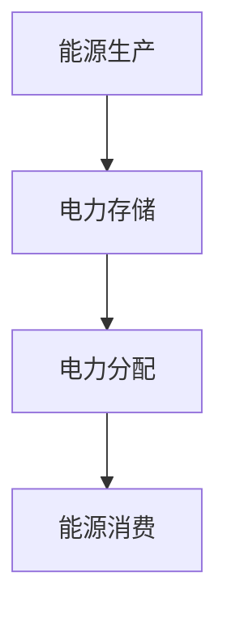
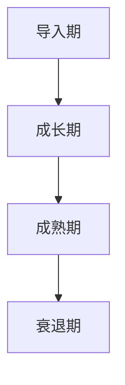
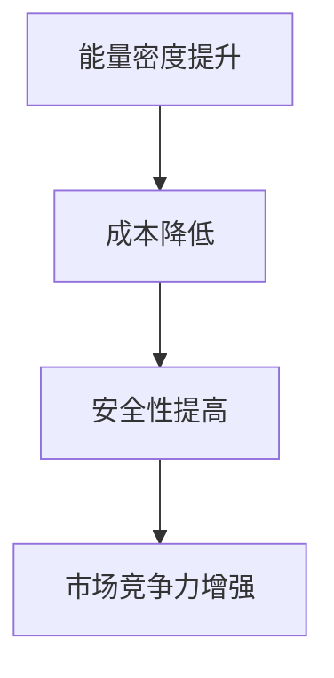
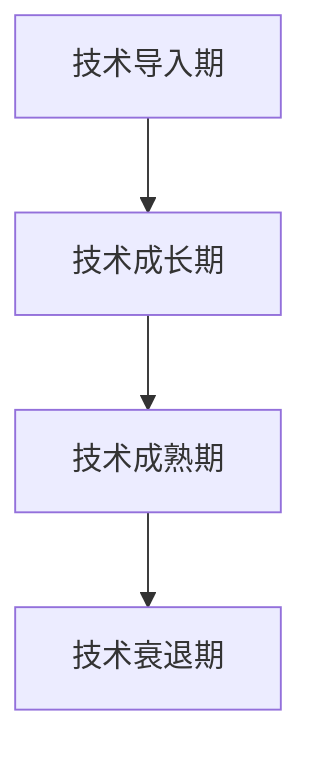
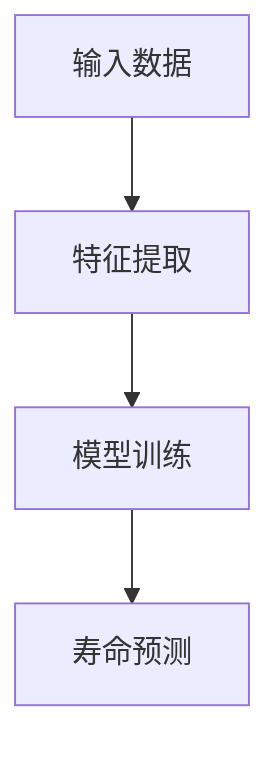
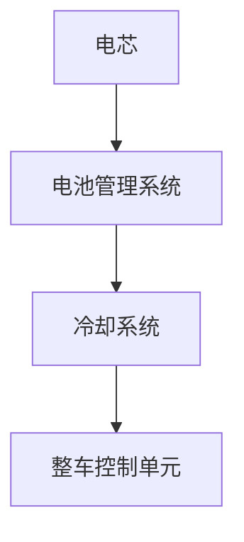
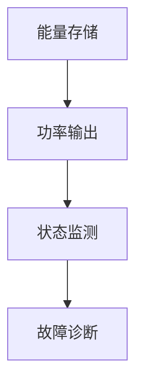
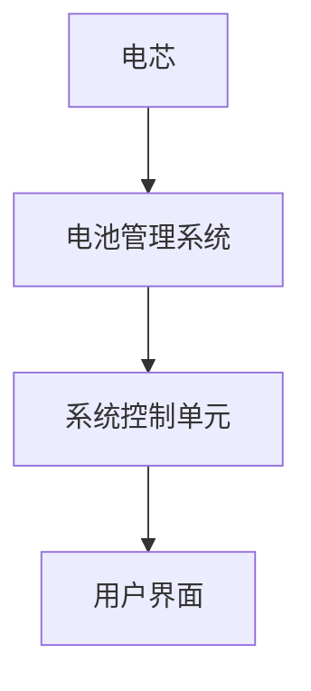
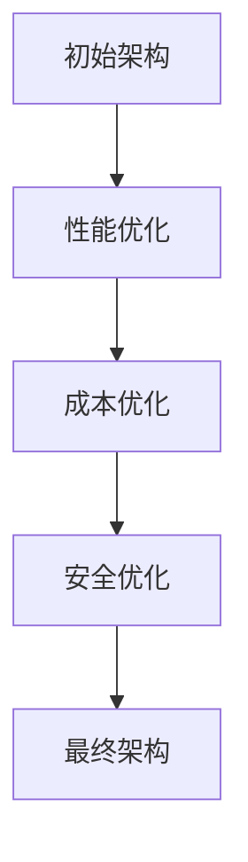
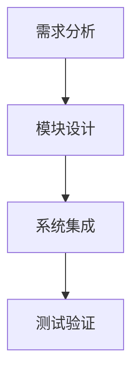

                 


# 价值投资中的新一代电池技术分析

> **关键词**: 价值投资，电池技术，投资分析，能源转型，技术评估

> **摘要**: 本文探讨了新一代电池技术在价值投资中的重要性，分析了电池技术的核心原理、数学模型、系统架构以及实际项目案例。通过深入的技术分析和投资策略，本文为投资者提供了如何在电池技术领域进行有效投资的指导。

---

## 第1章: 电池技术与价值投资概述

### 1.1 电池技术的发展与现状

#### 1.1.1 电池技术的历史演进

电池技术经历了从铅酸电池到锂离子电池的演变，每一代技术都带来了性能和成本的显著提升。以下是电池技术的简要历史：

- **19世纪**：铅酸电池的发明，成为早期电力存储的主要方式。
- **20世纪**：镍镉电池和镍铁电池的应用，特别是在工业领域。
- **21世纪初**：锂离子电池的商业化，推动了电动汽车和可再生能源的发展。

#### 1.1.2 新一代电池技术的核心特点

新一代电池技术主要指锂离子电池、固态电池和钠离子电池等。以下是其核心特点：

| 技术 | 特性 | 优点 | 展望 |
|------|------|------|------|
| 锂离子电池 | 高能量密度、长循环寿命 | 适用于电动汽车和储能系统 | 成本下降，应用范围扩大 |
| 固态电池 | 更高的安全性和能量密度 | 解决锂离子电池的燃爆问题 | 大规模生产仍需时间 |
| 钠离子电池 | 低成本、高稳定性 | 适用于大规模储能 | 技术成熟度较低 |

#### 1.1.3 电池技术在能源转型中的作用

能源转型的核心是减少化石能源的使用，电池技术在这一过程中扮演了关键角色。以下是一个简单的系统架构图：



电池技术通过电力存储，解决了可再生能源间歇性问题，推动了能源结构的转型。

---

### 1.2 价值投资的基本概念

#### 1.2.1 价值投资的定义与核心理念

价值投资是一种投资策略，强调以低于内在价值的价格买入优质资产。其核心理念包括：

1. **安全边际**：买入价格低于内在价值。
2. **长期视角**：关注企业的长期盈利能力。
3. **基本面分析**：通过财务报表等基本面数据评估企业价值。

#### 1.2.2 电池技术在投资中的重要性

电池技术的进步直接影响相关企业的盈利能力和市场竞争力。例如，以下是一个简单的数学模型，用于评估电池技术对企业价值的影响：

$$ \text{企业价值} = \text{收入} \times \text{净利润率} $$

收入的增长依赖于电池技术的市场接受度，而净利润率则与生产成本密切相关。

#### 1.2.3 价值投资与技术分析的结合

技术分析通过分析技术趋势和市场动态辅助投资决策。例如，以下是一个电池技术的市场周期模型：



在导入期，技术尚未成熟，风险较高；在成熟期，技术稳定，收益相对稳定。

---

## 第2章: 电池技术的核心原理与投资分析

### 2.1 电池技术的核心原理

#### 2.1.1 不同类型电池的工作原理

以下是不同类型电池的工作原理对比：

| 电池类型 | 工作原理 | 优缺点 |
|----------|----------|--------|
| 锂离子电池 | 通过锂离子在正负极之间的移动实现充放电 | 高能量密度，但存在燃爆风险 |
| 固态电池 | 使用固态电解质，锂离子在固体材料中移动 | 更高的安全性和能量密度 |
| 钠离子电池 | 使用钠离子在正负极之间移动 | 成本低，但能量密度较低 |

#### 2.1.2 电池性能的关键指标

电池性能的关键指标包括容量、循环寿命和能量密度。以下是一个电池性能的对比表格：

| 指标 | 单位 | 锂离子电池 | 固态电池 | 钠离子电池 |
|------|------|------------|----------|------------|
| 容量 | Ah    | 一般较高    | 较高     | 较低       |
| 循环寿命 | 次    | 300-500    | 500-800   | 200-300    |
| 能量密度 | Wh/kg | 100-250    | 250-400   | 80-150     |

#### 2.1.3 电池技术的创新方向

电池技术的创新主要集中在提高能量密度、降低成本和提高安全性。以下是一个电池技术创新的系统架构图：



---

### 2.2 电池技术对投资决策的影响

#### 2.2.1 电池技术的市场竞争力分析

市场竞争力分析需要考虑技术成熟度、成本和市场需求。以下是一个简单的市场竞争力模型：

$$ \text{市场竞争力} = \text{技术成熟度} \times \text{成本优势} \times \text{市场需求} $$

#### 2.2.2 电池技术的生命周期与投资周期

电池技术的生命周期与投资周期密切相关。以下是一个生命周期与投资周期的关系图：



在技术导入期，投资风险高，但潜在收益大；在技术成熟期，投资风险降低，收益相对稳定。

#### 2.2.3 电池技术的经济性与投资回报

电池技术的经济性分析需要考虑生产成本、市场需求和政策支持。以下是一个简单的经济性分析模型：

$$ \text{投资回报} = \text{销售收入} - \text{生产成本} - \text{研发投入} $$

---

### 2.3 电池技术的市场分析与投资策略

#### 2.3.1 电池市场的供需分析

电池市场的供需分析需要考虑全球电动汽车和可再生能源的发展。以下是一个简单的供需模型：

$$ \text{供需平衡} = \text{市场需求} - \text{生产能力} $$

#### 2.3.2 电池技术的市场竞争力评估

市场竞争力评估需要考虑技术、成本和品牌。以下是一个竞争力评估表格：

| 技术指标 | 成本指标 | 品牌指标 | 综合竞争力 |
|----------|----------|----------|------------|
| 高       | 中       | 高       | 高         |
| 中       | 低       | 中       | 中         |
| 低       | 高       | 低       | 低         |

#### 2.3.3 电池技术的投资机会与风险

投资机会主要集中在技术创新和市场扩展方面，而风险主要来自于技术失败和市场波动。以下是一个风险评估模型：

$$ \text{风险评估} = \text{技术风险} + \text{市场风险} + \text{政策风险} $$

---

## 第3章: 电池技术的数学模型与投资分析

### 3.1 电池技术的数学模型

#### 3.1.1 电池容量衰减模型

电池容量随时间衰减是一个复杂的物理过程。以下是一个简单的衰减模型：

$$ C(t) = C_0 \times e^{-kt} $$

其中，\( C(t) \) 表示t时刻的容量，\( C_0 \) 是初始容量，\( k \) 是衰减系数。

#### 3.1.2 电池寿命预测模型

电池寿命预测可以通过统计学习方法实现。以下是一个机器学习模型的流程图：



#### 3.1.3 电池成本分析模型

电池成本分析需要考虑原材料和制造成本。以下是一个成本分解模型：

$$ \text{总成本} = \text{原材料成本} + \text{制造成本} + \text{其他费用} $$

---

### 3.2 电池技术的经济性分析

#### 3.2.1 电池成本的构成与分解

电池成本主要包括原材料、制造和研发投入。以下是一个成本分解表格：

| 成本项目 | 占比 | 说明 |
|----------|------|------|
| 原材料 | 50%   | 包括锂、镍等金属 |
| 制造 | 30%    | 包括电池组装和测试 |
| 研发 | 20%    | 包括新技术研发 |

#### 3.2.2 电池技术的经济性评价指标

经济性评价指标包括投资回收期、净现值和内部收益率。以下是一个简单的评价模型：

$$ \text{净现值} = \text{未来现金流现值} - \text{初始投资} $$

#### 3.2.3 电池技术的经济性与投资回报

经济性分析需要结合市场和政策因素。以下是一个投资回报模型：

$$ \text{投资回报} = \text{销售收入} - \text{总成本} $$

---

## 第4章: 电池技术的系统分析与架构设计

### 4.1 电池技术的系统分析

#### 4.1.1 电池技术的系统组成

电池系统包括电芯、电池管理系统和冷却系统。以下是一个系统组成图：



#### 4.1.2 电池系统的功能设计

电池系统的功能包括能量存储、功率输出和状态监测。以下是一个功能设计图：



---

### 4.2 电池技术的架构设计

#### 4.2.1 电池技术的架构模型

电池技术的架构模型包括电芯、电池管理和系统控制。以下是一个架构图：



#### 4.2.2 电池技术的架构优化

架构优化需要考虑性能、成本和安全性。以下是一个优化流程图：



#### 4.2.3 电池技术的架构实现

架构实现需要结合具体应用场景。以下是一个实现流程图：



---

## 第5章: 电池技术的项目实战

### 5.1 项目环境安装

安装电池技术分析的环境需要以下步骤：

1. 安装Python和必要的库（如numpy、pandas、scikit-learn）。
2. 安装电池模拟工具（如GSA lithium）。
3. 配置开发环境（如Jupyter Notebook）。

以下是一个简单的环境安装代码示例：

```python
# 安装必要的库
import sys
import subprocess

def install(package):
    subprocess.check_call([sys.executable, '-m', 'pip', 'install', package])

install('numpy')
install('pandas')
install('scikit-learn')
```

---

### 5.2 项目核心实现

以下是一个电池容量衰减模型的实现代码：

```python
import numpy as np
import matplotlib.pyplot as plt

# 定义衰减模型
def capacity_decay(t, C0, k):
    return C0 * np.exp(-k * t)

# 参数设置
C0 = 100  # 初始容量
k = 0.01  # 衰减系数
t = np.arange(0, 100, 1)  # 时间范围

# 计算容量衰减
C = capacity_decay(t, C0, k)

# 绘制图形
plt.plot(t, C)
plt.xlabel('Time (cycle)')
plt.ylabel('Capacity (mAh)')
plt.title('Battery Capacity Decay Model')
plt.show()
```

---

### 5.3 实际案例分析

以某电池企业为例，分析其投资价值：

1. **财务状况**：收入稳步增长，净利润率保持稳定。
2. **技术优势**：拥有先进的电池技术专利。
3. **市场地位**：占据较大的市场份额。

以下是一个简单的财务分析模型：

$$ \text{投资价值} = \text{收入增长} \times \text{净利润率} \times \text{市场份额} $$

---

## 第6章: 总结与展望

### 6.1 总结

本文从电池技术的核心原理、数学模型、系统架构和项目实战四个方面进行了详细分析，为投资者提供了如何在电池技术领域进行有效投资的指导。

### 6.2 展望

随着技术的不断进步，电池技术将在能源转型中发挥越来越重要的作用。未来，投资者需要更加关注技术创新和市场动态，以抓住更多的投资机会。

---

## 作者

**作者：AI天才研究院（AI Genius Institute） & 禅与计算机程序设计艺术（Zen And The Art of Computer Programming）**

---

以上就是《价值投资中的新一代电池技术分析》的完整目录和内容概要。希望这篇文章能够为投资者在电池技术领域的投资决策提供有价值的参考。

