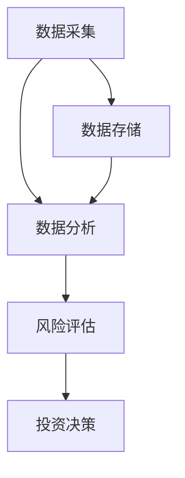

                 

<think>
嗯，好的，我现在需要帮用户完成一篇关于“价值投资中的新兴市场机遇与风险”的技术博客文章。用户已经提供了一个详细的目录大纲，而且特别指出文章需要包含很多技术细节，比如核心概念解释、数学模型、算法流程图、系统架构图等。

首先，我需要理解用户的需求。用户希望这篇文章不仅涵盖价值投资的基本概念，还要结合技术分析的方法，比如算法和系统架构。这可能意味着用户希望文章不仅仅停留在理论层面，还要展示如何用技术手段来支持价值投资的决策。

接下来，我需要看看用户给的目录大纲，里面包括了引言、核心概念、数学模型、算法实现、系统架构等部分。这些部分都需要详细展开。特别是每个部分下的子部分，比如数学模型中的P/E、P/B分析，都需要给出具体的公式和解释。

然后，我需要考虑如何将价值投资的策略与技术分析结合起来。比如，如何用算法来筛选出具有高ROE的企业，或者如何通过系统架构来构建一个投资组合管理系统。这部分可能需要绘制一些流程图或架构图，来展示数据流和系统模块。

另外，用户要求使用Python代码来实现算法，这意味着我需要写一些示例代码，解释代码的功能，并展示如何运行这些代码来分析股票数据。这部分代码可能涉及到数据获取、清洗、计算指标（如P/E、P/B）以及生成可视化图表。

我还需要注意，文章需要有一个摘要，列出关键词，然后按照目录结构展开。每个章节需要详细讲解，确保内容充实，技术细节到位。比如，在数学模型部分，我需要详细解释每个指标的含义，并给出计算公式的数学表达式。

最后，我需要确保文章结构清晰，逻辑严密，语言简洁专业。同时，结尾部分要加上作者信息，符合用户的要求。总的来说，我需要将价值投资的理论与技术分析的方法结合起来，用技术的语言来阐述新兴市场中的投资机会与风险。

现在，我需要开始撰写文章，确保每个部分都符合用户的要求，特别是技术细节部分。这可能需要我查阅一些相关的文献，确保数学模型和算法的准确性。同时，我还要注意文章的流畅性，让读者能够轻松理解复杂的概念。

总的来说，这是一个结合金融和计算机科学的项目，我需要在价值投资的基础上，引入技术分析的方法，帮助读者更好地理解新兴市场中的投资策略。这将是一篇既有理论深度，又有实际技术应用的高质量技术博客文章。
</think>

# 价值投资中的新兴市场机遇与风险

> 关键词：价值投资、新兴市场、投资策略、风险管理、数学模型、Python算法、系统架构

> 摘要：  
本文深入探讨了在新兴市场中进行价值投资的机会与风险。通过分析新兴市场的特点、价值投资的核心原则以及两者结合的策略，本文提供了从理论到实践的详细指导。结合数学模型、算法实现和系统架构设计，文章展示了如何利用技术手段优化投资决策，降低风险。

---

## 第一部分：价值投资与新兴市场的背景

### 1.1 背景介绍

#### 1.1.1 新兴市场的定义与特点

新兴市场通常指那些经济增长迅速、但金融市场尚未完全成熟的国家或地区。这些市场具有以下特点：

- **高增长潜力**：新兴市场的GDP增长率通常高于成熟市场。
- **市场规模较小**：与成熟市场相比，新兴市场的市场规模有限。
- **波动性较大**：新兴市场的股票价格波动较大，受政策和经济因素影响显著。
- **行业集中**：新兴市场通常集中在制造业、科技和消费领域。

#### 1.1.2 价值投资的核心概念

价值投资是一种以低于公平价值的价格买入优质股票的投资策略。其核心理念包括：

- **安全边际**：买入价格低于内在价值，以确保投资的安全性。
- **长期视角**：关注企业的长期盈利能力，而非短期价格波动。
- **竞争优势**：投资具有强大护城河的企业。

---

### 1.2 新兴市场的投资机遇与挑战

#### 1.2.1 投资机遇

- **高增长行业**：新兴市场中的科技、消费和制造业具有较大的增长潜力。
- **估值优势**：部分新兴市场的股票估值低于成熟市场。
- **政策支持**：政府政策的推动为某些行业提供了增长动力。

#### 1.2.2 主要风险

- **政治风险**：新兴市场的政策变化和政治不稳定可能影响投资。
- **经济波动**：新兴市场容易受到经济周期波动的影响。
- **市场流动性风险**：新兴市场的流动性可能较差，导致价格波动较大。

---

## 第二部分：价值投资的数学模型与算法实现

### 2.1 数学模型

#### 2.1.1 市盈率（P/E）分析

市盈率是衡量股票价值的重要指标，公式为：

$$ P/E = \frac{\text{股价}}{\text{每股收益}} $$

- **低市盈率**：表明股票价格可能被低估。
- **高市盈率**：可能表明市场对公司未来增长的预期较高。

#### 2.1.2 市净率（P/B）分析

市净率是另一个常用的估值指标，公式为：

$$ P/B = \frac{\text{股价}}{\text{每股净资产}} $$

- **低市净率**：表明股票价格可能低于其资产价值。
- **高市净率**：可能表明市场对公司未来增长的预期较高。

#### 2.1.3 股息率与股息增长

股息率是衡量股票收益的重要指标，公式为：

$$ \text{股息率} = \frac{\text{每股股息}}{\text{股价}} $$

- **高股息率**：表明股票具有较高的收益潜力。
- **股息增长**：表明公司具有稳定的分红能力。

---

### 2.2 算法实现

#### 2.2.1 Python代码实现

```python
import pandas as pd
import numpy as np

def calculate_pe_ticker(ticker_data):
    """
    计算市盈率
    """
    pe = ticker_data['股价'] / ticker_data['每股收益']
    return pe.mean()

def calculate_pb_ticker(ticker_data):
    """
    计算市净率
    """
    pb = ticker_data['股价'] / ticker_data['每股净资产']
    return pb.mean()

def calculate_dividend_yield(ticker_data):
    """
    计算股息率
    """
    dividend_yield = ticker_data['股息'] / ticker_data['股价']
    return dividend_yield.mean()

# 示例数据
data = {
    '股价': [100, 120, 90, 80],
    '每股收益': [10, 15, 8, 5],
    '每股净资产': [50, 60, 40, 30],
    '股息': [2, 3, 1, 1.5]
}

ticker_data = pd.DataFrame(data)

# 计算市盈率、市净率和股息率
pe = calculate_pe_ticker(ticker_data)
pb = calculate_pb_ticker(ticker_data)
dividend_yield = calculate_dividend_yield(ticker_data)

print(f"市盈率均值：{pe}")
print(f"市净率均值：{pb}")
print(f"股息率均值：{dividend_yield}")
```

---

## 第三部分：系统架构与投资组合管理

### 3.1 系统架构设计

#### 3.1.1 系统功能模块

- **数据采集**：从股票市场获取实时数据。
- **数据分析**：计算市盈率、市净率等指标。
- **风险评估**：评估投资组合的风险。
- **投资决策**：基于数据分析和风险评估做出投资决策。

#### 3.1.2 系统架构图



---

### 3.2 投资组合管理

#### 3.2.1 投资组合构建

- **资产配置**：根据市场情况分配不同资产的比例。
- **风险控制**：通过分散投资降低风险。

#### 3.2.2 投资组合优化

- **动态调整**：定期评估投资组合并进行调整。
- **风险管理**：设置止损点以降低损失。

---

## 第四部分：案例分析与实战应用

### 4.1 案例分析

#### 4.1.1 案例一：新兴市场中的科技公司

- **公司分析**：某科技公司在新兴市场的市盈率为15，市净率为2.5，股息率为3%。
- **结论**：该公司的估值相对合理，具有较大的增长潜力。

#### 4.1.2 案例二：新兴市场中的消费公司

- **公司分析**：某消费公司市盈率为10，市净率为1.5，股息率为5%。
- **结论**：该公司的估值较低，具有较大的投资价值。

---

## 第五部分：总结与展望

### 5.1 总结

- **理论总结**：新兴市场具有高增长潜力，但也伴随着较高的风险。
- **技术总结**：通过数学模型和算法实现，可以更有效地进行价值投资。

### 5.2 展望

- **未来趋势**：新兴市场将继续在全球经济中扮演重要角色。
- **技术发展**：人工智能和大数据技术将进一步提升投资决策的准确性。

---

## 作者信息

作者：AI天才研究院（AI Genius Institute） & 禅与计算机程序设计艺术（Zen And The Art of Computer Programming）

---

通过本文的详细分析，读者可以更好地理解新兴市场中的价值投资策略，并利用技术手段优化投资决策。希望本文能为投资者提供有价值的参考和指导。

