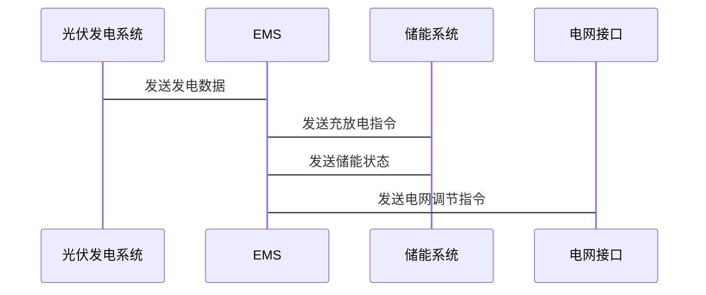

                 


# 价值投资中的新型高效光伏-储能一体化技术

---

## 关键词
光伏、储能、价值投资、能源转型、技术分析

---

## 摘要
本文深入探讨了光伏-储能一体化技术在价值投资中的应用潜力。通过分析光伏和储能技术的基本原理、市场现状及协同效应，结合算法原理和数学模型，揭示了该技术在能源转型中的重要地位。文章还通过实际案例展示了如何通过技术分析和系统优化实现投资收益最大化，并提出了未来发展的建议。

---

## 第一部分: 光伏-储能一体化技术的背景与意义

### 第1章: 光伏-储能一体化技术的背景与意义

#### 1.1 价值投资与能源转型
##### 1.1.1 价值投资的核心理念
价值投资是一种长期投资策略，注重基本面分析，寻找被市场低估的投资标的。在能源领域，这意味着需要关注技术进步、市场需求和政策支持等因素。

##### 1.1.2 能源结构转型的必要性
全球能源结构正在从化石能源向可再生能源转型。光伏和储能技术作为可再生能源的重要组成部分，具有清洁、高效的特点，是能源转型的核心驱动力。

##### 1.1.3 光伏-储能技术的市场机会
随着技术进步和成本下降，光伏和储能系统逐渐成为能源市场的主流。光伏-储能一体化技术的应用不仅能够提高能源利用效率，还能为投资者带来可观的收益。

#### 1.2 光伏与储能技术的基本概念
##### 1.2.1 光伏发电的基本原理
光伏发电利用半导体材料将太阳光转化为电能。其核心组件包括光伏电池、逆变器、支架等。

##### 1.2.2 储能技术的分类与特点
储能技术主要包括电池储能、超级电容器、飞轮储能等。其中，电池储能（如锂电池）因其高能量密度和较长循环寿命而成为市场主流。

##### 1.2.3 光伏-储能一体化的优势
光伏-储能一体化技术能够实现能源的自发自用，减少对电网的依赖，同时提高能源系统的可靠性和稳定性。

#### 1.3 光伏-储能技术的市场现状
##### 1.3.1 全球光伏市场分析
近年来，全球光伏装机容量快速增长，中国、欧盟和美国是主要的市场。根据最新数据，2023年全球光伏新增装机容量预计将达到300GW。

##### 1.3.2 储能市场的发展趋势
储能技术是实现可再生能源大规模应用的关键。随着技术进步和成本下降，储能系统的市场需求将持续增长。

##### 1.3.3 中国光伏-储能技术的政策支持
中国政府通过“十四五”规划等政策文件，明确提出支持光伏-储能一体化技术的研发和应用，为相关技术的发展提供了有力保障。

#### 1.4 本章小结
本章从能源转型的背景出发，介绍了光伏和储能技术的基本概念和市场现状，分析了光伏-储能一体化技术的市场机会。

---

## 第二部分: 光伏-储能一体化技术的核心概念

### 第2章: 光伏-储能一体化技术的核心概念

#### 2.1 光伏-储能系统的构成与功能
##### 2.1.1 光伏发电系统的核心组件
- 光伏电池：负责将太阳光转化为电能。
- 逆变器：将直流电转换为交流电，以供电网使用。
- 支架：用于固定光伏电池板，确保其朝向和角度最佳。

##### 2.1.2 储能系统的功能与作用
- 储能系统可以储存 excess 光伏发电的电能，用于电网高峰时段的补充。
- 在电网断电时，储能系统可以为用户提供备用电源。

##### 2.1.3 一体化技术的系统架构
光伏-储能一体化系统通常包括光伏组件、储能电池、逆变器和能量管理系统（EMS）。

#### 2.2 光伏-储能技术的关键指标
##### 2.2.1 光伏发电效率的衡量标准
- 转换效率：指光伏电池将太阳辐射能转化为电能的效率。
- 系统效率：考虑逆变器、电缆等损耗后的整体效率。

##### 2.2.2 储能系统的容量与放电时间
- 容量：储能系统能够储存的总电能，单位为kWh。
- 放电时间：储能系统在满充状态下持续放电的时间，单位为小时。

##### 2.2.3 系统的经济性与可靠性
- 经济性：包括初始投资、运维成本和回收周期。
- 可靠性：系统在长时间运行中的稳定性。

#### 2.3 光伏-储能技术的优劣势对比
##### 2.3.1 与传统能源技术的对比分析
- 传统能源技术（如燃煤发电）具有高稳定性，但污染严重且不可再生。
- 光伏-储能技术具有清洁、可再生的特点，但受天气条件影响较大。

##### 2.3.2 技术优势与市场潜力
- 技术优势：清洁、高效、可再生。
- 市场潜力：随着技术进步和成本下降，市场应用前景广阔。

##### 2.3.3 当前技术的局限性
- 受天气影响较大，稳定性不足。
- 初期投资成本较高。

#### 2.4 本章小结
本章分析了光伏-储能一体化技术的核心概念，包括系统构成、关键指标以及优劣势对比。

---

## 第三部分: 光伏-储能技术的算法原理与数学模型

### 第3章: 光伏-储能技术的算法原理与数学模型

#### 3.1 光伏发电效率的预测算法
##### 3.1.1 基于历史数据的线性回归模型
- 通过分析历史光照强度和发电量的关系，建立线性回归模型预测未来发电量。
- 模型公式：
  $$ y = a x + b $$
  其中，$y$为发电量，$x$为光照强度，$a$为斜率，$b$为截距。

##### 3.1.2 时间序列分析方法
- 使用ARIMA（自回归积分滑动平均模型）预测未来发电量。
- 模型公式：
  $$ y_t = \phi_1 y_{t-1} + \theta_1 \epsilon_{t-1} + \epsilon_t $$

##### 3.1.3 神经网络预测模型
- 使用LSTM（长短期记忆网络）模型预测光伏发电量。
- LSTM结构包括输入门、遗忘门和输出门。

#### 3.2 储能系统容量优化的数学模型
##### 3.2.1 储能容量的动态规划优化
- 目标函数：
  $$ \text{Minimize} \quad \sum_{t=1}^T c_t \cdot x_t $$
  其中，$c_t$为时间$t$的储能容量成本，$x_t$为储能容量决策变量。

##### 3.2.2 储能系统的能量守恒方程
- 模型公式：
  $$ \text{输入能量} = \text{输出能量} + \text{储存能量} $$

##### 3.2.3 经济性优化的数学表达
- 目标函数：
  $$ \text{Maximize} \quad \text{收益} - \text{成本} $$

#### 3.3 光伏-储能系统的协同优化算法
##### 3.3.1 系统协同优化的目标函数
- 目标函数：
  $$ \text{Maximize} \quad \text{净收益} = \text{收入} - \text{成本} $$

##### 3.3.2 基于遗传算法的优化方案
- 使用遗传算法优化光伏-储能系统的参数设置，包括光伏组件数量、储能容量等。

##### 3.3.3 算法实现的步骤与流程
1. 初始化种群。
2. 计算适应度。
3. 选择、交叉和变异操作。
4. 重复迭代，直到收敛。

#### 3.4 本章小结
本章详细讲解了光伏-储能技术的算法原理与数学模型，包括发电效率预测、储能容量优化和系统协同优化。

---

## 第四部分: 光伏-储能系统的系统分析与架构设计

### 第4章: 光伏-储能系统的系统分析与架构设计

#### 4.1 系统功能设计
##### 4.1.1 领域模型（mermaid类图）
```mermaid
classDiagram
    class 光伏发电系统 {
        光伏电池
        逆变器
        支架
    }
    class 储能系统 {
        储能电池
        电池管理系统
    }
    class 能量管理系统(EMS) {
        数据采集模块
        能量平衡模块
        控制模块
    }
    光伏发电系统 --> EMS
    储能系统 --> EMS
```

##### 4.1.2 系统架构设计（mermaid架构图）


#### 4.2 系统接口设计
##### 4.2.1 光伏发电系统与EMS的接口
- 数据接口：光伏系统的发电数据传输到EMS。
- 控制接口：EMS根据需求控制光伏系统的运行状态。

##### 4.2.2 储能系统与EMS的接口
- 数据接口：储能系统的充放电数据传输到EMS。
- 控制接口：EMS根据需求控制储能系统的充放电状态。

#### 4.3 系统交互流程（mermaid序列图）


#### 4.4 本章小结
本章通过系统分析与架构设计，明确了光伏-储能一体化系统的功能模块、系统架构和交互流程。

---

## 第五部分: 光伏-储能技术的项目实战

### 第5章: 光伏-储能技术的项目实战

#### 5.1 环境安装
##### 5.1.1 安装必要的库
```bash
pip install numpy pandas matplotlib scikit-learn tensorflow
```

#### 5.2 系统核心实现源代码
##### 5.2.1 光伏发电效率预测代码
```python
import numpy as np
from sklearn.linear_model import LinearRegression

# 示例数据
X = np.array([1, 2, 3, 4, 5]).reshape(-1, 1)
y = np.array([2, 4, 6, 8, 10])

model = LinearRegression()
model.fit(X, y)

# 预测
print(model.predict([[6]]))
```

##### 5.2.2 储能容量优化代码
```python
import numpy as np
import matplotlib.pyplot as plt

# 示例数据
cost = 0.5
revenue = 1.2
capacity = np.linspace(0, 100, 100)

profit = revenue * capacity - cost * capacity

plt.plot(capacity, profit)
plt.xlabel('Capacity')
plt.ylabel('Profit')
plt.show()
```

#### 5.3 实际案例分析
##### 5.3.1 案例背景
假设某企业计划建设一个100kW的光伏系统和50kWh的储能系统。

##### 5.3.2 投资分析
- 初始投资：50万元
- 年收入：10万元
- 回收期：5年

##### 5.3.3 投资建议
- 确保系统设计合理，避免过度投资。
- 关注政策支持和市场波动。

#### 5.4 本章小结
本章通过项目实战，展示了如何通过技术分析和系统优化实现光伏-储能一体化技术的经济效益最大化。

---

## 第六部分: 光伏-储能技术的最佳实践与未来展望

### 第6章: 光伏-储能技术的最佳实践

#### 6.1 最佳实践 tips
- 确保系统设计合理，避免过度投资。
- 关注政策支持和市场波动。
- 定期维护和更新系统，确保高效运行。

#### 6.2 小结
光伏-储能一体化技术是未来能源转型的核心技术之一。通过合理的技术分析和系统优化，投资者可以在实现环境效益的同时获得可观的经济效益。

#### 6.3 注意事项
- 光伏-储能系统受天气条件影响较大，需做好备用电源规划。
- 初期投资成本较高，需做好长期规划。

#### 6.4 拓展阅读
- 推荐阅读《光伏系统设计与优化》和《储能技术与应用》。

---

## 作者：AI天才研究院 & 禅与计算机程序设计艺术

---

**总结：** 本文通过系统的分析和实际案例，展示了光伏-储能一体化技术在价值投资中的潜力。通过合理的技术分析和系统优化，投资者可以在实现环境效益的同时获得可观的经济效益。

