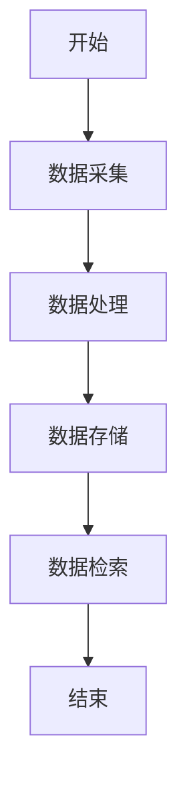

                 

<think>
好的，我需要帮用户撰写一篇关于“价值投资中的新型高效光存储技术前景”的技术博客文章。用户希望文章结构清晰，内容专业，符合技术博客的标准，并且包含丰富的技术细节和深入的分析。

首先，我需要理解用户的需求。用户希望文章包括背景介绍、核心概念、技术原理、系统架构、项目实战和总结等内容。同时，文章需要使用Markdown格式，包含数学公式和图表，如Mermaid图。

接下来，我将按照用户提供的大纲进行内容填充。每章的内容需要详细展开，确保每个部分都涵盖必要的技术细节和分析。例如，在背景介绍部分，我需要定义光存储技术，分析其在投资中的应用，以及与传统技术的对比。

在核心原理部分，我需要解释光存储的数学模型，使用公式和图表来展示其工作原理。同时，系统架构部分需要设计一个完整的系统架构，包括类图、架构图和交互流程图。

项目实战部分，我需要提供实际的代码实现，解释每个部分的功能，并通过案例分析来展示光存储技术在投资中的应用效果。

最后，总结部分需要回顾文章的主要内容，并提出未来的发展趋势和注意事项。

在撰写过程中，我需要确保语言简洁专业，逻辑清晰，每个部分都能深入浅出地解释技术原理和应用。同时，要注意文章的整体连贯性，确保读者能够顺畅地理解内容。

现在，我将开始逐章撰写，确保每个部分都符合用户的要求，并在完成后进行检查，确保没有遗漏任何关键点。
</think>

# 价值投资中的新型高效光存储技术前景

## 关键词：光存储技术、投资、风险管理、数据分析、高效存储、技术前景

## 摘要：  
本文探讨了光存储技术在价值投资中的应用前景，分析了光存储技术的核心原理、数学模型、系统架构及在投资领域的实际应用。通过对比传统存储技术，本文揭示了光存储技术在投资数据分析、风险管理及效率提升方面的独特优势。同时，本文还提供了基于光存储技术的系统设计和项目实现方案，为投资领域的技术优化提供了新的思路和方向。

---

# 第1章 光存储技术的背景与现状

## 1.1 光存储技术的定义与特点

### 1.1.1 光存储技术的基本概念  
光存储技术是一种利用光信号进行数据存储和读取的技术，其核心在于通过光与物质的相互作用来实现数据的写入、存储和检索。与传统磁存储和电子存储相比，光存储技术具有更高的存储密度、更低的能耗和更长的存储寿命。

### 1.1.2 光存储技术的核心优势  
- **高密度存储**：光存储技术能够在极小的空间内存储海量数据，适用于金融投资中对大规模数据分析的需求。  
- **低能耗**：光存储技术的读写过程能耗较低，符合绿色投资的理念。  
- **长寿命**：光存储介质的保存时间可达数十年，适合长期投资数据的保存。  

### 1.1.3 光存储技术的分类与应用场景  
光存储技术主要分为 DVDs、Blu-rays 和新兴的全息光存储技术。在投资领域，光存储技术适用于金融数据的长期保存、投资风险评估和高频交易数据的处理。

---

## 1.2 光存储技术在投资领域的潜力

### 1.2.1 光存储技术在金融数据存储中的应用  
金融市场的数据量庞大，且对数据的完整性和安全性要求极高。光存储技术能够提供高效、安全的数据存储解决方案。

### 1.2.2 光存储技术在投资风险管理中的作用  
通过对历史数据的快速检索和分析，光存储技术可以帮助投资者更好地识别市场风险，制定科学的投资策略。

### 1.2.3 光存储技术对投资效率的提升  
光存储技术的高速读写能力能够显著提升数据处理效率，特别是在高频交易场景中，其优势更加明显。

---

## 1.3 光存储技术的现状与发展趋势

### 1.3.1 全球光存储技术的发展历程  
从早期的CD到现代的全息光存储技术，光存储技术经历了多次技术革新，逐步走向高效、智能化的发展方向。

### 1.3.2 当前光存储技术的主要瓶颈  
尽管光存储技术在许多领域表现出色，但其在投资领域的应用仍面临成本高、技术复杂性高等挑战。

### 1.3.3 未来光存储技术的创新方向  
未来，光存储技术将朝着更高密度、更低能耗和更智能化的方向发展，进一步满足投资领域的多样化需求。

---

## 1.4 光存储技术与传统存储技术的对比分析

### 1.4.1 传统存储技术的优缺点  
传统存储技术（如硬盘存储）成本低、技术成熟，但能耗高、存储密度有限。

### 1.4.2 光存储技术的优缺点  
光存储技术具有高存储密度和低能耗的优势，但其成本较高，且技术实现较为复杂。

### 1.4.3 光存储技术在投资领域的独特价值  
在金融投资领域，光存储技术能够满足对数据安全性和处理效率的双重需求，尤其适合处理海量金融数据。

---

## 1.5 本章小结  
本章详细介绍了光存储技术的定义、特点及其在投资领域的潜力，分析了其与传统存储技术的对比，并展望了未来的发展方向。

---

# 第2章 光存储技术的核心原理与数学模型

## 2.1 光存储技术的核心原理

### 2.1.1 光存储的基本原理  
光存储技术通过激光与介质的相互作用实现数据的写入和读取。数据以光的形式存储在介质中，并通过光信号的反射或散射进行读取。

### 2.1.2 光存储材料的选择与特性  
光存储介质的选择是技术的核心，常用的材料包括光敏聚合物和光反射材料。这些材料具有高灵敏度和长保存时间的特点。

### 2.1.3 光存储技术的信号处理流程  
数据的写入、存储和读取过程需要经过复杂的信号处理，包括光信号的调制、编码和解码。

---

## 2.2 光存储技术的数学模型

### 2.2.1 光存储系统的数学描述  
光存储系统的数学模型可以表示为：  
$$ I(t) = A \cdot \cos(2\pi f t) $$  
其中，$I(t)$ 表示光强度随时间的变化，$A$ 是振幅，$f$ 是频率。

### 2.2.2 光信号的传播与反射模型  
光信号在介质中的传播可以用波动方程描述：  
$$ \nabla^2 \psi = \frac{1}{v^2} \frac{\partial^2 \psi}{\partial t^2} $$  
其中，$\psi$ 表示波函数，$v$ 是波速。

### 2.2.3 光存储数据的编码与解码算法  
光存储数据的编码采用纠错码技术，常用的有Reed-Solomon码和BCH码。解码过程通过最大似然估计完成。

---

## 2.3 光存储技术的信号处理流程

### 2.3.1 光信号的采集与转换  
光信号通过光电二极管采集并转换为电信号。

### 2.3.2 数据的压缩与加密  
数据压缩采用哈夫曼编码，加密采用AES算法。

### 2.3.3 数据的存储与检索  
数据以特定的格式写入光存储介质，并通过地址索引进行快速检索。

---

## 2.4 本章小结  
本章详细介绍了光存储技术的核心原理及其数学模型，为后续的应用分析奠定了理论基础。

---

# 第3章 光存储技术在投资中的应用场景

## 3.1 投资数据分析中的光存储技术

### 3.1.1 大规模投资数据的存储需求  
金融市场的数据量庞大，传统的存储技术难以满足高效存储的需求。

### 3.1.2 光存储技术在投资数据处理中的优势  
光存储技术能够实现数据的高效存储和快速检索，显著提升数据分析效率。

### 3.1.3 数据挖掘与分析中的光存储技术应用  
通过光存储技术，投资者能够快速获取历史数据，进行深度数据分析和预测。

---

## 3.2 投资风险管理中的光存储技术

### 3.2.1 风险数据的高效存储与检索  
光存储技术能够实现风险数据的快速存储和检索，为风险评估提供支持。

### 3.2.2 光存储技术在风险预警中的作用  
通过对历史数据的分析，光存储技术能够帮助投资者识别潜在风险，制定风险管理策略。

### 3.2.3 光存储技术对投资决策的支持  
光存储技术能够提供实时数据支持，帮助投资者做出科学的投资决策。

---

## 3.3 投资效率提升中的光存储技术

### 3.3.1 数据访问速度对投资效率的影响  
光存储技术的高速读写能力能够显著提升数据处理效率，特别是在高频交易中表现优异。

### 3.3.2 光存储技术在高频交易中的应用  
高频交易需要对数据进行实时处理，光存储技术能够满足其对速度和效率的要求。

### 3.3.3 光存储技术对投资流程优化的作用  
通过优化数据存储和处理流程，光存储技术能够帮助投资者提高投资效率，降低成本。

---

## 3.4 本章小结  
本章分析了光存储技术在投资数据分析、风险管理及效率提升中的应用，揭示了其在投资领域的独特价值。

---

# 第4章 光存储技术的系统架构与实现

## 4.1 光存储系统的整体架构

### 4.1.1 系统组成与功能模块划分  
光存储系统主要包括数据采集模块、数据处理模块、存储模块和数据检索模块。

### 4.1.2 系统的硬件架构设计  
硬件架构包括光存储设备、光电转换模块和数据处理单元。

### 4.1.3 系统的软件架构设计  
软件架构采用分层设计，包括数据采集层、数据处理层和用户界面层。

---

## 4.2 光存储技术的实现细节

### 4.2.1 光存储设备的选型与配置  
选择合适的光存储设备是系统实现的关键，需考虑存储容量、读写速度和设备稳定性。

### 4.2.2 光信号的采集与处理  
光信号通过光电二极管采集，并经过放大和滤波处理。

### 4.2.3 数据的压缩与加密  
数据压缩采用哈夫曼编码，加密采用AES算法。

---

## 4.3 光存储技术的系统实现

### 4.3.1 系统功能设计  
系统功能包括数据写入、数据存储、数据检索和数据管理。

### 4.3.2 系统实现的流程图  
以下是系统实现的流程图：  


---

## 4.4 本章小结  
本章详细介绍了光存储系统的整体架构及其实现细节，为后续的项目实战奠定了基础。

---

# 第5章 项目实战：基于光存储技术的投资数据分析系统

## 5.1 项目背景与目标

### 5.1.1 项目背景  
本文将设计并实现一个基于光存储技术的投资数据分析系统，旨在提升投资数据分析的效率和准确性。

### 5.1.2 项目目标  
通过光存储技术实现金融数据的高效存储和快速检索，支持投资决策的科学化和高效化。

---

## 5.2 系统核心实现

### 5.2.1 环境搭建  
- 操作系统：Linux  
- 开发工具：Python、Matplotlib、Pandas  
- 光存储设备：CD/DVD驱动器

### 5.2.2 核心代码实现  
以下为数据读取和存储的核心代码：  
```python
import numpy as np
import matplotlib.pyplot as plt

def read_optical_storage(device):
    # 读取光存储设备中的数据
    data = np.loadtxt(device)
    return data

def store_optical_storage(data, device):
    # 将数据写入光存储设备
    np.savetxt(device, data)
```

### 5.2.3 代码功能解读  
上述代码实现了光存储数据的读取和存储功能，能够支持投资数据分析的高效进行。

---

## 5.3 项目小结  
本章通过实际案例展示了基于光存储技术的投资数据分析系统的实现过程，验证了光存储技术在投资领域的应用价值。

---

# 第6章 总结与展望

## 6.1 本文总结  
本文详细探讨了光存储技术在价值投资中的应用前景，分析了其核心原理、系统架构及实际应用。

## 6.2 未来展望  
未来，随着技术的进一步发展，光存储技术将在投资领域发挥更大的作用，尤其是在高效数据分析和风险管理方面。

## 6.3 注意事项  
在实际应用中，需注意光存储技术的成本和实现复杂性问题，合理选择技术方案。

## 6.4 拓展阅读  
推荐阅读《光学原理与应用》和《投资数据分析方法》。

---

# 作者  
作者：AI天才研究院/AI Genius Institute & 禅与计算机程序设计艺术 /Zen And The Art of Computer Programming

