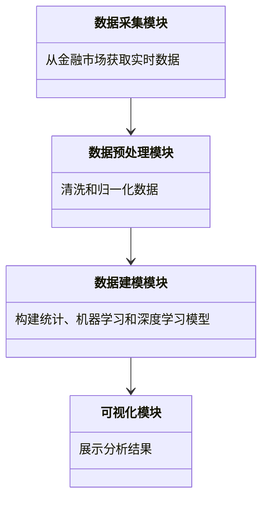

                 


# 价值投资中的新型高效光学计算材料技术

> 关键词：价值投资，光学计算材料，数据处理，金融建模，高效计算

> 摘要：本文探讨了光学计算材料在价值投资中的应用，分析了其在金融数据处理和建模中的优势，详细讲解了相关技术原理和实现方法，为投资者和技术开发者提供了新的视角和解决方案。

---

## 第1章 引言与背景

### 1.1 价值投资的基本概念

#### 1.1.1 价值投资的定义与核心理念
价值投资是一种以基本面分析为基础的投资策略，旨在通过识别被低估的资产来实现长期稳定的收益。其核心理念包括：
1. **内在价值**：评估资产的真实价值，而非其市场波动。
2. **安全边际**：买入价格低于内在价值，以降低风险。
3. **长期视角**：关注企业的长期表现而非短期波动。

#### 1.1.2 光学计算材料的定义与特性
光学计算材料是一种能够利用光的物理特性进行信息处理的新型材料。其主要特性包括：
1. **高速并行计算**：光信号的并行处理能力远超传统电子计算。
2. **低能耗**：光子计算相比电子计算能耗显著降低。
3. **高密度集成**：支持大规模集成，适合高性能计算需求。

#### 1.1.3 两者的结合与应用前景
将光学计算材料应用于价值投资，可以显著提升数据处理和建模的效率，特别是在处理海量金融数据和复杂模型时，其高速、低能耗的特点为企业级应用提供了新的可能性。

---

### 1.2 价值投资中的数据处理需求

#### 1.2.1 金融数据分析的特点
金融数据具有高频性、海量性、实时性等特点，对数据处理的速度和精度要求极高。

#### 1.2.2 数据处理的挑战与优化方向
传统电子计算在处理复杂金融模型时面临能耗高、速度慢等问题。光学计算材料的引入为解决这些问题提供了新思路。

#### 1.2.3 光学计算材料在数据处理中的优势
通过光学计算材料，可以实现数据的实时处理和快速建模，显著提升价值投资的效率和准确性。

---

### 1.3 本章小结

本章从价值投资的基本概念出发，介绍了光学计算材料的定义和特性，分析了其在金融数据处理中的潜力和优势。

---

## 第2章 光学计算材料的物理特性与分类

### 2.1 光学材料的基本特性

#### 2.1.1 折射率与吸收率
折射率决定光的传播方向，吸收率影响光的衰减程度，两者共同决定了材料的光学性能。

#### 2.1.2 薄膜材料与纳米材料
薄膜材料通过表面处理优化光学特性，纳米材料则通过尺寸效应实现高性能。

#### 2.1.3 光电效应与非线性光学特性
光电效应使材料能够将光信号转换为电信号，非线性光学特性则允许材料在强光作用下产生非线性响应。

---

### 2.2 光学计算材料的分类

#### 2.2.1 按功能分类
1. **光信号放大材料**：用于提升光信号强度。
2. **光信号调制材料**：用于对光信号进行编码。
3. **光信号处理材料**：用于执行复杂的计算任务。

#### 2.2.2 按应用场景分类
1. **金融数据处理材料**：专注于金融数据的高效处理。
2. **图像处理材料**：用于图像识别和分析。
3. **通用计算材料**：适用于多种计算任务。

#### 2.2.3 典型材料实例
- **铌酸锂**：广泛应用于光调制器。
- **石墨烯**：具有优异的光电性能。

---

### 2.3 光学计算材料的制备与表征

#### 2.3.1 材料制备方法
1. **外延生长法**：在衬底上生长单晶薄膜。
2. **溶胶-凝胶法**：通过化学反应制备纳米材料。
3. **物理气相沉积法**：通过真空沉积制备薄膜。

#### 2.3.2 材料性能表征技术
1. **光谱分析**：测量材料的吸收和发射光谱。
2. **电光效应测试**：评估材料的光电响应。
3. **拉曼光谱**：分析材料的晶体结构。

#### 2.3.3 材料优化与改性
通过掺杂、应力工程等方法优化材料性能，提升其在光学计算中的应用效果。

---

## 第3章 光学计算材料在数据处理中的应用

### 3.1 数据处理的基本流程

#### 3.1.1 数据采集与预处理
1. **数据采集**：从金融市场获取实时数据。
2. **数据清洗**：去除噪声和异常值。
3. **数据特征提取**：提取有助于价值投资的关键特征。

#### 3.1.2 数据分析与建模
1. **统计分析**：计算均值、方差等统计指标。
2. **机器学习模型**：使用回归、分类等算法进行预测。
3. **深度学习模型**：利用神经网络进行复杂建模。

#### 3.1.3 数据可视化与结果呈现
通过图表展示数据分析结果，帮助投资者直观理解市场趋势。

---

### 3.2 光学计算材料在数据处理中的优势

#### 3.2.1 高速并行计算能力
光学计算材料能够同时处理大量数据，显著提升计算速度。

#### 3.2.2 低能耗与高效率
相比传统电子计算，光学计算材料能耗更低，效率更高。

#### 3.2.3 可扩展性与灵活性
光学计算材料支持大规模并行计算，适用于复杂金融模型的构建。

---

### 3.3 典型应用案例分析

#### 3.3.1 金融时间序列分析
使用光学计算材料对历史价格数据进行建模，预测未来趋势。

#### 3.3.2 风险评估与投资组合优化
通过光学计算材料快速评估投资组合的风险，优化资产配置。

#### 3.3.3 市场情绪分析与预测
结合自然语言处理技术，利用光学计算材料分析新闻和社交媒体情绪，预测市场走势。

---

## 第4章 价值投资中的数据处理与建模

### 4.1 数据清洗与预处理

#### 4.1.1 数据清洗方法
1. **去除缺失值**：通过插值或删除方法处理缺失数据。
2. **去除异常值**：识别并处理异常数据点。
3. **去除重复值**：清理重复数据。

#### 4.1.2 数据标准化与归一化
1. **标准化**：将数据缩放到均值为0，方差为1。
2. **归一化**：将数据缩放到0-1范围。

#### 4.1.3 数据特征选择
通过统计检验和模型性能评估，选择对预测最重要的特征。

---

### 4.2 数据建模与分析

#### 4.2.1 传统统计模型
1. **线性回归**：预测目标变量与特征变量之间的线性关系。
2. **时间序列分析**：使用ARIMA模型预测未来趋势。

#### 4.2.2 机器学习模型
1. **支持向量机（SVM）**：用于分类和回归任务。
2. **随机森林**：通过集成学习提升模型性能。

#### 4.2.3 深度学习模型
1. **神经网络**：用于复杂非线性关系建模。
2. **长短期记忆网络（LSTM）**：适用于时间序列数据。

---

### 4.3 数据可视化与结果解释

#### 4.3.1 数据可视化工具与方法
1. **Matplotlib**：用于绘制折线图、柱状图等。
2. **Seaborn**：用于绘制统计图表。
3. **Plotly**：用于交互式可视化。

#### 4.3.2 可视化结果的解释
通过图表直观展示模型预测结果，帮助投资者理解市场趋势和投资机会。

---

## 第5章 系统分析与架构设计方案

### 5.1 问题场景介绍

#### 5.1.1 项目介绍
本项目旨在利用光学计算材料构建一个高效的价值投资数据分析系统，提升金融建模和预测的效率。

---

### 5.2 系统功能设计

#### 5.2.1 领域模型


---

### 5.3 系统架构设计


---

## 第6章 项目实战

### 6.1 环境安装

#### 6.1.1 安装Python环境
使用Anaconda安装Python 3.8及以上版本。

#### 6.1.2 安装依赖库
安装numpy、pandas、scikit-learn、matplotlib等库。

---

### 6.2 系统核心实现源代码

```python
# 数据预处理代码
import numpy as np
import pandas as pd

# 读取数据
data = pd.read_csv('financial_data.csv')

# 清洗数据
data.dropna()  # 删除缺失值
data = data[~data.duplicated()]  # 删除重复值

# 归一化处理
from sklearn.preprocessing import MinMaxScaler
scaler = MinMaxScaler()
data_scaled = scaler.fit_transform(data)

# 构建模型
from sklearn.ensemble import RandomForestRegressor
model = RandomForestRegressor(n_estimators=100, random_state=42)
model.fit(data_scaled, target_variable)

# 可视化结果
import matplotlib.pyplot as plt
plt.figure(figsize=(10, 6))
plt.plot(model.predict(data_scaled), label='预测值')
plt.plot(target_variable, label='真实值')
plt.legend()
plt.show()
```

---

### 6.3 代码应用解读与分析

#### 6.3.1 数据预处理
使用numpy和pandas进行数据清洗和归一化，确保数据质量。

#### 6.3.2 数据建模
采用随机森林回归模型进行预测，模型参数选择和调优是关键。

#### 6.3.3 可视化结果
通过Matplotlib绘制预测值与真实值的对比图，直观展示模型性能。

---

### 6.4 案例分析与详细讲解剖析

#### 6.4.1 数据来源与特征选择
从实际金融市场数据出发，选择影响股票价格的关键特征，如市盈率、市净率等。

#### 6.4.2 模型训练与评估
通过交叉验证评估模型性能，调整参数以优化预测效果。

#### 6.4.3 结果分析与策略制定
根据模型预测结果制定投资策略，如买入低估值股票，卖出高估值股票。

---

## 第7章 总结与展望

### 7.1 总结

本文详细探讨了光学计算材料在价值投资中的应用，分析了其在金融数据处理和建模中的优势，并通过实际案例展示了其在价值投资中的潜力。

---

### 7.2 展望

未来，随着光学计算材料技术的不断发展，其在价值投资中的应用将更加广泛，可能涉及到更多复杂金融模型的构建和优化。

---

## 作者

作者：AI天才研究院/AI Genius Institute & 禅与计算机程序设计艺术 /Zen And The Art of Computer Programming

---

**[End of Article]**

