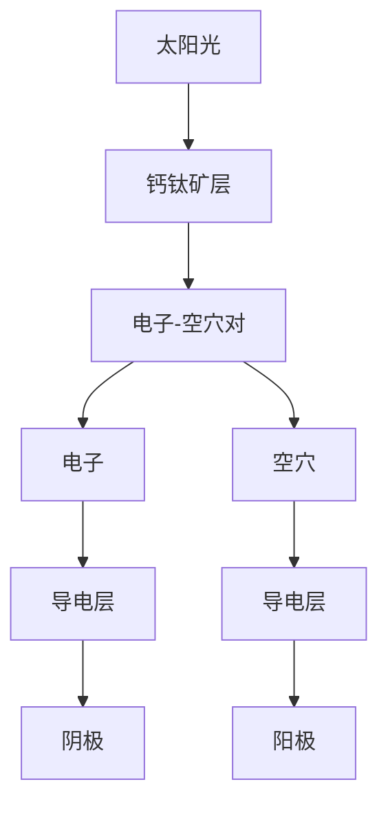
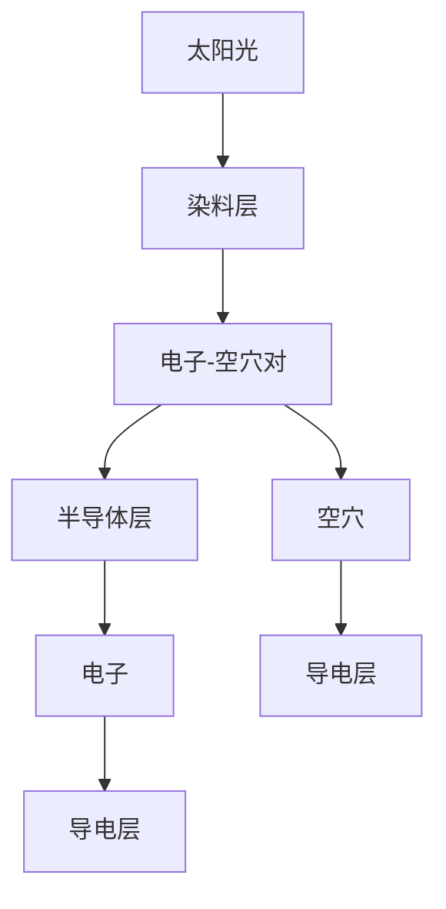

                 

# 价值投资中的新型高效太阳能电池技术

> 关键词：太阳能电池，钙钛矿，投资价值，技术发展，高效电池

> 摘要：本文深入探讨了新型高效太阳能电池技术在价值投资中的潜力和策略。通过分析钙钛矿等新型技术的原理、市场现状、投资价值评估以及未来趋势，为投资者提供了全面的视角和实用的指导。

---

## 第一章: 太阳能电池技术的发展与价值投资背景

### 1.1 太阳能电池技术的发展历程

#### 1.1.1 太阳能电池的基本原理
太阳能电池是一种将太阳光转化为电能的器件，其基本原理基于半导体材料的光电效应。当光子撞击半导体材料时，会激发电子，产生电流。太阳能电池的核心材料通常是晶体硅，但随着技术进步，新型材料如钙钛矿开始崛起。

$$ I = I_0 (e^{\frac{-E_g}{k T}} - 1) $$

其中，$I$ 是电流，$I_0$ 是反向饱和电流，$E_g$ 是带隙能量，$k$ 是玻耳兹曼常数，$T$ 是温度。

#### 1.1.2 太阳能电池的技术演进
太阳能电池的发展经历了多个阶段，从最初的单晶硅电池到后来的多晶硅电池，再到当前的薄膜电池和钙钛矿电池。每一代技术的改进都带来了效率的提升和成本的下降。

| 技术类型 | 效率 | 成本 | 优势 |
|----------|------|------|------|
| 单晶硅 | 15%-20% | 高 | 高效稳定 |
| 多晶硅 | 12%-18% | 中等 | 成本较低 |
| 薄膜电池 | 8%-12% | 低 | 灵活性高 |
| 钙钛矿 | 20%-30% | 中等 | 高效低成本 |

#### 1.1.3 太阳能电池的效率提升与成本下降
近年来，钙钛矿太阳能电池的效率突破了传统硅基电池的限制，同时生产成本显著降低。这一技术进步使得太阳能电池的经济性大幅提升，为投资带来了新的机遇。

---

### 1.2 价值投资的基本概念

#### 1.2.1 价值投资的核心理念
价值投资是一种长期投资策略，强调以低于内在价值的价格买入优质资产。其核心在于识别那些具有持续竞争优势和良好财务状况的企业。

#### 1.2.2 价值投资与技术创新的关系
技术创新是推动企业竞争优势的关键因素。在太阳能电池领域，技术创新不仅提升了产品效率，还降低了成本，从而增强了企业的市场竞争力和投资价值。

#### 1.2.3 太阳能电池技术在价值投资中的独特地位
太阳能电池技术的创新具有较高的技术壁垒和市场潜力，符合价值投资的核心理念。通过分析技术领先性、市场地位和财务健康状况，投资者可以识别出具有长期价值的企业。

---

## 第二章: 新型高效太阳能电池技术的背景与现状

### 2.1 新型高效太阳能电池的定义与分类

#### 2.1.1 钙钛矿太阳能电池的崛起
钙钛矿太阳能电池是一种基于有机无机杂化材料的新型电池，具有高效、低成本和易于制造的特点。其核心材料化学式为 $CH_3NH_3PbI_3$。

#### 2.1.2 其他新型高效电池技术
除了钙钛矿电池，还包括染料敏化电池（DSSC）和薄膜电池（CIGS）等技术。这些技术在效率和成本上各有优劣。

| 技术类型 | 优点 | 缺点 |
|----------|------|------|
| 钙钛矿电池 | 高效、低成本 | 稳定性待提升 |
| 染料敏化电池 | 灵活性高 | 效率较低 |
| 薄膜电池 | 成本低 | 效率有限 |

#### 2.1.3 各种技术的优缺点对比
钙钛矿电池在效率和成本方面具有显著优势，但其稳定性问题尚未完全解决。染料敏化电池和薄膜电池则在特定场景下表现出色。

---

### 2.2 新型高效太阳能电池技术的市场现状

#### 2.2.1 全球太阳能市场的发展趋势
全球太阳能市场呈现快速增长态势，2022年全球太阳能装机容量达到1000GW。钙钛矿电池因其高效性和低成本，被认为是下一代主流技术。

#### 2.2.2 中国在新型太阳能电池技术中的地位
中国在钙钛矿电池研发和产业化方面处于领先地位，多家企业已实现小规模量产。中国的政策支持和市场规模为技术创新提供了有力保障。

#### 2.2.3 技术创新对市场价值的影响
技术创新直接推动了市场价值的提升。钙钛矿电池的商业化将带来成本的进一步下降和效率的提升，从而增强企业的竞争力和投资吸引力。

---

## 第三章: 新型高效太阳能电池技术的核心原理

### 3.1 钙钛矿太阳能电池的原理

#### 3.1.1 钙钛矿材料的光电特性
钙钛矿材料具有优异的光电转换效率，其吸收光谱覆盖可见光区域。材料的能级结构决定了其高效的电荷分离和传输特性。

$$ E_g = E_{conduction} - E_{valence} $$

其中，$E_g$ 是带隙能量，$E_{conduction}$ 是导带能量，$E_{valence}$ 是价带能量。

#### 3.1.2 钙钛矿电池的工作原理
钙钛矿电池通过光生伏特效应将光能转化为电能。光子撞击钙钛矿层后，电子被激发，形成电子-空穴对。电子通过导电层流向阴极，空穴通过另一导电层流向阳极。

#### 3.1.3 钙钛矿电池的结构优化
通过优化电池结构，如增加透明导电层的导电性或改善钝化层的缺陷钝化能力，可以进一步提升电池效率。

---

### 3.2 其他新型电池技术的原理

#### 3.2.1 染料敏化太阳能电池
染料敏化电池通过染料吸收光能，激发电子，利用半导体材料进行电荷分离和传输。

#### 3.2.2 薄膜太阳能电池
薄膜电池通过沉积超薄半导体层来实现光电转换，具有低成本和高柔性的特点。

---

## 第四章: 新型高效太阳能电池技术的投资价值评估

### 4.1 价值投资的核心指标

#### 4.1.1 技术领先性评估
技术领先性是价值投资的重要指标，包括技术专利数量、研发团队实力和技术创新能力。

| 指标 | 重要性 | 评估方法 |
|------|--------|-----------|
| 专利数量 | 高 | 统计专利数量和质量 |
| 团队实力 | 中 | 调研团队背景 |
| 技术创新 | 高 | 对比技术路线 |

#### 4.1.2 市场竞争力评估
市场竞争力包括市场份额、竞争对手分析和市场前景预测。

| 指标 | 重要性 | 评估方法 |
|------|--------|-----------|
| 市场份额 | 高 | 调研市场数据 |
| 竞争对手 | 中 | 分析竞争对手布局 |
| 市场前景 | 高 | 预测市场规模和增长 |

#### 4.1.3 财务健康状况评估
财务健康状况包括收入、利润、现金流和资产负债情况。

| 指标 | 重要性 | 评估方法 |
|------|--------|-----------|
| 收入 | 高 | 分析财务报表 |
| 利润 | 高 | 计算利润率 |
| 现金流 | 中 | 评估现金流健康 |
| 资产负债 | 中 | 分析资产负债结构 |

---

### 4.2 投资价值评估的数学模型

#### 4.2.1 技术领先性评分模型
技术领先性评分模型通过加权评分法对企业的技术优势进行评估。

$$ V = \sum_{i=1}^{n} w_i x_i $$

其中，$V$ 是技术领先性评分，$w_i$ 是指标权重，$x_i$ 是指标评分。

#### 4.2.2 市场竞争力预测模型
市场竞争力预测模型通过回归分析预测企业的市场份额。

$$ S = \beta_0 + \beta_1 T + \beta_2 C + \epsilon $$

其中，$S$ 是市场份额，$T$ 是技术优势，$C$ 是成本优势，$\epsilon$ 是误差项。

---

## 第五章: 价值投资中的新型高效太阳能电池技术未来展望

### 5.1 未来技术发展趋势

#### 5.1.1 钙钛矿电池的技术瓶颈
钙钛矿电池的稳定性问题尚未完全解决，未来需要通过改进材料和工艺来提升其使用寿命。

#### 5.1.2 新型技术的突破
随着材料科学和纳米技术的进步，新型太阳能电池技术将不断涌现，进一步推动行业的发展。

---

### 5.2 投资机会与风险

#### 5.2.1 钙钛矿电池的投资机会
钙钛矿电池的商业化前景广阔，预计未来几年内将实现大规模量产，为投资者带来丰厚的回报。

#### 5.2.2 技术风险与市场风险
技术风险包括技术瓶颈和专利纠纷，市场风险包括政策变化和市场竞争加剧。

---

## 结论

新型高效太阳能电池技术的发展为价值投资带来了新的机遇。通过分析技术原理、市场现状和投资价值，投资者可以识别出具有长期潜力的企业。钙钛矿电池作为最具潜力的技术，将成为未来太阳能电池市场的主流。

---

作者：AI天才研究院/AI Genius Institute & 禅与计算机程序设计艺术 /Zen And The Art of Computer Programming

