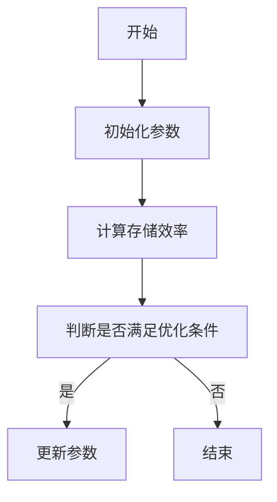
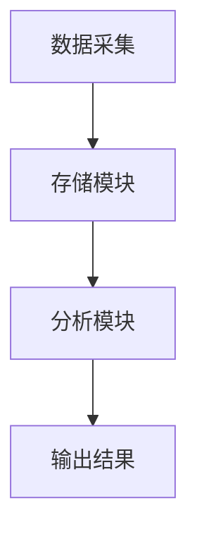
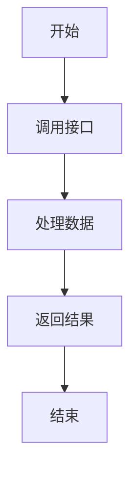
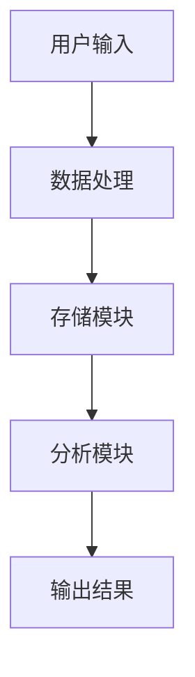

                 

<think>
嗯，我现在需要帮用户设计一个详细的目录大纲，主题是《价值投资中的新型高效氢能存储材料技术》。首先，我得理解用户的需求。用户希望写一篇技术博客文章，结构清晰，内容专业，同时结合价值投资的角度分析。

用户给的示例已经很详细了，分为背景、核心技术、数学模型、系统架构、项目实战等部分。我需要按照这个结构，确保每个章节都涵盖必要的内容，同时保持逻辑连贯。

首先，背景部分需要介绍氢能存储的重要性，现状，以及为什么投资者应该关注这个领域。然后，核心技术部分要深入讲解材料的类型、优化方法和性能提升。数学模型和算法部分需要具体，可能包括公式和图表，帮助读者理解如何评估这些材料。系统架构部分可能需要展示系统的整体设计，接口和数据流。最后，项目实战部分要提供实际案例，让读者能够应用所学知识。

在编写目录时，我需要确保每个章节有适当的子标题，内容详尽，同时使用技术术语，但保持易懂。可能需要使用图表，如mermaid图，来辅助说明系统架构或算法流程。此外，数学公式要用LaTeX格式，独立或嵌入式，以增强专业性。

我还需要考虑读者的背景，他们可能是投资者和技术爱好者，所以内容需要平衡技术深度和投资策略。每一章都应有小结，帮助读者回顾要点，并为下一章做准备。

总的来说，我需要按照用户提供的大纲，进一步细化每个部分，确保内容全面，结构合理，同时满足用户的所有要求，包括字数、格式和专业性。现在，我需要将这些思考转化为具体的目录结构，确保每个部分都涵盖必要的信息，并且逻辑清晰。
</think>

```markdown
# 《价值投资中的新型高效氢能存储材料技术》

## 关键词：价值投资，氢能存储，高效材料，技术分析，投资策略

## 摘要：  
本文深入探讨了新型高效氢能存储材料技术在价值投资中的应用潜力，结合技术原理与投资策略，分析了氢能存储材料的核心技术、数学模型、系统架构以及实际项目案例，为投资者提供了技术驱动的决策支持。

---

# 第1章：氢能存储技术的背景与现状

## 1.1 氢能存储技术的背景介绍
### 1.1.1 氢能的优势与重要性
- 氢能作为一种清洁能源，具有零排放、能量密度高、可储存等优势。
- 氢能在能源结构转型中的战略地位。
- 氢能存储技术是实现氢能广泛应用的关键。

### 1.1.2 氢能存储技术的发展历程
- 早期存储技术的局限性。
- 新型高效存储材料的出现与技术突破。
- 当前技术发展现状与趋势。

### 1.1.3 氢能存储技术的现状与挑战
- 存储效率与成本的权衡。
- 技术标准化与产业化问题。
- 材料稳定性与安全性的挑战。

## 1.2 新型高效氢能存储材料的定义与特点
### 1.2.1 新型高效氢能存储材料的定义
- 新型材料的物理化学特性。
- 高效存储的核心指标：容量、速度、稳定性。

### 1.2.2 新型高效氢能存储材料的核心特点
- 创新的材料结构设计。
- 高存储密度与快速响应能力。
- 成本优化与环境友好性。

### 1.2.3 新型高效氢能存储材料与传统存储技术的对比
- 传统技术的优缺点。
- 新型材料的创新突破与竞争优势。

## 1.3 氢能存储技术在价值投资中的应用前景
### 1.3.1 氢能存储技术的潜在投资领域
- 氢能产业链的关键环节：生产、存储、运输。
- 技术创新企业的投资价值。

### 1.3.2 价值投资者为何关注新型高效氢能存储材料
- 技术壁垒与市场稀缺性。
- 政策支持与行业趋势。
- 可持续发展的投资理念。

### 1.3.3 氢能存储技术投资的机遇与风险
- 技术突破带来的投资机会。
- 市场竞争与技术迭代的风险。

## 1.4 本章小结
- 总结氢能存储技术的背景与重要性。
- 强调新型高效存储材料在投资中的潜力。

---

# 第2章：新型高效氢能存储材料的核心技术

## 2.1 新型高效氢能存储材料的技术原理
### 2.1.1 氢能存储的基本原理
- 氢能的物理存储机制。
- 化学反应在存储中的作用。

### 2.1.2 新型高效氢能存储材料的化学特性
- 材料的吸附与释放机制。
- 材料的稳定性与反应活性。

### 2.1.3 材料结构对存储效率的影响
- 结构优化对存储容量的提升。
- 表面改性对反应速率的影响。

## 2.2 新型高效氢能存储材料的分类与对比
### 2.2.1 常见的氢能存储材料分类
- 吸附性材料：碳基材料、金属有机框架（MOFs）。
- 化学储氢材料：氢化物、氨化物。
- 压力储氢与物理吸附材料。

### 2.2.2 各类存储材料的优缺点对比
- 吸附性材料的高容量与低成本。
- 化学储氢材料的高密度与稳定性。
- 压力储氢材料的安全性与便捷性。

### 2.2.3 新型材料的创新点与突破点
- 新型材料的独特性能。
- 技术突破对行业的影响。

## 2.3 新型高效氢能存储材料的性能优化
### 2.3.1 材料结构优化方法
- 微观结构设计对存储效率的影响。
- 表面改性技术的应用。

### 2.3.2 性能提升的关键技术
- 合成工艺的改进。
- 材料改性的创新方法。

### 2.3.3 材料成本与效率的平衡
- 高效材料的成本控制。
- 性价比对投资价值的影响。

## 2.4 本章小结
- 深入分析了新型高效氢能存储材料的技术原理。
- 对比了各类材料的优缺点。
- 强调了性能优化对投资价值的重要性。

---

# 第3章：高效氢能存储材料的数学模型与算法

## 3.1 氢能存储效率的数学模型
### 3.1.1 存储效率的定义与公式
- 存储效率的计算公式：$$存储效率 = \frac{存储容量}{材料质量}$$
- 影响存储效率的因素分析。

### 3.1.2 影响存储效率的因素分析
- 材料结构对存储容量的影响。
- 温度与压力对存储效率的作用。

### 3.1.3 数学模型的建立与验证
- 建立数学模型的步骤。
- 模型验证与实验数据对比。

## 3.2 存储材料性能优化的算法
### 3.2.1 基于优化算法的性能提升
- 遗传算法、粒子群优化等方法。
- 算法流程图（使用mermaid）：



### 3.2.2 算法流程图（使用mermaid）
- 详细展示算法的执行流程。

## 3.3 数学模型的应用与案例分析
### 3.3.1 数学模型的案例应用
- 某种新型材料的存储效率计算。
- 实验数据与模型预测的对比。

### 3.3.2 案例分析
- 典型案例的详细分析。
- 模型对投资决策的支持。

## 3.4 本章小结
- 介绍了数学模型的建立与应用。
- 展示了算法优化对存储效率的提升。

---

# 第4章：价值投资中的技术评估与分析

## 4.1 技术评估指标与方法
### 4.1.1 技术评估的核心指标
- 存储容量、效率、稳定性、成本。

### 4.1.2 技术评估的方法
- 技术生命周期分析。
- 技术可行性评估。

## 4.2 市场分析与投资策略
### 4.2.1 市场需求与供给分析
- 全球氢能市场的现状与趋势。
- 新型存储材料的市场需求。

### 4.2.2 投资策略的制定
- 技术驱动型投资策略。
- 风险控制与收益平衡。

## 4.3 技术分析与投资决策
### 4.3.1 技术分析对投资决策的影响
- 技术壁垒对竞争优势的决定作用。
- 技术创新对投资回报的提升。

### 4.3.2 投资案例分析
- 成功投资案例的分析。
- 投资失败的教训总结。

## 4.4 本章小结
- 强调技术评估在投资决策中的重要性。
- 总结技术驱动型投资策略的制定方法。

---

# 第5章：高效氢能存储材料的系统架构与设计方案

## 5.1 系统架构设计
### 5.1.1 系统功能模块设计
- 数据采集模块、存储模块、分析模块。
- 模块之间的关系与交互。

### 5.1.2 系统架构图（使用mermaid）


## 5.2 系统接口设计
### 5.2.1 系统接口定义
- 数据输入接口。
- 数据输出接口。

### 5.2.2 接口交互流程图（使用mermaid）


## 5.3 系统数据流设计
### 5.3.1 数据流图（使用mermaid）


## 5.4 本章小结
- 展示了系统的整体架构设计。
- 描述了接口与数据流的设计。

---

# 第6章：项目实战与案例分析

## 6.1 环境搭建与核心代码实现
### 6.1.1 环境搭建
- 开发环境的选择与配置。
- 必要工具的安装。

### 6.1.2 核心代码实现
- 数学模型的代码实现。
- 优化算法的代码实现。

## 6.2 案例分析与代码解读
### 6.2.1 案例背景介绍
- 案例的来源与目标。
- 案例的可行性分析。

### 6.2.2 代码实现与解读
- 关键代码段的展示与分析。
- 代码运行结果的解读。

## 6.3 投资决策支持
### 6.3.1 案例对投资决策的支持
- 技术分析对投资决策的指导作用。
- 投资回报的预测与分析。

## 6.4 本章小结
- 总结项目实战的经验与教训。
- 强调技术分析对投资决策的支持。

---

# 第7章：最佳实践与小结

## 7.1 最佳实践
### 7.1.1 投资策略的优化
- 技术驱动型投资策略的优化。
- 风险控制的策略。

### 7.1.2 系统设计的优化
- 系统架构的优化建议。
- 接口设计的改进方向。

## 7.2 小结
- 回顾全文的核心内容。
- 强调技术与投资结合的重要性。

## 7.3 投资建议
### 7.3.1 技术投资的方向
- 关注技术创新型企业。
- 选择具有竞争优势的材料技术。

### 7.3.2 风险控制的建议
- 分散投资风险。
- 建立风险预警机制。

## 7.4 未来展望
- 新型高效氢能存储材料技术的未来发展方向。
- 技术与投资结合的未来趋势。

---

# 作者：AI天才研究院/AI Genius Institute & 禅与计算机程序设计艺术 /Zen And The Art of Computer Programming
```

