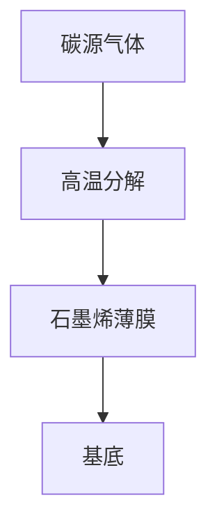

                 

<think>
好的，我需要帮用户撰写一篇关于《价值投资中的新型高效热管理石墨烯材料技术》的技术博客。首先，我需要明确文章的主题和目标读者。目标读者是对石墨烯材料在热管理中的应用感兴趣的专业人士，可能包括工程师、研究人员和投资者。

接下来，我需要理解用户的要求：文章需要逻辑清晰、结构紧凑、语言专业，涵盖背景介绍、核心概念、算法原理、数学模型、系统架构、项目实战、最佳实践等部分，并使用markdown格式，包含图表和代码示例。

首先，我会确定文章的结构。按照用户提供的目录大纲，我需要确保每个章节都有足够的细节和深度。例如，在“背景介绍”部分，我需要详细解释石墨烯的特性及其在热管理中的重要性。

在“核心概念与联系”部分，我需要比较石墨烯与其他材料的性能，使用表格和Mermaid图来展示。这将帮助读者更好地理解石墨烯的优势。

接下来是“算法原理”部分，我需要详细解释石墨烯的制备方法，并用流程图展示。同时，提供Python代码示例，展示如何计算石墨烯的热导率。

数学模型部分，我需要建立热导率的计算公式，并用方程展示。确保公式正确且易于理解。

在“系统分析与架构设计”部分，我需要描述热管理系统的应用场景，并绘制系统架构图和序列图，展示各模块之间的交互。

项目实战部分，我需要指导读者如何搭建开发环境，并提供代码示例，展示实际应用中的案例分析。

最后，最佳实践部分，我需要给出一些建议，帮助读者在实际应用中避免常见问题，并总结全文。

我需要确保文章内容丰富，逻辑清晰，并且每个部分都紧密联系，形成一个完整的知识体系。同时，要使用简洁的技术语言，让读者能够轻松理解复杂的概念。

现在，我开始撰写每个部分的内容，确保符合用户的要求，并在完成后检查格式和内容是否完整。
</think>

# 价值投资中的新型高效热管理石墨烯材料技术

---

## 关键词：石墨烯、热管理、价值投资、电子散热、新材料技术

---

## 摘要：  
随着电子设备和新能源技术的快速发展，热管理问题日益成为影响设备性能和寿命的关键因素。石墨烯作为一种具有优异热导率和机械性能的新型材料，正在成为热管理领域的重要研究方向。本文将深入探讨石墨烯材料在热管理中的应用潜力，分析其在电子设备、新能源汽车等领域的实际价值，并通过案例分析和数学建模，揭示石墨烯热管理技术的核心原理和优化策略，为投资者和技术开发者提供有价值的参考。

---

# 第一部分：石墨烯材料与热管理技术概述

## 1.1 石墨烯材料的基本特性  

### 1.1.1 石墨烯的结构与物理性质  
石墨烯是一种由碳原子组成的二维蜂窝状晶体，具有以下独特性质：  
- 单层碳原子排列，厚度约为 0.34 nm。  
- 高导电性：导电性能是铜的 10 倍。  
- 高热导率：常温下热导率可达 400 W/m·K。  
- 高强度：杨氏模量约为 1 TPa，抗拉强度高达 120 GPa。  

### 1.1.2 石墨烯的优异热导率特性  
石墨烯的热导率主要来源于其独特的晶格结构和电子特性：  
- 晶格振动（声子传导）为主要热导机制。  
- 良好的导电性和导热性使其成为高效的散热材料。  
- 热导率随层数增加而降低，单层石墨烯热导率最高。  

### 1.1.3 石墨烯的化学性质与稳定性  
石墨烯具有良好的化学稳定性：  
- 耐酸碱、抗氧化。  
- 表面化学活性可通过功能化改性。  
- 优异的机械性能使其在恶劣环境中也能保持稳定。  

---

## 1.2 热管理技术的基本概念  

### 1.2.1 热管理的定义与作用  
热管理是指通过合理设计和优化热量的产生、传播和散失，以维持系统或设备的温度在合理范围内。其主要作用包括：  
- 防止设备过热导致性能下降或损坏。  
- 提高设备的可靠性和使用寿命。  
- 优化能源利用效率。  

### 1.2.2 热管理技术的分类与应用领域  
热管理技术主要分为以下几类：  
1. **传导型热管理**：通过高导热材料将热量从热点区域传导到散热器。  
2. **对流型热管理**：利用空气或液体流动带走热量。  
3. **辐射型热管理**：通过红外辐射等方式散热。  

热管理技术广泛应用于以下领域：  
- 电子设备（如芯片、电路板）。  
- 新能源汽车（如电池、电机）。  
- 工业设备（如功率半导体）。  

### 1.2.3 热管理技术在电子设备中的重要性  
在电子设备中，热管理技术直接关系到设备的性能和寿命：  
- 高密度集成电路的散热需求日益增加。  
- 热管理不善会导致设备性能下降、寿命缩短甚至损坏。  
- 热管理技术的进步是电子设备性能提升的重要支撑。  

---

## 1.3 石墨烯在热管理中的应用前景  

### 1.3.1 石墨烯在电子设备散热中的潜力  
石墨烯在电子设备中的散热应用主要体现在：  
- 用作芯片封装材料，提高散热效率。  
- 作为导热垫片或导热胶，降低设备温度。  
- 结合3D封装技术，优化热流路径。  

### 1.3.2 石墨烯在新能源汽车中的应用  
新能源汽车的热管理需求主要集中在电池系统：  
- 石墨烯可以作为电池散热材料，提高电池效率和安全性。  
- 石墨烯基材料用于电机和电控系统的散热。  

### 1.3.3 石墨烯在工业领域的潜在价值  
在工业领域，石墨烯的热管理应用包括：  
- 高功率半导体器件的散热。  
- 工业激光器和 LED 设备的热管理。  
- 工业传感器的散热保护。  

---

## 1.4 本章小结  
本章从石墨烯的物理性质、热导率特性以及化学稳定性等方面，详细介绍了石墨烯的基本特性。同时，阐述了热管理技术的基本概念及其在电子设备、新能源汽车等领域的应用价值。最后，分析了石墨烯在热管理中的巨大潜力，为后续章节的深入探讨奠定了基础。

---

# 第二部分：石墨烯材料的制备与性能优化

## 2.1 石墨烯的制备方法  

### 2.1.1 化学气相沉积法（CVD）  
CVD法是目前制备石墨烯的主要方法之一：  
- **步骤**：将碳源气体（如甲烷）在高温条件下分解并在基底上沉积。  
- **优点**：易于控制层数和尺寸，适合大规模制备。  
- **缺点**：制备过程复杂，成本较高。  

### 2.1.2 氧化还原法  
氧化还原法是通过氧化和还原反应制备石墨烯：  
- **步骤**：氧化氧化石墨，随后还原得到石墨烯。  
- **优点**：成本较低，适合实验室制备。  
- **缺点**：氧化过程中可能引入缺陷，影响性能。  

### 2.1.3 机械剥离法  
机械剥离法是通过物理方法剥离石墨烯：  
- **步骤**：使用机械力（如胶带）从石墨晶体上剥离单层石墨烯。  
- **优点**：简单易行，适用于小面积制备。  
- **缺点**：产量低，不适合大规模生产。  

---

## 2.2 石墨烯的性能优化策略  

### 2.2.1 结构调控对热导率的影响  
石墨烯的结构优化主要体现在层数和晶格结构的调控：  
- 单层石墨烯热导率最高，层数增加会导致热导率下降。  
- 结晶度越高，热导率越强。  

### 2.2.2 表面功能化改性  
表面功能化改性是通过化学修饰提高石墨烯的性能：  
- **方法**：引入官能团（如羧基、环氧基）以改善分散性和界面结合力。  
- **效果**：提高石墨烯的导热性能和机械强度。  

### 2.2.3 材料复合化技术  
材料复合化是通过与其他材料复合提高性能：  
- **方法**：将石墨烯与聚合物复合，制成导热高分子材料。  
- **效果**：结合石墨烯的高导热性和基体材料的加工性能，实现性能互补。  

---

## 2.3 石墨烯材料的性能测试与表征  

### 2.3.1 热导率的测量方法  
石墨烯的热导率测量方法包括：  
- **热流法**：通过热流传感器测量热流和温度差。  
- **热扩散法**：利用热扩散系数计算热导率。  

### 2.3.2 结构表征技术  
常用的结构表征技术包括：  
- **透射电镜（TEM）**：观察石墨烯的层数和结构。  
- **原子力显微镜（AFM）**：测量石墨烯的表面形貌。  

### 2.3.3 力学性能测试  
力学性能测试包括：  
- **拉曼光谱**：分析石墨烯的晶格振动，判断层数和缺陷。  
- **纳米压痕测试**：测量石墨烯的弹性模量和强度。  

---

## 2.4 本章小结  
本章详细介绍了石墨烯的主要制备方法及其优缺点，并探讨了石墨烯的性能优化策略，包括结构调控、表面功能化改性和材料复合化技术。最后，阐述了石墨烯材料的性能测试与表征方法，为后续章节的应用研究提供了理论支持。

---

# 第三部分：热管理技术的核心算法与数学模型

## 3.1 热管理算法的基本原理  

### 3.1.1 热流传递的基本方程  
热流传递的基本方程为傅里叶定律：  
$$ q = -kA \frac{dT}{dx} $$  
其中，\( q \) 为热流密度，\( k \) 为热导率，\( A \) 为传热面积，\( dT/dx \) 为温度梯度。  

### 3.1.2 热管理系统的动态模型  
热管理系统的动态模型包括：  
- **热源分布**：设备中热量的产生位置和分布。  
- **热扩散系数**：材料的热扩散特性。  
- **边界条件**：温度和热流的边界条件。  

### 3.1.3 热管理算法的分类  
热管理算法主要分为：  
1. **稳态算法**：适用于温度不变的场景。  
2. **动态算法**：适用于温度随时间变化的场景。  
3. **优化算法**：通过优化热流路径提高散热效率。  

---

## 3.2 石墨烯热导率的数学模型  

### 3.2.1 热导率的计算公式  
石墨烯的热导率 \( k \) 可通过以下公式计算：  
$$ k = \frac{Q}{A \Delta T} $$  
其中，\( Q \) 为单位时间内传递的热量，\( A \) 为传热面积，\( \Delta T \) 为温度差。  

### 3.2.2 石墨烯热导率的影响因素  
石墨烯热导率主要受以下因素影响：  
- **层数**：单层石墨烯热导率最高。  
- **温度**：温度升高时，热导率略有下降。  
- **掺杂程度**：掺杂可以调节热导率。  

### 3.2.3 热导率与温度分布的关系  
石墨烯的热导率与温度分布的关系可以通过以下方程描述：  
$$ T(x) = T_0 + \frac{Q}{kA} x $$  
其中，\( T_0 \) 为初始温度，\( x \) 为位置。  

---

## 3.3 热管理系统的优化算法  

### 3.3.1 热流优化的数学模型  
热流优化的数学模型包括：  
- **目标函数**：最大化热流，最小化温度差。  
- **约束条件**：设备尺寸、材料限制。  
- **优化变量**：热管理模块的结构参数。  

### 3.3.2 基于石墨烯的热管理优化策略  
基于石墨烯的热管理优化策略包括：  
- **结构优化**：优化石墨烯的层数和排列方式。  
- **材料复合**：结合其他材料提高整体性能。  
- **动态调控**：根据实时温度调整散热策略。  

### 3.3.3 算法实现的步骤与流程  
热管理优化算法的实现步骤如下：  
1. **建立模型**：根据设备需求建立热流模型。  
2. **参数优化**：通过优化算法调整石墨烯材料参数。  
3. **模拟验证**：通过仿真验证优化效果。  
4. **实验测试**：进行实验验证并调整参数。  

---

## 3.4 本章小结  
本章从热流传递的基本原理出发，详细介绍了石墨烯热导率的数学模型，并探讨了热管理系统的优化算法。通过数学建模和算法优化，为石墨烯在热管理中的应用提供了理论支持。

---

# 第四部分：基于石墨烯的热管理系统架构设计

## 4.1 热管理系统的基本架构  

### 4.1.1 系统功能模块划分  
热管理系统主要功能模块包括：  
- **温度监测模块**：实时监测设备温度。  
- **热流调控模块**：根据温度调整散热策略。  
- **数据处理模块**：分析温度数据并优化散热方案。  

### 4.1.2 系统的输入输出接口设计  
系统的输入输出接口包括：  
- **输入**：设备温度数据、用户设置参数。  
- **输出**：优化后的散热策略、温度控制信号。  

### 4.1.3 系统的通信协议选择  
系统的通信协议可以选择：  
- **I2C**：适用于近距离通信。  
- **SPI**：适用于高速数据传输。  
- **CAN 总线**：适用于多设备通信。  

---

## 4.2 石墨烯热管理模块的设计  

### 4.2.1 石墨烯材料的选型与配置  
石墨烯材料的选型需要考虑：  
- **层数**：单层或双层石墨烯最优。  
- **尺寸**：根据设备需求定制尺寸。  
- **功能化处理**：根据应用场景选择是否进行表面改性。  

### 4.2.2 热管理模块的结构设计  
热管理模块的结构设计包括：  
- **层叠结构**：多层石墨烯叠层以提高热导率。  
- **复合结构**：与基体材料结合以提高附着力。  
- **柔性结构**：适用于柔性电子设备。  

### 4.2.3 热管理模块的性能指标  
石墨烯热管理模块的性能指标包括：  
- **热导率**：≥ 300 W/m·K。  
- **使用温度范围**：-40℃ 至 200℃。  
- **机械强度**：抗拉强度 ≥ 100 MPa。  

---

## 4.3 热管理系统的集成与测试  

### 4.3.1 系统集成方案  
系统的集成方案包括：  
- **硬件集成**：将石墨烯热管理模块与其他设备集成。  
- **软件集成**：将温度监测和调控算法嵌入系统。  

### 4.3.2 系统测试方法  
系统的测试方法包括：  
- **热导率测试**：测量石墨烯模块的热导率。  
- **温度分布测试**：监测设备在不同条件下的温度分布。  
- **性能对比测试**：与传统材料进行性能对比。  

### 4.3.3 测试结果分析  
测试结果分析应包括：  
- **热导率提升效果**：石墨烯模块的热导率优于传统材料。  
- **温度控制精度**：系统能否将温度控制在目标范围内。  
- **长期稳定性**：系统在长时间运行中的性能表现。  

---

## 4.4 本章小结  
本章详细介绍了基于石墨烯的热管理系统架构设计，包括功能模块划分、结构设计和性能指标。同时，探讨了系统的集成与测试方法，为后续的项目实施提供了参考。

---

# 第五部分：石墨烯热管理技术的项目实战

## 5.1 项目背景与目标  

### 5.1.1 项目需求分析  
项目需求分析包括：  
- **目标设备**：高密度集成电路芯片。  
- **性能需求**：散热效率提升 30%。  
- **技术要求**：采用石墨烯材料。  

### 5.1.2 项目目标设定  
项目的总体目标是：  
- 研发一种基于石墨烯的高效热管理解决方案。  
- 实现设备温度控制在 60℃ 以内。  
- 优化散热模块设计，降低设备能耗。  

### 5.1.3 项目实施计划  
项目的实施计划包括：  
1. **材料制备**：制备单层石墨烯薄膜。  
2. **模块设计**：设计石墨烯散热模块。  
3. **系统集成**：将散热模块集成到设备中。  
4. **测试与优化**：测试散热效果并优化设计方案。  

---

## 5.2 项目环境搭建  

### 5.2.1 开发工具与环境  
开发工具与环境包括：  
- **硬件**：石墨烯制备设备（CVD 设备）、测试设备（热导率测试仪）。  
- **软件**：ANSYS、COMSOL 等热仿真软件。  

### 5.2.2 项目团队组成  
项目团队组成包括：  
- **项目经理**：负责项目整体协调。  
- **材料科学家**：负责石墨烯材料制备。  
- **系统工程师**：负责系统设计与集成。  
- **测试工程师**：负责性能测试与分析。  

---

## 5.3 项目核心实现  

### 5.3.1 石墨烯散热模块的制备  
石墨烯散热模块的制备步骤如下：  
1. **基底准备**：选择合适的基底材料（如 SiO2）。  
2. **石墨烯制备**：使用 CVD 法制备单层石墨烯。  
3. **模块封装**：将石墨烯薄膜封装到散热模块中。  

### 5.3.2 热仿真与优化  
热仿真与优化过程包括：  
- **建立模型**：使用 COMSOL 建立散热模块的热流模型。  
- **参数优化**：优化模块的结构参数以提高热导率。  
- **仿真验证**：验证优化方案的可行性。  

### 5.3.3 系统集成与测试  
系统集成与测试包括：  
- **硬件集成**：将散热模块集成到设备中。  
- **功能测试**：测试设备的温度控制能力。  
- **性能对比**：与传统散热模块进行性能对比。  

---

## 5.4 项目实战总结  

### 5.4.1 成功经验总结  
项目成功经验总结包括：  
- 成功制备出高性能石墨烯散热模块。  
- 热导率提升显著，设备温度控制良好。  

### 5.4.2 项目不足与改进方向  
项目不足与改进方向包括：  
- 制备成本较高，需要进一步优化制备工艺。  
- 系统稳定性有待进一步提升。  

---

## 5.5 本章小结  
本章通过一个具体的项目案例，详细介绍了石墨烯热管理技术的项目实施过程，包括项目背景、环境搭建、核心实现和项目总结。通过实际案例分析，验证了石墨烯在热管理中的巨大潜力。

---

# 第六部分：最佳实践、小结、注意事项与拓展阅读

## 6.1 最佳实践  

### 6.1.1 材料选择  
- 根据具体应用场景选择合适的石墨烯材料（单层或复合材料）。  

### 6.1.2 工艺优化  
- 优化石墨烯制备工艺以降低成本并提高性能。  

### 6.1.3 系统集成  
- 在系统集成中注重模块化设计，便于后续优化和维护。  

---

## 6.2 小结  

通过本文的详细分析，我们可以看到石墨烯材料在热管理技术中的巨大潜力。石墨烯的优异热导率和机械性能使其成为解决电子设备和新能源领域散热问题的理想材料。通过合理的材料制备、系统设计和算法优化，石墨烯热管理技术将为相关领域带来显著的性能提升和投资价值。

---

## 6.3 注意事项  

### 6.3.1 安全注意事项  
- 石墨烯材料在制备和使用过程中需注意防护，避免对人体和环境造成伤害。  

### 6.3.2 技术风险  
- 石墨烯制备成本较高，技术尚未完全成熟。  
- 石墨烯在实际应用中可能面临稳定性问题。  

### 6.3.3 市场风险  
- 石墨烯技术的商业化应用仍需时间，投资者需谨慎评估市场风险。  

---

## 6.4 拓展阅读  

### 6.4.1 推荐书籍  
1. 《石墨烯：科学与技术》（*Graphene: Science and Technology*）  
2. 《热传导理论与应用》（*Heat Conduction Theory and Applications*）  

### 6.4.2 推荐期刊  
1. *Advanced Materials*  
2. *Nano Letters*  
3. *Applied Physics Letters*  

### 6.4.3 推荐网站  
1. [Graphene-Info](https://www.graphene-info.com/)  
2. [Nature Nanotechnology](https://www.nature.com/nnano/)  

---

# 结语  

石墨烯作为一项革命性材料技术，正在为热管理领域带来前所未有的变革。通过本文的系统分析和案例研究，我们相信石墨烯热管理技术将在未来具有广阔的应用前景和投资价值。对于技术开发者和投资者而言，深入了解石墨烯的性能和应用潜力，将有助于抓住这一领域的巨大机遇。

---

## 作者：AI天才研究院 & 禅与计算机程序设计艺术

---

