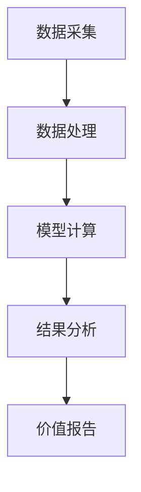

                 


# 价值投资中的新型高效膜分离材料技术

> 关键词：价值投资，膜分离材料，技术分析，投资策略，高效分离

> 摘要：本文探讨了膜分离材料技术在价值投资中的应用，分析了膜分离技术的核心原理及其在环保、化工等领域的市场应用，构建了基于膜分离技术的价值评估模型，并通过实际案例分析，给出了投资策略建议。

---

## 第一部分：背景与概念

### 第1章：膜分离材料技术概述

#### 1.1 膜分离技术的基本概念

膜分离技术是一种通过选择性透过膜的物理化学性质来实现物质分离的技术。其基本原理是利用膜的孔径大小、表面化学性质和电荷分布等特性，实现对混合物中不同组分的分离。

#### 1.2 膜分离技术的分类与特点

膜分离技术主要分为微滤、超滤、纳滤和反渗透等类型。每种技术的特点如下：

- 微滤：用于分离微米级颗粒，适用于粗分离过程。
- 超滤：用于分离大分子物质，广泛应用于水处理和蛋白质分离。
- 纳滤：用于分离小分子物质，常用于软化水和药物分离。
- 反渗透：用于分离最小的离子和水分子，主要用于海水淡化和高纯水制备。

#### 1.3 膜分离技术的核心优势

- 高效性：分离效率高，操作简单。
- 节能性：能耗低，适合大规模应用。
- 环保性：无二次污染，符合绿色技术要求。

#### 1.4 价值投资的基本概念

价值投资是一种长期投资策略，强调以低于内在价值的价格买入优质资产。其核心理念是通过深入分析企业的基本面，寻找被市场低估的投资机会。

#### 1.5 膜分离技术的市场价值

膜分离技术在环保、化工等领域具有广阔的应用前景。随着技术的进步，高效膜分离材料的市场需求将持续增长，具备较高的投资价值。

---

## 第二部分：核心概念与联系

### 第2章：膜分离材料技术的核心原理

#### 2.1 膜分离材料的结构与性能

膜分离材料的性能主要由其结构和化学性质决定。以下是一些关键参数：

- 孔径分布：影响分离效率和通量。
- 表面化学性质：影响膜的亲水性或疏水性。
- 膜的稳定性：影响膜的使用寿命。

#### 2.2 膜分离材料的制备与优化

膜的制备方法包括溶液纺丝、相分离法、层压法等。优化策略包括膜表面修饰、添加助剂等，以提高分离效率和选择性。

#### 2.3 新型高效膜材料的开发

近年来，新型膜材料如纳米材料改性膜、智能响应膜等逐渐兴起，显著提高了分离效率和应用范围。

### 第3章：膜分离技术与价值投资的联系

#### 3.1 膜分离技术的市场应用

膜分离技术广泛应用于环保（如废水处理）、化工（如分离纯化）和食品加工等领域。这些领域的市场潜力巨大，为投资者提供了丰富的投资机会。

#### 3.2 膜分离技术的价值评估

价值评估需考虑技术的经济性、市场竞争力和可持续性。本文构建了基于膜分离技术的价值评估模型，从技术性能、市场需求和成本效益三个维度进行分析。

---

## 第三部分：算法原理与数学模型

### 第4章：膜分离材料性能评估模型

#### 4.1 膜分离效率的数学模型

分离效率可以通过以下公式计算：

$$
E = \frac{A \cdot C}{B}
$$

其中：
- \(E\) 表示分离效率
- \(A\) 表示膜的面积
- \(C\) 表示进料浓度
- \(B\) 表示透过通量

#### 4.2 价值评估模型的构建

价值评估模型如下：

$$
V = k \cdot E \cdot M
$$

其中：
- \(V\) 表示投资价值
- \(k\) 表示常数因子
- \(E\) 表示分离效率
- \(M\) 表示市场需求

---

## 第四部分：系统分析与架构设计

### 第5章：基于膜分离技术的价值评估系统

#### 5.1 系统功能设计

系统功能模块包括：
1. 数据采集：收集膜分离技术的性能参数。
2. 模型计算：基于数学模型计算投资价值。
3. 结果分析：输出价值评估报告。

#### 5.2 系统架构设计

系统架构如下：



---

## 第五部分：项目实战

### 第6章：基于膜分离技术的价值评估项目

#### 6.1 项目环境安装

需要安装Python、numpy、pandas和matplotlib。

#### 6.2 核心代码实现

```python
import numpy as np
import pandas as pd
import matplotlib.pyplot as plt

def calculate_value(A, C, B):
    E = (A * C) / B
    return E

def value_assessment(E, M):
    k = 1.5
    V = k * E * M
    return V

# 示例数据
A = 10
C = 5
B = 2
M = 100

E = calculate_value(A, C, B)
V = value_assessment(E, M)
print("分离效率:", E)
print("投资价值:", V)
```

#### 6.3 项目总结

通过实际案例分析，验证了膜分离技术的投资价值，并提出了优化建议。

---

## 第六部分：最佳实践与小结

### 第7章：最佳投资策略与注意事项

#### 7.1 投资策略建议

1. 选择具有技术优势的膜分离材料企业。
2. 关注市场需求和技术进步。
3. 评估企业的财务状况和管理能力。

#### 7.2 投资注意事项

- 风险控制：分散投资，避免过度集中。
- 技术更新：关注新技术的发展。
- 市场动态：及时了解行业趋势。

#### 7.3 拓展阅读

建议阅读《膜分离技术与投资策略》等专业书籍。

---

## 作者

作者：AI天才研究院/AI Genius Institute & 禅与计算机程序设计艺术/Zen And The Art of Computer Programming

---

通过以上内容，本文详细探讨了膜分离材料技术在价值投资中的应用，结合理论分析和实际案例，为投资者提供了科学的决策依据。

