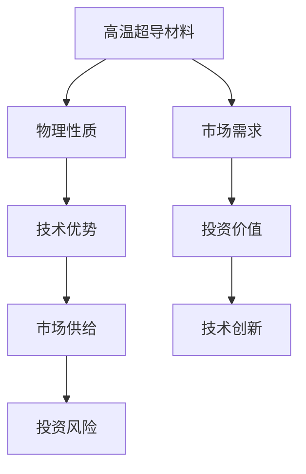
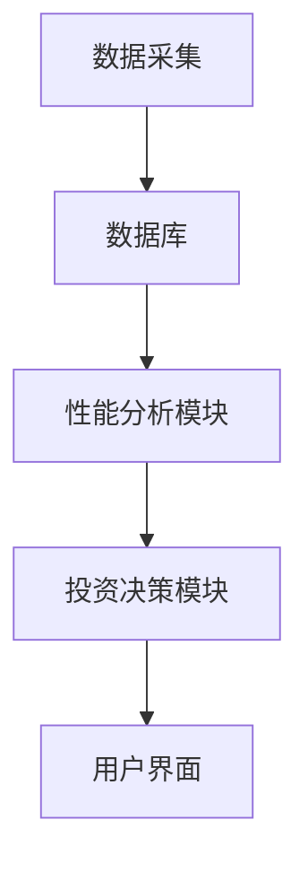

                 


# 价值投资中的新型高温超导材料应用

## 关键词：高温超导材料，价值投资，市场分析，技术创新，投资策略

## 摘要：本文探讨了高温超导材料在价值投资中的应用潜力，分析了其科学原理、市场价值和技术优势，并通过实际案例展示了如何将高温超导材料的性能数据转化为投资决策的依据。

---

# 第一部分: 高温超导材料与价值投资的背景介绍

## 第1章: 高温超导材料概述

### 1.1 高温超导材料的基本概念
#### 1.1.1 超导体的定义与基本特性
超导体是指在特定条件下（如低温、高压或强磁场）电阻降为零的材料。高温超导材料是在较高温度下（通常在液氮温区，即约77K）表现出超导特性的材料。这些材料具有零电阻、完全抗磁性和宏观量子特性。

#### 1.1.2 高温超导材料的发现与发展历程
高温超导材料的研究始于20世纪80年代，1986年，瑞士科学家马约拉纳和贝德林发现Ba-La-Cu-O体系具有超导性，这一发现引发了广泛的研究热潮。随后，许多新型高温超导材料不断被发现，如钇钡铜氧（YBCO）等。

#### 1.1.3 高温超导材料的分类与应用领域
高温超导材料主要分为铜基超导体和铁基超导体两大类。它们在能源、交通、医疗和通信等领域有广泛应用，如超导电缆、磁悬浮列车、MRI设备和量子计算机等。

### 1.2 价值投资的基本原理
#### 1.2.1 价值投资的核心理念
价值投资强调以低于内在价值的价格购买优质资产，长期持有的投资策略。其核心在于识别具有持续竞争优势和良好管理的公司，关注其内在价值而非短期市场波动。

#### 1.2.2 价值投资在科技领域的应用
科技领域的投资需要关注技术创新、市场需求和公司竞争力。高温超导材料作为一项前沿技术，其市场潜力和商业应用前景是价值投资者关注的重点。

#### 1.2.3 高温超导材料在价值投资中的潜力
高温超导材料的广泛应用和技术创新使其成为高潜力的投资领域。投资者需要评估其市场需求、技术壁垒和商业化能力，以确定其投资价值。

---

## 第2章: 高温超导材料的核心概念与联系

### 2.1 高温超导材料的科学原理
#### 2.1.1 超导现象的发现与理论基础
超导现象由荷兰物理学家卡末林·昂内斯在1911年发现，其理论基础包括比克林-斯科特理论和伦敦方程。高温超导材料的发现突破了传统超导体的温度限制，为实际应用提供了更多可能性。

#### 2.1.2 高温超导材料的微观结构与特性
高温超导材料的微观结构复杂，涉及多种元素的排列组合。其超导机制尚未完全解析，但研究表明材料的电子结构和晶格动力学对其超导性能起关键作用。

#### 2.1.3 高温超导材料的物理性质与数学模型
高温超导材料的物理性质可以通过数学模型进行描述。例如，临界磁场和临界电流密度可以用以下公式表示：

$$ B_c = \frac{2\mu_0 H_{c}}{1 + \sqrt{\frac{\lambda^2}{H_{c}^2}}} $$

其中，$B_c$是临界磁场，$\mu_0$是真空磁导率，$H_c$是临界磁场，$\lambda$是相干长度。

### 2.2 高温超导材料与价值投资的关系
#### 2.2.1 高温超导材料的市场需求与供给分析
高温超导材料的需求主要集中在能源、交通和医疗等领域，但其供给受限于制备技术和成本。市场需求的快速增长与供给能力的不足可能导致投资机会的出现。

#### 2.2.2 高温超导材料的技术创新与投资机会
技术创新是高温超导材料发展的核心驱动力。投资者应关注技术突破带来的成本下降和新应用领域的扩展，这些都可能提升材料的市场价值。

#### 2.2.3 高温超导材料的市场风险与应对策略
高温超导材料的投资面临技术风险、市场风险和政策风险。投资者应通过多元化投资、风险评估和持续监控来降低风险。

### 2.3 核心概念与联系的表格对比
#### 2.3.1 高温超导材料与传统导体的性能对比

| 特性          | 高温超导材料 | 传统导体 |
|---------------|---------------|-----------|
| 电阻          | 0             | 高         |
| 临界电流密度  | 高            | 低         |
| 工作温度       | 高            | 低         |

#### 2.3.2 高温超导材料在不同领域的应用对比

| 领域         | 应用          | 优势         |
|--------------|---------------|--------------|
| 能源         | 超导电缆       | 低损耗       |
| 交通         | 磁悬浮列车     | 高速         |
| 医疗         | MRI设备       | 高精度       |

#### 2.3.3 高温超导材料的市场价值与技术难度对比

| 维度         | 市场价值       | 技术难度     |
|--------------|---------------|--------------|
| 需求量       | 高            | 中           |
| 技术壁垒     | 高            | 高           |

### 2.4 核心概念的ER实体关系图


---

## 第3章: 高温超导材料的算法原理

### 3.1 高温超导材料的性能分析算法
#### 3.1.1 性能数据分析
高温超导材料的性能数据包括临界电流、临界磁场、电阻率等。这些数据可以通过实验测量并存储在数据库中。

#### 3.1.2 数据分析与预测
使用回归分析等方法对高温超导材料的性能进行预测。例如，可以通过以下公式预测临界电流：

$$ I_c = aT + b $$

其中，$I_c$是临界电流，$T$是温度，$a$和$b$是回归系数。

#### 3.1.3 投资决策算法
基于性能数据分析和市场趋势分析，制定投资决策。例如：

1. 数据收集与预处理
2. 建立性能预测模型
3. 结合市场分析，评估投资价值
4. 制定投资策略

### 3.2 高温超导材料的数学模型
#### 3.2.1 基于回归的性能预测模型
$$ y = \beta_0 + \beta_1x + \epsilon $$

其中，$y$是目标变量（如临界电流），$x$是自变量（如温度），$\beta_0$和$\beta_1$是回归系数，$\epsilon$是误差项。

#### 3.2.2 基于时间序列的市场趋势模型
使用ARIMA模型预测市场趋势：

$$ y_t = \phi y_{t-1} + \theta \epsilon_t + \epsilon_{t-1} $$

其中，$y_t$是当前市场趋势，$\phi$是自回归系数，$\theta$是滑动平均系数，$\epsilon_t$是当前误差项。

### 3.3 高温超导材料的系统分析与架构设计
#### 3.3.1 系统功能设计
- 数据采集与存储
- 性能分析与预测
- 投资决策支持

#### 3.3.2 系统架构设计


---

## 第4章: 高温超导材料的项目实战

### 4.1 项目背景与目标
本项目旨在通过分析高温超导材料的性能数据，评估其市场价值，并制定投资策略。

### 4.2 环境安装与数据准备
#### 4.2.1 环境安装
- 安装Python、NumPy、Pandas、Scikit-learn等工具。
- 数据库安装与配置（如MySQL）。

#### 4.2.2 数据准备
从公开数据源获取高温超导材料的性能数据和市场数据，存储在数据库中。

### 4.3 系统核心实现
#### 4.3.1 性能预测模型实现
使用回归分析模型预测高温超导材料的临界电流：

```python
import numpy as np
from sklearn.linear_model import LinearRegression

# 数据准备
X = np.array([1, 2, 3, 4, 5]).reshape(-1, 1)
y = np.array([2, 3, 5, 6, 8])

# 建立模型
model = LinearRegression()
model.fit(X, y)

# 预测
new_X = np.array([[6]]).reshape(-1, 1)
print(model.predict(new_X))
```

#### 4.3.2 投资决策支持实现
基于回归模型和市场分析，生成投资建议。

### 4.4 实际案例分析
分析某高温超导材料公司的历史数据，预测其未来表现，并制定投资策略。

### 4.5 项目小结
总结项目成果，分析存在的问题，并提出改进建议。

---

## 第5章: 最佳实践与小结

### 5.1 最佳实践
- 关注技术创新和市场需求
- 建立完善的分析模型
- 多元化投资降低风险

### 5.2 小结
高温超导材料作为一项前沿技术，具有广阔的应用前景和投资潜力。投资者需要结合科学原理、市场分析和技术创新，制定合理的投资策略。

### 5.3 注意事项
- 高温超导材料的投资存在较高的技术风险和市场风险
- 需要持续关注技术创新和政策变化
- 建议分散投资，避免过度集中

### 5.4 拓展阅读
推荐相关书籍和论文，供读者进一步学习。

---

# 作者：AI天才研究院/AI Genius Institute & 禅与计算机程序设计艺术 /Zen And The Art of Computer Programming

