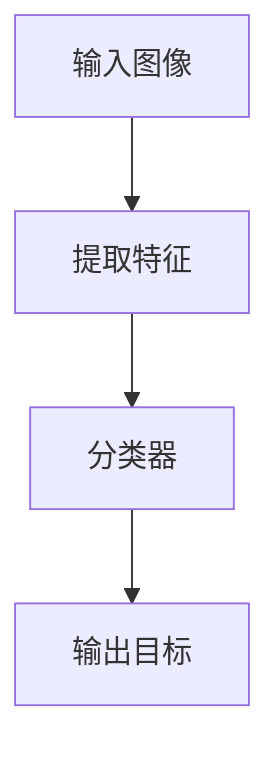
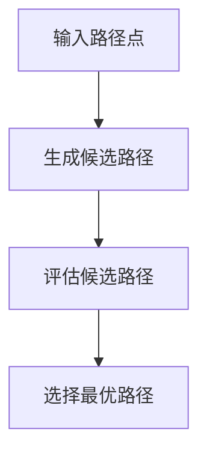
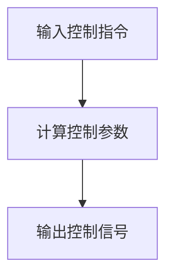

                 

<think>
嗯，用户希望我写一篇关于《价值投资中的无人驾驶技术前景》的技术博客文章。首先，我需要理解用户的需求，他们希望文章结构清晰，逻辑严谨，语言专业，同时包含多个部分，比如背景、核心技术、算法、经济价值、投资策略等。用户还特别提到要使用特定的格式，比如目录大纲，关键词，摘要，以及每个章节的具体内容。

我应该从哪里开始呢？首先，确定文章的标题和关键词。标题已经给出，关键词可能包括无人驾驶技术、价值投资、前景分析、投资策略、技术趋势。接下来是摘要，要简明扼要地概括文章的核心内容，强调技术与投资的结合。

然后，目录大纲需要详细列出各个章节和子章节，确保内容覆盖全面。比如，第一章介绍无人驾驶技术的背景与发展，第二章深入核心技术，第三章分析算法，第四章探讨经济价值，第五章讨论投资策略，第六章分析市场动态，最后是小结和展望。

在写作过程中，每个章节都需要详细展开。例如，在核心技术部分，我需要解释感知、决策和执行系统的原理，并使用图表来辅助说明。在算法部分，可能需要用mermaid流程图和Python代码来展示具体的实现，同时给出数学模型。

接下来，我需要确保每个部分都符合用户的要求，比如使用markdown格式，包含mermaid图表，数学公式用latex表示，并在每个章节中加入具体的代码示例。同时，要加入一些小贴士和注意事项，帮助读者更好地理解和应用这些内容。

最后，整篇文章要保持逻辑连贯，从背景到技术，再到经济和投资，层层递进，确保读者能够全面理解无人驾驶技术的前景及其投资价值。同时，结尾部分需要总结全文，并给出未来展望，让读者对未来趋势有清晰的认识。

总之，我需要一步步按照用户的指示，构建一个结构清晰、内容详实的技术博客，涵盖无人驾驶技术的各个方面，帮助读者从技术到投资全面了解这一领域。
</think>

# 价值投资中的无人驾驶技术前景

## 关键词：无人驾驶技术，价值投资，经济价值，投资策略，技术趋势

## 摘要：  
无人驾驶技术作为人工智能领域的前沿技术，正在逐步改变我们的出行方式。本文从技术背景、核心概念、算法原理、系统架构、经济价值、投资策略、市场动态等多个角度，深入分析无人驾驶技术的前景及价值投资机会。通过详细的技术分析和案例解读，帮助投资者和科技爱好者更好地理解无人驾驶技术的投资价值和未来发展趋势。

---

# 第1章：无人驾驶技术的背景与发展

## 1.1 无人驾驶技术的发展历程  
无人驾驶技术经历了从概念到实践的漫长发展历程。早期的无人驾驶技术主要用于军事领域，随着传感器技术、人工智能算法和计算能力的提升，无人驾驶技术逐渐进入民用领域，并取得了显著进展。  

---

## 1.2 无人驾驶技术的核心技术基础  
无人驾驶技术的核心技术包括感知、决策和执行三个部分：  
- **感知**：通过激光雷达、摄像头、雷达等传感器感知周围环境。  
- **决策**：基于感知数据，通过算法做出路径规划和行为决策。  
- **执行**：通过控制系统的执行机构实现车辆的自动驾驶。  

---

## 1.3 无人驾驶技术的现状分析  
目前，无人驾驶技术已在全球范围内取得显著进展。特斯拉、Waymo、百度等企业纷纷投入大量资源，推动无人驾驶技术的商业化进程。然而，技术瓶颈、法律法规和市场接受度等问题仍然制约着无人驾驶技术的大规模普及。  

---

## 1.4 无人驾驶技术面临的挑战  
无人驾驶技术的发展面临以下主要挑战：  
- **技术层面**：感知精度不足、算法优化空间有限。  
- **法律与伦理**：责任划分不明确、隐私保护问题。  
- **市场接受度**：用户信任度低、成本过高。  

---

# 第2章：无人驾驶技术的核心概念与联系

## 2.1 无人驾驶技术的核心原理  
无人驾驶技术的核心原理是通过传感器、算法和控制系统实现车辆的自动驾驶。感知系统负责采集环境数据，决策系统负责处理数据并制定行驶策略，执行系统负责执行决策并控制车辆运动。  

---

## 2.2 核心概念的属性对比  
以下是无人驾驶技术核心概念的属性对比表：  

| 核心概念 | 感知 | 决策 | 执行 |  
|----------|------|------|------|  
| 功能     | 采集环境数据 | 制定行驶策略 | 控制车辆运动 |  
| 输入     | 传感器信号 | 感知数据 | 决策指令 |  
| 输出     | 环境模型 | 行驶策略 | 控制指令 |  

---

## 2.3 ER实体关系图  
以下是无人驾驶技术的ER实体关系图：  

```mermaid
erd
  车辆
    - 车牌号 (主键)
    - 车型
    - 制造商
  感知系统
    - 传感器类型
    - 传感器ID (主键)
  决策系统
    - 算法类型
    - 算法版本 (主键)
  执行系统
    - 控制模块
    - 执行指令
  无人驾驶系统
    - 系统ID (主键)
    - 车辆ID (外键)
    - 感知系统ID (外键)
    - 决策系统ID (外键)
    - 执行系统ID (外键)
```

---

# 第3章：无人驾驶技术的算法原理

## 3.1 感知算法  
无人驾驶技术的感知算法主要用于识别道路、障碍物和行人。以下是目标检测算法的流程图：  



以下是目标检测算法的Python实现示例：  

```python
import tensorflow as tf
from tensorflow import keras

# 定义目标检测模型
model = keras.Sequential([
    keras.layers.Conv2D(32, (3,3), activation='relu'),
    keras.layers.MaxPooling2D((2,2)),
    keras.layers.Conv2D(64, (3,3), activation='relu'),
    keras.layers.MaxPooling2D((2,2)),
    keras.layers.Flatten(),
    keras.layers.Dense(64, activation='relu'),
    keras.layers.Dense(1, activation='sigmoid')
])

# 编译模型
model.compile(optimizer='adam', loss='binary_crossentropy', metrics=['accuracy'])

# 训练模型
model.fit(X_train, y_train, epochs=10, batch_size=32)
```

---

## 3.2 决策算法  
无人驾驶技术的决策算法主要用于路径规划和行为决策。以下是路径规划算法的流程图：  



以下是路径规划算法的数学模型：  

$$
\text{目标函数：} \quad \min_{x} \sum_{i=1}^{n} (x_i - x_{i-1})^2
$$

$$
\text{约束条件：} \quad x_0 = 0, \quad x_n = 1
$$

---

## 3.3 执行控制算法  
无人驾驶技术的执行控制算法主要用于实现车辆的自动驾驶。以下是执行控制算法的流程图：  



以下是PID控制算法的Python实现示例：  

```python
def pid_controller(target, current):
    # 计算误差
    error = target - current
    # 计算积分项
    integral += error * dt
    # 计算微分项
    derivative = (error - previous_error) / dt
    # 计算输出
    output = Kp * error + Ki * integral + Kd * derivative
    return output
```

---

# 第4章：无人驾驶技术的经济价值与投资机会

## 4.1 无人驾驶技术的市场价值  
无人驾驶技术的市场规模预计将在未来十年内迅速增长。根据市场研究机构的预测，到2030年，全球无人驾驶市场规模将达到数万亿美元。  

---

## 4.2 投资机会分析  
无人驾驶技术的投资机会主要集中在以下几个领域：  
- **硬件领域**：激光雷达、摄像头、芯片等。  
- **软件领域**：算法开发、地图服务等。  
- **服务领域**：无人驾驶出租车、物流配送等。  

---

## 4.3 无人驾驶技术的投资风险  
无人驾驶技术的投资风险包括：  
- **技术风险**：技术瓶颈可能导致商业化延迟。  
- **法律风险**：法律法规不完善可能导致市场不确定性。  
- **市场竞争风险**：行业竞争加剧可能导致利润下降。  

---

# 第5章：价值投资策略与模型

## 5.1 价值投资策略  
价值投资策略的核心是寻找被市场低估的无人驾驶技术相关企业。投资者需要关注企业的技术实力、市场前景和财务状况。  

---

## 5.2 投资模型构建  
以下是无人驾驶技术投资模型的构建步骤：  
1. **筛选目标企业**：选择具有技术优势的企业。  
2. **评估企业价值**：基于财务指标和市场前景进行估值。  
3. **制定投资策略**：根据风险偏好制定投资组合。  

---

# 第6章：无人驾驶技术的市场动态与未来展望

## 6.1 无人驾驶技术的市场动态  
目前，无人驾驶技术的市场动态主要集中在以下几个方面：  
- **技术突破**：感知算法和决策算法的优化。  
- **政策支持**：各国政府纷纷出台支持政策。  
- **商业化进程**：无人驾驶出租车和物流配送逐步落地。  

---

## 6.2 无人驾驶技术的未来展望  
未来，无人驾驶技术将朝着以下方向发展：  
- **技术融合**：与5G、人工智能等技术深度融合。  
- **市场扩展**：应用场景将更加多样化。  
- **生态完善**：产业链上下游协同创新。  

---

# 小结  
无人驾驶技术作为人工智能领域的前沿技术，具有广阔的应用前景和巨大的投资潜力。通过本文的分析，投资者可以更好地理解无人驾驶技术的核心价值和投资机会。未来，随着技术的不断进步和市场的逐步成熟，无人驾驶技术将成为改变人类生活的革命性技术。

---

# 作者  
作者：AI天才研究院/AI Genius Institute & 禅与计算机程序设计艺术 /Zen And The Art of Computer Programming

