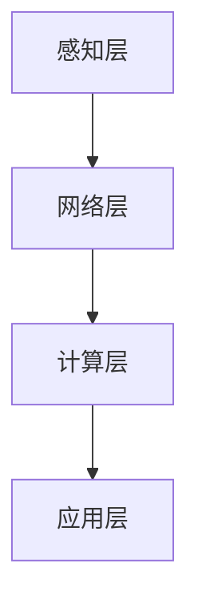
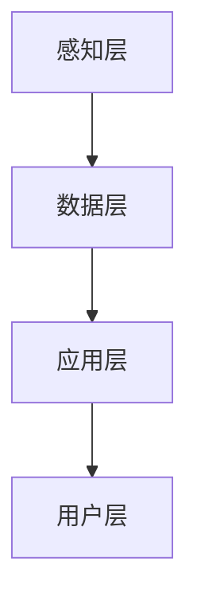
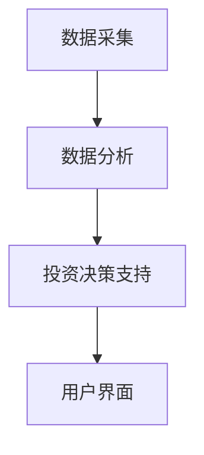

                 


# 价值投资中的智慧城市机会

> 关键词：智慧城市，价值投资，人工智能，大数据，物联网，区块链，投资机会

> 摘要：随着全球智慧城市建设的不断推进，智慧城市成为价值投资的重要领域。本文将详细分析智慧城市的定义、核心技术和价值投资的逻辑，探讨如何在智慧城市建设中发现投资机会，构建有效的投资模型，帮助投资者在智慧城市领域实现长期稳健的收益。

---

## 第一部分: 智慧城市与价值投资的背景与概念

### 第1章: 智慧城市的基本概念

#### 1.1 智慧城市的核心定义

##### 1.1.1 智慧城市的起源与发展
智慧城市的概念起源于20世纪末，随着信息技术的发展，城市化进程的加快，智慧城市建设逐渐成为解决城市化问题的重要手段。智慧城市建设以数字化、网络化、智能化为特征，旨在通过技术创新提升城市管理效率、优化资源配置、改善居民生活质量。

##### 1.1.2 智慧城市的特征与属性
智慧城市的特征包括：智能化、数据驱动、互联互通、可持续性、用户-centric。其核心属性是通过技术手段实现城市资源的高效利用和管理。

##### 1.1.3 智慧城市的技术架构与组成
智慧城市的架构通常包括感知层、网络层、计算层和应用层。感知层通过传感器采集数据，网络层实现数据传输，计算层进行数据处理，应用层提供智能化服务。



#### 1.2 价值投资的基本原理

##### 1.2.1 价值投资的定义与核心理念
价值投资是一种投资策略，强调以低于内在价值的价格购买优质资产。其核心理念是寻找市场低估的企业，长期持有，等待其价值回归。

##### 1.2.2 价值投资的三大支柱：安全边际、内在价值、市场先生
安全边际是投资时价格与内在价值的差额，确保投资的安全性；内在价值是企业未来现金流的现值；市场先生则指市场的波动性和非理性。

##### 1.2.3 价值投资与长期主义的关系
价值投资强调长期主义，关注企业的长期价值和持续盈利能力，而非短期市场波动。

#### 1.3 智慧城市与价值投资的结合

##### 1.3.1 智慧城市中的投资机会
智慧城市的建设涉及大数据、人工智能、物联网、区块链等技术，这些领域蕴含丰富的投资机会。

##### 1.3.2 智慧城市投资的核心逻辑
智慧城市建设需要大量的技术投入和长期运营，因此具备较高的进入门槛和可持续的盈利能力。

##### 1.3.3 智慧城市中的价值发现与长期收益
通过价值投资的方法，可以在智慧城市建设中发现被低估的企业和项目，实现长期稳健的收益。

---

## 第二部分: 智慧城市价值投资的系统分析与架构

### 第2章: 智慧城市与价值投资的系统架构

#### 2.1 系统架构的总体设计

##### 2.1.1 系统架构的分层与模块化
智慧城市建设可以分为感知层、数据层、应用层和用户层，每层都有不同的功能模块。



##### 2.1.2 核心模块的功能与交互关系
核心模块包括数据采集、数据分析、投资决策支持等，各模块之间通过数据流进行交互。



##### 2.1.3 系统架构的可扩展性与灵活性
系统架构应具备灵活性和可扩展性，以适应智慧城市建设的动态需求。

#### 2.2 系统功能设计

##### 2.2.1 数据采集与处理模块
通过传感器和物联网设备采集城市运行数据，如交通流量、环境监测等。

##### 2.2.2 数据分析与建模模块
利用大数据和人工智能技术对采集的数据进行分析和建模，识别投资机会。

##### 2.2.3 投资决策支持模块
基于分析结果，提供投资决策支持，包括风险评估和收益预测。


---

## 第三部分: 智慧城市价值投资的技术实现

### 第3章: 智慧城市价值投资的核心技术

#### 3.1 大数据与人工智能在智慧城市中的应用

##### 3.1.1 数据预处理与清洗
数据预处理是数据分析的第一步，包括数据清洗、转换和标准化。

```python
import pandas as pd

# 数据清洗示例
data = pd.read_csv('data.csv')
data = data.dropna()  # 删除缺失值
data = data[~data['price'].isnull()]  # 过滤掉价格为NaN的行
```

##### 3.1.2 机器学习模型的训练与优化
使用回归分析或分类算法对数据进行建模，预测城市发展的趋势和投资价值。

```python
from sklearn.linear_model import LinearRegression

# 线性回归示例
model = LinearRegression()
model.fit(X_train, y_train)
y_pred = model.predict(X_test)
```

##### 3.1.3 数据分析与投资决策
通过数据分析模型，评估智慧城市项目的价值和风险，为投资决策提供支持。

---

### 第4章: 智慧城市价值投资的系统测试与优化

#### 4.1 系统测试的策略与方法

##### 4.1.1 功能测试
验证系统功能是否符合设计要求，包括数据采集、分析和投资决策支持模块。

##### 4.1.2 性能测试
评估系统在高负载下的表现，确保系统的稳定性和响应速度。

##### 4.1.3 安全测试
检查系统是否存在安全隐患，确保数据的安全性和系统的抗攻击能力。

#### 4.2 系统优化与改进

##### 4.2.1 系统架构优化
通过优化系统架构，提升系统的可扩展性和灵活性。

##### 4.2.2 算法优化
改进算法模型，提高数据分析的准确性和效率。

---

## 第五部分: 智慧城市价值投资的未来展望

### 第5章: 智慧城市价值投资的未来趋势

#### 5.1 智慧城市技术的创新发展
随着技术的进步，智慧城市建设将更加智能化和个性化，为投资者提供更多机会。

#### 5.2 价值投资策略的优化与调整
投资者需要不断优化投资策略，关注新技术和新商业模式，以应对市场的变化。

#### 5.3 智慧城市与价值投资的深度融合
未来，智慧城市建设将与价值投资更加紧密地结合，形成新的投资模式和机会。

---

## 作者简介

作者：AI天才研究院/AI Genius Institute & 禅与计算机程序设计艺术 /Zen And The Art of Computer Programming

---

# 结语

智慧城市建设为价值投资提供了广阔的舞台，投资者需要结合技术分析和市场洞察，抓住智慧城市发展中的投资机会。通过系统化的分析和长期的持有，投资者可以在智慧城市建设中实现稳健的收益。

--- 

这篇文章系统地探讨了智慧城市建设中的价值投资机会，结合了技术分析和投资策略，为投资者提供了有益的参考和指导。

