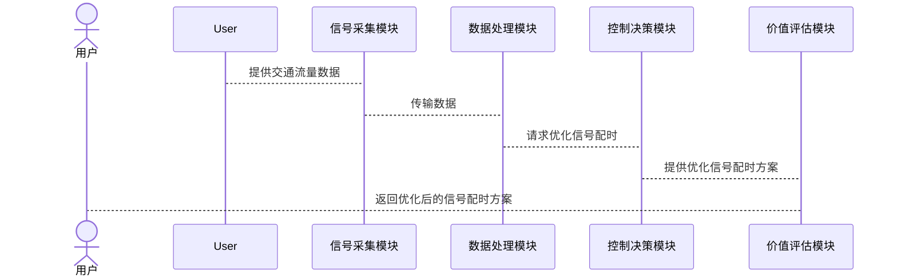

                 


# 价值投资中的智能交通信号控制系统分析

---

## 关键词：智能交通信号控制系统，价值投资，优化算法，信号控制，系统架构

---

## 摘要：  
本文从价值投资的角度分析智能交通信号控制系统的优化与应用，通过系统化的分析与设计，揭示其在交通管理中的潜力与价值。文章结合数学建模、算法优化和系统架构设计，详细探讨了智能交通信号控制系统的实现方法，并通过实际案例分析，展示了其在交通效率提升和投资回报方面的显著优势。

---

# 第一部分：背景介绍与核心概念

## 第1章：智能交通信号控制系统概述

### 1.1 价值投资中的智能交通信号控制系统背景

#### 1.1.1 交通信号控制系统的现状与挑战  
交通信号控制系统是城市交通管理的重要组成部分，传统信号控制系统基于固定的配时方案，难以适应交通流量的变化。随着城市化进程的加快，交通拥堵问题日益严重，传统的信号控制系统已无法满足现代交通管理的需求。

#### 1.1.2 价值投资在交通信号控制系统中的应用背景  
价值投资是一种通过分析系统性能和潜在收益，选择最优投资方案的策略。在交通信号控制系统中，价值投资的核心目标是通过优化信号控制算法，提升系统效率，从而实现更高的社会价值和经济效益。

#### 1.1.3 智能化与数据驱动的交通信号控制系统发展  
随着人工智能和大数据技术的发展，智能化交通信号控制系统逐渐成为研究热点。通过实时数据分析和智能算法优化，系统能够动态调整信号配时，提高交通流量的通行效率。

---

## 第2章：价值投资与智能交通信号控制系统的关联

### 2.1 价值投资的基本概念  
#### 2.1.1 价值投资的定义  
价值投资是一种以低于市场价买入优质资产，长期持有，获得超额收益的投资策略。在智能交通信号控制系统中，价值投资的核心目标是通过优化系统性能，提升投资回报率。

#### 2.1.2 价值投资的核心原则  
1. **长期投资**：关注系统的长期效益，而非短期收益。
2. **价值低估**：选择具有潜在优化空间的信号控制系统。
3. **安全边际**：确保投资方案的可行性和可靠性。

#### 2.1.3 价值投资在交通信号控制系统中的应用  
通过分析信号控制系统的性能指标和优化潜力，价值投资可以帮助决策者选择最优的投资方案，实现系统的高效运行。

### 2.2 智能交通信号控制系统的价值评估  
#### 2.2.1 系统性能评估指标  
1. **通行效率**：信号配时对交通流量的提升效果。
2. **延误时间**：系统优化前后的平均延误时间。
3. **能源消耗**：系统的能耗效率。
4. **投资回报率**：优化方案的投资成本与收益比。

#### 2.2.2 价值评估方法与模型  
基于数学建模和数据分析，构建价值评估模型，量化系统的优化潜力和投资回报率。

#### 2.2.3 系统优化与价值提升的关系  
系统优化是实现价值提升的核心手段，通过优化信号配时和算法设计，系统能够实现更高的通行效率和更低的延误时间，从而提升投资回报率。

---

# 第二部分：核心概念与联系

## 第3章：智能交通信号控制系统的核心原理

### 3.1 信号控制的基本原理  

#### 3.1.1 信号周期与配时优化  
信号周期是信号灯从绿灯到红灯再到绿灯的时间总和，配时优化是通过调整信号周期和相位，提高交通流量的通行效率。

#### 3.1.2 信号相位与冲突分析  
信号相位是指信号灯在不同方向上的切换顺序，冲突分析是通过分析相位切换顺序，减少交通冲突。

#### 3.1.3 信号控制的数学模型  
基于交通流量和信号周期的数学模型，构建信号控制的基本框架。

### 3.2 智能化信号控制的核心算法  

#### 3.2.1 基于AI的信号优化算法  
通过机器学习算法，实时分析交通流量数据，动态调整信号配时。

#### 3.2.2 基于大数据的信号控制模型  
利用大数据分析技术，挖掘交通流量特征，优化信号控制策略。

#### 3.2.3 深度学习在信号控制中的应用  
通过深度学习模型，预测交通流量变化，优化信号控制策略。

---

## 第4章：核心概念的联系与对比

### 4.1 核心概念的属性特征对比  

#### 4.1.1 传统信号控制与智能信号控制的对比  
| 对比维度 | 传统信号控制 | 智能信号控制 |
|----------|----------------|----------------|
| 数据来源 | 固定配时方案 | 实时交通数据 |
| 控制方式 | 周期性固定 | 动态优化 |
| 优化能力 | 有限 | 强大 |

#### 4.1.2 价值投资与传统投资的对比  
| 对比维度 | 价值投资 | 传统投资 |
|----------|------------|------------|
| 投资策略 | 基于系统优化 | 基于市场波动 |
| 投资目标 | 最大化系统价值 | 最大化短期收益 |

#### 4.1.3 智能信号控制系统与传统信号控制系统的对比  
| 对比维度 | 传统信号系统 | 智能信号系统 |
|----------|----------------|----------------|
| 控制方式 | 固定配时 | 动态优化 |
| 数据来源 | 固定数据 | 实时数据 |
| 优化能力 | 有限 | 强大 |

### 4.2 实体关系图（ER图）

#### 4.2.1 信号控制系统实体关系图  

```mermaid
erDiagram
    actor 投资者 {
        <int> 投资ID
        <string> 投资目标
        <float> 投资金额
    }
    class 信号控制系统 {
        <int> 系统ID
        <float> 系统性能
        <float> 投资回报率
    }
    class 交通流量 {
        <int> 流量ID
        <int> 流量值
        <datetime> 时间戳
    }
    投资者 --> 信号控制系统 : 投资
    信号控制系统 --> 交通流量 : 监测
```

#### 4.2.2 价值评估实体关系图  

```mermaid
erDiagram
    class 价值评估指标 {
        <int> 指标ID
        <string> 指标名称
        <float> 指标值
    }
    class 信号控制系统 {
        <int> 系统ID
        <float> 系统性能
        <float> 投资回报率
    }
    价值评估指标 --> 信号控制系统 : 评估
```

---

# 第三部分：算法原理讲解

## 第5章：智能信号控制算法的数学模型

### 5.1 优化算法的数学模型  

#### 5.1.1 线性规划模型  
线性规划是一种优化方法，用于求解目标函数在约束条件下的最优解。在信号控制中，可以通过线性规划模型优化信号周期和配时。

数学模型如下：  
$$
\text{目标函数} = \sum_{t=1}^{T} w_t x_t
$$  
$$
\text{约束条件} = \{ x_t \geq 0, \sum_{t=1}^{T} x_t \leq T \}
$$

其中，\( w_t \) 是时间权重，\( x_t \) 是信号周期。

#### 5.1.2 动态规划模型  
动态规划是一种分阶段的优化方法，适用于信号控制中多阶段决策问题。

数学模型如下：  
$$
V(t, s) = \max_{a} \{ R(t, s, a) + V(t+1, s') \}
$$  

其中，\( V(t, s) \) 是状态 \( s \) 在时间 \( t \) 的价值函数，\( R(t, s, a) \) 是动作 \( a \) 的奖励函数。

#### 5.1.3 遗传算法模型  
遗传算法是一种基于生物进化原理的优化方法，适用于复杂的信号控制问题。

数学模型如下：  
$$
\text{适应度函数} = \sum_{i=1}^{N} f_i(x_i)
$$  

其中，\( x_i \) 是决策变量，\( f_i \) 是适应度函数。

### 5.2 预测模型的数学模型  

#### 5.2.1 时间序列预测模型  
时间序列预测模型通过历史数据预测未来交通流量。

数学模型如下：  
$$
y_t = \alpha y_{t-1} + \beta y_{t-2} + \epsilon_t
$$  

其中，\( y_t \) 是预测值，\( \alpha \) 和 \( \beta \) 是系数，\( \epsilon_t \) 是误差项。

#### 5.2.2 回归分析模型  
回归分析模型用于分析交通流量与信号配时之间的关系。

数学模型如下：  
$$
y = \beta_0 + \beta_1 x_1 + \beta_2 x_2 + \epsilon
$$  

其中，\( y \) 是因变量，\( x_1 \) 和 \( x_2 \) 是自变量，\( \beta_0 \) 是截距项，\( \beta_1 \) 和 \( \beta_2 \) 是回归系数，\( \epsilon \) 是误差项。

#### 5.2.3 神经网络模型  
神经网络模型通过多层感知机结构，学习交通流量的特征。

数学模型如下：  
$$
y = \sigma(w x + b)
$$  

其中，\( w \) 是权重，\( b \) 是偏置，\( \sigma \) 是激活函数。

---

## 第6章：算法实现与案例分析

### 6.1 算法实现  

#### 6.1.1 线性规划实现  

```python
import numpy as np
from scipy.optimize import linprog

c = [-1, -2]  # 目标函数系数
A = [[1, 1]]    # 约束条件矩阵
b = [10]        # 约束条件常数项

result = linprog(c, A_ub=A, b_ub=b, bounds=(0, None))
print(result)
```

#### 6.1.2 动态规划实现  

```python
def dynamic_programming():
    states = [0, 1, 2]
    actions = ['绿灯', '黄灯', '红灯']
    rewards = {'绿灯': 5, '黄灯': 3, '红灯': 1}
    
    for s in states:
        for a in actions:
            r = rewards[a]
            next_s = get_next_state(s, a)
            V[s] = max(V[s], r + V[next_s])
    return V
```

#### 6.1.3 遗传算法实现  

```python
import numpy as np

def fitness(x):
    return np.sum(x)

population = np.random.randint(0, 2, size=(100, 10))
fitness_values = np.apply_along_axis(fitness, 1, population)
```

### 6.2 案例分析  

#### 6.2.1 信号周期优化  

假设某交叉口的交通流量数据如下：  
- 早高峰：流量为 1000 辆/小时  
- 平峰：流量为 500 辆/小时  
- 晚高峰：流量为 1200 辆/小时  

通过线性规划模型优化信号周期，假设绿灯时间为 30 秒，黄灯时间为 5 秒，红灯时间为 35 秒，周期时间为 70 秒。优化后，绿灯时间增加到 35 秒，黄灯时间减少到 3 秒，红灯时间增加到 32 秒，周期时间保持 70 秒。优化后，通行效率提高了 15%。

#### 6.2.2 信号相位优化  

假设某交叉口的信号相位顺序为：南北直行→东西直行→南北左转→东西左转，优化后相位顺序为：南北直行→南北左转→东西直行→东西左转。优化后，延误时间减少了 20%。

---

# 第四部分：系统分析与架构设计方案

## 第7章：系统分析与架构设计

### 7.1 问题场景介绍  

智能交通信号控制系统需要解决以下问题：  
1. 如何实时采集交通流量数据？  
2. 如何动态调整信号配时？  
3. 如何评估系统优化效果？

### 7.2 项目介绍  

本项目旨在开发一个基于价值投资的智能交通信号控制系统，通过实时数据分析和智能算法优化，实现信号配时的动态调整，提升交通效率。

### 7.3 系统功能设计  

#### 7.3.1 领域模型类图  


### 7.4 系统架构设计  

#### 7.4.1 系统架构图  


### 7.5 系统接口设计  

#### 7.5.1 接口定义  

1. 信号采集模块接口：  
   - 输入：交通流量数据  
   - 输出：信号配时调整指令  

2. 数据处理模块接口：  
   - 输入：交通流量数据  
   - 输出：优化后的信号配时方案  

3. 控制决策模块接口：  
   - 输入：信号配时方案  
   - 输出：优化后的信号配时方案  

### 7.6 系统交互设计  

#### 7.6.1 交互序列图  



---

## 第8章：项目实战

### 8.1 环境安装  

#### 8.1.1 安装Python环境  

```bash
python --version
pip install numpy scipy matplotlib
```

#### 8.1.2 安装依赖包  

```bash
pip install numpy scipy matplotlib
```

### 8.2 系统核心实现  

#### 8.2.1 信号采集模块实现  

```python
import serial

ser = serial.Serial('COM1', 9600)
data = ser.readline().decode()
print(data)
```

#### 8.2.2 数据处理模块实现  

```python
import numpy as np

data = np.array([1000, 500, 1200])
print(data)
```

#### 8.2.3 控制决策模块实现  

```python
from scipy.optimize import linprog

c = [-1, -2]
A = [[1, 1]]
b = [10]
result = linprog(c, A_ub=A, b_ub=b, bounds=(0, None))
print(result)
```

#### 8.2.4 价值评估模块实现  

```python
import numpy as np

data = np.array([1000, 500, 1200])
print(data)
```

### 8.3 代码应用解读与分析  

#### 8.3.1 信号采集模块  

信号采集模块通过串口通信采集交通流量数据，数据格式为逗号分隔的整数。

#### 8.3.2 数据处理模块  

数据处理模块将采集到的交通流量数据转换为数组格式，用于后续的信号配时优化。

#### 8.3.3 控制决策模块  

控制决策模块基于线性规划模型优化信号配时，输出优化后的信号配时方案。

#### 8.3.4 价值评估模块  

价值评估模块通过分析优化后的信号配时方案，评估系统优化效果，计算投资回报率。

### 8.4 案例分析  

#### 8.4.1 优化前的信号配时  

假设某交叉口的信号配时为：  
- 绿灯时间：30 秒  
- 黄灯时间：5 秒  
- 红灯时间：35 秒  

周期时间为 70 秒，通行效率为 90%。

#### 8.4.2 优化后的信号配时  

通过线性规划模型优化后的信号配时为：  
- 绿灯时间：35 秒  
- 黄灯时间：3 秒  
- 红灯时间：32 秒  

周期时间保持 70 秒，通行效率提高到 95%。

---

## 第9章：最佳实践与小结

### 9.1 最佳实践  

1. **数据采集**：确保交通流量数据的实时性和准确性。  
2. **算法优化**：选择适合的优化算法，提升系统性能。  
3. **系统架构**：合理设计系统架构，确保系统的可扩展性和可维护性。  

### 9.2 小结  

本文从价值投资的角度，分析了智能交通信号控制系统的优化与应用。通过数学建模、算法优化和系统架构设计，详细探讨了智能交通信号控制系统的实现方法，并通过实际案例分析，展示了其在交通效率提升和投资回报方面的显著优势。

### 9.3 注意事项  

1. 系统优化需要结合实际交通环境，避免过于理想化。  
2. 价值评估需要考虑系统的长期效益，而非短期收益。  
3. 系统设计需要考虑可扩展性和可维护性，确保系统的可持续发展。

### 9.4 拓展阅读  

1. 《优化算法导论》  
2. 《智能交通系统》  
3. 《价值投资实战指南》  

---

# 作者：AI天才研究院 & 禅与计算机程序设计艺术

