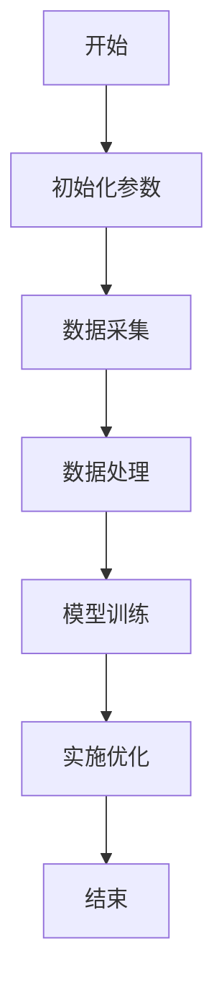
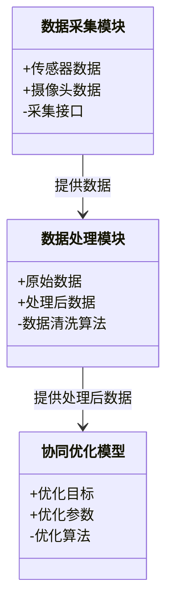
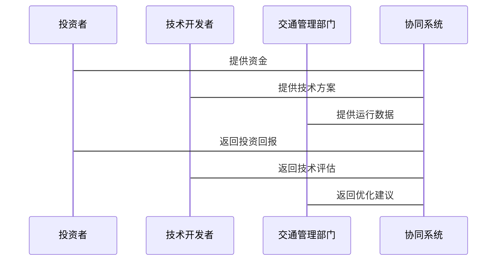

                 


# 价值投资中的智能交通自动驾驶协同系统分析

## 关键词：价值投资，智能交通，自动驾驶，协同系统，系统分析

## 摘要：本文分析了智能交通和自动驾驶协同系统在价值投资中的应用，探讨了协同系统的算法原理、系统架构设计、项目实战案例，并总结了最佳实践和未来展望。

---

# 第一部分: 背景介绍

## 第1章: 智能交通与自动驾驶协同系统的背景介绍

### 1.1 问题背景
#### 1.1.1 智能交通系统的发展现状
智能交通系统（ITS）利用先进技术优化交通管理，提升道路使用效率，减少拥堵和排放。随着城市化进程加快， ITS的应用越来越广泛。

#### 1.1.2 自动驾驶技术的崛起
自动驾驶技术通过AI和传感器实现车辆自主行驶，提高交通安全和效率。技术进步推动了自动驾驶的发展，但其大规模应用仍面临挑战。

#### 1.1.3 价值投资在智能交通中的作用
价值投资关注长期收益，通过分析技术与市场的结合点，识别投资机会，优化资源配置，推动技术创新。

### 1.2 问题描述
#### 1.2.1 智能交通与自动驾驶协同中的挑战
协同系统需整合交通数据、自动驾驶技术和投资策略，解决数据孤岛、技术兼容性和经济效益问题。

#### 1.2.2 价值投资在技术应用中的定位
价值投资需准确评估技术创新的经济价值，平衡短期成本与长期收益，识别高潜力项目。

#### 1.2.3 协同系统的目标与意义
协同系统旨在优化资源配置，提升交通效率，降低运营成本，实现技术与经济的双赢。

### 1.3 问题解决
#### 1.3.1 协同系统的构建思路
构建跨领域协同机制，整合数据流、技术应用和投资策略，确保系统高效运行。

#### 1.3.2 价值投资在系统优化中的应用
通过价值评估模型，优化投资决策，推动技术创新，提升系统整体效益。

#### 1.3.3 技术与经济的协同机制
建立技术评估和经济分析的桥梁，确保技术创新与市场应用的无缝对接。

### 1.4 边界与外延
#### 1.4.1 协同系统的边界界定
明确协同系统的范围，包括数据采集、处理、分析和应用环节，确保各部分协调工作。

#### 1.4.2 价值投资的适用范围
聚焦于技术创新和市场潜力，选择具有长期收益的项目进行投资。

#### 1.4.3 技术与经济的协同外延
协同系统不仅限于智能交通和自动驾驶，还可扩展到其他领域，如智慧城市和绿色能源。

### 1.5 概念结构与核心要素
#### 1.5.1 协同系统的构成要素
- 数据采集：传感器、摄像头、交通信号等。
- 技术应用：自动驾驶算法、路径优化模型。
- 经济模型：投资评估、收益预测。

#### 1.5.2 价值投资的核心要素
- 技术可行性：技术成熟度和市场前景。
- 经济可行性：投资回报率和风险评估。
- 战略协同性：与整体战略目标的契合度。

#### 1.5.3 技术与经济的关联结构
技术进步推动经济收益，经济收益支持技术创新，形成正向循环。

---

## 第2章: 智能交通与自动驾驶协同系统的核心概念

### 2.1 核心概念原理
#### 2.1.1 智能交通系统的原理
智能交通系统利用传感器和数据分析优化交通流量，减少拥堵，提高道路使用效率。

#### 2.1.2 自动驾驶技术的原理
自动驾驶通过环境感知、决策规划和执行控制实现车辆自主行驶，依赖AI算法和传感器。

#### 2.1.3 价值投资的原理
价值投资基于对企业基本面的深入分析，寻找市场低估的优质资产，长期持有，实现稳定收益。

### 2.2 概念属性特征对比
| 特性         | 智能交通系统 | 自动驾驶技术 | 价值投资 |
|--------------|--------------|--------------|----------|
| 核心技术     | 数据分析     | AI算法       | 财务分析 |
| 目标         | 提高交通效率 | 实现自动驾驶 | 实现收益 |
| 应用场景     | 交通管理     | 智能驾驶     | 投资决策 |

### 2.3 ER实体关系图

```mermaid
erDiagram
    actor 投资者 {
        string 资金
        string 投资目标
    }
    actor 技术开发者 {
        string 技术方案
        string 开发进度
    }
    actor 交通管理部门 {
        string 交通规则
        string 运行数据
    }
    investor --> 投资者 : 提供资金
    developer --> 技术开发者 : 提供技术方案
    trafficAuthority --> 交通管理部门 : 提供交通规则
    system --> 协同系统 : 综合管理
```

---

## 第3章: 协同系统的算法原理

### 3.1 算法原理概述
#### 3.1.1 协同系统的算法目标
实现智能交通和自动驾驶的数据共享、资源共享和信息协同，提升整体效率。

#### 3.1.2 算法的核心思想
通过数据融合、模型优化和协同控制，实现系统各部分的高效协作。

#### 3.1.3 算法的实现步骤
1. 数据采集：收集交通数据和自动驾驶数据。
2. 数据处理：清洗、整合和分析数据。
3. 模型训练：构建协同优化模型。
4. 实施优化：调整参数，优化系统性能。

### 3.2 算法流程图



---

## 第4章: 系统分析与架构设计

### 4.1 系统分析
#### 4.1.1 问题场景介绍
智能交通和自动驾驶协同系统需处理复杂的交通环境，协调各方资源，确保系统高效运行。

### 4.2 项目介绍
#### 4.2.1 系统功能设计
- 数据采集：传感器、摄像头等设备实时采集交通数据。
- 数据处理：清洗、分析数据，提取有用信息。
- 模型训练：构建协同优化模型，优化系统性能。

#### 4.2.2 领域模型



#### 4.2.3 系统架构设计


#### 4.2.4 接口设计
- 数据接口：模块间数据传输接口。
- 控制接口：系统控制指令接口。

#### 4.2.5 交互图



---

## 第5章: 项目实战

### 5.1 环境安装
1. 安装Python和相关库（如numpy、pandas、scikit-learn）。
2. 安装Mermaid和系统架构工具。

### 5.2 核心代码实现
```python
def协同优化算法():
    数据采集模块()
    数据处理模块()
    模型训练()
    优化实施()
    返回优化结果
```

### 5.3 代码解读
- 数据采集模块：从传感器获取实时数据。
- 数据处理模块：清洗和分析数据，提取特征。
- 模型训练：构建协同优化模型，训练参数。
- 优化实施：调整参数，优化系统性能。

### 5.4 案例分析
案例分析：假设一个城市实施协同系统，投资回报显著，交通效率提升。

---

## 第6章: 案例分析与最佳实践

### 6.1 案例分析
分析实际项目案例，评估协同系统的经济效益和社会效益。

### 6.2 最佳实践
- 数据质量管理：确保数据准确性和完整性。
- 技术评估：选择合适的技术方案。
- 投资策略：制定合理的投资计划。

---

## 第7章: 结论与展望

### 7.1 结论
协同系统在智能交通和自动驾驶中发挥了重要作用，价值投资为其提供了经济支持。

### 7.2 未来展望
随着技术进步和市场发展，协同系统将更加智能化，应用范围将扩大。

---

## 作者：AI天才研究院 & 禅与计算机程序设计艺术

---

## 注意事项
- 本文内容具有理论性和实践性，可供技术人员和投资者参考。
- 持续关注技术发展和市场动态，及时更新和优化协同系统。

