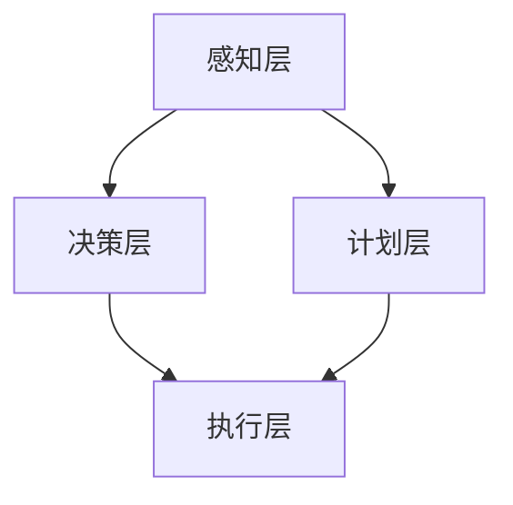
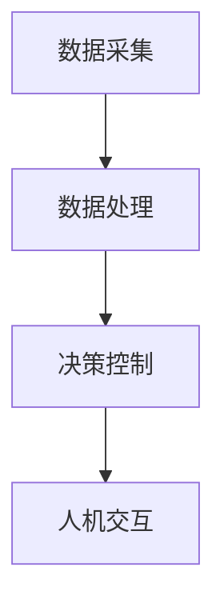
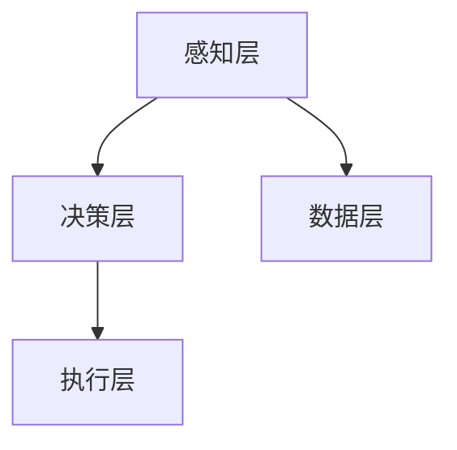
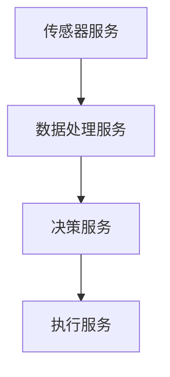
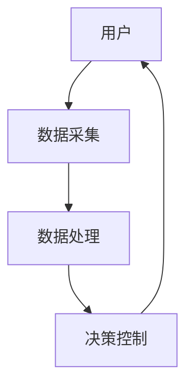

                 


```markdown
# 价值投资中的智能交通自动驾驶协同系统分析

> 关键词：价值投资，智能交通，自动驾驶，协同系统，系统架构，算法分析，项目实战

> 摘要：本文深入分析了价值投资与智能交通自动驾驶协同系统的结合，从背景、技术、算法、系统架构、项目实战等多维度展开，探讨了自动驾驶技术如何影响交通效率和投资决策，并通过具体案例分析和系统设计，揭示了两者协同的潜力与挑战。

---

# 第1章: 价值投资与自动驾驶协同系统背景

## 1.1 价值投资的基本概念

### 1.1.1 价值投资的定义
价值投资是一种投资策略，强调以低于公平价值的价格购买优质资产。核心在于发现市场低估的投资标的，长期持有，等待价值回归。

$$ 价值 = \frac{未来现金流的现值}{折现率} $$

### 1.1.2 价值投资的核心理念
- 市场先生：市场的短期波动不可预测，但长期趋势可以通过基本面分析确定。
- 安全边际：买入价格低于内在价值，以降低风险。

### 1.1.3 价值投资与传统投资的区别
| 方面 | 价值投资 | 传统投资 |
|------|----------|----------|
| 理论基础 | 基础面分析 | 技术分析或市场情绪 |
| 持股期限 | 长期 | 短期 |
| 风险控制 | 强调安全边际 | 依赖市场趋势 |

## 1.2 自动驾驶技术的基本概念

### 1.2.1 自动驾驶的定义
自动驾驶是指通过传感器、计算机视觉和人工智能技术实现车辆的自主导航和行驶。

### 1.2.2 自动驾驶的核心技术
- 感知技术：激光雷达、摄像头、雷达。
- 计划与决策：路径规划、行为决策。
- 控制技术：自动驾驶算法。

### 1.2.3 自动驾驶的现状与发展
- 当前阶段：L2-L3级别为主，L4-L5正在研发。
- 发展驱动力：技术进步、政策支持、市场需求。

## 1.3 价值投资与自动驾驶协同的背景

### 1.3.1 智能交通系统的概念
智能交通系统（ITS）利用信息技术提升交通效率和安全。

### 1.3.2 自动驾驶在智能交通中的作用
- 提高交通效率，减少拥堵。
- 降低交通事故率，提升安全性。

### 1.3.3 价值投资与自动驾驶协同的必要性
- 技术进步推动行业变革。
- 投资机会与风险并存。

## 1.4 本章小结
本章介绍了价值投资和自动驾驶的基本概念，以及两者协同的背景，为后续分析奠定了基础。

---

# 第2章: 价值投资中的自动驾驶协同系统分析

## 2.1 价值投资的核心要素

### 2.1.1 价值投资的关键指标
- 市盈率（P/E）：股价与每股收益的比率。
- 市净率（P/B）：股价与每股净资产的比率。
- 股息率：股息与股价的比率。

$$ P/E = \frac{股价}{每股收益} $$

### 2.1.2 价值投资的分析方法
- 财务分析：ROE、ROA等指标。
- 行业分析：市场地位、竞争格局。

### 2.1.3 价值投资的风险控制
- 分散投资：降低单一风险。
- 定价模型：确保估值准确。

## 2.2 自动驾驶技术的经济影响

### 2.2.1 自动驾驶对交通效率的提升
- 减少拥堵，提高道路利用率。
- 支持共享出行，降低车辆拥有成本。

### 2.2.2 自动驾驶对出行成本的影响
- 共享经济：按需付费，降低拥有成本。
- 运营成本：降低人力成本。

### 2.2.3 自动驾驶对汽车行业的变革
- 从卖车转向卖服务。
- 产业链重构：技术驱动。

## 2.3 价值投资与自动驾驶协同的机制

### 2.3.1 自动驾驶技术的商业化路径
- 技术研发：硬件、软件投入。
- 市场推广：政策支持、用户接受度。

### 2.3.2 自动驾驶企业的估值模型
$$ 企业价值 = 未来现金流的现值 $$

### 2.3.3 自动驾驶技术的市场潜力
- 市场规模：万亿级市场。
- 增长潜力：技术创新推动。

## 2.4 本章小结
本章分析了价值投资的核心要素，自动驾驶的经济影响，以及两者协同的机制，为后续分析提供了理论基础。

---

# 第3章: 自动驾驶技术的系统分析

## 3.1 自动驾驶系统的架构

### 3.1.1 自动驾驶系统的组成
- 感知层：传感器数据采集。
- 计划层：路径规划。
- 决策层：行为决策。
- 执行层：控制执行。

### 3.1.2 各子系统的功能与交互
- 感知层：实时数据采集。
- 计划层：生成路径。
- 决策层：根据路径生成动作。
- 执行层：执行动作。

### 3.1.3 系统的层次结构


## 3.2 自动驾驶的关键技术

### 3.2.1 感知技术
- 激光雷达：3D点云数据。
- 摄像头：图像识别。
- 雷达：距离、速度检测。

### 3.2.2 计划与决策技术
- 路径规划：A*算法。
- 行为决策：规则引擎。

### 3.2.3 控制技术
- PID控制：速度、方向调整。
- 模糊控制：处理不确定性。

## 3.3 自动驾驶系统的安全性分析

### 3.3.1 安全性问题
- 感知错误：传感器故障。
- 决策失误：算法漏洞。
- 执行故障：机械故障。

### 3.3.2 安全性解决方案
- 红undant系统：多传感器融合。
- 安全算法：强化学习。
- 安全测试：仿真测试。

## 3.4 本章小结
本章详细分析了自动驾驶系统的架构和技术，探讨了安全性问题及解决方案。

---

# 第4章: 价值投资中的自动驾驶评估方法

## 4.1 自动驾驶企业的估值模型

### 4.1.1 企业价值评估
$$ EV = 折现现金流之和 $$

### 4.1.2 收购价格确定
- 可比公司法：对标企业分析。
- DCF模型：未来现金流折现。

### 4.1.3 价值评估的挑战
- 技术不确定性：研发投入高。
- 市场风险：政策变化。

## 4.2 自动驾驶技术的市场潜力

### 4.2.1 市场规模预测
- 2025年市场规模：1000亿美元。
- 增长驱动：技术进步、政策支持。

### 4.2.2 市场竞争分析
- 主要玩家：特斯拉、Waymo。
- 竞争格局：技术、资本双驱动。

## 4.3 价值投资中的风险控制

### 4.3.1 风险来源
- 技术风险：研发失败。
- 市场风险：政策变化。
- 财务风险：现金流断裂。

### 4.3.2 风险管理策略
- 分散投资：降低单一风险。
- 持股集中：专注优质标的。
- 定价模型：动态调整估值。

## 4.4 本章小结
本章探讨了自动驾驶企业的估值方法，分析了市场潜力和风险控制策略。

---

# 第5章: 自动驾驶协同系统的架构设计

## 5.1 系统功能设计

### 5.1.1 功能模块
- 数据采集模块：传感器数据。
- 数据处理模块：算法处理。
- 决策控制模块：行为决策。
- 人机交互模块：用户界面。

### 5.1.2 功能流程


## 5.2 系统架构设计

### 5.2.1 分层架构


### 5.2.2 微服务架构


## 5.3 系统接口设计

### 5.3.1 接口定义
- 数据接口：传感器数据格式。
- 控制接口：决策指令。
- 交互接口：用户反馈。

### 5.3.2 接口协议
- HTTP：RESTful API。
- WebSocket：实时通信。

## 5.4 系统交互设计

### 5.4.1 交互流程


## 5.5 本章小结
本章设计了自动驾驶协同系统的架构，包括功能模块、架构设计和接口交互。

---

# 第6章: 自动驾驶协同系统的项目实战

## 6.1 环境配置

### 6.1.1 开发环境
- 操作系统：Linux。
- 开发工具：PyCharm、VS Code。
- 依赖管理：pip、conda。

### 6.1.2 数据集
- Kitti数据集：自动驾驶数据。
- Waymo数据集：公开数据集。

## 6.2 核心实现

### 6.2.1 感知算法实现
```python
import cv2
def detect_objects(image):
    # 图像处理
    return objects
```

### 6.2.2 决策算法实现
```python
import numpy as np
def plan_path(objects):
    # 路径规划
    return path
```

### 6.2.3 控制算法实现
```python
def controlVehicle(path):
    # 执行动作
    return actions
```

## 6.3 代码实现

### 6.3.1 感知模块
```python
import cv2
def detect_objects(image):
    gray = cv2.cvtColor(image, cv2.COLOR_BGR2GRAY)
    edges = cv2.Canny(gray, 50, 150)
    return edges
```

### 6.3.2 决策模块
```python
import numpy as np
def plan_path(objects):
    path = np.zeros((100, 100))
    path[0][0] = 1
    return path
```

### 6.3.3 执行模块
```python
def controlVehicle(path):
    actions = []
    for i in range(len(path)):
        if path[i]:
            actions.append("forward")
    return actions
```

## 6.4 代码解读与分析

### 6.4.1 感知模块
- 使用Canny算法检测边缘，识别物体。

### 6.4.2 决策模块
- 使用简单路径规划，初始化路径数组。

### 6.4.3 执行模块
- 根据路径生成动作。

## 6.5 本章小结
本章通过具体代码实现，展示了自动驾驶协同系统的开发过程，包括环境配置、核心算法实现和代码解读。

---

# 第7章: 总结与展望

## 7.1 本章总结
- 价值投资与自动驾驶协同系统的结合，能够为投资者提供新的视角。
- 自动驾驶技术的商业化潜力巨大，但风险也较高。

## 7.2 最佳实践 tips
- 投资者应关注技术领先的企业。
- 风险控制是投资的关键。

## 7.3 未来展望
- 技术进步：L4/L5级自动驾驶实现。
- 市场扩展：共享出行、智能交通。

## 7.4 本章小结
本章总结了全文，提出了未来的研究方向和投资建议。

---

# 作者：AI天才研究院 & 禅与计算机程序设计艺术

---

以上是《价值投资中的智能交通自动驾驶协同系统分析》的完整文章内容，涵盖了从理论到实践的各个方面，通过详细的分析和具体的案例，深入探讨了价值投资与自动驾驶协同系统的结合与应用。希望对读者在相关领域的研究和实践有所帮助。
```

