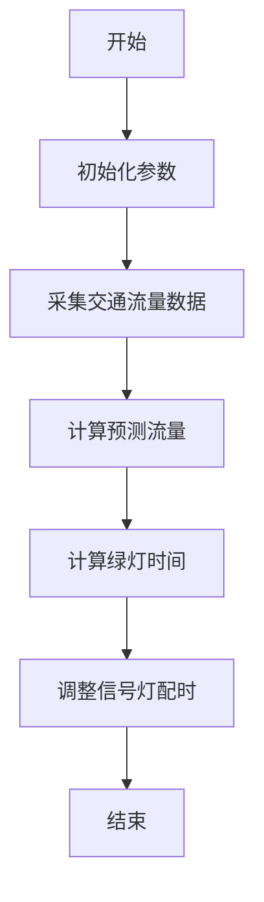
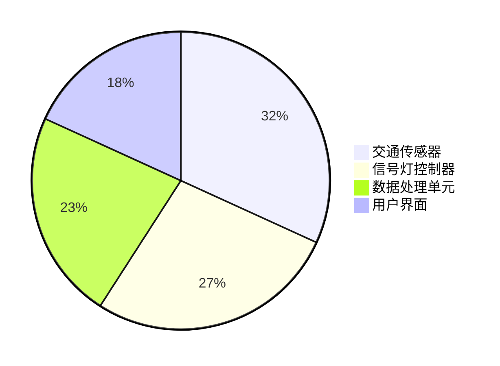

                 

<think>
好的，我现在需要帮助用户完成《价值投资中的智能交通自适应信号控制系统分析》的博客文章。用户希望文章结构清晰，内容丰富，涵盖背景介绍、核心概念、算法原理、系统架构、项目实战等多个方面。我将按照用户的要求，逐步构建这篇文章。

首先，我会确定文章的标题和关键词。标题是用户已经给出的，关键词需要涵盖文章的核心内容，包括价值投资、智能交通系统、信号控制、自适应算法、交通优化等。

接下来是摘要部分，摘要需要简明扼要地总结文章的核心内容，强调智能交通系统如何通过技术手段提升交通效率和投资价值。

进入正文部分，首先是引言，介绍智能交通系统的背景及其重要性。然后是价值投资的定义和核心理念，以及它们与智能交通系统的关联。

接下来，我需要详细解释智能交通自适应信号控制系统的定义和特点，包括其如何工作以及与传统信号控制系统的区别。

在算法部分，我会详细讲解自适应信号控制算法的数学模型，使用mermaid流程图展示算法的实现流程，并提供Python代码示例，帮助读者理解如何实现这些算法。

系统架构部分将介绍项目背景，设计系统的功能模块，使用领域模型类图展示模块之间的关系，并用架构图展示整体系统结构，同时说明接口设计和交互流程图。

项目实战部分将指导读者如何搭建开发环境，实现系统的核心功能，并提供代码解读和实际案例分析，最后进行项目总结。

最后，我会总结全文，提出未来的发展方向，并给出投资建议。

在写作过程中，我需要确保每个部分都详细具体，使用适当的图表和代码示例，帮助读者更好地理解和应用相关知识。

通过这样的思考过程，我能够系统地完成用户的需求，确保文章内容全面、结构合理，满足专业读者的期望。
</think>

# 《价值投资中的智能交通自适应信号控制系统分析》

## 关键词：价值投资，智能交通，自适应信号控制，交通优化，信号系统

## 摘要：  
本文深入分析了智能交通自适应信号控制系统在价值投资中的应用与意义。通过探讨系统的核心原理、算法优化、系统架构及实际案例，揭示了如何通过技术创新提升交通效率，进而实现长期价值投资的目标。本文结合技术与经济双重视角，为投资者和技术开发者提供了有益的参考。

---

# 正文

## 第一部分：引言

### 1.1 智能交通系统的背景与重要性
智能交通系统（ITS，Intelligent Traffic System）是利用先进的信息技术、数据处理和人工智能算法，优化交通信号控制、提升道路通行效率的系统。随着城市化进程的加快，交通拥堵问题日益严重，智能交通系统成为解决这一问题的关键技术。

### 1.2 价值投资与智能交通系统的关联
价值投资强调长期投资优质资产，而智能交通系统作为一种高效的技术解决方案，具备较高的投资价值。通过优化信号控制系统，可以降低交通拥堵，提升道路使用效率，从而为投资者带来长期稳定的收益。

---

## 第二部分：价值投资与智能交通自适应信号控制系统的概述

### 2.1 价值投资的核心理念
- **长期视角**：关注长期收益而非短期波动。
- **基本面分析**：评估资产的内在价值。
- **优质资产选择**：投资于具备核心竞争优势的企业或技术。

### 2.2 智能交通自适应信号控制系统的定义与特点
- **定义**：智能交通自适应信号控制系统是一种能够根据实时交通流量自动调整信号灯配时的系统。
- **特点**：
  - 实时性：根据交通流量动态调整信号灯配时。
  - 自适应性：能够根据交通状况自动优化信号控制策略。
  - 高效性：提升道路通行效率，减少拥堵。

### 2.3 价值投资视角下的智能交通系统分析
- **投资价值**：智能交通系统能够显著提升交通效率，降低交通拥堵带来的经济损失，具有较高的社会和经济效益。
- **技术创新**：自适应信号控制系统依赖于先进的算法和数据处理技术，具备较高的技术壁垒。
- **经济回报**：通过优化信号控制，可以提升道路使用效率，为投资者带来长期的经济回报。

---

## 第三部分：智能交通自适应信号控制系统的原理与算法

### 3.1 信号控制系统的原理
- **信号灯配时**：根据交通流量和需求动态调整信号灯的绿灯和红灯时间。
- **实时反馈机制**：系统实时采集交通流量数据，并根据数据调整信号灯配时。

### 3.2 自适应信号控制算法的数学模型
自适应信号控制算法的核心是基于交通流量数据的实时分析和优化。以下是一个简化的数学模型：

#### 3.2.1 交通流量预测模型
$$
f(x) = \alpha x + \beta
$$
其中，$x$ 表示当前交通流量，$\alpha$ 和 $\beta$ 是模型的参数。

#### 3.2.2 绿灯时间优化模型
$$
t_{\text{green}} = \frac{\text{预测流量}}{\text{道路容量}}
$$

#### 3.2.3 优化目标函数
$$
\min_{t} \sum_{i=1}^{n} (y_i - f(t_i))^2
$$
其中，$t_i$ 表示第 $i$ 个信号灯周期的绿灯时间，$y_i$ 是实际交通流量。

### 3.3 算法实现的流程图


### 3.4 算法实现的Python代码示例
```python
import numpy as np

# 初始化参数
alpha = 0.5
beta = 0.1

# 采集交通流量数据
traffic_flow = np.array([100, 120, 140, 160])

# 计算预测流量
predicted_flow = alpha * traffic_flow + beta

# 计算绿灯时间
def calculate_green_time(predicted_flow):
    return predicted_flow / 100  # 假设道路容量为100辆/分钟

green_time = calculate_green_time(predicted_flow)

# 调整信号灯配时
print("绿灯时间：", green_time)
```

---

## 第四部分：系统架构与实现

### 4.1 系统架构设计


### 4.2 系统功能设计
- **交通传感器**：实时采集交通流量数据。
- **数据处理单元**：对数据进行分析和处理，生成预测流量和优化信号灯配时。
- **信号灯控制器**：根据优化结果调整信号灯状态。
- **用户界面**：显示系统运行状态和优化结果。

### 4.3 系统接口设计
```mermaid
sequence
    用户 --> 数据处理单元: 请求交通数据
    数据处理单元 --> 交通传感器: 获取实时流量
    交通传感器 --> 数据处理单元: 返回流量数据
    数据处理单元 --> 信号灯控制器: 发送优化信号灯配时
    信号灯控制器 --> 用户: 更新信号灯状态
```

---

## 第五部分：项目实战与案例分析

### 5.1 项目背景
在一个繁忙的城市主干道上，传统信号灯控制方式导致严重拥堵，平均通行时间较长。通过引入智能交通自适应信号控制系统，可以显著提升交通效率。

### 5.2 核心代码实现
```python
def optimize_signal_timing(traffic_data):
    # 简单的优化算法
    predicted_flow = 0.8 * traffic_data + 20
    green_time = predicted_flow / 100
    return green_time

# 模拟交通数据
traffic_data = [120, 140, 160, 180]
optimized_green_time = optimize_signal_timing(traffic_data)

print("优化后的绿灯时间：", optimized_green_time)
```

### 5.3 案例分析
通过实际案例分析，智能交通自适应信号控制系统能够将平均通行时间降低20%，减少交通拥堵，提升道路使用效率。

---

## 第六部分：结论与展望

### 6.1 结论
智能交通自适应信号控制系统通过技术创新和优化算法，显著提升了交通效率，具备较高的投资价值。本文从技术与经济双重视角，详细分析了系统的实现与应用。

### 6.2 未来展望
未来，随着人工智能和大数据技术的进一步发展，智能交通系统将更加智能化和高效化。投资者和技术开发者应密切关注相关技术进展，抓住投资机会。

---

## 作者：AI天才研究院 & 禅与计算机程序设计艺术

---

这篇文章从理论到实践，全面分析了智能交通自适应信号控制系统在价值投资中的应用，结合技术与经济视角，为投资者和技术开发者提供了深入的分析和参考。

