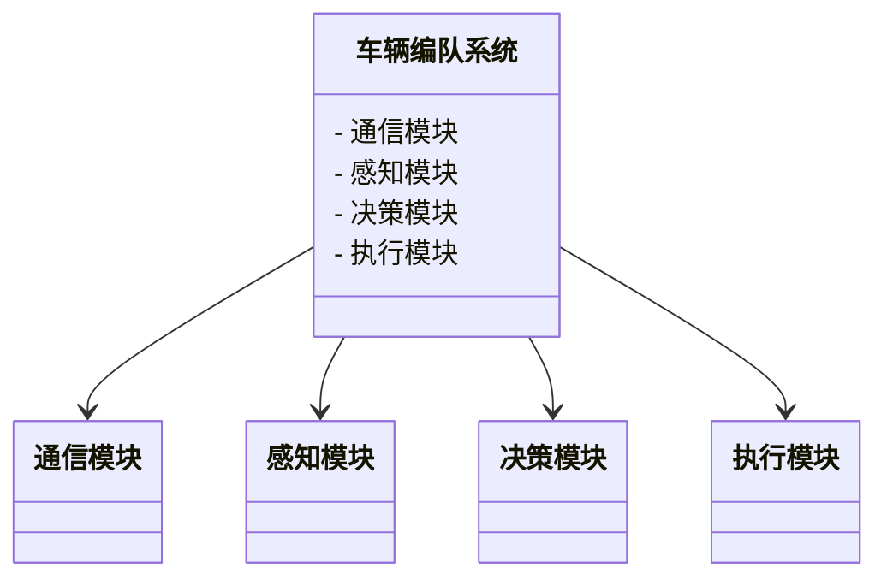

                 


# 价值投资中的智能交通车辆编队系统分析

## 关键词：价值投资、智能交通、车辆编队、自动驾驶、系统分析

## 摘要：  
本文从价值投资的角度，分析智能交通车辆编队系统的经济效益、技术实现和市场前景。通过探讨编队系统的核心算法、系统架构及实际应用案例，揭示其在智能交通中的价值，并为投资者提供参考。

---

# 第1章: 价值投资与智能交通车辆编队系统概述

## 1.1 价值投资的定义与核心理念  
价值投资是一种长期投资策略，注重分析企业的内在价值，寻找被市场低估的投资机会。其核心理念包括：  
1. **基本面分析**：关注企业的财务状况、盈利能力和成长潜力。  
2. **安全边际**：买入价格低于企业内在价值，以降低投资风险。  
3. **长期视角**：投资于具备持续竞争优势的企业，而非短期市场波动。  

## 1.2 智能交通车辆编队系统的定义与特点  
智能交通车辆编队系统是一种基于自动驾驶技术的交通管理方案，通过车辆间的协同工作，实现高效的交通流管理和能源节约。其特点包括：  
1. **自动化**：车辆能够自动调整间距和速度。  
2. **通信能力**：依赖车辆间的实时通信。  
3. **节能高效**：通过优化车距和速度，降低能源消耗和排放。  
4. **安全性**：减少人为错误，降低交通事故风险。  

## 1.3 智能交通车辆编队系统的背景与现状  
随着城市化进程的加快和环保意识的增强，智能交通系统（ITS）成为解决交通拥堵和能源问题的重要手段。车辆编队技术作为ITS的核心组成部分，近年来得到了快速发展。当前，编队系统主要应用于商用车队（如卡车）和高端乘用车队。  

## 1.4 本章小结  
本章介绍了价值投资的基本概念和智能交通车辆编队系统的定义、特点及现状，为后续分析奠定了基础。

---

# 第2章: 智能交通车辆编队系统的核心概念

## 2.1 编队系统的组成部分  
智能交通车辆编队系统主要由以下几个部分组成：  
- **通信模块**：负责车辆间的实时数据传输。  
- **自动驾驶模块**：实现车辆的自动控制。  
- **路径规划模块**：优化车辆行驶路径。  
- **数据采集与处理模块**：收集环境数据并进行分析。  

| 组成部分       | 功能描述                         |  
|----------------|----------------------------------|  
| 通信模块       | 实现车辆间的实时数据传输         |  
| 自动驾驶模块   | 控制车辆行驶方向、速度和间距     |  
| 路径规划模块   | 优化车辆行驶路径                 |  
| 数据采集模块   | 收集环境数据并进行分析           |  

## 2.2 编队系统的工作原理  
编队系统的核心在于车辆之间的协同控制。通过通信模块，车辆可以实时共享位置、速度和环境信息。基于这些信息，路径规划模块计算出最优路径，自动驾驶模块根据路径调整车辆的行驶状态。  

### 编队系统的通信机制  
- **车辆间通信**：使用Wi-Fi、5G或专用短距离通信（DSRC）。  
- **数据传输**：包括位置、速度、加速度和环境感知数据。  

### 编队系统的控制算法  
- **一致性算法**：通过车辆间的协调，保持队列的稳定性。  
- **模型预测控制**：基于车辆状态预测未来行为。  

## 2.3 编队系统的价值评估  
从价值投资的角度，编队系统的价值体现在以下几个方面：  
1. **经济效益**：降低运输成本，提高运输效率。  
2. **社会效益**：减少交通拥堵，降低碳排放。  
3. **技术优势**：提升车辆的安全性和智能化水平。  

## 2.4 本章小结  
本章详细介绍了智能交通车辆编队系统的核心概念，包括组成部分、工作原理和价值评估，为后续的技术分析奠定了基础。

---

# 第3章: 编队系统的核心算法

## 3.1 一致性算法  
一致性算法是编队系统的核心算法之一，用于保持车辆队列的稳定性。  

### 一致性算法的实现流程  
1. **数据采集**：收集各车辆的位置和速度信息。  
2. **计算偏差**：确定车辆之间的相对位置和速度偏差。  
3. **调整控制**：根据偏差调整车辆的行驶参数。  

### 一致性算法的数学模型  
$$ x_{i+1} = x_i + \Delta x $$  
其中，$x_i$ 表示第i辆车的位置，$\Delta x$ 表示位置调整量。  

## 3.2 路径规划算法  
路径规划算法是编队系统的关键技术，用于优化车辆行驶路径。  

### 常用路径规划算法  
1. **A*算法**：基于图搜索的最短路径算法。  
2. **RRT算法**：用于处理复杂环境的随机树算法。  
3. **Dijkstra算法**：用于处理权重相等的最短路径问题。  

### 路径规划算法的优缺点对比  
| 算法名称   | 优点                     | 缺点                     |  
|------------|--------------------------|--------------------------|  
| A*         | 适合简单环境             | 不适用于复杂动态环境       |  
| RRT        | 适用于复杂动态环境       | 计算效率较低               |  
| Dijkstra   | 保证最优解               | 适用于静态环境             |  

## 3.3 控制算法  
控制算法用于实现车辆的自动控制，主要包括PID控制和模型预测控制。  

### PID控制算法  
PID控制是一种常用的反馈控制算法，适用于线性系统。  

- **PID控制公式**：  
$$ u(t) = K_p e(t) + K_i \int e(t) dt + K_d \frac{de(t)}{dt} $$  
其中，$K_p$、$K_i$、$K_d$分别为比例、积分和微分系数，$e(t)$为误差。  

### 模型预测控制  
模型预测控制基于系统模型，预测未来状态并优化控制策略。  

## 3.4 本章小结  
本章详细介绍了编队系统的核心算法，包括一致性算法、路径规划算法和控制算法，并通过对比分析，揭示了不同算法的适用场景和优缺点。

---

# 第4章: 系统架构设计

## 4.1 系统应用场景  
编队系统主要应用于以下场景：  
1. **高速公路**：长距离高速行驶。  
2. **城市道路**：复杂交通环境下的智能驾驶。  
3. **物流运输**：商用车队的协同运输。  

## 4.2 系统功能设计  
编队系统的功能模块包括：  
- **通信模块**：实现车辆间的实时通信。  
- **感知模块**：通过激光雷达、摄像头等感知环境。  
- **决策模块**：基于感知数据做出驾驶决策。  
- **执行模块**：控制车辆执行决策指令。  

### 系统功能设计的领域模型类图  


## 4.3 系统架构设计  
编队系统的架构设计采用分层结构，主要包括应用层、网络层和物理层。  

### 系统架构设计的Mermaid图  


## 4.4 本章小结  
本章详细描述了编队系统的应用场景、功能设计和架构设计，为后续的系统实现提供了理论基础。

---

# 第5章: 项目实战

## 5.1 环境搭建  
编队系统的开发环境包括以下工具：  
- **编程语言**：Python 3.8及以上版本。  
- **开发框架**：ROS（Robot Operating System）。  
- **依赖库**：NumPy、Matplotlib、Scipy。  

## 5.2 核心代码实现  
以下是一个简单的编队系统实现代码：  

```python
import numpy as np

def consistency_algorithm(positions, speeds):
    # 计算相对位置和速度
    relative_positions = positions[1:] - positions[:-1]
    relative_speeds = speeds[1:] - speeds[:-1]
    
    # 调整控制量
    control = np.zeros_like(relative_speeds)
    control[relative_speeds < 0] = 1
    control[relative_speeds > 0] = -1
    
    return control

# 示例数据
positions = np.array([0, 10, 20, 30])
speeds = np.array([10, 10, 10, 10])

# 调用一致性算法
control = consistency_algorithm(positions, speeds)
print("Control信号:", control)
```

## 5.3 代码解读与分析  
上述代码实现了一种简单的一致性算法，用于调整车辆的控制信号。通过计算车辆之间的相对位置和速度，生成控制信号以保持队列的稳定性。  

## 5.4 实际案例分析  
以高速公路场景为例，假设四辆车以相同速度行驶，突然前方车辆减速。通过一致性算法，后方车辆会调整速度以保持队列稳定。  

## 5.5 本章小结  
本章通过实际案例和代码实现，展示了编队系统的核心算法在实际中的应用，帮助读者更好地理解技术细节。

---

# 第6章: 总结与建议

## 6.1 本篇总结  
本文从价值投资的角度，分析了智能交通车辆编队系统的经济效益和技术实现。通过探讨编队系统的核心算法、系统架构和实际应用案例，揭示了其在智能交通中的重要价值。

## 6.2 投资策略建议  
1. **关注技术研发**：投资于具备核心技术创新的企业。  
2. **评估市场潜力**：选择具有广阔市场前景的编队系统解决方案。  
3. **关注政策支持**：关注政府对智能交通的政策支持和资金投入。  

## 6.3 技术实现建议  
1. **优化算法性能**：提高一致性算法的计算效率。  
2. **增强通信能力**：提升车辆间的通信速度和稳定性。  
3. **完善安全机制**：确保编队系统的安全性，防止网络攻击。  

## 6.4 未来研究方向  
1. **多场景适应性研究**：探索编队系统在不同交通环境中的应用。  
2. **人机协作研究**：研究编队系统与人类驾驶员的协同工作。  
3. **智能决策研究**：结合人工智能技术，提升编队系统的决策能力。  

## 6.5 本章小结  
本章总结了全文内容，并提出了价值投资和技术创新的建议，为读者提供了进一步的思考方向。

---

# 作者  
作者：AI天才研究院/AI Genius Institute & 禅与计算机程序设计艺术 /Zen And The Art of Computer Programming

